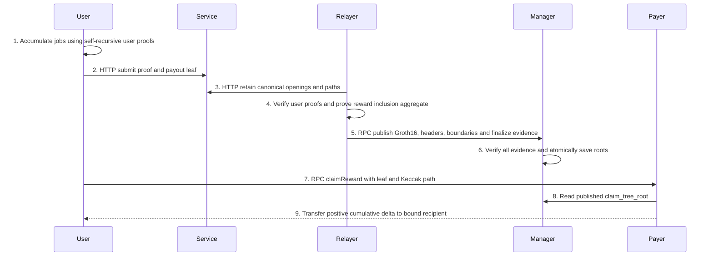

# Bridge Merkle Settlement

> Date: 2026-10-05. Status: **Review — blocked on the interleaved terminal-proof join; not implementation-ready**. Documentation-only protocol proposal. User-approved amount representation is uint256 in eight u32 limbs, exactly 34 public inputs. Required topology is three circuit kinds with data-dependent self-recursive user depth. No source, measurement, activation or independent approval is claimed.

## Terminology and Abbreviations

`TERMINOLOGY.md` owns spellings. This document owns the settlement contract. A source citation describes existing behavior; a **proposed** declaration specifies the replacement and is not a claim that the declaration exists.

| Term | Definition |
|---|---|
| PI | Circuit public input. Offsets below are zero-based, half-open. |
| Felt / Hash4 | Goldilocks field element / four ordered canonical field elements; modulus `p=18446744069414584321`. |
| L1 / L2 | Destination settlement chain / Psy execution chain. |
| ABI / API | Application binary interface / application programming interface. |
| CLI / WASM | Command-line interface / WebAssembly user proving surface. |
| HTTP / RPC / JSON | Hypertext Transfer Protocol / remote procedure call / JavaScript Object Notation. |
| QA / OOG | Quality assurance / out-of-gas. |
| SHA-256 | Retained-artifact byte digest, not proof authority. |
| BN254 | Groth16 scalar field; packed public values here are uint128 and fit it. |
| `B,d,N,K,C,D` | Inclusion capacity, its base-two depth, family leaf count, segment count, configured chain count, deposit leaf count. |
| `K_w,K_r` | Withdrawal and reward segments accepted in one publication transaction. |
| `AggregateWindow` | Process-local config, window, and authenticated endpoint context; not a wire object. |
| `opening_digest` | Hash of the artifact's precisely specified opening preimage. Not `header_digest`. |
| `header_digest` | Hash of the packed publication header under its separate domain. |
| `claim_tree_root` | Keccak payout-membership root of one inclusion segment. |
| `historical_merkle_proof` | Checkpoint-leaf membership under the selected checkpoint-tree root; not a checkpoint-header upgrade. |
| `nullifier_key` | Immutable reward-job birth coordinate. |
| `reward_accumulator_root` | Proposed checkpoint-authenticated earned-state root; not an existing global-state field. |
| User proving session | Existing authenticated L2 account session; UPS in existing source identifiers. |
| `k` | Benchmark-selected maximum real jobs per same-kind user step; not a lifetime cap. |
| `paid_total` | L1 delivered amount per economic domain and user; not earned-state authority. |

## Abstract

Users accumulate jobs through one self-recursive user circuit kind; a separate reward inclusion aggregate verifies one terminal proof per user; the aggregator publishes its Groth16 wrapper. These are exactly three circuit kinds, not a fixed proof depth. Withdrawal remains a separate pipeline. L1 claims use a leaf and Keccak path, with neither user Groth16 nor signatures. Checkpoint-authenticated earned state establishes lifetime amounts; rolling job commitments and nullifier transitions authenticate presented jobs. One binding gap remains: independently valid terminal user proofs are not yet proven to belong to the same interleaved global nullifier history. This draft states that gap explicitly and does not authorize payable publication until it is closed and independently reviewed.

## Motivation

The current `StateManager.applyBridgeWindow` verifies then iterates complete withdrawal/reward openings (`psy-contracts/src/StateManager.sol:205-253`); `EthereumRewardPayer.payRewards` pays one fixed reward per job (`psy-contracts/src/EthereumRewardPayer.sol:52-95`). The current inclusion constructor has 1024 slots and a 12-input statement (`psy_plonky2_circuits/src/bridge/circuits/inclusion_aggregate.rs:15,73,262-325`). A 100,000-user publication therefore requires segmentation and pull delivery rather than a larger on-chain payout loop. Current checkpoint global roots have six fields and a 192-byte encoding (`psy_data/src/v1/qdata/checkpoint.rs:320-327,362-370`); the earned-state extension below is a protocol proposal, not a discovered seventh field.

## Table of Contents

- [Specification](#specification)
  - [1. Scope and flow](#1-scope-and-flow)
  - [2. Proof topology and public inputs](#2-proof-topology-and-public-inputs)
  - [3. Checkpoint-authenticated reward relation](#3-checkpoint-authenticated-reward-relation)
  - [4. Canonical encoding and claim trees](#4-canonical-encoding-and-claim-trees)
  - [5. Finalize and deposit authentication](#5-finalize-and-deposit-authentication)
  - [6. Publication and delivery](#6-publication-and-delivery)
  - [7. Retention and recovery](#7-retention-and-recovery)
  - [8. Acceptance and resource bounds](#8-acceptance-and-resource-bounds)
- [Data Structures](#data-structures)
- [Core Functions](#core-functions)
- [Core Loops](#core-loops)
- [Module Changes](#module-changes)
- [File Changes](#file-changes)
- [Naming Crosswalk](#naming-crosswalk)
- [Prior Document Content Disposition](#prior-document-content-disposition)
- [Rationale](#rationale)
- [Security Considerations](#security-considerations)
- [Review and Activation Boundary](#review-and-activation-boundary)

## Specification

### 1. Scope and flow



```text
reward:     user circuit -> reward inclusion_aggregate -> Groth16 wrap -> root registry
withdrawal: withdrawal proof -> withdrawal inclusion_aggregate -> its Groth16 wrap -> root registry
checkpoint: authenticated contiguous transitions -> finalize -> its Groth16 wrap ----+
deposit:    complete configured-chain deposit transition -> its Groth16 wrap --------+
claim:      leaf + Keccak siblings -> published root -> replay/accounting checks -> transfer
```

The user owns user proving. The aggregator verifies, aggregates and wraps; it does not generate user proofs. Guardian signing policy belongs exclusively to `bridge-relayer-multisig.md` and is unchanged. User L1 claims never call a verifier or accept signatures. Publication is proposer-only and requires Groth16 evidence.

Withdrawal preserves nonce replay, pending delay, threshold, lifetime limits, pause and force-claim behavior. Pull registration starts the delay when the pull is registered, not when its root is published; this timing change is explicit and requires product approval before deployment. Reward funding is checked at pull time, with no publication-time reserve of all future deltas. Insufficient funding reverts only that claim and leaves it claimable. Neither policy is presented as behavior-preserving.

### 2. Proof topology and public inputs

**Required topology: exactly three circuit kinds.** Kind one is the self-recursive user accumulator, kind two is reward inclusion aggregation of one terminal proof per user, and kind three is its Groth16 wrapper. A user step directly constrains at most compiled `k` new jobs, checkpoint membership, job sum, accumulator membership, recipient binding and nullifier updates. It recursively verifies the same-kind own-user predecessor and, when users interleave, the same-kind global predecessor. Depth is data-dependent, `ceil(job_count/k)` user steps; it is not three layers. `k` remains a benchmark-selected circuit capacity, not a lifetime/job/checkpoint limit or an extra circuit kind. No distinct per-job tree, closing circuit, four signature circuits or re-anchor circuit is introduced. Eight distinct circuit kinds and a flat unbounded monolithic circuit are rejected. The exact three-kind count is fixed; the quantitative `k` selection remains OPEN until authorized measurements.

Withdrawal construction and reward construction have distinct constructors, witnesses, circuits, setup identities and runtime paths. Shared pure canonical tree/encoding helpers are allowed only for identical semantics. The rejected alternative is one family-generic circuit whose runtime selector merges withdrawal and reward relations: it weakens ownership, couples fingerprints and leaves family-specific constraints implicit. A common publication envelope does not merge the proof pipelines.

#### User statement: exactly 34 fields

| Offset | Field | Constraint and interpretation |
|---|---|---|
| `[0..4)` | `checkpoint_tree_root` | Four canonical Felt limbs in hash order. |
| `[4]` | `user_id` | u32. |
| `[5..13)` | `recipient` | Eight u32 limbs, least-significant limb first; limbs 5, 6 and 7 zero; low five form a nonzero 160-bit address distinct from payer. |
| `[13..21)` | `total_amount` | Eight u32 limbs, least-significant limb first; full uint256 partial/terminal cumulative amount with checked recursive carry. |
| `[21]` | `count` | u32 accumulated jobs in this proof chain; checked recursive addition. No stored lifetime count. The finite statement range is not represented as an unbounded integer. |
| `[22..26)` | `jobs_commitment` | Four canonical Felt limbs of rolling `H(previous commitment || new jobs)`; exact encoding below. |
| `[26..30)` | `old_nullifier_root` | Four canonical Felt limbs. |
| `[30..34)` | `new_nullifier_root` | Four canonical Felt limbs. |

All integer ranges are constrained in the circuit, not merely decoded natively. Addition uses eight u32 limbs with checked carries and final carry zero; overflow rejects. No Felt reduction, lifetime cap, or one-Felt amount remains. For amount `2^32+7`, limbs are `[7,1,0,0,0,0,0,0]`. This adopts 34 fields only for the user statement; it does not globally replace occurrences of 27 or alter the unrelated 28-input publication, current 28-input per-job source, 32-input withdrawal child, or finalize layout.

#### Publication, deposit and finalize statements

The proposed inclusion publication has 28 fields: `[1,7,family,0]`, then `opening_digest[8]`, `claim_tree_root[8]`, `header_digest[8]`, each digest split into eight big-endian u32 words. Family 2 is withdrawal; family 3 is reward. The wrapper emits 768 most-significant-bit-first bits, packed in order as six uint128 values: high then low half of each digest. User 34 fields are recursively verified inside reward inclusion, not passed to the L1 verifier.

Deposit keeps prefix `[1,11,1,0]`, 12 inputs, 256 wrapper bits and two uint128 halves. Finalize retains `26+9*C` inputs and its separate wrapper. Its retained 26-word prefix is not its full width. The current inclusion source still registers 12 inputs (`inclusion_aggregate.rs:321-325`); 28 is the proposed replacement.

`B` is exactly one of 1024, 2048, 4096 and 8192; initial compiled capacity is 1024. Count range uses `log2(B)+1` bits. The pure tree helper supports powers of two from 1 through 131072, including empty sibling paths at capacity 1; production circuits remain limited to the four listed capacities. A helper's larger range does not authorize another production setup.

### 3. Checkpoint-authenticated reward relation

The authoritative earned-state relation, concrete witness definitions and producer completeness rules are specified in the reward relation subsection of Data Structures. Both old and new cumulative states are authenticated under checkpoint leaves, and the same user proof binds their difference to its exact job records. An asserted amount, a public root without a membership proof, or L1 `paid_total` cannot replace this relation. The accumulator is earned authority; the nullifier tree records presentation of jobs and is not an alternate earned ledger.

#### Immutable birth identity and membership

```text
birth_checkpoint_id = claim_checkpoint_id       u32
level = height                                 2..=21
index = path_index                             0 <= index < 2^(level-2)
nullifier_index = (1 << level) - 1 + index       u32, checked
nullifier_key = (birth_checkpoint_id << 31) | (level << 26) | index
```

Bits 0..25 hold index, 26..30 level, and 31..62 birth checkpoint; bit 63 is zero. Equal keys name the same job regardless of recipient or anchor. Distinct owners or amounts for an equal key reject. These position rules preserve current source semantics (`client_prover/psy_core/psy_data/src/bridge_aggregate.rs:202-209`; `psy_plonky2_circuits/src/bridge/circuits/reward_inclusion.rs:57-92`).

A historical checkpoint witness contains its checkpoint id, complete checkpoint leaf and exactly 32 Poseidon siblings. For each least-significant-first index bit, bit zero hashes `(state,sibling)` and bit one hashes `(sibling,state)`. The final root equals PI `[0..4)`. Birth id cannot exceed the authenticated end id. A checkpoint leaf hash is the existing Poseidon global-root/stats hash construction; the full stats must open, including `pm_rewards_commitment.gutas_root`. The source relation is `reward_inclusion.rs:142-153`, not `HistoricalRootMerkleProofGadget` or a header upgrade.

The user circuit directly constrains the existing tagged-tree relation: nonzero tag preimage, first element equals user id, leaf tag equals Poseidon of the preimage with itself, nonzero leaf tag, authenticated tagged-tree root equals the birth checkpoint's `gutas_root`. The tagged-tree loop and its left/right order are those at `reward_inclusion.rs:83-109`; inactive path levels are zero. A user-account path is not a substitute for this reward-tree membership.

For each real new job, open bit zero under the current global root with exactly 63 siblings and close bit one with the same siblings. A step's root starts at PI `[26..30)` and ends at `[30..34)`. Duplicate/stale keys reject. No birth record or stored bytes are deleted. An interleaved step connects its old root to the verified global predecessor's new root, not to a nonadjacent own-user root. Own-user predecessor separately carries amount/count/jobs commitment and immutable identity. A zero-job base has equal roots and the canonical seed commitment; it is not a publishable reward leaf. New published user claims require positive count. These local constraints alone do not solve terminal membership in one chosen global chain; see the blocking relation below.

### 4. Canonical encoding and claim trees

Existing labels retain the exact prefix `PsyBridge/TwoArtifact/1/` and suffixes `Config`, `CircuitSet`, `A`, `Batch`, `Record`, `Leaf`, `Node`, `Empty`, `Window`, `Reward`, `WithdrawalNonce`, `WithdrawalBatch`, and `RewardBatch` (`bridge_aggregate.rs:58-68`). Renaming source types does not rename these bytes. `word(x)` is one 32-byte unsigned big-endian word; upper padding must be zero. Existing word-encoded Hash4 is four such words, each containing a canonical u64 Felt.

Withdrawal opening is the existing ordered context, configured root vector and six-word records: `288+128*C+192*N` bytes. Existing per-job reward opening is `256+192*N` bytes and remains a historical/current codec only. Source computes its flat digest as domain plus encoded opening (`inclusion_aggregate.rs:310-321`); the former document's nested reward `batchRoot` digest is not retained as a competing rule. Deposit's distinct projected `A` preimage remains unchanged.

The proposed cumulative reward protocol uses new domains `keccak256(UTF8("PsyBridge/CumulativeReward/1/Opening"))` and `keccak256(UTF8("PsyBridge/CumulativeReward/1/Record"))`. It does not reinterpret old `RewardBatch` bytes. A cumulative payout leaf is five words in order: economic domain, u32 user id, uint256 total amount, 20-byte recipient, initialized bool. Length is 160 bytes. Payable leaves require initialized=1; uninitialized earned-state leaves are never payable. Leaf commitment is Keccak of record domain followed by these bytes. Reward opening uses word-encoded `(config_hash,window_id,end_checkpoint_id,end_checkpoint_root[4],count)` followed by leaves: `256+160*N` bytes. Users strictly increase within and across segments of one window. Economic domain is the existing stable `rewardNullifierDomain` derivation (`EthereumRewardPayer.sol:46-49`), not config hash, window id or setup identity.

Packed `header_bytes` contains, in order, `family:u8`, config hash 32 bytes, window id 32 bytes, end id u64, end root four u64, six u32 values `(aggregate_capacity,total_count,segment_count,segment_index,first_ordinal,count)`, family-specific roots, opening digest 32 bytes and claim root 32 bytes. All integers here are big-endian. Withdrawal-specific roots are `C` Hash4 values; reward-specific roots are old and new nullifier Hash4. No option tag or vector length is encoded. Header domain is `keccak256(UTF8("PsyBridge/TwoArtifact/1/AggregateHeader"))`. Header digest is Keccak of that domain and packed header bytes. Length is `193+32*C` for withdrawal and 257 for reward. Decoder rejects a missing/trailing byte, noncanonical Felt or wrong family.

#### Typed Hash4 boundary

A native Hash4 is exactly four canonical u64 values. The alternative circuit transport representation is exactly eight u32 values, adjacent low/high pair for each same u64: `value[i]=pair[2*i]+2^32*pair[2*i+1]`, followed by `<p` validation. A decoder accepts either representation only where the interface explicitly selects `CanonicalU64x4` or `LittleEndianU32x8`; it never tries one after another on failure. User PI roots and packed headers require `CanonicalU64x4`; user amount and recipient are eight little-endian u32 integers, not Hash4. Finalize prefix slots `[4..20)` use the paired-u32 representation; all other finalize root slots use canonical u64 words. Keccak digest words are big-endian u32 and are never interpreted as little-endian Hash4 pairs. Width and encoding selector form part of source/setup identity.

#### Claim tree and segment arithmetic

The claim tree reuses the existing marker-12 Keccak construction (`bridge_aggregate.rs:649-674`) at variable capacity. Let `D(label)` be the preserved label hash above. Real node `i` is `keccak256(D(Leaf)||word(12)||word(count)||word(i)||leaf_commit[i])`; padding node is `keccak256(D(Empty)||word(12)||word(count)||word(i))`. At height `h=1..d`, parent is `keccak256(D(Node)||word(12)||word(h)||left||right)`. Tree storage has `2*B-1` nodes with root index zero and leaves starting at `B-1`. Path length is exactly `d`, ordered leaf-to-root, with ordinal bits least-significant-first.

```text
K = 0 if N=0 else ceil(N/B)
for segment_index in 0..K:
    first_ordinal = segment_index * B
    count = min(B, N-first_ordinal)               strictly positive
```

All operations reject u32 overflow. Empty-family manifest sets all counts/indices to zero and both digests to bytes32 zero. Empty withdrawal still carries authenticated `C` roots; empty reward has equal stored old/new nullifier roots. Empty families register no root and supply no proof. Nonempty first manifests are byte-identical to their verified segment-zero headers in the first transaction.

### 5. Finalize and deposit authentication

A real positive-span finalize proof is mandatory for every destination transaction, including continuation. The retained prefix is `[0..4)` start root, `[4..12)` global deposit pair encoding, `[12..20)` global withdrawal pair encoding, `[20..24)` end root, `[24]` end id and `[25]` span. For configured ordinal `o`, `b=26+9*o`: `[b..b+4)` deposit root, `[b+4]` absolute deposit count, `[b+5..b+9)` withdrawal root. Count is checked u32. `C` and ordered chain indices are circuit constants. Full width is `26+9*C` (`bridge_agg_final.rs:63-69`).

Wrapper bytes retain the original 144-byte prefix: indices `[0..4)` and `[20..26)` use big-endian u64; `[4..20)` use big-endian u32 with adjacent pairs swapped. Each extension word appends big-endian u64, including the u32 count. Full length is `144+72*C`. L1 and wrapper require this exact width and hash the same bytes. Zero proof, zero span, bootstrap substitution and an unverified named end root reject.

Generated finalize verifier getter `endpointChainListHash()` is `keccak256(UTF8("PsyBridge/FinalizeChainList/1") || uint16_be(C) || raw ordered chain-index bytes)`. Installation compares it against configured chains. A same-width differently ordered chain list is not an equivalent source.

**Fingerprint prerequisite:** load the cached `GenerateRollupStateTransitionProof` fingerprint as base. Independently obtain the coordinator checkpoint-step fingerprint, then require equality before prebuild, range proving, regeneration or key setup. A missing cached base rejects; copying the coordinator fingerprint into both arguments is not a check. Pass the independently obtained values to their typed base/step positions. The finalize wrapper source carries actual finalizer common/verifier data and the finalizer's configured chain indices; it cannot be assembled from arbitrary same-width metadata. Setup validation compares source, ordered chain list, encoding and width, not width alone. Current relevant callers are `psy_cli/psy_relayer_cli/src/bridge/prove_bridge.rs:1028-1029,1108-1112` and `regen_groth16_keystore.rs:294-307`; these references describe the reviewed requirement, not completed runtime evidence.

**Checkpoint machine is separate from the three reward circuit kinds.** Current Final verifies Chain, appends 1..32 deltas, binds the chain hash to the final checkpoint proof and checks exact span (`bridge_agg_final.rs:194-319,371-374,584-634`). A proposed direct Final path is selected only when the complete checkpoint interval has span 1..32: start from authenticated start, verify every consecutive transition and final checkpoint proof, and omit the empty Chain-prefix proof. Above 32, retain the complete Chain-prefix relation and terminal Final deltas. Reward segment count or `N<=B` does not establish checkpoint span. Removing Chain validation without the direct replacement is forbidden and is not justified by the reward kind count.

Deposit aggregate remains mandatory and authenticates every configured chain's old/new deposit root and absolute count. StateManager joins each new endpoint to the matching finalize extension and joins every withdrawal-root vector to the same extension. Deposit application remains restricted to StateManager, verifies no proof itself, and preserves local custody, pending-count and transition checks. It accepts exact end-state no-op on continuation. Neither a root name nor the reserved `withdrawalSubtreeRoot` storage is withdrawal authority.

Withdrawal root witness remains private: configured ordinal u8 and exactly eight Poseidon siblings select one root from the authenticated ordered C-root vector through the height-eight lookup padded to256. Require `1<=C<=256`, exact configured membership, canonical limbs and no trailing opening bytes. No path is serialized in a withdrawal record and no additional setup is introduced. Strict opening order is `(chain_index,nonce)`; foreign-chain records never create local nonce consumption. Current source witness is `inclusion_aggregate.rs:38-49,281-307`.

Identity replay reuses the real positive-span proof, requires end id/root equal stored cursor and opening end, but does not require historical start root equal current end. It performs all endpoint joins and no cursor advance or `Finalized` emission. No previous-anchor or historical-success mapping is added.

### 6. Publication and delivery

The complete proposed publication ABI is:

```solidity
struct InclusionSegment {
    bytes headerBytes;
    uint256[8] proof;
    bytes firstLeafBytes;
    bytes32[] firstSiblings;
    bytes lastLeafBytes;
    bytes32[] lastSiblings;
}
function applyBridgeWindow(
    uint256[8] calldata finalizeProof,
    uint256[] calldata checkpointPublicInputs,
    uint256[8] calldata depositProof,
    bytes calldata depositOpening,
    bytes calldata withdrawalManifest,
    bytes calldata rewardManifest,
    InclusionSegment[] calldata withdrawalSegments,
    InclusionSegment[] calldata rewardSegments
) external;
function claimReward(bytes32 headerDigest, uint32 ordinal,
    bytes calldata leafBytes, bytes32[] calldata siblings) external;
function claimAggregateWithdrawal(bytes32 headerDigest, uint32 ordinal,
    bytes calldata leafBytes, bytes32[] calldata siblings) external;
```

This replaces the current full-opening withdrawal/reward publication parameters; it is not the current source ABI. Both claim implementations use `nonReentrant`; publication remains `onlyProposer`. Calldata arrays are bounded by compiled family counts and preflight; no arbitrary fixed two-to-four segment cap is introduced. Full openings remain off chain except the complete deposit opening. First/last witnesses are required even for a one-leaf segment and then must encode the same leaf/path.

Publication order is authorization and canonical decoding; manifests and segment/boundary validation; new-window or continuation predicate; finalize and deposit verification; per-segment Groth16 verification and endpoint joins; reward root chaining; then atomic deposit, registry, progress, nullifier and cursor writes. Any failure reverts the entire transaction. No transfer or `paid_total` update occurs during publication.

StateManager's registry unique key is `(config_hash,window_id,family,segment_index)`, with lookup by `header_digest`. New segments are consecutive per family. First/last paths use ordinals 0 and `count-1`, with previous last key less than next first key. Withdrawal key is `(chain_index,nonce)`; reward key is user id under fixed domain. Circuit sorting is internal; identical saved-header retries are no-ops and conflicting retries revert. Segment nullifier endpoints must chain from stored root, but this is insufficient to bind interleaved terminal user proofs to that chain. The unresolved terminal join below therefore blocks reward publication even when endpoint comparisons pass. Stale unpublished proofs return to the user for reproving; no root is edited outside the circuit.

The first transaction contains both manifests and verified segment zero for every nonempty family. It advances the cursor once. Continuation requires identical window/end/deposit digest and family common fields `(family,B,total_count,segment_count,withdrawal_roots)`; its current cursor equals the active end and finalize is identity replay. A new window rejects until all required segments of both families are accepted. Empty-window completion is immediate after mandatory finalize/deposit checks. Progress is per destination; a successful receipt on one chain is not another chain's acceptance.

#### Three separate continuity checks

| Check | Required proof or state relation | What it does not establish |
|---|---|---|
| User step | Verify same-kind predecessors; global predecessor new root equals current step old root; current jobs perform exact zero-to-one updates; own-user predecessor carries amount, count and rolling jobs commitment. | It does not prove that an arbitrary set of terminal user proofs all belongs to the selected global history. |
| Terminal common history | Circuit-verifiable membership of every selected terminal user proof in the same global nullifier history, using approved34 fields, per-user rolling commitment and user-linear terminal aggregation. | This remains unresolved. Neither registry ordering nor a privately asserted history root supplies it. |
| Segment publication | New segment old root equals current stored admission root and the registered predecessor new root; commit verified successor and registry/counter atomically. | It cannot repair internally forked terminal proofs that an incomplete inclusion relation accepted. |

Current `StateManager.sol:205-253` has no reward-admission-root registry. Its checkpoint continuity and `_verifyFinalize` comparisons concern checkpoint roots, not the proposed reward nullifier root. The following is **design pseudocode**, not an existing implementation or permission to publish while the terminal relation is unresolved:

**Reward publication is BLOCKED until the terminal common-history relation is completely specified, independently reviewed and implemented.** The following is only the segment-registry design conditional on that prerequisite. It defines no callable `terminalJoin` check and is not an executable replacement for the missing circuit relation.

```text
applyBridgeWindow, for each supplied reward segment in canonical segment order:
    decode the typed reward header; recompute its exact header_digest
    require configured config, active window, reward family and authenticated end
    key = (config_hash, window_id, family, segment_index)
    if key is already registered:
        require supplied canonical headerBytes equals retained headerBytes byte-for-byte
        require recomputed header_digest equals the saved header_digest
        accept this segment as an idempotent retry
        do not rewrite the stored admission root or increment its counter
        continue to the next supplied segment
    require segment_index equals nextRewardSegment
    if segment_index == 0:
        require header.old_nullifier_root equals current stored admission root
        a new window uses the prior completed window's root; never reset it
    else:
        require segment_index - 1 is registered for this config/window/family
        require header.old_nullifier_root equals current stored admission root
        require current stored admission root equals predecessor.new_nullifier_root
    verify the reward Groth16 statement binds this exact header and opening/root
    stage this new publication's exact headerBytes and saved header_digest
    stage stored admission root = header.new_nullifier_root exactly once
    stage nextRewardSegment = segment_index + 1
after every required proof, endpoint join, boundary check and deposit effect succeeds:
    commit all staged registry, root, counter and other window writes atomically
on any failure:
    revert every write/effect in this transaction
```

`nextRewardSegment` denotes the proposed `ActiveWindow.rewardAccepted` counter, not another stored datum. Earlier staged new segments are visible to subsequent checks in this transaction; registered retries never rewind it. Canonical `headerBytes` in the registry is the sole retained header authority; decoded roots/counts/digests are projections of those exact bytes and must not become independently writable mirrors. The current admission root is the live successor cursor. Comparing it to the registered predecessor's decoded new root checks the same transition boundary, not a second independent root authority. `header_digest` is not a literal hash chain because no previous-header field is encoded. Registry identity, sequential indices, exact retries and endpoint equality establish segment ordering only. Hash roots have no numeric monotonicity; the constrained nullifier bits are monotone zero-to-one.

For example, A terminal proves `R0 -> R_A` and B terminal proves `R0 -> R_B` on separate forks. A malformed inclusion relation can verify both and expose one segment ending at `R_B`; a perfect segment registry still cannot establish A belongs to B's history. This is the missing terminal check, not a defect solved by comparing segment0 to stored root. No PI increase or free private history root is chosen.

Existing `Bridge.claimedNullifiers` and `EthereumRewardPayer.spentRewards` remain distinct existing delivery/consumption mappings, not the proposed admission tree. Preserve their recorded consumption across cutover; a mapping rename or new window never clears it. Publication never consumes either delivery mapping, never writes `paid_total` and never transfers a reward. The proposed cumulative payer's positive-delta accounting has its own authenticated migration requirement; it is not evidence that an old per-job key has become an admission-tree proof.

These document mechanisms are specified now. All code authoring is authorized before the terminal common-history join freezes. That authorization is not cryptographic GO, not payable activation, and not automatic approval; payable publication stays unresolved while the terminal proof relation is unspecified.

Reward claim loads the published reward-family record, validates config and stable domain, decodes a 160-byte initialized leaf, requires `ordinal<count`, checks exact path length and root, then checks recipient. If `total_amount<=paid_total`, reject before subtraction. Otherwise compute `delta=total_amount-paid_total`, set paid total and first initialized recipient before external transfer, and require exact payer balance decrease, recipient balance increase and unchanged total supply. Any transfer failure reverts the accounting. Anyone can relay a claim; funds go only to the proof-bound recipient. Publication never initializes delivery recipient. Subsequent claims require the same recipient and never decrease paid total. Only configured Ethereum pays rewards; other destinations authenticate the publication but do not pay.

Withdrawal claim loads the withdrawal registry entry, checks domain/config, six-word leaf, local chain and path, then enters existing nonce/pending/payment code. A consumed nonce rejects that claim. Publishing a root does not consume local or foreign nonces. The unchanged delay/threshold/force-claim logic stays at `Bridge.sol:643-670`; its explicit pull-time registration change remains an activation prerequisite.

Events are `InclusionAggregateRootPublished(bytes32 indexed headerDigest,uint8 indexed family,bytes32 indexed windowId,uint32 segmentIndex,bytes32 claimTreeRoot,uint32 count,uint64 endCheckpointId)` and `RewardCumulativePaid(bytes32 indexed headerDigest,uint256 indexed userId,address indexed recipient,uint32 ordinal,uint256 previousPaid,uint256 totalAmount,uint256 delta)`. Existing `Finalized`, `WithdrawalPendingCreated`, and `WithdrawalClaimed` retain their own meanings. Root publication is never a payment event.

### 7. Retention and recovery

Before broadcast, the relayer retains canonical header/opening bytes, user-proof references, aggregate proof, complete deposit proof/opening, destination finalize evidence, ordered leaf associations, and submission state. Files are addressed by SHA-256 and a repeated digest must identify identical bytes. Missing bytes, mismatch or noncanonical encoding returns unavailable; never substitute an empty path or a changed root. Existing durable installation uses temporary file, file synchronization, rename and parent-directory synchronization (`psy_cli/psy_relayer_cli/src/bridge/daemon.rs:1817-1919`). A failed save prevents broadcast.

For each destination and exact frozen transaction: `NotSent -> Sending` is durably saved before signing/broadcast; returned transaction hash produces durable `Submitted`. A crash or send timeout after `Sending` leaves `Sending`. Missing receipt, mempool absence and operator assertion never reset it to `NotSent`. Resolve only with finalized receipt bound to chain, sender, nonce and exact calldata, canonical block hash and expected logs/state. If the hash was lost, retain evidence for manual investigation, not automatic resend. Existing source states and observation are at `daemon.rs:1338-1378,1433-1459,1633-1667`.

A reverted transaction rolls back all root/cursor effects in that transaction. It does not roll back already finalized earlier segments. Resume only at the next canonical segment/root. A reorganization rebuilds service projections from canonical receipts and state; it does not delete retained artifacts or erase canonical consumption. Projection names are `included`, `root_published`, `withdrawal_pending`, `paid`, `consumed_elsewhere`.

The proposed service endpoint is `POST /v1/bridge/inclusion-aggregates`. Required JSON shapes are defined below; unknown fields reject. Hex bytes are lowercase, `0x`-prefixed and even length; `Hex32` is exactly 32 bytes; u64 values are decimal strings and u32 values JSON integers.

```text
Receipt = {chain_id: Hex32, transaction_hash: Hex32, block_hash: Hex32,
           block_number: decimal_u64, log_index: u32}
IncludeAggregate = {kind: "include", header_bytes: HexBytes, opening_bytes: HexBytes}
ReplaceAggregate = {kind: "replace", previous_header_digest: Hex32,
                    header_bytes: HexBytes, opening_bytes: HexBytes}
ObservePublication = {kind: "publication", header_digest: Hex32, receipt: Receipt}
ObserveClaim = {kind: "claim", header_digest: Hex32, ordinal: u32, receipt: Receipt}
AggregateResponse = {header_digest: Hex32, status: "included" | "root_published" |
                     "withdrawal_pending" | "paid" | "consumed_elsewhere"}
ReplacementBlocked = {previous_header_digest: Hex32,
                      reason: "admission_evidence_required" |
                              "changed_membership_not_supported" | "predecessor_published"}
```

Inclusion reconstructs both digests and claim root from retained bytes and creates immutable `(header_digest,ordinal)` associations; retention alone is not publication authority. Receipt evidence is independently fetched and checked for success, emitter, topics, calldata, finalized block and resulting state at that block. Unknown identity returns 404, conflicting/not-yet-included identity 409, unavailable evidence 503. Identical evidence is idempotent.

Replacement is restricted to an exact leaf-identity bijection with unchanged count and segmentation. Lock predecessor and associations, require finalized registry evidence that predecessor is unpublished, verify equality, insert successor and move associations atomically. Retain predecessor bytes. Canonical concurrent predecessor publication wins; reconcile before successor publication. Changed membership returns 409 `changed_membership_not_supported`; absent finalized admission evidence returns `admission_evidence_required`; published predecessor returns `predecessor_published`. This is a deliberate fail-closed supported operation set, not an unspecified recovery mechanism.

Users or services retain birth records, tagged-tree witnesses, accumulator/checkpoint preimages and enough checkpoint-tree history to produce new paths for unpresented jobs. Re-anchor replaces only checkpoint siblings/end context, preserving birth id, level, index, owner, eligibility amount and nullifier key. A new proof recomputes its context-bound jobs commitment. Published payout leaf/path archives remain sufficient for L1 claims even when a service is unavailable; journal retention is not an on-chain authorization condition. No surviving copy means unavailable data, not a failed valid path.

### 8. Acceptance and resource bounds

| Capacity `B` | Depth | Segments for 100,000 users | Last segment count | Retained reward opening bytes |
|---:|---:|---:|---:|---:|
| 1024 | 10 | 98 | 672 | 16,025,088 |
| 2048 | 11 | 49 | 1696 | 16,012,544 |
| 4096 | 12 | 25 | 1696 | 16,006,400 |
| 8192 | 13 | 13 | 1696 | 16,003,328 |

Bytes are `160*N+256*K`, off chain. Raw publication proof plus header bytes are `K_w*(449+32*C)+K_r*513`; both manifests add `450+32*C`. Each new segment also includes two boundary leaf/path witnesses: withdrawal `384+64*log2(B)`, reward `320+64*log2(B)` bytes before ABI framing. Include actual ABI offsets/padding, finalize inputs, deposit opening, transaction intrinsic costs, storage and logs in receipts; these formulas alone are not a gas result. Publication work includes `O(K_w*C+C+D+(K_w+K_r)*log(B))`. Pull verifies `log2(B)` Keccak levels and zero Groth16 calls.

`max_deposits<=1024`, `max_withdrawals<=131072`, `max_rewards<=131072`, with target deployment reward limit 100000. All codec, circuit and Solidity checks change together. These changes invalidate config-dependent fingerprints/setups. Transaction segment count is selected by preflight within the full gas/calldata budget; no deployment segment limit is inferred without receipts.

Required unexecuted QA:

1. Exact 34-user offsets, all u32 ranges, canonical Felt decoding, uint256 carry/overflow, recipient upper zeros; distinguish publication 28 and finalize `26+9*C`.
2. Exactly three reward circuit kinds on the actual construction path; same-kind self-recursion with data-dependent depth and benchmark-selected `k`, no hidden distinct job/closing/authorization circuit. Separate withdrawal/reward setup identities.
3. Complete producer-earned accounting, old/new accumulator membership, wrong owner/rate/recipient rejection, rolling job commitment order/count/padding, immutable re-anchor, recursion carry/equality, and the two-fork terminal-join counterexample. Payable publication must reject mixed-history terminal proofs before this gate can pass.
4. Cross-language opening/header/tree/digest vectors; C=1 and C=256; counts 0,1,B-1,B,B+1; helper depths 0 and 17 accepted, 18 rejected; production widths exactly four.
5. Real-proof acceptance and zero/wrong proof rejection; cached-base/coordinator fingerprint mismatch before any setup; same-width wrong chain-list/type rejection; direct span 1/32 and chained 33 boundaries with every checkpoint transition authenticated.
6. Atomic publication rollback, identity replay, duplicate/conflicting segment retry, incomplete-window blocking, empty manifests, inter-segment sorting, mixed-family continuation, canonical reorganization recovery and indeterminate Sending retention.
7. Positive-only cumulative payout delta, unchanged recipient, first-payment authorization, insufficient reserve, exact token deltas, claim trace with no verifier/signature call, withdrawal nonce/delay behavior.
8. Keep `testFullCapacityWithdrawalAggregate`'s 30,000,000-gas fixture (`psy-contracts/test/foundry/BridgeOpening.t.sol:131-147`) and report its actual success or OOG. Independently require actual complete publication receipts with `gasUsed<=8,000,000`, including maximum configured C/D, both families, first and continuation windows, boundary witnesses and all verification/deposit effects. A reward-only or mock-verifier receipt does not qualify mixed deployment. 50,000 pull gas remains an unmeasured target.
9. Serial construction/proving/wrapping at N=1 and maximum compiled occupancy for withdrawal/reward plus configured deposit aggregate: MemoryHigh 56 GiB, MemoryMax 64 GiB, SwapMax 0, Rayon 1. Measure inclusion widths and same-kind user step capacities `k`; report depth separately from circuit-kind count. Bound failure returns to design, not silent topology or lifetime-cap changes.

Record exact artifact hashes, verifier identities, B/C/D/counts/proof counts, calldata, receipt status, transaction/block hashes, gas and resource observations. This documentation task executes none of them. Historical mock-verifier regressions are not evidence for this proposed protocol.

## Data Structures

The proposed publication types below are complete. Hash4 is `[u64;4]` with each limb `<p`; Bytes32 is `[u8;32]`. Vectors are bounded by the specification, not unbounded protocol inputs.

```rust
pub struct InclusionAggregateHeader {
    pub family: u8,
    pub config_hash: [u8; 32],
    pub window_id: [u8; 32],
    pub end_checkpoint_id: u64,
    pub end_checkpoint_root: [u64; 4],
    pub aggregate_capacity: u32,
    pub total_count: u32,
    pub segment_count: u32,
    pub segment_index: u32,
    pub first_ordinal: u32,
    pub count: u32,
    pub withdrawal_roots: Vec<[u64; 4]>,
    pub old_nullifier_root: Option<[u64; 4]>,
    pub new_nullifier_root: Option<[u64; 4]>,
    pub opening_digest: [u8; 32],
    pub claim_tree_root: [u8; 32],
}
pub struct CumulativeRewardLeaf {
    pub economic_domain: [u8; 32],
    pub user_id: u32,
    pub total_amount: [u32; 8],
    pub recipient: [u8; 20],
    pub initialized: bool,
}
pub enum Hash4Encoding { CanonicalU64x4, LittleEndianU32x8 }
```

The relayer creates headers; the respective inclusion circuit constrains every field, StateManager recomputes their hash, and the service retains bytes. Family 2 requires exactly C withdrawal roots and absent nullifier roots; family 3 requires no withdrawal roots and both nullifier roots. No field is defaulted on decoding. Example: B=2048,N=100000,K=49,segment=48,first=98304,count=1696,end=1200; reward user 7 has limbs `[1500,0,0,0,0,0,0,0]`, recipient `0x1111111111111111111111111111111111111111`, initialized=true. Actual digests are calculated from the complete opening; this is a value example, not a cryptographic test vector.

```solidity
struct InclusionAggregateRoot {
    bytes32 configHash;
    bytes headerBytes;
    bytes32 claimTreeRoot;
    bytes32 openingDigest;
    bytes32 headerDigest;
    uint64 endCheckpointId;
    uint32 count;
    uint32 aggregateCapacity;
    uint8 family;
    bool published;
}
struct ActiveWindow {
    bool initialized;
    bytes32 windowId;
    bytes32 depositOpeningDigest;
    bytes withdrawalManifest;
    bytes rewardManifest;
    bytes32 endCheckpointRoot;
    uint64 endCheckpointId;
    uint32 withdrawalAccepted;
    uint32 rewardAccepted;
    bytes32 withdrawalLastNonce;
    uint8 withdrawalLastChainIndex;
    uint32 rewardLastUserId;
}
```

`inclusionAggregateRoot` returns this struct as a derived lookup, not as a stored mirror. Stored `headerBytes` is the single header authority. `configHash`, `claimTreeRoot`, `openingDigest`, `headerDigest`, `endCheckpointId`, `count`, `aggregateCapacity`, and `family` are derived from those exact bytes on lookup and are not independently stored fields. `published` reports whether that registry key exists; it is not a second header authority.

### Reward relation subsection

#### Proposed earned-state layout and ownership

Append `reward_accumulator_root` after the existing six roots. The proposed record is 224 bytes: seven Hash4 values, each four canonical u64 little-endian limbs. The authenticated protocol schema selects the record; never pad an old 192-byte record. Let `G6` be the existing global-root hash (`psy_data/src/v1/qdata/checkpoint.rs:489-493`); proposed `global_chain_root=Poseidon(G6,reward_accumulator_root)`. Checkpoint hash/serialization, target gadgets, producer/coordinator proofs, provider witnesses and caches cut over together. This is not current source behavior.

Coordinator alone updates the accumulator through existing prepared checkpoint updates. Leaf index is u32 `user_id` in the tree of configured `GLOBAL_USER_TREE_HEIGHT`. The complete proposed native leaf is:

```rust
pub struct RewardAccumulatorLeaf {
    pub user_id: u32,
    pub total_amount: [u32; 8],
    pub recipient: [u32; 5],
}
pub struct RewardPosition {
    pub relative_level: u8,
    pub relative_index: u32,
    pub owner_user_id: u32,
    pub owner_tag: [u64; 4],
}
```

No lifetime count, initialized flag, cursor, nullifier root or per-user domain is stored in the accumulator. Recipient zero means unset. Empty leaf hash is Hash4 zero, opened with zero amount/recipient at the selected index. Occupied hash is PoseidonHashMany of one field per byte of `UTF8("PsyRewardAccumulator/Leaf/1") || economic_domain[32] || LE32(user_id) || LE32(amount[0])..LE32(amount[7]) || LE32(recipient[0])..LE32(recipient[4])`. Require nonzero hash and amount or recipient nonzero. Domain is immutable activation input, never mutable config hash. Example: user7, amount1500, recipient `0x1111111111111111111111111111111111111111` has amount limbs `[1500,0,0,0,0,0,0,0]` and five recipient limbs all `0x11111111`; it is occupied without a stored count.

#### Complete once-only producer accounting

This is a proposed incompatible producer statement change, not a fourth reward claim circuit kind. Existing producer statement is `legacy_pi=H(header_hash,R)` (`docs/src/dev/reward-tree-circuits.md:94-125`). Proposed statement is `H(legacy_pi,positions_commitment)`, still four fields. Every parent verifies the pinned new child fingerprint and opens header, R and positions commitment against it. Old children lacking the commitment reject after cutover; producer whitelists, caches and submit checks migrate together.

`RewardPosition` wire is exactly 41 bytes: level u8, index LE32, owner LE32, owner_tag four canonical LE64. Records strictly increase by `(level,index)`. Owner tag is Poseidon(tag_preimage,tag_preimage), preimage first element is owner u32, both hashes nonzero. Commitment is PoseidonHashMany of byte fields for `UTF8("PsyRewardAccounting/Positions/1") || LE32(record_count) || records`. Example `(2,0,7,[1,2,3,4])` describes serialization only; it is accepted only with a preimage whose computed tag is that value. Count is transient, not accumulator state.

Each producer derives contributions from its pinned reward expression, not host metadata. A tagged node contributes its own coordinate only when its actual tag is nonzero; literal zero and opaque nonreward expressions contribute none; untagged internal hashes create no jobs. Mount child `(h,i,u,t)` at `(d,j)` as `(d+h,(j<<h)|i,u,t)` with checked arithmetic; discard only positions with resulting level above21. Complete expression mapping:

| Expression | Own and synthetic positions | Child mounts |
|---|---|---|
| No-child/EndCap | `(0,0)` | none |
| Binary | `(0,0)` | `(1,0),(1,1)` |
| Lift | `(0,0)` | `(1,0)` |
| Three-child | `(0,0),(1,1)` | `(1,0),(2,2),(2,3)` |
| Four-child | `(0,0),(1,1),(2,3)` | `(1,0),(2,2),(3,6),(3,7)` |
| RealmFinalize63 | `(0,0)` | left root_guta only; right output is opaque |

Synthetic positions carry their actual repeated parent tag. Zeroed EndCap branches contribute none. Checkpoint transition32 lifts part1, using exactly the four-child expression defined in `reward-tree-circuits.md:178-205`; the circuit expression is fixed, not a selectable witness mode. Parent opens every child's complete list and verifies its commitment. Deterministic two-way merge chooses the lesser next coordinate, copies the whole record and advances exactly that cursor; equal coordinates reject; termination requires all input records consumed. Constraints bind comparisons, selectors, cursor progress and copied fields. Canonical inactive padding is zero. Capacities derive from fixed expression/child capacities with depth21 truncation; full-tree position ceiling is `2^22-1`. This correctness construction has no measured fit claim.

For activation checkpoint A, every committed C>A accounts exactly source S=C-1, including empty sources. Contiguous checkpoint transition establishes once-only consumption; no second accounting cursor exists. Authenticate previous source proof/header/R against checkpoint(S), and its complete positions list against the new producer commitment. Old accumulator root comes from checkpoint(S). At the complete checkpoint reward expression, retain exactly positions with `rewardCutover<=S<rewardEndExclusive`, `2<=level<=21`, `index<2^(level-2)` and valid u32 user index. Each earns the unchanged positive `rewardPerClaim`. A constrained whole-record sorting network orders by `(owner,level,index)` and preserves exact permutation; fold all eligible positions per owner. Merge those owners with sorted unique valid recipient-import requests; their union is the exact update set, not a host-selected subset.

For each ascending user, open old leaf under the previous intermediate root, add one fixed-rate amount for every owned position with eight-limb checked carries, preserve/import recipient, and update that same leaf path. Initial root is authenticated predecessor; final root is the new checkpoint accumulator root. Untouched users cannot change. Outside eligibility interval delta is zero. One checkpoint after the last eligible birth source credits its jobs. Earnings accrue for offline users and unset recipients; L1 admissions do not create earnings.

#### Proposed one-time recipient authority

There is no existing lifetime recipient slot in inspected source. Proposed new precompile has contract id7, state-tree height1, slot0 `[a0,a1,a2,a3]`, slot1 `[a4,0,0,0]`, with five u32 address limbs. Id7 is a proposed coordinated genesis assignment, not an existing deployed contract. Initial slots are zero. Proposed source signature is `set_recipient(recipient: [u32;5])`; it uses only authenticated user-session current-context storage, requires both old slots zero, rejects zero/payer address and writes both slots. No replacement, clearing or delegated-user method exists. Pin the approved full contract leaf/function-tree root/height, not id alone. Existing current-context storage pattern is `../psy-compiler/psy-precompiles/multisig_policy/src/main.psy:58-82`; it is evidence for the pattern, not this implementation.

Identifier7 is **unapproved and not globally collision-checked**. `psy-genesis/genesis_abi/abi_list.json:3-45` lists0..5 and `reward_authorization.rs:174` uses multisig6; this does not establish a complete reservation registry or prove7 free. References to7 below describe only this proposed allocation. Recipient storage semantics are specified, but allocation requires authoritative registry reconciliation and explicit coordinated contract/genesis approval before its source interface can freeze. This is an additional integration prerequisite, not a user-approved identifier or a solved deployment fact.

Permissionless import names only user id. At C the coordinator opens that user's account under the already-proved new user root, account contract tree at id7, both state slots and approved contract leaf under new global contract root. Copy address only when accumulator recipient is zero; otherwise require equality. Import occurs in the first committed checkpoint containing a valid request. It is not required for all users or all earnings. User reward proof reads the checkpoint-authenticated recipient; it adds no inline four-signature system and no claim-time authorization circuit. Existing account/session authentication authorizes the original L2 setting transaction.

#### Complete user witness and arithmetic

Private witness opens checkpoint leaves O,N,E with complete stats/global-root preimages and exactly32 siblings, where `O<N<=E`. Each global-root preimage obeys its authenticated schema. Open old/new accumulator leaves for the same user under O/N with configured user-tree-height paths. Bind nonzero new recipient to PI recipient; preserve nonzero old recipient. A zero-to-nonzero recipient additionally opens the N account, id7 state and approved contract leaf. Bind total target to authenticated amount(N), base to amount(O). The same entitlement target/base must hold across own-user recursion; a host cannot reset it between steps.

Newly credited jobs are exactly `O<=birth<N` because accounting is one checkpoint delayed. Each job supplies birth checkpoint membership, tag preimage, left/right/tag values, 21 tagged-tree siblings, 21 parent tags and 63 nullifier siblings. Distinct eligible jobs at fixed positive rate must sum exactly to `amount(N)-amount(O)`. Combined with complete producer accounting, this excludes omissions from that user's interval; it does not demand all prior lifetime jobs be presented on L1. User proof owns current interval job admission; producer owns lifetime entitlement. New publication requires positive newly admitted count. Already published leaves remain payable without another user proof.

For each addition and limb i enforce `a[i]+b[i]+carry[i]=out[i]+2^32*carry[i+1]`, boolean carries, carry0=carry8=0. Local sums are below `2^33`, so no Goldilocks wrap occurs. Count addition rejects u32 overflow. This approved count field is finite; a truly unlimited count in one statement is not claimed. No stored cumulative count or amount reduction is introduced.

#### Rolling jobs commitment and recursive equality contract

One step contains 1..k new jobs; base contains zero. Canonical record fields are birth u32, level u8, index u32, nullifier_index u32, owner u32, eight amount u32 limbs, four canonical owner_tag u64 limbs and old/new bit bytes 0/1. Integers in this byte record are little-endian; record length is `4+1+4+4+4+32+32+2=83` bytes. Key is derived from birth/level/index, not redundantly serialized. Jobs strictly increase by key within a step. Every real record is linked to its actual membership and update witness. Padding is all-zero record bytes, constrained inactive, and excluded from the hashed real prefix.

Define `H(bytes)` as PoseidonHashMany of one canonical field per byte, with exact domains and explicit lengths. Seed is `H(UTF8("PsyRewardJobs/Seed/1") || economic_domain || LE32(user_id) || checkpoint_tree_root as 4 LE64 || LE32(O) || LE32(N) || old_leaf_encoding || new_leaf_encoding)`, where accumulator leaf encoding is LE32 user, eight LE32 amount, five LE32 recipient. This binds entitlement context without creating a global transcript commitment. Step is `H(UTF8("PsyRewardJobs/Step/1") || previous_commitment as 4 LE64 || LE32(previous_count) || LE32(step_count) || LE32(new_count) || real_record_bytes)`. No padding bytes enter the hash; explicit count fixes list length. Empty base uses seed, not an all-zero hash.

Own-user predecessor is the same pinned circuit kind and carries equal user, recipient, checkpoint root and entitlement context; current amount is previous amount plus exact new-job sum and current count is previous count plus step count; current jobs hash is the specified rolling step. Global predecessor is the immediately preceding same-kind step and must expose `new_nullifier_root=current.old_nullifier_root`; apply current jobs to obtain current new root. Both proofs are verified in circuit, never accepted through host sorting. A base must authenticate its earned-state base and the selected publication predecessor root. A terminal must reach the target amount exactly. The proposed 34 fields do not independently expose the seed context or terminal ancestry; the full initial/terminal recursive binding is not declared closed while the following gap remains. No executable user constructor or guessed fingerprint is frozen.

#### Blocking terminal common-history relation

```text
         A terminal -> R_A
R0 -----<
         B terminal -> R_B
```

A and B independently prove valid updates from R0. Verifying both terminal proofs and selecting R_B does not prove A's admissions are in that global history. Two-child same-kind recursion makes individual steps locally sound but does not show that every supplied per-user terminal belongs to the chosen tip. This matters even when lifetime earned amounts are independently authentic: publication would claim an admission set its stored tree does not contain. Segment endpoint equality, host sorting and copied roots do not repair it. Arbitrary interleaving plus one terminal proof per user requires a circuit-verifiable common-history join that this draft does not yet supply.

No 38-field layout is adopted. A separate authenticated transcript/latest-user-summary commitment is an unapproved possible direction, not a proved minimum, sufficient construction or impossibility result for 34 fields. Nesting it into `jobs_commitment` would silently change the required per-user rolling semantics and is rejected. Opening every job in the inclusion aggregate gives job-linear work, not the requested user-linear aggregation. Forcing contiguous grouped users contradicts arbitrary interleaving. The exact unresolved relation blocks clean-design/gate and source interface freeze; it is not hidden behind an optional missing proof.

#### Retained checkpoint recovery

Use existing coordinator prepared updates/backups, saving exact successor nodes/leaves, source identity, accounting proof, seven-root bytes and old/new roots before the latest-checkpoint marker. Replay successor values from authenticated predecessor; never re-add deltas to partially applied balances. Existing write-last/deletion boundary is `psy_node_common/src/coordinator/processor/db.rs:1228-1277`. Retain source proof/list/owner openings until accounting and recovery state are durable; retain historical checkpoint/accumulator nodes and birth tag evidence for supported unpaid claims and rollback checkpoints. Re-anchor changes checkpoint siblings, not birth or entitlement identity. Changed global predecessor requires new nullifier witnesses and a new proof; already admitted keys fail zero membership and use their retained publication for payment.

## Core Functions

The existing source function is `InclusionAggregateCircuit::prove(&self, config: &NetworkConfig, window: &AggregateWindow, leaves: &AggregateLeaves<'_, C, D>) -> anyhow::Result<ProofWithPublicInputs<F, C, D>>` at `inclusion_aggregate.rs:367-370`. It calls `set_witness` then the already-built circuit's `prove`; it never appends inputs after build. The replacement preserves that construction discipline but splits the owning withdrawal and reward constructors/witnesses.

Proposed concrete shared codec functions:

```rust
pub fn build_inclusion_aggregate_tree(
    leaf_commits: &[[u8; 32]], aggregate_capacity: usize,
) -> Result<Vec<[u8; 32]>, BridgeProofError>;
pub fn read_hash4(words: &[u64], encoding: Hash4Encoding)
    -> Result<[u64; 4], BridgeProofError>;
```

`build_inclusion_aggregate_tree` validates power-of-two capacity, depth<=17 and count<=capacity, fills real/padding leaves using section 4, then hashes each parent exactly once from bottom to top; errors use existing `InvalidCount`. Output length is `2*B-1`, root index zero. It has no I/O or proof side effect. `read_hash4` checks selected width 4 or 8, validates u32 halves when selected, reconstructs each limb, checks `<p` and rejects without decoder fallback. Existing `BridgeProofError` and `Result` are at `bridge_aggregate.rs:25-50`.

The section 6 Solidity declarations are the full external source interfaces. `StateManager.applyBridgeWindow` calls canonical header/config/deposit decoders, finalize verification, deposit verification, family-specific inclusion verification and boundary-tree verification, then restricted `Bridge.applyDepositAggregate(bytes)` and registry/progress updates. Preconditions, failure rollback and no-transfer postcondition are section 6. Inclusion verification passes `[openingHigh,openingLow,rootHigh,rootLow,headerHigh,headerLow]` to the proposed interface:

```solidity
interface IInclusionAggregateVerifier {
    function verifyProof(uint256[8] calldata proof, uint256[6] calldata input) external view;
}
function inclusionAggregateRoot(bytes32 headerDigest)
    external view returns (InclusionAggregateRoot memory);
```

The existing two-half `IAggregateVerifier` stays for deposits; finalize uses its separate verification path. `claimReward` calls registry lookup, cumulative-leaf decoder, Keccak path fold, paid-total/recipient checks and token balance/transfer functions. `claimAggregateWithdrawal` calls the same pure tree fold with withdrawal leaf codec and then existing nonce/pending/payment logic. No caller passes a proof object to either claim.

## Core Loops

1. **User proving:** consume at most `k` new jobs per step. Verify own-user predecessor and actual global predecessor, bind identities/context, open each exact job and update its zero-to-one path, add checked uint256 amount and u32 count, and roll jobs commitment. Increment consumed jobs by actual step count. Repeat until the finite selected interval is complete; depth grows with jobs. The final amount must equal authenticated earned state. Reject overflow, wrong predecessor, duplicate key or capacity excess. Global interleaving requires the unresolved terminal join before inclusion can accept the final proof set.
2. **Segment construction:** for each separate family start ordinal zero; take `min(B,remaining)`, verify its user/withdrawal proofs, construct opening/header/claim tree and prove inclusion, retain bytes, increment ordinal by count. Stop at total_count. An error leaves earlier retained artifacts intact and submits no incomplete candidate for that segment.
3. **Publication:** wait until no Sending/Submitted transaction remains for the destination; read next accepted segment indices and root; preflight exact candidate calldata; save Sending; broadcast; save hash. Observe finalized evidence until classified. Indeterminate outcome stays retained and stops further submission. Accepted segments advance counters exactly once. Stop the window only when both families complete.
4. **Pull:** fetch one published leaf/path, verify membership locally for user feedback, submit exact claim, then classify canonical event/state. Failed transfer leaves paid total unchanged. Retrying an already delivered total rejects; a later higher total pays only its positive delta.

## Module Changes

| Owner | Proposed responsibility | Existing evidence |
|---|---|---|
| Codec | Separate opening types, packed header, cumulative leaf, typed Hash4 and pure claim tree | `bridge_aggregate.rs:202-217,420-435,649-687` |
| Self-recursive user accumulator | One kind, 34 inputs; own-user/global predecessors, direct membership/sum/nullifier constraints | Existing membership/tag gadgets `reward_inclusion.rs:57-153` are reusable constraints, not separate recursive children |
| Withdrawal inclusion circuit | Only 32-input withdrawal child verification, configured-root membership, withdrawal header/tree | `inclusion_aggregate.rs:24-49,262-325` |
| Reward inclusion circuit | One terminal 34-input proof per user, cumulative leaf equality and publication bindings; terminal common-history join remains blocked | Replaces current reward witness at `inclusion_aggregate.rs:51-60` |
| Wrapper/setup | Artifact-specific 2-half or 6-half shapes and typed finalize source | `bridge_wrap.rs:116-148` |
| Coordinator/checkpoint | Complete earned-state production and authenticated root evolution | Current six-root owner `psy_data/src/v1/qdata/checkpoint.rs:320-370` |
| StateManager | Atomic per-transaction publication, complete-window progress, finalize/deposit joins | `StateManager.sol:205-275` |
| Payer / Bridge | Reward positive delta / withdrawal nonce and delay | `EthereumRewardPayer.sol:52-95`; `Bridge.sol:643-670` |
| Relayer / service | Retained exact artifacts, family-specific proving, receipt recovery, canonical projections | `daemon.rs:1338-1459,1817-1919` |

## File Changes

This is a source-impact plan, not an applied source patch. Hunk headers below identify inspected existing ranges and proposed changes; they do not pretend unknown full implementations exist. No source, tests, generators or setup artifacts are edited by this documentation task.

| File or coordinated file set | Action and bounded change |
|---|---|
| `client_prover/psy_core/psy_data/src/bridge_aggregate.rs` | Retain deposit codec/preimages; add header/cumulative codec/typed Hash4/helper; separate deposit 1024 bound from window 131072 bound. |
| `psy_plonky2_common_circuits/src/bridge/aggregate_config.rs` | Match three native config count bounds in circuit. |
| `psy_plonky2_circuits/src/bridge/circuits/inclusion_aggregate.rs` | Replace merged family constructor with separate withdrawal/reward owning circuits; share only identical tree/encoding helpers. Register 28 publication inputs before build. |
| User accumulator and checkpoint producer owners identified in reward relation subsection | Proposed 34-input self-recursive relation and authenticated earned state; terminal join blocks executable source interface freeze. |
| `psy_plonky2_circuits/src/bridge/circuits/bridge_wrap.rs` | Artifact-specific inclusion width 28 versus deposit 12; typed finalize source, exact encoding and chain-list identity. |
| `psy_plonky2_circuits/src/bridge/circuits/bridge_agg_final.rs` | Direct span<=32 path with full transition coverage; preserve Chain prefix for larger spans. |
| `psy_cli/psy_relayer_cli/src/bridge/prove_bridge.rs`, `regen_groth16_keystore.rs` | Independent cached-base/coordinator equality guard before construction/setup and proving; artifact-specific wrapper dispatch. |
| `psy-contracts/src/BridgeOpening.sol` | Decode strict header/cumulative bytes and update window bounds without deposit preimage changes. |
| `psy-contracts/src/StateManager.sol` | Replace full payout-opening ABI with section 6; registry/progress/root chain, six-half inclusion calls; no direct payout. |
| `psy-contracts/src/IInclusionAggregateVerifier.sol` | New six-half interface; do not change deposit `IAggregateVerifier.sol`. |
| `psy-contracts/src/EthereumRewardPayer.sol`, `IEthereumRewardPayer.sol` | Replace per-job payment with section 6 cumulative claim and accounting; preserve economic domain/token safety. |
| `psy-contracts/src/Bridge.sol`, `IAggregateBridge.sol` | Pull membership before existing nonce/delay path; remove StateManager batch-registration callers in the same cutover. |
| `psy_cli/psy_relayer_cli/src/bridge/daemon.rs` | Ordered retained segment artifacts, manifest and receipt state; preserve crash ordering. |
| `../psy-services/src/api/handlers/inclusion_aggregate.rs`, `../psy-services/src/repositories/inclusion_aggregate.rs` | New dedicated endpoint/repository for section 7; register through existing server/module lists. Do not reuse unrelated public-transfer repository. |
| Existing adjacent aggregate/payer/checkpoint tests | Author section 8 contracts; execution only in authorized QA. Preserve named 30M fixture. |

Concrete inspected declaration hunks:

```diff
--- a/psy_plonky2_circuits/src/bridge/circuits/inclusion_aggregate.rs
+++ b/psy_plonky2_circuits/src/bridge/circuits/inclusion_aggregate.rs
@@ -15,1 +15,1 @@
-pub const AGGREGATE_PI_LEN: usize = 12;
+pub const AGGREGATE_PI_LEN: usize = 28;
--- a/client_prover/psy_core/psy_data/src/bridge_aggregate.rs
+++ b/client_prover/psy_core/psy_data/src/bridge_aggregate.rs
@@ -244,2 +244,3 @@
-            || [self.max_deposits, self.max_withdrawals, self.max_rewards].iter()
-                .any(|&count| count as usize > MAX_LEAVES)
+            || self.max_deposits as usize > MAX_LEAVES
+            || self.max_withdrawals > 131072
+            || self.max_rewards > 131072
```

These hunks are only exact declaration/bound changes. They are not sufficient implementations of the interfaces above. Constructor targets, equality constraints, witness assignment, codecs, native metadata and setup consumers cut over atomically. User proof width, inclusion width and finalize width never share a blanket replacement.

Setup generation remains gated. Operational command reference, not execution authorization: digest setup uses `psy_relayer_cli regenerate-groth16-keystore --aggregate-proofs --aggregate-config <approved-json> --output-dir <fresh-directory>`; finalize uses `regenerate-groth16-keystore --include-bridge-agg --aggregate-config <approved-json> --skip-deposit-append --skip-withdrawal-claim --keystore-dir <fresh-directory>`, then `export-solidity-verifier --finalize <fresh-directory> <output.sol>`. A fresh directory is mandatory; source/common/verifier/fingerprint, native proving/verifying keys and Solidity verifier constitute one atomic artifact set. Old setup files never validate changed layouts.

Source/service cutover rejects old checkpoint-aggregate schemas and old cumulative-incompatible reward codecs without conversion. Archive service claims verbatim; archived included/applied/rejected claim-id or spent-key associations block fresh admission. Queued/refresh-required archive rows are not reinterpreted. Preserve already-applied migration bytes. Activation in an existing economic domain requires an authenticated earned root, presented-job nullifier root, delivered totals and initialized recipients; no implicit zero reset or fabricated migration amount. Fresh domain starts from canonical empty-tree roots, never integer zero.

## Naming Crosswalk

| Concept | Final spelling and equivalent siblings | Protected occurrence / disposition |
|---|---|---|
| Complete withdrawal opening | `WithdrawalAggregateOpening` | `WithdrawalBatch` remains cryptographic label; no `WAggregateOpening` alias. |
| Complete reward opening | `RewardAggregateOpening` for existing per-job source; `CumulativeRewardLeaf` identifies proposed payout codec | `RewardBatch` remains existing label; new cumulative domains distinguish bytes. No `RAggregateOpening` alias. |
| Opening digest | Rust `opening_digest`; JSON/Solidity `openingDigest`; deposit `deposit_opening_digest` / `depositOpeningDigest` | Distinct from `header_digest`; retire `statementB` and `aggregateStatement` fields without aliases. |
| Publication header/root | `InclusionAggregateHeader`, `InclusionAggregateRoot`, `claim_tree_root` | Not an earned-state accumulator. |
| Reward user amount | `total_amount`, eight little-endian u32 limbs | User width 34 only; unrelated source widths remain distinct. |
| Job identity | `nullifier_key`, `nullifier_tree`, `old_nullifier_root`, `new_nullifier_root`, proposed `NULLIFIER_TREE_HEIGHT=63` | Current L1 `spentRewards` and withdrawal `claimedNullifiers` are protected existing mappings, not naming aliases for the tree. |
| Checkpoint membership | `historical_merkle_proof` | Existing `claim_checkpoint_path` is source evidence; `HistoricalRootMerkleProofGadget` is a different header-upgrade operation. |
| Earned authority | `reward_accumulator_root` | Proposed root, not existing source slot. |
| Payout bookkeeping | `paid_total` | Payer-owned delivered amount, never entitlement proof. |
| Encoding selector | `Hash4Encoding::{CanonicalU64x4,LittleEndianU32x8}` | Explicit widths; Keccak words not interchangeable. |
| Codec / circuit leaf types | Existing `AggregateLeaf` / `AggregateLeafTarget` | Different types, preserve distinction. |
| Earned leaf / contribution | `RewardAccumulatorLeaf`, `RewardPosition`, `positions_commitment` | Proposed checkpoint accounting types; transient positions are not stored cumulative counts. |
| Circuit kind / recursion depth | Self-recursive user accumulator / data-dependent steps | Exactly three reward kinds; not a fixed three-proof depth. |

## Prior Document Content Disposition

Inventory was performed against the complete 239-line `bridge-proof-aggregation.md` before replacement. This table covers every normative section; the former path becomes only an operational pointer, not another contract.

| Prior content | Disposition in this authority |
|---|---|
| Scope/guardian ownership, sections 1–2 | Retained section 1; guardian document untouched. |
| Canonical domains, complete opening bytes, section 3 | Retained section 4; corrected obsolete nested reward-digest claim to source flat digest; cumulative bytes use a new domain. |
| Deposit aggregate and endpoint joins, section 4 | Retained section 5 unchanged in authority and mandatory proof. |
| Dynamic finalize/replay/chain-list identity, section 5 | Retained section 5, including full `26+9*C` and `144+72*C`. |
| Withdrawal vector/private height-8 membership/sorting, section 6 | Retained withdrawal pipeline and configured-root checks; claim delivery moves nonce consumption to pull. |
| Per-job reward authority/payment, section 7 | Source description only; replaced by checkpoint-earned user relation, nullifier presentation and cumulative pull. No parallel per-job payout. |
| Four setup identities/source-fit warning, section 8 | Retained distinct finalize/deposit/withdrawal/reward identities and resource bounds; user layer is not another L1 setup. |
| One atomic full-opening transaction and old events, section 9 | Replaced by atomic per-publication-transaction roots plus segmented complete-window progress; no false whole-window atomicity claim. |
| Retry/race/reorganization, section 10 | Retained fail-closed submission evidence and canonical reconciliation in section 7; consumption moves to pull. |
| Cutover/archive/setup commands, section 11 | Retained File Changes with no execution/activation authorization. |
| Structures/functions/loops/modules/files | Consolidated into corresponding sections; removed obsolete combined checkpoint aggregate and merged family-circuit target. |
| Cost/acceptance | Replaced outdated calldata arithmetic; retained serial memory bounds, added actual 8M receipts and separate 30M fixture. |
| Rationale/security/approval | Consolidated below; old approvals never carry to the new protocol. |

## Rationale

- A checkpoint-earned accumulator exists because without authenticated earned authority, a valid presentation-bit transition can authorize a free lifetime total.
- One jobs commitment exists because without binding the exact context and job list, amount/count/nullifier witnesses can describe different jobs.
- A nullifier tree exists because without zero-to-one membership the same presented job can be admitted repeatedly; it is not a second earned or paid ledger.
- `paid_total` exists because published cumulative leaves overlap and otherwise pay the lifetime amount repeatedly.
- An immutable recipient exists because otherwise an unclaimed earned amount can be redirected by a new caller or configuration.
- Segmentation exists because 100,000 users exceed every allowed compiled inclusion capacity.
- Active-window manifests and boundary witnesses exist because without them omitted segments or cross-segment duplicates can be presented as a complete window.
- Distinct withdrawal/reward circuits exist because their membership, ordering, replay and payment semantics are different. Sharing only pure identical algorithms avoids a runtime family-selection relation.
- Typed finalize identity and base/step equality exist because same-width wrong sources or chain lists can otherwise use incompatible setup metadata.
- Retained Sending exists because an unknown broadcast outcome is not evidence permitting a second transaction.
- Three circuit kinds retain one reusable user relation while allowing data-dependent self-recursive depth; a bounded step is not a cap on lifetime work. Interleaved terminal history still needs a proof-authenticated common-history join.
- Realm-finalize output commitment `A` is an opaque value, not a job subtree and not a tagged claimable reward leaf. The circuit binds it as the value-only right child of the inner reward hash: `reward_subtree=H(root_guta.rewards_tree_value,A)`, `R63=H(reward_subtree,worker_reward_tag)`, and the registered public input is `PI=H(final_guta_header_hash,R63)` (`psy_plonky2_circuits/src/guta_v2/circuits/realm_finalize_guta.rs:690-741`; host mirror `psy_data/src/guta/realm_finalize.rs:171-173,331-363`). A's own preimage contains no `worker_tag`. This document does not claim that public `A` or that public input discloses `worker_tag`: the tag is a circuit witness, and any tag visibility requires explicit transport such as the proposal body. EndCap admission and coordinator admission authenticate their own proof, identity, and first-writer boundaries; neither is coordinator inclusion (`psy_node_common/src/realm/edge/handler.rs:829-863,972-983`; `psy_node_common/src/coordinator/edge/handler.rs:636-733`).
- The exact completeness recurrence and its DFS alternative are not adopted. Current producer accounting remains the ascending-user fold in the reward relation subsection. Three earlier counterexamples are withdrawn and are not retained as bugs: a zero-tag descendant under `(2,1)`, including `(3,2)`, is geometrically ineligible because every descendant of `(h,i)` with `i>=2^(h-2)` stays outside `index<2^(level-2)`; same-owner sequential addition on the current root is sound without requiring intermediate roots to commute; and a substituted base fails a pinned context chain rather than requiring base-local authentication. Those withdrawals do not select DFS, a 64-frame stack, or chunk width `k`.
- All code authoring is authorized before the terminal common-history join freezes. That authorization is not cryptographic GO and not payable activation. It does not adopt a root-7 protocol, does not change the exact 34 user fields, does not merge withdrawal and reward, and does not turn benchmark-selected `k` into a lifetime cap.

## Security Considerations

1. A named/public root is not authenticated unless its membership and recursive equality constraints reach the verified checkpoint/finalize source.
2. Earned-state completeness and recipient initialization are checkpoint transition obligations; L1 paid totals and job-admission bits cannot repair an omitted obligation.
3. Same immutable birth key with different user/rate/recipient context rejects. Re-anchoring never changes identity.
4. Publication root chains start at current stored root, advance exactly once and revert atomically with all writes in that transaction.
5. Pull accounting and exact token movement commit together; a zero/negative delta rejects before subtraction.
6. Segmented windows are not globally atomic; incomplete progress blocks the next window, while already published valid claims remain payable.
7. Unknown submission outcome halts resend; administrative state override does not recreate spent jobs or paid amounts.
8. Missing artifact availability is not proof failure and does not justify accepting unbound replacement witnesses.
9. Hash4 encodings, byte order, integer width, chain order and verifier identity are protocol inputs, not decoder conveniences.
10. No gas, proof-capacity, runtime or deployment success is asserted here.
11. Current implementation authority `G6` does not contain `reward_accumulator_root`. `PQEDCheckpointGlobalStateRoots` has exactly six hashes and a 192-byte encoding (`psy_data/src/v1/qdata/checkpoint.rs:320-327,362-370`), and `G6` is the six-root hash at `checkpoint.rs:489-493`. A later user note that leaf roots bind earned state does not replace the unresolved root decision and does not activate a seventh root. The private witness still opens accumulator leaves under checkpoint leaves O and N (`bridge-merkle-settlement` user-witness subsection), and the jobs seed still binds O and N. A candidate terminal equality `amount==amount(N)` therefore depends on an earned-state authority this current interface does not provide. The actual unresolved interface is the current checkpoint child statement: `checkpoint_state_transition_proofs.rs:193-204` checks `H(header,R)` and has no frontier, accumulator, or reward-root input, while `checkpoint_state_transition.rs:68-153` builds the fixed child/core circuit and checkpoint-history recursion. This is not a blanket instruction to wait, and it is not solved by relabeling that relation as one of the three reward claim kinds.

## Review and Activation Boundary

The 34-field amount decision and three circuit kinds are adopted requirements, not remaining questions. Same-kind recursion depth is data-dependent and `k` is benchmark-selected. Withdrawal and reward remain separate pipelines. All code authoring is authorized before the terminal common-history join freezes. That authorization is not cryptographic GO, not payable activation, and not approval; it does not freeze the unresolved terminal-join source interface. The terminal common-history binding gap in the reward relation subsection remains the stated cryptographic design blocker; no free-root workaround, extra commitment, or 38-field interface is adopted or claimed necessary. Proposed checkpoint storage and the cumulative protocol are not existing code. No reward-position recursion is implemented: the unsafe base that accepted unbound context is removed as a candidate, not replaced by a shipped recursive relation. Current `G6` still has no reward root, so root-7 activation stays an unresolved decision rather than an adopted protocol change.

Independent GPT and Grok review of this exact version, at least two rounds under `PIPELINE.md`, then an independent design-reviewer gate, are unmet. Those gates cannot pass while the terminal join, the actual checkpoint reward-root interface, or recipient-import completion remains unspecified. This revision records the withdrawn counterexamples and the opaque-`A` boundary; it does not close them as approval and does not claim GO. Product funding, withdrawal timing, and authenticated existing-domain migration remain activation prerequisites. The author does not self-approve. This assignment executes no source implementation, tests, builds, formatter, setup generation, Git operation, or deployment.
