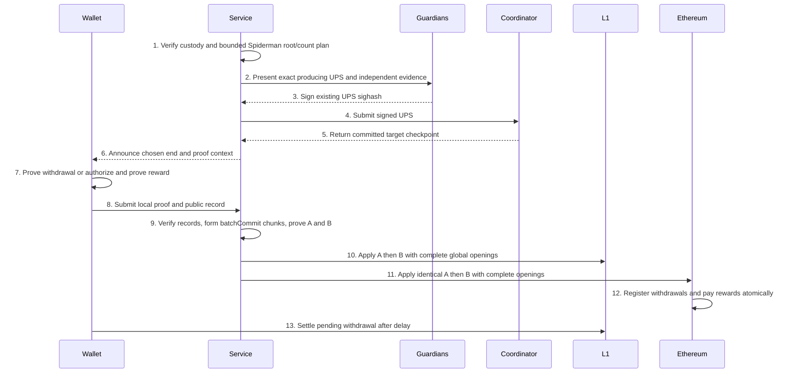

# Two-Artifact Multichain Bridge Proof Aggregation

> Date: 2026-09-28. Status: **Review — production integration amendment pending independent review. The narrow PI/chain-level source cutover has separate static review evidence; it does not approve production integration or runtime activation.**
> Owner: Technical Writer. Source baseline: `mainnet-beta`, `0341409b15017b31276620e2df31564e96d4ac27` plus inspected working-tree source.
> Runtime verification, circuit measurements, setup generation, deployment, and migration: **PENDING; not executed**.

## Terminology and Abbreviations

| Term | Meaning |
|---|---|
| A | One final Groth16 artifact proving all configured chains' deposit append transitions for one window. |
| B | One final Groth16 artifact proving checkpoint finalization, all selected withdrawal registrations, and all selected Ethereum reward payments for the same window. |
| Window | One prebounded processing round, producing exactly shared A+B after its bounded L2 plan is committed. |
| Complete opening | Every real deposit record, withdrawal record, reward record, and chain transition in the aggregate is supplied in the same transaction on **each** executing chain. A branch inclusion proof is not a complete opening. |
| batchCommit | Context-bound Keccak commitment to one actual canonical chunk of up to 32 records. |
| L1 / L2 | External settlement chain / PsyProtocol account execution layer. |
| PI | Circuit public input. |
| GUTA / CST / UPS | Global user-tree aggregator / checkpoint state transition / user proving session. |
| GUSR / ULEAF / CSTATE | Global user tree / authenticated user leaf / per-user contract-state tree. |
| ABI / EVM | Application binary interface / Ethereum Virtual Machine. |
| WASM | WebAssembly user-local proving target. |
| RPC | Remote procedure call. |
| QA | Quality assurance, executable only after the repository's preceding gates. |
| Felt | Canonical Goldilocks field element in `[0, 2^64-2^32+1)`. |
| Hash4 | Four ordered Felt elements, not an arbitrary bytes32 value. |

## Abstract

Relayer/RPC batch limits are manually configured before each L2 processing plan; every round produces exactly shared A+B with complete global openings. Rewards are Ethereum-only authenticated GUTA membership plus owner authorization at fixed REWARD_PER_CLAIM. Numeric reward/token/units remain deployment inputs. Gas/calldata tuning is operational, not an automatic sizing subsystem or current design blocker. Independent review remains required.

## Motivation

The current withdrawal circuit builds 32 membership gadgets even for one record and exposes **18** public u32 words: eight root words, count, bridge user, and eight commitment words; a record contains **34** u32 words (`psy_plonky2_common_circuits/src/bridge/withdrawal_batch_claim_circuit.rs:23-26,96-173`). A user-local single-record proof avoids charging every user for the fixed 32-record circuit. Native aggregation amortizes final wrapping without moving a user's private Merkle witness into the service.

The current shared checkpoint proof has one predecessor root and one count (`psy_plonky2_circuits/src/bridge/circuits/bridge_agg_final.rs:294-305`). Each StateManager instead checks its own predecessor and derives its own count (`psy-contracts/src/StateManager.sol:188-212`). Merely copying proof bytes and changing chain openings (`psy_cli/psy_relayer_cli/src/bridge/daemon.rs:793-821`) does not support different cursors. In addition, deposit append before finalization is daemon sequencing (`daemon.rs:968-975`), not an on-chain deposit guard: `StateManager.sol:254-275` checks subtree membership but does not compare Bridge's applied deposit state.

## Table of Contents

- [Terminology and Abbreviations](#terminology-and-abbreviations)
- [Abstract](#abstract)
- [Motivation](#motivation)
- [Specification](#specification)
  - [1. Scope and authority](#1-scope-and-authority)
  - [2. Flow overview](#2-flow-overview)
  - [3. Canonical encoding and commitments](#3-canonical-encoding-and-commitments)
  - [4. A statement](#4-a-statement)
  - [5. B statement and asynchronous cursors](#5-b-statement-and-asynchronous-cursors)
  - [6. Withdrawal leaf statement](#6-withdrawal-leaf-statement)
  - [7. Reward leaf statement and authority](#7-reward-leaf-statement-and-authority)
  - [8. Recursive shape and verifier binding](#8-recursive-shape-and-verifier-binding)
  - [9. Complete opening and execution](#9-complete-opening-and-execution)
  - [10. Retry, race, and reorganization](#10-retry-race-and-reorganization)
  - [11. Cutover](#11-cutover)
- [Data Structures](#data-structures)
- [Core Functions](#core-functions)
- [Core Loops](#core-loops)
- [Module Changes](#module-changes)
- [File Changes](#file-changes)
- [Cost Model](#cost-model)
- [Acceptance Matrix](#acceptance-matrix)
- [Rationale](#rationale)
- [Security Considerations](#security-considerations)
- [Approval Boundaries and External Prerequisites](#approval-boundaries-and-external-prerequisites)
- [Narrow PI and Chain-Level Amendment](#narrow-pi-and-chain-level-amendment)
- [Production Integration Contract](#production-integration-contract)

## Specification

### 1. Scope and authority

**In scope:** proof statements, recursive verification, user-local leaf proving, complete global openings, chain-local execution, delayed withdrawals, Ethereum reward funding, asynchronous checkpoint cursors, atomic verifier cutover, and future acceptance scenarios.

**Out of scope:** implementation in this change; live migration of account 524288; token ownership transfer; mint permission; deployment; generating setup material; changing pause-guardian powers; per-user entitlement registration followed by partial openings; a third Groth16 artifact; one newly generated Groth16 per chain.

This document owns proof validity. [Bridge relayer multisig](bridge-relayer-multisig.md) owns three independent signing nodes and proposed 2-of-3 authorization of the bridge account's exact L2 UPS sighash. A/B statements are evidence for signer validation, not a new mandatory guardian signature domain for public L1 proofs. Existing L1 proposer authorization remains separate. The existing pause guardian remains a different role.

All proposed symbols below are design interfaces, not claims that exported functions exist. Add their vocabulary to `TERMINOLOGY.md` during an approved implementation; this document-only assignment does not modify that authority.

### 2. Flow overview



Ethereum is one configured L1, not a second execution on the same chain. Guardians approve the bounded producing UPS before its committed target checkpoint and final A/B exist. The user-authorized sequence is task three first: repair and independently review this aggregation design while preserving the existing guardian implementation; cohort merge is deferred. This supersedes the companion document's older merge-before-aggregation order without granting implementation, merge, generation, or deployment approval. Backlog stays queued for subsequent bounded A+B rounds; no A-only catchup path is specified.

```text
User local proof -> verified record -> canonical 32-record chunk -> batchCommit leaf
                                                     |
A: every chain's append transitions ----------------> recursive A -> Groth16 A
B: every start->end checkpoint transition + leaves --> recursive B -> Groth16 B
                                                                    |
                         identical statement + COMPLETE opening on every L1
                                                                    |
                         authenticate ALL preimages -> execute LOCAL effects
```

### 3. Canonical encoding and commitments

Use Keccak-256 for the new opening commitments and preserve existing Poseidon and tagged-Merkle rules inside source-tree membership. Do not reinterpret a Poseidon root as a uniformly distributed 256-bit integer.

**Bounded Boolean Keccak implementation:** preserve the existing `keccak_f1600<F: RichField + Extendable<D>, const D: usize>(builder: &mut CircuitBuilder<F,D>, s: &mut [[U32Target;2];25])` interface and all Keccak-256 encodings, padding, domains and commitment formulas. Replace only its interleaved-lane implementation (`psy_plonky2_common_circuits/src/hash/keccak/mod.rs:50-101`): theta currently calls unsafe_xor_many_u64 at67 and subsequent theta/chi/iota use interleaved operations at71-99. A sum of five interleaved operands can carry between encoded bits and reduce in Goldilocks; it is not a bounded Boolean XOR. The replacement uses no interleave/uninterleave gates and does not change their general-purpose implementation or serializers.

The concrete failure is not a padding convention: for interleaving I(0xffffffff)=0x5555555555555555, the helper's three-operand sum is0xffffffffffffffff=GoldilocksPrime+0xfffffffe; reducing before extraction yields XOR0x0000fffe instead of0xffffffff (`psy_plonky2_basic_helpers/src/u32/gadgets/interleaved_u32.rs:161-166`). Absorbing136 bytes of0xff places all-ones lanes4,9,14 and zero lanes19,24 into the first theta column4, reaching this case. Independently, a64-bit decomposition constrained only modulo the prime admits the prime's bits for field zero; the replacement's32-bit half decomposition has range strictly below the prime, eliminating that alias without changing shared custom gates. These mechanisms motivate both the permutation replacement and bounded-prefix absorption replacement, not an input-specific exception.

At permutation entry, split each of the50 input u32 halves with split_le(target,32), producing state[lane][bit]:BoolTarget[25][64] in little-endian bit order (low half bits0..31, high half32..63). These decompositions constrain every input half to32 bits. Keep the entire state Boolean through exactly24 rounds. Define bit XOR as a+b-2*a*b on already-constrained Boolean operands; its result is Boolean algebraically, with no unconstrained Boolean witness. For each round: (1) theta computes C[x][b] by folding XOR over state[x+5*y][b] for y=0..4, then D[x][b]=XOR(C[(x+4)%5][b],C[(x+1)%5][(b+63)%64]), and XORs D[x][b] into all five lanes of column x; (2) rho/pi uses the existing KECCAKF_ROTC/KECCAKF_PILN tables (`mod.rs:32-44`), carrying the old lane1 and for each of24 destinations replacing destination bit b with carried bit (b+64-rotation)%64 before carrying that destination's previous lane; (3) chi snapshots each five-lane row, then sets bit[x]=XOR(row[x],(1-row[(x+1)%5])*row[(x+2)%5]); (4) iota toggles lane0 bits selected by the existing round's low/high constant (`mod.rs:15-30`). After round23, reconstruct each output half once with le_sum over exactly32 Boolean bits. No full64-bit lane is ever represented as one field element. The existing sponge's Boolean absorption/padding remains unchanged (`mod.rs:203-267`).

Add one concrete shared helper in that same Keccak module: `pub(crate) fn xor_u32_bounded<F: RichField + Extendable<D>, const D: usize>(builder: &mut CircuitBuilder<F,D>, left: U32Target, right: U32Target) -> U32Target`. Split both operands into32 Boolean bits, XOR corresponding bits with the same formula, and return U32Target(le_sum(output_bits)). The bounded-prefix absorber in `psy_plonky2_common_circuits/src/bridge/aggregate_commitment.rs:224-293` replaces its xor_u64 call at276 with this helper applied independently to each low/high half for lanes0..16. Its prefix bound, zero inactive bytes, 136-byte rate, final-block padding, active-state selection and big-endian output remain unchanged. Remove the now-unused interleaved-operation imports from these two owners. This repair touches only those two source files; it adds no gate type, serializer extension, hash protocol, proof family or broader gate repair. All dependent circuit fingerprints/common/verifier artifacts are invalidated and must be regenerated together only in the separately approved artifact phase; old artifacts cannot certify the repaired constraints.

`word(x)` is one 32-byte big-endian unsigned integer with zero high bytes above its declared width. Every parser rejects nonzero high bytes, trailing bytes, missing bytes, unrecognized tags, and noncanonical Felt elements. `word(Hash4)` means four consecutive `word(Felt)` values in source order. A bytes32 hash occupies one word. An EVM address occupies one word with 12 leading zero bytes. Arrays are `word(length) || encode(element_0) || ...`; fixed arrays omit length. Structures concatenate fields in the exact order in Data Structures. No Solidity dynamic ABI offset is hashed: canonical bodies are passed as `bytes` and decoded with this grammar.

Define `D(label)=keccak256(UTF8("PsyBridge/TwoArtifact/1/"+label))` for `Config`, `CircuitSet`, `A`, `B`, `Batch`, `Record`, `Leaf`, `Node`, `Empty`, `Window`, `Reward`, `WithdrawalNonce`. A commitment is Keccak of domain then canonical body; `configHash=commit(Config,NetworkConfig)`.

**Actual batch chunks:** sort each family once: deposit by chain/absoluteIndex, withdrawal by chain/nonce, reward by checkpoint/nullifier. Partition its complete list into consecutive groups of 32 except the shorter final group. A group can cross chain boundaries; private Spiderman web chunks do not change this canonical grouping. For f=1 deposit, 2 withdrawal, 3 reward, chunk j begins at s=32*j and contains n=1..32 real records. Define `batchCommit=keccak256(D(Batch)||configHash||word(endCheckpointId)||encode(endCheckpointRoot)||word(f)||word(j)||word(s)||word(n)||encode(record[s])||...||encode(record[s+n-1]))`. No padding record enters that hash. Local proofs instead bind `recordCommit=keccak256(D(Record)||word(f)||encode(record))`, with context separately in their PIs; a user does not create a batchCommit.

The canonical opening and batchCommit format intentionally replaces the old padded 32-record Keccak format; it is not claimed byte-compatible with it. Preserve source custody-tree leaf hashing separately: map DepositLeaf to exactly 41 u32 words in order shieldAddress[8], zero-extended token[8], l2TokenContractId[8], amount[8], chainIndex[1], noteCommitment[8], then apply the existing Poseidon helper. absoluteIndex is constrained by append position and is not a source leaf-hash word (`psy_plonky2_common_circuits/src/bridge/deposit_batch_append_circuit.rs:33-56,141-159`). The seven-word wire record and its Keccak recordCommit remain unchanged. Likewise withdrawal uses its existing 34-word Poseidon leaf but new unpadded contextual batchCommit. New wrappers/verifiers consume only the new format; old padded commitments are not alternate accepted encodings.

For K=ceil(N/32), ordered leaf j is `keccak256(D(Leaf)||word(f)||word(j)||batchCommit[j])`. Pad to max(1,next_power_of_two(K)) with `keccak256(D(Empty)||word(f)||word(j))`. Level-l parent is `keccak256(D(Node)||word(l)||left||right)`, leaves level0. Empty family has N=K=0 and its position0 empty leaf. Real chunk/record counts are committed; parents constrain contiguous chunk positions and summed record counts. This is option2: **batchCommit leaves → ordered binary Merkle root → context-bound statement hash → two 128-bit Groth16 inputs**.

A projection is its ordered fields replacing depositLeaves with `word(Nd)||word(Kd)||depositBatchRoot`. B projection is `statementA||encode(ends)||word(Nw)||word(Kw)||withdrawalBatchRoot||word(Nr)||word(Kr)||rewardBatchRoot`. A/B digests use D(A)/D(B). Every L1 receives all raw records and reconstructs chunks/roots; supplying only roots is invalid. Final inputs are the first and second 16 digest bytes interpreted big-endian uint128. Wrapper computation constrains both halves without old pair-swapping.

`windowId=commit(Window,configHash||word(endCheckpointId)||encode(endCheckpointRoot)||encode(starts)||encode(deposits))`. It excludes claims/signatures/receipts; B digest distinguishes different claims. Every encoded array has its length word.

### 4. A statement

A proves one append-only Spiderman transition for every **configured** chain, in ascending chain index. Each transition binds old root/count, new root/count, and every contiguous appended deposit record. No operational frontier is an A field, L1 input, or new L1 state. Existing custody preimage checks remain (`psy-contracts/src/Bridge.sol:668-678`); the frontier-dependent proving path at `Bridge.sol:633-697` is replaced, not retained behind an unbound frontier refresh.

A verifies pinned Spiderman chunk proofs with a 32-leaf web subtree and a 27-level top path, preserving the existing height-32 Poseidon tree. For each chunk let `base=32*floor(oldCount/32)` and `take=min(32-(oldCount mod 32), remaining)`. Constrain top-path index to `base/32`; for web position j constrain absolute position `base+j`. Positions below oldCount are unchanged; positions in `[oldCount,oldCount+take)` have zero old leaves and the exact corresponding custody-record leaf hashes as new leaves; positions at or above oldCount+take remain zero. Require every added leaf hash nonzero, range-check every position/count to u32, and connect newCount=oldCount+take without field wraparound. The append-only gadget connects old/new web roots to old/new top-path values (`psy_plonky2_common_circuits/src/hash/merkle/gadgets/spiderman_append_proof.rs:22-44`); its unchanged-nonzero and zero-tail rules are in `full_merkle_tree_append.rs:39-65`. Use neither allow-existing nor overwrite variants. Consecutive chunks connect roots/counts. BatchCommit roots bind all real DepositLeaf records; subtree leaves/path are private proof witness, not frontier calldata. A zero-count root is normalized once to the existing empty deposit root; all later statements use that canonical root.

For zero deposits, constrain equal old/new root and count with empty local range. Verify the full opening and A proof before returning a no-op when authoritative Bridge root/count already equals the proven end. No applied-A digest is stored. Encode every configured chain, including no-op rows, without padding the public chain list to256.

An L1 checks its local deposit preimages against `depositLeafHashes[absolute_index]`, its old root/count against storage, and its end count against `pendingDepositCount`. Foreign custody cannot be inspected by this L1; A proves append mathematics, while each destination independently authenticates custody. B never treats a foreign receipt as locally required. Preserve existing proxy frontier storage slots only as inert reserved layout; disable the replaced frontier append entry point. No path reads, updates, or reconstructs those slots after cutover.

A's `endCheckpointId/root` names the B checkpoint being targeted. A does not prove that checkpoint transition. B proves that the checkpoint's authenticated deposit contract state contains exactly the A end root **and absolute count** for every chain. Direct L2 `set_chain_root` authorization is insufficient proof of L1 custody; L1 deposit equality remains mandatory.

**L2 frontier boundary:** `../psy-compiler/psy-precompiles/deposit_tree/src/main.psy:17,147-170` stores and consumes frontier state in `append_to_chain_hash`; callers are `append_leaf` (258-260), `batch_append_deposits_2` (275-308), `batch_append_deposits_5` (312-345), and `append_deposit` (349-370). Preserve those public methods for non-bridge account state; this design does not remove unrelated deposit-tree behavior. On the bridge account, the existing relayer root/count path is already `build_set_chain_root_call` and its single/multichain callers (`psy_cli/psy_relayer_cli/src/bridge/daemon.rs:2489-2510,2583-2589,2728-2733`). The companion guardian policy permits only that root/count path for the configured bridge account and rejects its frontier methods; changing that policy is a separate reviewed account-authorization change. Its signers independently verify the Spiderman append witness and finalized custody preimages before signing the exact UPS root-update call. `set_chain_root` itself (`deposit_tree/src/main.psy:212-244`) is not an append-proof verifier and must never be described as equivalent to A. Do not mix its root replacement with frontier append methods on the bridge account; its frontier slots remain unused, with no hidden refresh. Non-bridge public append semantics and callers remain unchanged.

### 5. B statement and asynchronous cursors

B contains one `ChainStart` per configured chain and a single end checkpoint identity. For each distinct start identity, recursively prove a contiguous CST range to the common end, then connect its result to every matching chain row. Shared ranges are proved once and reused internally; no additional final Groth16 artifact is generated. Each row contains `(startCheckpointId,startCheckpointRoot)`; `count=endCheckpointId-startCheckpointId` is derived, never an independent unconstrained count. Equal start/end requires exact root equality and an identity checkpoint transition.

A checkpoint cursor is a root of the checkpoint tree, not a reward root or withdrawal subtree. The final authenticated checkpoint leaf and its global state roots are constrained exactly as in `bridge_agg_final.rs:241-291`; deposit and withdrawal roots come from the bridge user's contract state, not the placeholder global fields seen in `psy_plonky2_circuits/src/coordinator/gadgets/checkpoint_state_transition_proofs.rs:64-78`.

**Family6 root/count selectors:** use the approved deposit/withdrawal contract layouts, not the old global-root-only gadget. Both source structs put root[8] first, frontiers[8192][8] next, chain_counts[256] next, then global_count and three padding Felts, then chain_roots[256][8] (`../psy-compiler/psy-precompiles/deposit_tree/src/main.psy:13-25`; `../psy-compiler/psy-precompiles/withdrawal_tree/src/main.psy:13-24`). Four Felts occupy one contract-state leaf. The current compiled-layout readers confirm count subslot `65544+c` and root subslot `65804+8*c` (`psy_cli/psy_relayer_cli/src/bridge/daemon.rs:53-59,3354-3367`; `psy_cli/psy_relayer_cli/src/guardian/verify.rs:262-285`). For configured chain index c:u8, authenticate deposit count leaf index `16386+floor(c/4)` and select element `c mod 4`; authenticate deposit root leaves `16451+2*c` and `16452+2*c`. Authenticate withdrawal root at those same two leaf indices under the withdrawal contract, not the deposit contract. Also authenticate withdrawal count with the same count selector solely to distinguish uninitialized zero-root representation. Each count is stored as Felt but must be range-constrained to u32 before use; reject values above u32::MAX rather than truncate. Each eight-word root is range-constrained to u32, decoded as `Hash4[j]=word[2*j]+2^32*word[2*j+1]`, and constrained canonical below the Goldilocks prime. For count0 and eight stored zero words only, return the existing height32 empty Poseidon root; all other stored words decode unchanged. Example c=5 selects count leaf16387 element1 and root leaves16461/16462. Example c=255 selects count leaf16449 element3 and root leaves16961/16962.

Family6 private witness contains the complete end checkpoint leaf, end global-state roots, bridge ULEAF/user path, and for each configured chain three deposit and three withdrawal `SlotValueInContractStateWitnessInput<GoldilocksField>` values (count and the two root leaves). That existing type fully owns sender_user_id, contract_id, slot_index, user_leaf, slot_proof, contract_proof and user_tree_proof (`psy_plonky2_circuits/src/bridge/gadgets/slot_value_in_contract_state.rs:20-28`). Instantiate its gadget for each selected leaf; constrain sender_user_id=524288, contract_id to the source-fixed deposit/withdrawal identifier, slot_index to the formula above, identical authenticated ULEAF, and user_tree_root=endGlobalStateRoots.user_tree_root. Connect its slot root through the contract proof to that ULEAF as the existing gadget does (`slot_value_in_contract_state.rs:65-89,100-111`), with source-fixed approved contract-state heights. Hash endGlobalStateRoots into endCheckpointLeaf.global_chain_root and endCheckpointLeaf into endLeafHash, connected to family5. Select the count element with constrained quotient/remainder (c=4*q+r, 0<=r<4), never a host-chosen limb. Build each ChainEnd from those decoded values, hash the complete ordered ends and publish family6.chainEndsHash. The current `TreeRootInContractStateGadget` authenticates only slots0/1 (`tree_root_in_contract_state.rs:85-114`); reuse its slot primitive, not its selector or a claim that it already authenticates chain counts. Layout/contract changes invalidate these source-fixed circuit objects and their manifest, not a caller-controlled offset.

Family6's constructor fixes exactly configured C chain witnesses, not256 copies or a runtime-sized target vector. Its proof is verified only by B normalization; B chain bases carry one row without repeating extraction. Section8 defines the internal end commitment and fixed-height withdrawal paths.

Each L1 verifies B and compares its exact start id/root against StateManager, including bootstrap. B proves the contextual A end and checkpoint deposit state agree; on chain require that end root/count equal authoritative Bridge.depositRoot/provedDepositCount. **Proof-artifact identity is intentionally not a dependency:** custody was checked when Bridge advanced, and equal root/count is the required state fact. A public identity proof cannot overwrite this fact or obstruct B. No A receipt map, singleton digest or count-keyed receipt is introduced.

For every chain, B authenticates the end withdrawal subtree and the end deposit subtree/count against the same end checkpoint. A leaf uses this end withdrawal subtree. Withdrawals admitted under an older root must be re-proved locally against the chosen end checkpoint before inclusion; B does not add an arbitrary historical-root whitelist. Pending withdrawals created before cutover retain settlement rights.

Checkpoint no-op chains remain in B. They can register new selected claims against the already finalized checkpoint if their local start equals the common end; zero checkpoint advance is allowed only in this newly specified entry point. An empty claim list is valid. The current `finalize` requires strict advancement (`StateManager.sol:194`) and must not be mistaken for this new behavior.

### 6. Withdrawal leaf statement

A user proves a single-record Plonky2 inclusion circuit. Private witness: leafIndex:u32 and 32 Poseidon siblings. Public PIs bind configHash, end checkpoint, bridge user, withdrawal root and recordCommit as section 8 specifies. WithdrawalLeaf remains exactly six canonical fields; no contextual bytes are silently added to its recordCommit.

The source Poseidon leaf hashes sender id, eight u32 limbs each of recipient/token/amount/nonce, and chain index: 34 field elements. Range-check all limbs/index, address high zeros and `0<amount<GoldilocksPrime`; require nonzero recipient and verify 32-level membership. Derive recordCommit from the six-field WithdrawalLeaf only. Config/bridge/checkpoint/root bind separately through local PIs and the later contextual chunk batchCommit. The private leaf index is not the nullifier.

The service recursively verifies the pinned local circuit and connects its root to B's authenticated destination subtree and its checkpoint/config to B. The service cannot replace the chain, amount, recipient, nonce, or root with unrelated public inputs.

Replay authority remains `Bridge.claimedNullifiers[nonce]`, scoped to the configured Bridge on the destination chain (`Bridge.sol:762-764`). Within the aggregate, sort withdrawals by `(destinationChainIndex, nonce)` and require strict increasing order, rejecting duplicate nonce even if payout fields differ. Across windows, storage consumption is authoritative. On success call `_registerPendingWithdrawal`, then consume nonce; do not transfer immediately. Existing delay, pause, total-cap and amount rules remain in force (`Bridge.sol:810-837`).

### 7. Reward leaf statement and authority

**User-decided reward authority: Ethereum only.** Fixed Ethereum chainId/index and payer are config-bound; no user destination selector exists. Payer checks block.chainid, its own configured address and Ethereum StateManager caller. Only its authoritative reward-consumption map writes spent keys. Other L1s verify identical B/full opening but execute only local checkpoint/withdrawals, rejecting reward payout attempts. Same-domain L2 claims are disabled at fresh launch. Eligibility and pricing follow the user's fixed-membership/fixed-amount rule below; funding permission remains separate.

**User-decided eligibility:** an authenticated tagged node in the GUTA subtree, owned by the claimant's tag, is eligible. No off-chain job metadata, saved job type, additional job-set commitment or actual-job proof is required. The checkpoint's named gutas_root currently aliases the whole tagged tree (`checkpoint_state_transition_proofs.rs:101-105`); therefore the circuit must enforce the GUTA subtree location N(2,0), defined by `psy_data/src/rewards_tree/offsets.rs:6-33,52-62`, rather than accept arbitrary nodes under that aliased root. Do not exclude in-subtree no-change or intermediate nodes using an unapproved job classification.

The local reward circuit proves:

1. Authenticate claimCheckpointId's complete checkpoint leaf under B's accepted end checkpoint tree and extract pm_rewards_commitment.gutas_root. Fees/completed-job statistics remain part of the existing leaf hash but are not reward-price inputs. Schema: `psy_data/src/v1/qdata/checkpoint.rs:183-219,268-305`.
2. A tagged path reconstructs that reward root: start `H(H(leafLeft,leafRight),leafTag)`; at each active level combine sibling on the side selected by the path bit, then hash with `parentTag`. Require `leafTag=H(tagPreimage,tagPreimage)` and `tagPreimage[0]=userId`. All other tag preimage elements are private canonical Felt values.
3. Height/path refer to the **full authenticated tagged root**, not a subtree-relative relabeling. Require 2<=height<=21 and 0<=pathIndex<2^(height-2): the two rootward path bits are zero, locating N(2,0) or its descendants. At height2 only index0 is eligible, including the GUTA subtree root itself. Require all unused siblings/tags zero and all high index bits zero. Derive nullifierIndex=(2^height-1)+pathIndex with checked integers; it is canonical across all proof representations. Registration N(3,2), deployment N(4,6), update N(4,7), CST and part-1 nodes fail this predicate. No local-depth alternative nullifier exists.
   Root orientation is source-backed: the checkpoint stores `H(H(part1R,0),CSTtag)` (`psy_plonky2_circuits/src/coordinator/gadgets/checkpoint_state_transition_proofs.rs:90-105`); part1 places GU as its first/left child (`psy_data/src/rewards_tree/offsets.rs:6-33`). Thus N(2,0) is measured from that exact committed root, not part1R. During leaf-to-root traversal bit0 selects the immediate parent branch; bits height-2 and height-1 are the final two/rootward branches and both must be0. Also explicitly enforce pathIndex<2^height. Require nonzero leafTag and nonzero tagPreimage, `leafTag=H(tagPreimage,tagPreimage)`, tagPreimage[0]=authenticated userId; zero/unassigned tag nodes fail. No new assumption assigns ownership to synthetic ancestors outside GU; subtree membership itself is the user-selected eligibility rule.
4. Payout is exactly the Ethereum contract constant **REWARD_PER_CLAIM**, in the approved token's smallest units. No amount field exists in RewardLeaf, request, private witness or user-chosen authorization. The new reward circuit does not divide fees by gutas_completed and does not constrain proposed_reward*T<=fees; that source formula is intentionally replaced by the user's fixed-amount decision.
5. Dedicated account authorization binds the record, authenticated context and immutable config containing reward token/constant denomination. Ethereum checks the contract constant equals that committed config value. Count each distinct unused reward key once; require checked uint256 total=realRewardCount*REWARD_PER_CLAIM without overflow and sufficient dedicated reserve before effects. Then consume keys and transfer the same constant to each recipient atomically.

**Dedicated reward authorization:** introduce four separately pinned circuits: `ZkRewardAuthorizationCircuit`, `SecpRewardAuthorizationCircuit`, `PersonalSignRewardAuthorizationCircuit`, and `MultisigRewardAuthorizationCircuit`. Each verifies only its named scheme over the same reward-domain M and has its own fingerprint/common/verifier data. None calls `get_sig_action_for_user`, reuses the EndCap action, constructs a transaction stack, or accepts an EndCap. Existing signature circuits and account identities remain unchanged.

Define `Dauth=keccak256(UTF8("PsyBridge/TwoArtifact/1/RewardAuthorization"))` and `M=keccak256(Dauth||configHash||word(endCheckpointId)||encode(endCheckpointRoot)||encode(endCheckpointLeafHash)||encode(authorizationUserLeafHash)||encode(claimCheckpointLeafHash)||encode(RewardLeaf))`. RewardLeaf fixes checkpoint/user/canonical position/recipient, not amount. ConfigHash commits fixed rewardPerClaim/token/units and Ethereum destination. For field primitives messageFeltHash is Poseidon over `[0x52574155,m0,...,m7]`, the eight big-endian u32 words of M. No user-proposed reward amount enters this action.

The circuit must prove the claim checkpoint leaf **at claimCheckpointId** under B's authenticated end checkpoint-tree root, using the fixed network tree height and range-constrained index. It extracts the reward root/statistics from that leaf. Separately authenticate the end checkpoint leaf/global roots and the authorization ULEAF **at userId under that end user-tree root**. Require `U.user_id=RewardLeaf.userId` and integer-range-checked `U.last_checkpoint_id<=endCheckpointId`. Hash the complete existing ULEAF including nonce, public key and account-state root. Free historical roots or StateReader-supplied checkpoint hashes are not sufficient.

The identity allowlist is closed: exactly the following four existing account schemes and their frozen source-generated identity fingerprints. Require `H(existingIdentityFingerprint,publicKeyParam)=U.public_key`; never substitute the new reward-circuit fingerprint into account identity. The parent reward-inclusion circuit verifies the **new** reward authorization proof under pinned CommonCircuitData/VerifierOnlyCircuitData. All other identity fingerprints are rejected.

| Allowed existing identity | Dedicated reward witness/check | Account and policy source |
|---|---|---|
| ZK key | Private-key Hash4; derive existing publicKeyParam, constrain its existing-identity commitment to the authenticated account, and bind the complete reward-domain M through the authorization proof and parent equality | Existing key derivation owner `client_prover/psy_circuit/psy_common_circuit/src/circuits/zk_signature/`; wallet dispatch reference `client_prover/psy_prover/src/signature/users/zk_user.rs:48-51`. No replacement key. The unused possession-output hash is not an authorization condition; preserve key knowledge and message equality. |
| Raw secp256k1 | Compressed key and low-S signature over the raw 32 bytes of M; existing curve/key/scalar constraints | Existing publicKeyParam and raw-secp identity fingerprint; `client_prover/psy_prover/src/signature/users/secp256k1_user.rs:34-37,62-66`. No private-key export required. |
| Ethereum personal-sign secp256k1 | Compressed key and low-S signature over `keccak256("\x19Ethereum Signed Message:\n32" || M)` | Existing distinct personal-sign identity fingerprint/publicKeyParam; `client_prover/psy_prover/src/signature/users/eth_personal_sign_user.rs:49-52,77-81`. Raw-secp identity is not interchangeable. |
| Mutable multisig | Contract id 6, initial policy, authenticated header and three members, exactly two signatures over raw M with strictly increasing member indices in 0..2 | Authenticate all four slots under the same end ULEAF/account-state root: slot0=[version,2,3,0], slots1..3=current members. Derive current policy from these fields; reject zero/uninitialized header, bootstrap and replacement. Reuse fixed policy constraints and four-slot authentication at `client_prover/psy_circuit/psy_ups_circuit/src/signature/multisig.rs:62-65,156-166,207-223`; derive existing publicKeyParam from contract id/initial policy at `238-241`. No opaque stored commitment or caller-authoritative current_policy exists. |

Direct primitive verification in the dedicated circuit binds M; an existing UPS signature proof whose public inputs bind an EndCap action is not accepted. This is targeted new circuit construction, not a global signature-circuit refactor. Caller-supplied fingerprints, verifier selectors, or policy preimages are never authority without these constraints.

**Coverage limitation requiring deployment approval:** DPN/software-defined, delegated SDK/SD keys and arbitrary custom account fingerprints remain excluded from the closed authorization set. No fallback to a weaker account mode is allowed. Required excluded users block activation pending reviewed adapters; Ethereum-only authority does not approve stranding their rewards. This fresh-launch design offers no L2 reward compatibility path, deployed identity change or migration of user524288.

Replay consumption uses stable rewardNullifierDomain, claimCheckpointId and nullifierIndex, as defined below. M additionally binds payout and current authenticated account/end checkpoint. Account nonce is authenticated but never incremented; no UPS action or synthetic transaction convention is introduced.

Reward consumption uses the stable rewardNullifierDomain and key defined in Withdrawal nonce and configuration replacement, not configHash. Recipient, amount, user id, tag and reward-root bytes are excluded from the spent key. Sort records by checkpoint/nullifier and require strict increase; Ethereum consumes before transfer atomically.

**Canonical root:** only the claim checkpoint leaf authenticated under B's end checkpoint tree supplies the tagged root. Its fees/job counts remain authenticated leaf data but do not price payouts. Alternative proof roots do not replace this leaf; conflicting finalized histories remain a finality assumption.

**Fixed issuance semantics:** GUTA membership plus owner authorization and unique canonical position establishes entitlement under the user decision. Existing T=total_aggregation_proofs_generated is not a price denominator, payable-set cardinality proof or aggregate budget. No P<=T theorem is required for the fixed price. This design does **not** claim aggregate issuance is bounded by collected fees. More eligible positions produce more fixed payments; reserve provisioning is an independent funding obligation, not an implicit fee cap or first-come fee budget.

**Required deployment input:** the user must supply the exact REWARD_PER_CLAIM integer, reward-token address and smallest-unit convention before constants/config/artifacts can be finalized. No numeric value is invented here. The amount is immutable for this first launch and committed in configHash so proofs/authorizations cannot be replayed into a differently priced configuration. No new consensus reward counter, marker or R commitment is introduced.

**Mode-2 host correction, separate from economics:** preserve canonical R=`H(H(c0,H(H(c1,c2),tag)),tag)` from `parth_core/src/crypto/hash/tag_tree.rs:40-43` and `psy_data/src/worker/metadata.rs:61-65,102-117`; change `psy_data/src/worker/proving_work_history.rs:61-69` to use that same helper. Do not change R or infer two paid jobs merely because a synthetic node carries the tag. This is a proposed directly related claim-proof correctness fix, not a consensus reward-layout rewrite.

**Funding:** a dedicated Ethereum reward payer uses pre-funded, non-rebasing, non-fee-on-transfer reward tokens and checked aggregate balance before payment. It cannot withdraw Bridge custody reserved for user withdrawals. Transfers must deliver the exact stated amount or revert the whole local B transaction. No mint call, token ownership transfer, or external allowance is assumed. The token identity, amount units, reserve funding authorization, and sustainable funding source require explicit approval before activation. Existing L2 reward accounting is not evidence that the relayer owns Ethereum issuance rights.

### 8. Recursive shape and verifier binding

Use level-specific binary recursive aggregators with pinned child CommonCircuitData and VerifierOnlyCircuitData. Leaf circuits have separate pinned fingerprints for deposit chunk, withdrawal, reward payout authorization, reward inclusion, checkpoint range, and chain identity. Normalize their outputs into fixed-width tagged statements; never select an arbitrary verifier supplied by the service. Existing fingerprint/cyclic-verifier connection is a precedent, not permission to skip pinning (`bridge_agg_final.rs:130-166`; `bridge_wrap.rs:364-377`).

The deployed A and B wrappers each accept one normalized recursive root shape. A bounded shape table is part of NetworkConfig through its circuit-set hash. Counts determine the smallest admissible power-of-two tree; the root-normalization proof verifies the selected level's fingerprint from that fixed table and its exact level/count interval. A submitted level is not self-authorizing. Empty and identity branches use pinned constrained base circuits. No witness boolean bypasses verification of a real child.

**Canonical circuit-set schema.** `circuitSetHash=commit(CircuitSet,word(1)||encode(entries))`; sort entries by `(family:u16,level:u8,variant:u8)`, with no duplicate tuple. Each entry is exactly `(family:u16,level:u8,variant:u8,piWords:u16,fingerprint:Hash4,commonDigest:bytes32,verifierDigest:bytes32,identityFingerprint:Hash4)`. Digests are Keccak of the existing pinned library's canonical common/verifier serialization; that library source revision is frozen with the entries. identityFingerprint is zero except authorization family. Parents embed actual common/verifier objects and check these digests/fingerprints at artifact creation; no runtime registry update or caller-selected verifier is permitted. Allowed families: 1 Spiderman web, 2 withdrawal record, 3 reward record, 4 authorization (variants0 ZK/1 raw/2 personal/3 multisig), 5 checkpoint range, 6 end-state extraction, 7 batch (variants1/2/3), 8 batch reduction (variants1/2/3), 9 chain transition, 10 chain reduction, 11 normalization (variants1 A/2 B). Families1..7/9/11 have level0; family8 levels1..5; family10 levels1..L for source-fixed L=ceil(log2(C)), with no family10 entries when C=1. Empty base proofs are variants with high bit128 set for families7 and9 only, constrained zero count and family-specific empty commitment; no user proof is attached. Both family9 empty bases remain present even for C=1. This table includes the four identity records; they are not a second circuitSetHash format. The narrow amendment specifies exact registry completeness and source-C binding.

For family9/10, real variant1 is A and variant2 is B; family9 empty variants129/130 preserve that type. Parents accept only same-base-variant children and adjacent ordinal spans. Family6 variant0 is end extraction; families1/2/3 variant0 are their single statements. Family5 variant0 is strictly positive checkpoint range and variant1 is the separately pinned checkpoint identity circuit. Family11 normalization has exactly two distinct registry keys `(11,0,1)` for A and `(11,0,2)` for B, with distinct pinned fingerprints/verifier data; those variants are also constrained in their PI prefix. No shared ambiguous normalization key is permitted.

**Acyclic artifact construction:** freeze the immutable configured chain count C in 1..256 before circuit construction, and specialize family6 and B normalization to exactly C rows/range slots. NetworkConfig.chains.length must equal that source-fixed C; chain indices and other configuration values remain checked witnesses. Build source-fixed identity/authorization, membership, checkpoint and extraction circuits, harmonize selectable circuits' common data as specified below, then build batch/chain bases, increasing reduction levels, normalizers and wrappers. Each parent embeds only already-built child common/verifier data; a normalizer pins its descendants, not its own registry entry. Compute the complete circuit-set entries and circuitSetHash after these objects exist; then encode NetworkConfig and compute configHash; finally pin configHash in deployment/admission configuration. Circuits receive configHash as PI and NetworkConfig as canonical witness wherever its fields are used, constrain commit(Config,NetworkConfig)=configHash, and connect child contexts. No circuit bakes its final configHash or self-containing circuitSetHash into its fingerprint. Numeric reward/token inputs remain mandatory before final NetworkConfig/deployment, not before parameterized source implementation. Source-fixed child pinning follows `bridge_agg_final.rs:130-166`.

For family11, the preceding context rule applies to internal targets and verified child PIs, not an exported configHash: its only public fields are the four fixed header words and eight statement words. The complete statement still commits configHash and the selected end identity through the unchanged opening formulas.

**Fixed proof slots and authenticated inactive branches:** use the pinned Plonky2 fork `1dfe6112c3eca3668c15820755371a8a3e75f934` (`Cargo.toml:266`), `plonky2/src/recursion/conditional_recursive_verifier.rs:24-40`: `conditionally_verify_proof(condition, real_proof, constant_real_verifier, dummy_proof, constant_dummy_verifier, shared_common)`. It selects proof/verifier and invokes one verifier, not two. Both verifier targets are built by `constant_verifier_data`; never use the virtual-verifier `conditionally_verify_proof_or_dummy` helper. Build the dummy with `dummy_circuit(shared_common)` and its proof with no nonzero inputs; construction asserts exact common-data equality (`plonky2/src/recursion/dummy_circuit.rs:75-117`). Constrain every dummy PI to zero whenever selected. These zero PIs are internal inactive slots, not valid family statements; every active proof still obeys the exact prefix grammar below. Dummy verifier objects are embedded constants in parents, not new externally admitted proof families or user-authorized verifier selectors. No real proof/signature is duplicated into inactive slots. Active conditions are integer comparisons against constrained counts, never caller booleans. Verification gates remain present on inactive slots.

Before computing fingerprints, deterministically harmonize each set selected by one verifier: family7 real/empty for each variant, family9 real/empty for A and B separately, all four family4 authorization variants, and family5 positive/identity. Use the same non-zero-knowledge recursion configuration, the same public-input count, and the union of member gate types inserted in ascending gate-identifier order. Build provisional members to obtain that union and the maximum degree; rebuild every member with the complete gate set, adding NoopGate padding to the same target power-of-two degree. If rebuilt members require a larger degree, raise the target to their maximum and rebuild all members; terminate only when serialized CommonCircuitData is byte-identical for the entire set. A disagreement in non-degree fields is a build error, not permission to accept mismatched data. Generate each associated dummy from that exact common data and assert equality again. Only then compute fingerprints and embed verifier constants. Existing deterministic padding, goal-common-data and equality checks are the precedent (`psy_plonky2_circuits/src/bridge/circuits/bridge_agg_chain.rs:252-272,452-529`; `psy_plonky2_basic_helpers/src/builder/pad_circuit.rs:144-147,247`; pinned fork `plonky2/src/recursion/cyclic_recursion.rs:118-122,147-149`). This is artifact construction, never a witness-selected circuit size. Family4 uses one verifier with one of four constant verifier objects selected by a constrained variant0..3 equal to the verified PI variant and authenticated account identity; all four share this harmonized common data. Leaf/shape fingerprints include the resulting padded circuits.

Family9 A has exactly **33** web-proof slots: a 1024-record append beginning inside a 32-position web requires at most ceil((31+1024)/32)=33 webs. Let n=range.recordCount, offset=oldCount mod32; constrain n<=1024 and activeWebCount=0 if n=0, otherwise floor((offset+n+31)/32). For each fixed slot i=0..32 derive active=(i<activeWebCount), verify its real family1 proof or constant-verifier dummy, and when active require take=min(remaining,32-(rollingCount mod32)), take>0, proof.recordCount=take, exact rolling root/count/record-slice connections. Update rolling values only when active; require remaining=0 and exact final root/count after slot32. Family1 accepts positive recordCount only. At n=0 all slots are inactive, no real web is generated, and equal start/end is constrained. Family7 withdrawal/reward has exactly32 proof slots selected by i<realRecords, where 1<=realRecords<=32 for a real base; its canonical empty base fixes zero records and attaches no user proof. Hash only the active canonical records, never dummy PIs/padding. Deposit family7 hashes its at-most32 raw records without per-record proof slots; family9 owns the web verification. Family7/9 canonical empties retain their tagged family statement and commitment; they are distinct from all-zero internal dummy PIs. Binary parents select real versus canonical empty constant verifier using constrained real count, with harmonized common data. Shape normalization pins each level's own common/verifier object; different levels are not asserted to share common data.

**Exact recursive PI grammar.** All below are flat Goldilocks targets. `U8/U16/U32` occupy one range-checked target; `U64` occupies lo32 then hi32 targets; `K` (Keccak bytes32) occupies eight consecutive big-endian u32 targets; `P` (Hash4) occupies four canonical Felt targets. No field reduction of an integer is permitted. Every row begins `version:U32=1,family:U16,variant:U8,level:U8`. Families1..10 then carry `configHash:K,endId:U64,endRoot:P` (14 targets after the four-target prefix). Family11 omits that exported context and carries only its statement digest after the four-target prefix; its internal context targets, child-context equalities and complete-opening commitment remain mandatory. The following suffixes are complete; piWords is derived from them and frozen in the registry:

| Family | Exact suffix in order |
|---|---|
| 1 Spiderman web | chainIndex:U8, oldCount:U32, newCount:U32, oldRoot:P, newRoot:P, firstRecord:U32, recordCount:U32, globalDepositRecordRoot:K, globalDepositCount:U32 |
| 2 withdrawal record | bridgeUserId:U32, chainIndex:U8, withdrawalRoot:P, recordCommit:K |
| 3 reward record | recordCommit:K, claimId:U64 |
| 4 authorization | message:K, authorizationUserHash:P |
| 5 checkpoint, variant0 positive range or1 identity | startId:U64, startRoot:P, endLeafHash:P |
| 6 end extraction | endLeafHash:P, chainEndsHash:K |
| 7 batch / 8 batch reduction | firstChunk:U32, realChunks:U32, firstRecord:U32, realRecords:U32, subtreeRoot:K, chainEndsHash:K |
| 9 chain / 10 chain reduction, variant1 A or2 B | firstChainOrdinal:U32, realChains:U32, chainRowsHash:K, globalDepositRecordRoot:K, globalDepositCount:U32 |
| 11 A normalization, variant1 | statementA:K |
| 11 B normalization, variant2 | statementB:K |

**Global positional deposit commitment:** use one internal1024-leaf height10 Merkle tree over the complete deposit opening. Internal marker12 is reserved solely for this tree; it is not a proof family. Let N=globalDepositCount, constrained0..1024. For j<N, leaf[j]=keccak256(D(Leaf)||word(12)||word(N)||word(j)||recordCommit[j]); for N<=j<1024, leaf[j]=keccak256(D(Empty)||word(12)||word(N)||word(j)). At level l=1..10, parent=keccak256(D(Node)||word(12)||word(l)||left||right); leaves are level0. The level10 value is globalDepositRecordRoot. Common proof context binds config/end. These internal formulas never replace the existing canonical batchCommit tree, statement projections or wire fields.

Family1 has fixed32 DepositLeaf witness slots and32 paths of ten bytes32 siblings. For active i<recordCount, derive ordinal=firstRecord+i, constrain it to10 bits and ordinal<N, recompute recordCommit from that record, and verify its height10 path to globalDepositRecordRoot using ordinal bit l-1 at level l. Require record.chainIndex=family1.chainIndex, record.absoluteIndex=oldCount+i, newCount-oldCount=recordCount and positive count<=32. Connect that same record's source Poseidon hash to the changed append position. Inactive record/path witnesses are zero and excluded from hashes; active selection is count-derived. Family1 no longer exposes or computes orderedRecordHash. FirstRecord remains global record ordinal, never absolute tree index. Each web proves inclusion of the exact append records in the global positional tree, not an arbitrary same-length sequence.

**Deposit proof join:** `DepositRecordRange=(firstRecord:u32,recordCount:u32)` is exactly two canonical words64 bytes; it contains no per-chain ordered hash. A recursive row is `encode(ChainStart)||encode(DepositTransition)||encode(DepositRecordRange)`; B adds encode(ChainEnd) before encode(DepositRecordRange). No opening wire field changes. Family9/10 carry globalDepositRecordRoot/globalDepositCount once in their common PI suffix, not in each row. Only A bases verify the33 fixed web slots. Every active web connects its global root/count to that common suffix, firstRecord to range.firstRecord+consumed, oldCount/root to rolling state and recordCount to the exact take formula; range.recordCount=newCount-oldCount and final consumed/root/count must match the row. No A base witnesses/hashes a1024-record per-chain array or performs indexed lookups into one. Zero deposit rows consume no real web but preserve the same common root/count. Empty chain padding also carries that common root/count. Each family10 parent connects both children's common root/count to its own in addition to existing context/row constraints.

Each normalizer makes one O(C) prefix pass over transition count deltas: firstRecord is the running sum, recordCount the checked delta, and final sum=N equals the full deposit opening length. It computes all deposit recordCommit values once from that opening, constructs the one fixed1024-leaf tree once, and connects root/N to the verified family9/10 suffix. A computes canonical deposit batchCommit/root from those same opened records and connects family7/8; B derives the same prefix rows/root/N and embedded statementA without replaying web verification, retaining its authenticated end/state equality and local applied-A guard. Strict adjacent ordering by (chainIndex,absoluteIndex), canonical field bounds and complete length checks take one record pass; do not scan C chains or select a1024-element stream for each record. A's contiguous web coverage, positional membership and total prefix sum bind every one of the N records to the configured transitions. The withdrawal normalizer likewise checks adjacent (chainIndex,nonce) ordering and record bounds without another C-scan per record: its verified family7 end-membership join already authenticates configured chain membership.

**Standalone B deposit assignment:** each B chain base adds exactly two endpoint witness slots, without A web verification. Let s=range.firstRecord and d=range.recordCount=newCount-oldCount. Derive firstActive=(d>0), lastActive=(d>1). When firstActive, authenticate the first DepositLeaf at ordinal s through its ten-sibling marker12 path to common globalDepositRecordRoot/N; require leaf.chainIndex equal the row's configured chain and leaf.absoluteIndex=oldCount. When lastActive, authenticate the last DepositLeaf at ordinal s+d-1 through its ten-sibling path to the same root/N; require matching configured chain and absoluteIndex=newCount-1. If d=1 the first leaf is logically also last: no duplicate real endpoint witness. If d=0 both slots are inactive. Constrain inactive leaf fields/siblings to zero and zero-select inactive ordinals before10-bit decomposition; do not impose s<N on a zero-length range, because s=N=1024 is valid. Active ordinals require ordinal<N. All counts, selectors, checked additions and endpoint equalities are circuit constraints, not host-only checks. A bases add no endpoint paths.

Strict adjacent lexicographic (chainIndex,absoluteIndex) ordering in B normalization, exact N records and O(C) prefix partition combine with these endpoints: a slice of d distinct ordered records with endpoint chain equal and endpoint indices oldCount/newCount-1 spans exactly d integer positions, forcing every middle record to that chain and consecutive index. For d1 the first endpoint alone proves assignment; d0 has no record to assign. Thus standalone B rejects C1 oldCount0/newCount1 with leaf chain255/index42 without an A proof child. No per-record configured-chain scan, per-chain1024-record array or append mathematics is added.

In `psy_plonky2_circuits/src/bridge/circuits/chain_aggregate.rs`, private host witness `DepositRangeEndpoints { first_leaf: DepositLeaf, first_siblings: [[u8;32];10], last_leaf: DepositLeaf, last_siblings: [[u8;32];10] }` has matching fixed targets `DepositRangeEndpointsTarget { first_leaf: DepositLeafTarget, first_siblings: [Bytes32Target;10], last_leaf: DepositLeafTarget, last_siblings: [Bytes32Target;10] }`. The producer derives them from the single global tree: d0 zeros every field; d1 fills only first; d>1 fills both. Example s5,d3,old20,new23 authenticates ordinals5/7 with absolute indices20/22. Circuit helper `fn constrain_deposit_range_endpoints<const D: usize>(builder: &mut CircuitBuilder<GoldilocksField,D>, context: &ChainContextTarget, row: &ChainRowTarget, endpoints: &DepositRangeEndpointsTarget) where GoldilocksField: Extendable<D>` derives selectors, zero-constrains inactive fields, recomputes active recordCommit values, calls verify_deposit_record_path at each fixed slot and conditionally connects chain/index. B-base proving input includes this witness; A-base input does not. Family9/10 remain37 PI words; canonical A/B wire encodings are unchanged.

Family1 PI width is40=18 prefix+3 chain/count targets+8 roots+2 interval targets+8 global root+1 global count. Family9/10 width is37=18 prefix+2 ordinal/count targets+8 row hash+8 global root+1 global count. Family3 width is28, family6 width is30, and family11 width is12, as specified by the grammar above and the narrow amendment below. All parsers, constants, child offsets, circuit-set validation, manager entries and witness setters change together. Family2/4/5/7/8 widths and canonical A/B wire encodings stay unchanged. Removed layouts are not accepted as alternate layouts.

Native helpers in existing `client_prover/psy_core/psy_data/src/bridge_aggregate.rs` are `fn deposit_record_tree(record_commits: &[Bytes32]) -> Result<Vec<Bytes32>>` and `fn deposit_record_path(tree: &[Bytes32], count: u32, ordinal: u32) -> Result<[Bytes32;10]>`. The tree helper rejects count>1024 and returns exactly2047 nodes in heap order, root at0, leaves at1023+j, children2*i+1 and2*i+2. The path helper requires tree.len()=2047, count<=1024 and ordinal<count, then follows ten parent steps from1023+ordinal, returning the sibling at each step bottom-up. This derived host buffer is not proof authority: circuits recompute and authenticate the supplied paths. Service construction builds the tree once and reuses it for all paths. Circuit helpers in existing `psy_plonky2_common_circuits/src/bridge/aggregate_commitment.rs` are `fn deposit_record_root<F: RichField + Extendable<D>, const D: usize>(builder: &mut CircuitBuilder<F,D>, record_commits: &[Bytes32Target;1024], count: Target) -> Bytes32Target` and `fn verify_deposit_record_path<F: RichField + Extendable<D>, const D: usize>(builder: &mut CircuitBuilder<F,D>, active: BoolTarget, root: Bytes32Target, count: Target, ordinal: Target, record_commit: Bytes32Target, siblings: [Bytes32Target;10])`. Root construction bounds count<=1024, selects real versus empty leaf by j<count and ignores zero-constrained inactive commitments; path verification enforces active ordinal/count bounds, computes ten levels and conditionally connects the root. No caller-selected marker, depth or domain exists. Native and circuit results use identical bytes32 order. Family1 inputs extend with global root/count and32 ten-sibling paths; ChainContext/ChainContextTarget extend with the same root/count; ChainRow/DepositRecordRange retain only first/count. Inactive path ordinals are zero-selected before10-bit decomposition so a full-capacity firstRecord+inactive offset cannot overflow the active-index constraint.

**Authenticated end-state commitment:** retain the PI name chainEndsHash but make its value an internal ordered Merkle root with exactly256 leaves and height8. For ordinal j<C, leaf[j]=keccak256(D(Leaf)||word(6)||word(C)||word(j)||encode(ChainEnd[j])); for C<=j<256, leaf[j]=keccak256(D(Empty)||word(6)||word(C)||word(j)). For level l=1..8, parent=keccak256(D(Node)||word(6)||word(l)||left||right), with leaves at level0. chainEndsHash is the level8 root. No wire field or B statement projection changes: full ends remain in BOpening. Family6 authenticates exactly C ends, builds this tree once and publishes its root. B normalization verifies family6 **once**, recomputes the same tree once from the full ends opening, and connects its root and endLeafHash to the accepted checkpoint ranges. A B chain base witnesses only its one ChainEnd and connects its chainIndex and depositRoot/count to its one row/DepositTransition; it verifies neither family6 nor a full ends array nor a checkpoint range. The complete B chainRowsHash must match the normalizer's rows derived from the authenticated full opening, so no unauthenticated ChainEnd survives. No zero-filled fake ChainEnd exists in A. End-tree construction costs O(C+256), not repeated full-array work per chain or withdrawal batch.

**Withdrawal proof join before reduction:** for each active family7 variant2 record, witness exactly one ChainEnd, ordinal:u8 and eight bytes32 siblings. Require ordinal<C, ChainEnd.chainIndex=NetworkConfig.chains[ordinal].chainIndex=WithdrawalLeaf.chainIndex, and verify the fixed-height8 path using the exact leaf/level formulas above. Bit l-1 of ordinal selects left/right at level l; the computed root must equal the batch's chainEndsHash PI. Verify the real family2 proof and connect its configHash/endId/endRoot to batch context, bridgeUserId=NetworkConfig.bridgeUserId=524288, recordCommit to the opened WithdrawalLeaf commitment, chainIndex to the record, and withdrawalRoot to the selected ChainEnd.withdrawalRoot. Only then hash the contextual batchCommit. Inactive record witnesses are zero and add no path or record to the hash; fixed path gates are gated by the count-derived active condition. Family8 variant2 connects both child chainEndsHash values to its own, including canonical empty children. B normalization connects the final withdrawal commitment root to the verified family6.chainEndsHash before accepting statementB. Empty withdrawal bases carry that same root without user proofs. Deposit/reward variants constrain chainEndsHash to eight zero words. Each withdrawal now consumes eight siblings, not the entire ends array. Membership alone is not authority: current source separates membership (`withdrawal_batch_claim_circuit.rs:105-137`) from authoritative-root validation (`psy-contracts/src/Bridge.sol:719-724`).

Here variant2 includes its constrained empty-base variant130 for the shared commitment rule; empty reduction children carry the same chainEndsHash. Family7 variant1 has DepositLeaf preimages, not one family1 proof per record: it computes commitments and canonical chunk positions, while family9 verifies the web proofs and the normalizer enforces the deposit join. This avoids inventing a nonexistent deposit single-record proof family.

Every family10 parent witnesses the **complete concatenated child row preimages**, not just opaque hashes. Partition at left.realChains, recompute each child's chainRowsHash with its variant/start/count and connect to the verified child PI; then hash the concatenation with the parent's start and summed count. Empty child has zero rows and its uniquely specified empty-list hash. Require adjacent ordinal ranges, actual row chain indices equal configured indices, no missing/duplicated row, and identical context. The normalizer receives the entire ordered row array from complete opening and connects its hash to the final family9/10 proof. This intentional bounded row-preimage work makes the flat hash composable without inventing a Merkle concatenation identity.

The batch reduction level l covers exactly 2^l chunk positions. Left/right positions are adjacent, context identical, firstRecord/right offset matches left count, and real counts sum. Only the trailing right side can be empty; once empty, all later positions are empty. K<=32 retains batch levels0..5. Chain reduction exists only at levels1..L, where L=ceil(log2(C)) for the source-fixed configured C; L=0 selects the family9 base and C=256 reaches level8. N=0 uses constrained empty batch base; K=1 directly uses batch base; odd K receives position-specific empty leaves, not duplication. Normalization verifies the unique smallest level and recomputes the final complete-opening projection. It outputs the four fixed header words and the stated digest after checking every child connection. This fixes every inner boundary separately from final 2x128 wrapping.

**Family11 fixed level selection:** each used batch family has exactly six conditional-verifier slots, one for each level0..5: deposit in A, withdrawal and reward in B. Reconstruct N from the complete opening and constrain K=ceil(N/32). Derive selectedLevel=0 for K<=1, otherwise the unique l in1..5 with 2^(l-1)<K<=2^l; constrain exactly one active slot using these predicates, never a supplied level selector. At slot l, use that level's source-pinned CommonCircuitData and constant real verifier; construct its dummy against that exact common data and embed its constant dummy verifier. Different levels need not share common data. Invoke the section8 conditional-verifier primitive at all six slots, with inactive dummy PIs constrained zero. At level0, the real branch selects the pinned canonical empty base when N=0 and the pinned nonempty base when N>0; their common data is harmonized before fingerprints as specified above. Connect only the active real statement to the expected family/variant/level, config/end context, firstChunk=0, firstRecord=0, realChunks=K, realRecords=N, reconstructed subtreeRoot and family-specific chainEndsHash. An inactive all-zero dummy is never interpreted as a family statement. The chain-root level is compile-fixed ceil(log2(C)); C=1 pins family9 directly, otherwise pin that one family10 level, with no witness-selected common data. This adds neither adapter circuit nor proof family. All six batch verifier gadgets remain in the circuit even when five branches are inactive.

For checkpoint deduplication, sort the S distinct (startId,startRoot) pairs lexicographically, with 1<=S<=C. B normalization has exactly C proof slots, not a circuit recompiled for S. Slots i<S verify one pinned family5 positive/identity proof selected by its constrained integer span; inactive slots verify the fixed dummy with zero PIs and no real range proof. Positive/identity share the harmonized common data above; the selector connects span>0 to variant0 and span=0 to variant1, rejecting negative spans. B witnesses rangeIndex:u16[C], constrains each index<S and exact equality between each chain start and its indexed range start, and requires every active range used. Connect every active proof's endId/endRoot/endLeafHash to B/family6. These range proofs are verified once in normalization, never again per B chain base. Zero spans use new CheckpointIdentityCircuit family5 variant1: constrain startId=endId and startRoot=endRoot, authenticate the end checkpoint leaf/path at endId under endRoot, and expose endLeafHash. It proves membership and identity, not transition; never call prove_range for span0 or relax its positive guards. Its proposed owner is `psy_plonky2_circuits/src/bridge/circuits/checkpoint_identity.rs`; register it and its pinned parent relationship through the existing generator/cache owners. The normalizer carries C fixed verification gadgets but the prover creates only S real range proofs.

Circuit bounds are256 configured chains and1024 records per family; maximum size is not a transaction-fit claim. Operators manually configure existing relayer/RPC limits below these bounds before selecting work. Excess stays pending. No automatic sizing scheduler, measurement gate or extra proof family is introduced. Full calldata cost is an operational tuning caveat, not an unresolved design choice.

Every processing round emits exactly two shared final artifacts A+B, with internal Plonky2 proofs unrestricted in number. Bound work before its L2 update and leave excess in the queue; never reduce a frozen complete opening or introduce A-only stages to fit capacity.

### 9. Complete opening and execution

Every A/B transaction supplies the complete raw opening specified in section9; B includes A's preimage to recompute its contextual commitment. B verifies proven transition/end-state linkage and compares the local end with authoritative Bridge root/count; it does not require a previously recorded A artifact digest. Private paths remain private, but no aggregate record is omitted.

Each contract reconstructs all global commitments from all real preimages, checks canonical counts/order, verifies the global statement, and then selects its chain row using its immutable chain index and configured chainId/Bridge/StateManager addresses. Foreign records are authenticated, not executed. Users receive no on-chain `registerBatch` entitlement root and cannot submit a partial record opening afterward. Withdrawal settlement uses the already-created PendingWithdrawal, not another proof opening.

One B transaction is atomic **on one L1**: verify complete opening; verify B; validate local cursor and A dependency; finalize local checkpoint; register all local withdrawals; on Ethereum consume and transfer all rewards; emit the applied B digest. Any failure reverts all these local effects. Use one StateManager orchestration entry point with Bridge calls restricted to that StateManager for this path. Non-Ethereum chains do not call the Ethereum payer. Preserve existing pause and flow policy checks.

### 10. Retry, race, and reorganization

A receipt cache is derived transport state, not authority. On restart reconcile current contract storage **and canonical finalized transaction receipts/events**. Current storage establishes executable preconditions and consumption; it cannot by itself establish that an arbitrary historical B was applied. Immutable proof/opening bytes and destination transaction hashes support event lookup. Without a finalized matching event, do not report historical Applied merely because a cursor has advanced. No on-chain historical proof-receipt service is introduced.

- **A retry:** always decode/reconstruct the complete opening and verify A first. If current root/count equals its proven end, return a no-op. Otherwise require current equals proven start, checked endCount>=startCount, endCount<=pendingCount and every local custody leaf before advancing. Any other state rejects atomically; a proof cannot lower the cursor.
- **B retry:** no historical-success receipt service is promised. A start different from current rejects without effects. For start=end=current, nonempty local claims execute only if every nullifier is unused; replay rejects on consumption. If that chain has no local withdrawals and is not executing any Ethereum reward, the identity path performs no storage mutation but emits the same `AggregateFinalized` event after all proof/opening/cursor/deposit checks. Repeating empty identity B is safe and emits another verified completion event, not duplicate payout. Transport recognizes completion only from a finalized successful receipt with the expected StateManager address, chain, statementB and end fields; storage advancement alone never proves historical completion.
- **One chain succeeds, another fails:** retain original artifact bytes for retry on the failed chain. A successful chain neither executes again nor requires a compensating transaction. Do not automatically include an unresolved chain in a newer window that would make its retained predecessor impossible.
- **Withdrawal race:** a competing valid claim consuming any selected local nonce makes the whole local B revert. Reconcile consumed nonces, remove them from the selected list, and build a new complete B statement/window. Never skip a consumed nonce inside an otherwise unchanged complete opening. During cutover disable superseded proof-registration entry points; preserve pending settlement.
- **Reward race:** identical treatment for a consumed Ethereum reward key. Other chains that applied the preceding B keep their results; their rows in the replacement use their actual cursor, and previously consumed local withdrawals are excluded.
- **Deposit race:** compare authoritative root/count with both proven start and end under the A retry rule; never relabel an unrelated transition as identity. If neither matches, reconstruct the append range and new window.
- **Reorganization before accepted finality:** abandon receipt-derived status, re-read storage, and resubmit only when original preconditions hold. Missing custody logs or changed checkpoint ancestry require new proofs; never derive authenticated state from a disappeared event.
- **Reorganization beyond the configured finality assumption:** halt affected submissions and guardian signing. A guardian vote cannot repair an invalid checkpoint or retract a paid reward on another chain. Recovery requires explicit governance action and a newly approved checkpoint/bootstrap boundary; this document does not authorize a state-force operation.

Finality policy is the configured chain's finalized block source, including the parent-chain finality requirement for rollups; absence of a trustworthy finalized source blocks that chain's admission. RPC disagreement blocks freezing a window instead of selecting the most convenient answer.

**User-decided manual limits:** select deposit prefixes and withdrawal work using manually configured relayer/RPC limits before the producing L2 plan. Global/per-chain limits are operational inputs, not new protocol fields or an automatic subsystem. Operators account for complete-opening bytes and execution limits; benchmarks are not a current design prerequisite. Stay within circuit bounds, leave excess pending, and cap reward intake before B freezes. Never remove records from a frozen statement to fit a transaction.

Select deposits by configured-chain/absolute-index order, taking only contiguous prefixes from each authoritative count; select withdrawal work by canonical chain/nonce order. Skip no selected record after freezing. Remainder stays in durable pending intake for the next round, not in an omitted opening of this round. The exact plan binds every selected custody/burn record, each old/new root/count, and all calls in the guardian-approved UPS sighash. Producing planners must not jump roots to all pending deposits after selection. Target checkpoint is selected **after** that exact bounded UPS is committed; authenticate that its bridge deposit root/count equals every selected plan end. If another source, competing bridge session or unauthorized call advances any target state beyond this plan, stop before A/B execution and reconcile the authority violation; do not silently absorb extra records or weaken equality.

**Fresh-launch progress invariant:** initialize synchronized L1/L2 bridge roots/counts and checkpoint anchors. The authorized relayer/guardian call-plan path is the exclusive writer of this bridge account's root updates. Do not submit the next producing bridge round until this round's A then B is finalized on every configured destination; a paused chain blocks later producing rounds rather than accumulating an unbounded L1 lag. Queued custody deposits and user burns can accumulate without being included in that account's next bounded plan. Non-bridge Coordinator work continues. Per-chain proof cursors remain explicit for retry/identity cases, but arbitrary historical lag is not claimed recoverable by queue bounds alone. An already-ahead checkpoint/root or violated startup synchronization is outside this fresh-launch invariant and blocks processing pending separately authorized recovery; no A-only/partial-opening workaround is implied.

### 11. Cutover

1. Independently review fixed Ethereum rewards and manually bounded A+B rounds. Obtain numeric reward/token/units and reserve funding approval; operators configure existing relayer/RPC limits. No automatic capacity subsystem or measurement gate is required.
2. Freeze the source and closed existing-account fingerprint set; generate/register all four authorization circuit fingerprints, common/verifier data and the identity-to-authorization mapping committed by circuitSetHash. Pin all four parent inclusion relationships. Regenerate local bundles, network cache pair, A/B wrappers, both Groth16 setup triples and Solidity verifiers atomically. Existing UPS circuits and deployed identities remain unchanged. Any missing pin blocks activation; this draft invents no numeric fingerprint.
3. For this **fresh launch**, disable every L2 claim/payment method for the same Psy reward domain before activation; calls reject before any accounting mutation. There is no pre-cutover L2 compatibility claim route or historical reward migration. The configured Ethereum checkpoint interval limits Ethereum eligibility only; outside it rewards are not redirected to L2.
4. Verify fresh-launch L2 disablement and non-Ethereum payout rejection before Ethereum activation. No historical compatibility/migration is authorized. Eligibility/pricing rule is decided; concrete constant/token/funding inputs remain required.
5. Initialize each L1's exact checkpoint root/id, deposit root/count, pending withdrawals, and used nonces from authorized upgrade state. Preserve frontier slots only as inert proxy layout; do not use or refresh them. Disable superseded append/finalize/withdrawal-proof registration entry points and preserve pending settlement and policies. Keep L2 public frontier methods for non-bridge accounts; bridge-account guardian authorization rejects those methods and validates only the root/count updates described in section 4.
6. Enable the new daemon and user-local leaf clients only when every participating deployment advertises the same configHash and verifier artifacts. A paused chain remains represented with its real start cursor; its delayed execution does not create a new proof family. No phase authorizes migration of user 524288 or transfer of token ownership.

## Data Structures

These definitions are normative wire records. All fields are required; there are no optional defaults. The single wire owner is proposed `client_prover/psy_core/psy_data/src/bridge_aggregate.rs` in existing crate `psy_client_data`, registered in its `src/lib.rs`. ChainConfig, NetworkConfig, ChainStart, DepositTransition, DepositLeaf, WithdrawalLeaf, RewardLeaf, ChainEnd, AOpening and BOpening are defined there once. Wire Hash4 is `[u64;4]` with canonical Felt validation; bytes32/u256 are `[u8;32]` big-endian and address is `[u8;20]`; widths and array encodings remain section3. RewardWitness/WithdrawalWitness and runtime proof objects stay in their proving owners, not the wire module. Runtime proof containers reuse `ProofWithPublicInputs<GoldilocksField,PoseidonGoldilocksConfig,2>` and pinned library serialization; proof bytes are not leaf fields. Existing clients already depend on psy_client_data (`client_prover/psy_vm/Cargo.toml:27-30`; `client_prover/psy_circuit/psy_ups_circuit/Cargo.toml:30-32`). Add a direct workspace dependency with default features disabled in both node circuit crates for the same wire definitions. No dependency from client crates to root psy_data, parth_core, or node circuit crates is introduced; no duplicate wire structs or new shared crate is needed. Field/hash conversions at proving boundaries validate canonical u64 limbs before constructing the caller's existing field type.

| Record | Complete ordered fields and types | Owner and validation | Concrete example |
|---|---|---|---|
| `ChainConfig` | `chainIndex:u8, chainId:u256, bridge:address, stateManager:address, bootstrapId:u64, bootstrapRoot:Hash4` | Network governance; unique index/chainId/address binding; no zero contract addresses | index 1, chainId 1, bridge `0x1111111111111111111111111111111111111111`, stateManager `0x2222222222222222222222222222222222222222`, id 0, root `[1,2,3,4]` |
| `NetworkConfig` | `version:u32, networkMagic:u64, bridgeUserId:u32, circuitSetHash:bytes32, chains:ChainConfig[], ethereumIndex:u8, rewardPayer:address, rewardToken:address, rewardPerClaim:u256, rewardTokenDecimals:u8, rewardCutover:u64, rewardEndExclusive:u64, maxDeposits:u32, maxWithdrawals:u32, maxRewards:u32` | Immutable; rewardPerClaim>0 equals deployed REWARD_PER_CLAIM; decimals states smallest-unit convention, never scales user input; exact amount/token/units require user deployment decision | Other illustrative values follow ChainConfig; no example numeric reward substitutes for missing approved input |
| `ChainStart` | `chainIndex:u8, startCheckpointId:u64, startCheckpointRoot:Hash4` | Derived from that L1 StateManager; later checked against storage | index 1, id 500, root `[10,11,12,13]` |
| `DepositTransition` | `chainIndex:u8, oldRoot:Hash4, newRoot:Hash4, oldCount:u32, newCount:u32` | Bridge owns cursor; Spiderman proves exactly the contiguous appended positions; no frontier | index 1, roots both `[1,2,3,4]`, counts both 0: a no-op |
| `DepositLeaf` | `chainIndex:u8, absoluteIndex:u32, shieldAddress:bytes32, token:address, l2TokenContractId:bytes32, amount:u256, noteCommitment:bytes32` | Custody event defines preimage; sort by chain/index; amount rules match existing append leaf | index 1, absolute index 0, shield `0x`+64 `2` digits, token example above, contract id 1, amount 100, note `0x`+64 `3` digits |
| `WithdrawalLeaf` | `chainIndex:u8, senderUserId:u32, recipient:address, token:address, amount:u256, nonce:bytes32` | User local proof defines fields; config/checkpoint implicit from enclosing B; strict chain/nonce ordering | index 1, sender 1000, recipient `0x5555555555555555555555555555555555555555`, example token, amount 100, nonce 7 as bytes32 |
| `RewardLeaf` | `claimCheckpointId:u64, userId:u32, height:u8, pathIndex:u32, nullifierIndex:u32, recipient:address` | Full-root GU membership/owner; no amount/chain selector; fixed payer constant | checkpoint501, user1000, height2, index0, nullifier3, example recipient |
| `ChainEnd` | `chainIndex:u8, depositRoot:Hash4, depositCount:u32, withdrawalRoot:Hash4` | Authenticated end checkpoint contract state; A equality required | index 1, deposit root `[1,2,3,4]`, count 0, withdrawal root `[20,21,22,23]` |
| `AOpening` | `configHash:bytes32, windowId:bytes32, endCheckpointId:u64, endCheckpointRoot:Hash4, starts:ChainStart[], deposits:DepositTransition[], depositLeaves:DepositLeaf[]` | Service constructs from authenticated sources; one start/transition per configured chain; counts/root recomputed, not duplicated | end 501, root `[30,31,32,33]`, one example start and no-op transition, empty leaf list; configHash/windowId derived from these exact fields |
| `BOpening` | `a:AOpening, ends:ChainEnd[], withdrawals:WithdrawalLeaf[], rewards:RewardLeaf[]` | Service assembles; pinned recursive proof authenticates all components; no omitted chain | example A, one example ChainEnd, empty withdrawal and reward lists |
| `RewardWitness` | `tagPreimage:Hash4, leafLeft:Hash4, leafRight:Hash4, leafTag:Hash4, siblings:Hash4[21], parentTags:Hash4[21], claimCheckpointLeaf:PQEDCheckpointLeaf, claimCheckpointPath:Hash4[CHECKPOINT_HEIGHT], endCheckpointLeaf:PQEDCheckpointLeaf, endCheckpointPath:Hash4[CHECKPOINT_HEIGHT], endGlobalStateRoots:PQEDCheckpointGlobalStateRoots, authorizationUserLeaf:PsyUserLeaf, authorizationUserPath:Hash4[GLOBAL_USER_TREE_HEIGHT], authorization:RewardAuthorizationWitness` | Wallet owns witness; both checkpoint paths index their explicit IDs under B end root; hash endGlobalStateRoots into end leaf global_chain_root; user path reaches its user_tree_root | claim501/end505 requires two distinct authenticated leaves; equal IDs still supply both and constrain equality |
| `WithdrawalWitness` | `leafIndex:u32, siblings:Hash4[32]` | Wallet only; no L1 calldata disclosure | index 0 with 32 zero siblings is a concrete witness shape, valid only for its computed root |

Examples demonstrate encodings, not fabricated valid cryptographic proofs. Hashes defined by formulas are derived fields, not arbitrary example signatures. `PQEDCheckpointLeaf` is the existing complete schema, not a second locally maintained checkpoint format.

`RewardAuthorizationWitness` is a closed private union with these complete variants; its discriminator is host-side input typing, **not** a public scheme selector:

```rust
enum RewardAuthorizationWitness {
    Zk { private_key: Hash4 },
    Secp { compressed_public_key: [u8; 33], signature_rs: [u8; 64] },
    PersonalSign { compressed_public_key: [u8; 33], signature_rs: [u8; 64] },
    Multisig {
        contract_id: u32,
        initial_policy: MultisigPolicy,
        policy_slots: [Hash4; 4],
        contract_state_paths: [Vec<Hash4>; 4],
        policy_slot_paths: [[Hash4; 4]; 4],
        member_indices: [u8; 2],
        compressed_public_keys: [[u8; 33]; 2],
        signatures_rs: [[u8; 64]; 2],
    },
}
```

`MultisigPolicy` reuses the existing complete type: version:u32, threshold:u8, member_count:u8 and member_hashes:Hash4[8]. initial_policy has version1, threshold2, member_count3, nonzero strictly ordered members0..2 and zero members3..7; it binds immutable identity only. For each slot i=0..3, contract_state_paths[i] has exactly the existing user-contract-tree height and authenticates contract id6 under the same end ULEAF account-state root; policy_slot_paths[i] has exactly four siblings, index i and leaf policy_slots[i], and reaches that contract-state root. These are the existing four alternating contract/slot proofs, not four independent authorities (`client_prover/psy_circuit/psy_ups_circuit/src/signature/multisig.rs:207-223`). Decode slot0 as [version,2,3,0], range-check nonzero version to u32, and require slots1..3 nonzero and strictly ordered under the existing member comparator. Derive current policy with those members and five zero padding entries; no current_policy witness is accepted. Require 0<=member_indices[0]<member_indices[1]<3 and each compressed key's member commitment equals the selected authenticated slot. Verify exactly two low-S signatures over raw M. Reward authorization is read-only: no ending-policy field, no bootstrap and no replacement. Example policy_slots is [[1,2,3,0],[1,0,0,0],[2,0,0,0],[3,0,0,0]], indices [0,2]; paths/keys/signatures must authenticate those actual members, so this shape is not a claim of a valid cryptographic witness.

The four authorization entries are family4 variants0..3 of the single registry defined in section 8. Derive publicKeyParam from the typed witness; require the entry's constant identityFingerprint with that parameter hashes to authenticated U.public_key. Exactly one entry matches. Each of four dedicated circuits fixes its variant, identity and cryptographic policy; parent selection verifies the corresponding pinned proof and connects the exact family4 PI to family3. No caller fingerprint exists. Full end leaf/global-roots/user membership is verified inside authorization; reward inclusion independently connects the same end context and user hash. All registry and routing choices are constrained, not host assertions.

### Admission transport and lifecycle

Extend the existing Actix bridge service (`../psy-services/src/api/handlers/bridge.rs:1841-1970`, current `web::Data<ApiState>`/`json_success` conventions) with `GET /bridge/aggregation/context`, `POST /bridge/aggregation/claims`, and `GET /bridge/aggregation/claims/{claimId}`. Route registration is in that service's existing API routing module; handlers stay in bridge.rs, no second server. Responses use existing success/error envelope. SDK owner is `../psy-sdk/psy-rust-sdk/src/wasm/mod.rs`; CLI owners are claim_withdrawal.rs/claim_rewards.rs; DApp caller `psy-dapp/apps/bridge/src/services/claimActions.ts:120-146` replaces the final-Groth16 proxy request with local proof admission.

Context success body is exactly `{version:1,configHash:hex32,endCheckpointId:decimal_u64,endCheckpointRoot:[decimal_felt;4],contextId:hex32,maxProofBytes:16777216,maxRecords:1024}`; contextId=Keccak(D(Window)||configHash||word(endId)||encode(endRoot)). One admitted record per POST. Request is `{version:1,contextId:hex32,kind:"withdrawal"|"reward",record:base64(canonical_record_bytes),proof:base64(canonical_pinned_Plonky2_proof_bytes)}`. Deny unknown fields, invalid padding/base64, trailing decoded bytes or decoded proof above 16MiB; HTTP body limit24MiB. Proof decoder uses the selected fixed local family2/3 common data; no request fingerprint/registry is accepted. All public inputs must equal reconstructed context/record. Admission performs native verification before queueing and is public proof-authenticated HTTPS, not a new account-login authority.

Admission JSON uses numbers only for version/maxProofBytes/maxRecords; all u64/Felt values use canonical unsigned decimal **strings** without leading zeros except "0". hex32 is lowercase 0x plus64 hex digits. kind string maps withdrawal→2, reward→3 before word(kind) hashing. Add `currentContext:Context|null` to every status/error body; refresh_required and ContextChanged require the complete current context object there, all other states set null. This fixes one response shape rather than overloading contextId with an unannounced end.

`claimId=keccak256(D(Record)||configHash||word(kind)||encode(record))`; same-record/current-proof admission is idempotent. Changed payout fields change claimId but compete on the same spend key, so only the first valid queued record remains admitted. Exact status body: `{claimId:hex32,state:"queued"|"included"|"applied"|"refresh_required"|"rejected",contextId:hex32,statementB:hex32|null,errorCode:string|null,currentContext:Context|null}`. Exact error body inside the existing error record: `{errorCode:string,currentContext:Context|null}`. refresh_required/ContextChanged require the full current context; other states/errors use null. Included requires immutable B bytes; applied requires matching finalized destination receipt/event, not cursor inference. HTTP codes:400 InvalidEncoding;413 ProofTooLarge;422 InvalidProof/UnsupportedIdentity;409 ContextChanged/ConflictingClaim/AlreadyConsumed;503 NoCommittedContext. Neither errors nor status rewrite proof inputs.

When end context changes before inclusion, mark queued proofs refresh_required and return the new context on status. Withdrawals must regenerate end-root membership; rewards must regenerate membership **and fresh reward authorization** because M binds end account/root. Do not carry signatures across contexts. Retain queued/refresh records seven days after last valid admission, included records until every destination receipt finalizes or explicit finality halt, and applied/rejected responses seven days; expiration removes only service bytes, not L1 consumption. Durable existing relayer window storage owns included proof/opening bytes; service queue cannot override contract state. Client polls status and GET context, never receives an unannounced alternate end. Transport limits are admission choices, not measured proof-size guarantees; a generated leaf proof exceeding the bound blocks activation until a separately reviewed bound change.

### Storage and identity cutover contract

The bridge account remains **user524288**, enrolled with the actual approved mutable MultisigAccount public-key commitment. NetworkConfig.bridgeUserId must equal524288. Replacing secret-backed authorization does not authorize a different numeric account or rewriting consumer identity: preserve compiler token/usdt deposit readers (`../psy-compiler/psy-precompiles/token/src/main.psy:105-106`), bridge proof constants (`bridge_agg_final.rs:278-290`), relayer constants, SDK/network config and DApp bridge identity (`claimActions.ts:112-117`). The companion contract fixes this enrollment and consumer identity (`bridge-relayer-multisig.md:158-162,212-220`). Fresh initialization requires empty eligible state; an occupied account with a different key or real balances blocks initialization pending separately authorized reconciliation. Never overwrite, migrate or silently substitute another account.

Protocol state in StateManager is configHash:bytes32, l1ChainIndex:uint8, bridgeUserId:uint32=524288, lastFinalizedCheckpointId:uint64, lastVerifiedCheckpointRoot:bytes32, depositSubtreeRoot:bytes32, depositCount:uint32, withdrawalSubtreeRoot:bytes32. Retain existing addressesProvider and its initialized/provider/access-control wiring, `onlyProposer`, and administrator checks (`psy-contracts/src/StateManager.sol:35,83-87`); no second proposer owner is introduced. Bridge retains authoritative depositRoot/provedDepositCount, custody/pending deposits, claimedNullifiers, pendingWithdrawals and policy/access-control state. Neither contract stores lastAppliedA/lastAppliedB or historical proof receipts. Pack Hash4 as four source-order canonical uint64 big-endian limbs; reject noncanonical limbs. Fresh deployment removes obsolete global-root/historical-root authorization fields and old proof routes; no production compatibility is claimed. Define `event AggregateFinalized(bytes32 indexed statementB,uint64 endId,bytes32 endRoot,bytes32 localDepositRoot,uint32 localDepositCount,bytes32 localWithdrawalRoot)`. Emit it after every successful verified B invocation, including storage-no-op local-empty identity B; end roots use the canonical Hash4 packing above. It certifies verified completion, not necessarily checkpoint advancement or payment. Receipt reconciliation requires the expected chain and StateManager emitter plus all matching event fields and a finalized successful transaction. No extra storage is required. Existing real deployment migration is out of scope.

### Withdrawal nonce and configuration replacement

Before burn, derive `nonce=keccak256(D(WithdrawalNonce)||word(networkMagic)||word(bridgeUserId)||word(tokenContractId)||word(senderUserId)||word(destinationChainIndex)||callerNonceBytes32)`. Token and USDT precompiles compute it themselves from authenticated current contract/user identity; caller cannot submit a pre-derived nonce pretending another namespace. Existing withdrawal parameter becomes callerNonce without changing its width. Per-user contract duplicate map consumes callerNonce; event/withdrawal leaf emits derived nonce. CLI withdraw.rs:117-123, SDK withdraw encoding, relayer event decoding and user-proof clients use that same derivation; L1 mapping remains keyed by emitted nonce. This closes distinct-user/contract collisions without altering the leaf's six-field opening. Real preexisting collisions are detected before activation by grouping retained burns by destination/nonce; do not choose a winner or reset consumed state. Such balances require explicit authorized recovery outside this fresh-network cutover, and block activation for the affected data-bearing deployment.

**First-launch immutable configuration:** fix configHash, circuit set, chain list, Ethereum payer/token and eligibility interval at initialization. Replacement/config evolution and historical deployment compatibility are out of scope. Stable `rewardNullifierDomain=keccak256(D(Reward)||word(1)||word(networkMagic)||word(bridgeUserId)||word(ethereumChainId)||word(ethereumIndex)||word(rewardPayer)||word(rewardToken))`; consumed key=`keccak256(rewardNullifierDomain||word(claimCheckpointId)||word(nullifierIndex))`. Exclude configHash/circuitSetHash/chain list/interval bounds. Only the fixed Ethereum payer owns this map; no other chain or L2 has authority to consume/pay the same domain. Enforce Ethereum's immutable eligibility interval without enabling an L2 fallback. Future separately approved circuit evolution must preserve the reward spent namespace.

```text
NetworkConfig --owns--> ChainConfig[1..256]
AOpening      --owns--> ChainStart[] + DepositTransition[] + DepositLeaf[]
BOpening      --owns--> AOpening + ChainEnd[] + WithdrawalLeaf[] + RewardLeaf[]
Wallet        --owns--> private witnesses and payout authorization
L1 Bridge     --owns--> applied deposits, used withdrawal nonces, PendingWithdrawal
Ethereum payer--owns--> used reward keys and funded reward balance
```

## Core Functions

Signatures below are proposed interfaces. Existing source locations identify the implementation seams; no line number is invented for a new file. `Result<T, BridgeProofError>` uses this closed error set: `InvalidEncoding`, `InvalidConfig`, `InvalidProof`, `InvalidOrdering`, `InvalidCount`, `InvalidCursor`, `InvalidDepositState`, `DuplicateNullifier`, `InvalidRewardAuthority`, `InsufficientFunding`, `FinalityConflict`.

### User-local proving

```rust
fn prove_withdrawal_inclusion(
    config: &NetworkConfig, end_checkpoint_id: u64, end_checkpoint_root: Hash4,
    withdrawal_root: Hash4, leaf: &WithdrawalLeaf, witness: &WithdrawalWitness,
) -> Result<ProofWithPublicInputs<GoldilocksField, PoseidonGoldilocksConfig, 2>, BridgeProofError>;

fn prove_reward_inclusion(
    config: &NetworkConfig, end_checkpoint_id: u64, end_checkpoint_root: Hash4,
    leaf: &RewardLeaf, witness: &RewardWitness,
) -> Result<ProofWithPublicInputs<GoldilocksField, PoseidonGoldilocksConfig, 2>, BridgeProofError>;
```

The pure constructor belongs to targeted new `client_prover/psy_vm/src/reward_authorization.rs`, separate from UPS signing:

```rust
fn build_reward_authorization_message(
    config_hash: [u8; 32], end_checkpoint_id: u64,
    end_checkpoint_root: [u64; 4],
    end_checkpoint_leaf_hash: [u64; 4],
    authorization_user_leaf_hash: [u64; 4],
    claim_checkpoint_leaf_hash: [u64; 4],
    reward: &RewardLeaf,
) -> anyhow::Result<[u8; 32]>;
```

Validate canonical widths and return M. `prove_reward_inclusion` consumes RewardWitness.authorization, derives the scheme's existing publicKeyParam, and resolves the unique fixed registry record whose identity commitment equals authenticated U.public_key. It proves the corresponding one of four pinned authorization circuits using the typed witness. The parent verifies that exact pinned proof and connects M/end root/user hash; mismatch or no record returns InvalidRewardAuthority. The intermediate proof is generated internally, never accepted through a caller-selected fingerprint field. No fabricated UPS transcript is used.

Withdrawal flow validates fields, recordCommit and membership/context. Reward flow authenticates claim/end/account paths, full-root GU position and owner tag, dedicated authorization and canonical nullifier. No reward amount or fee arithmetic witness exists. Ethereum derives total from realRewardCount and config-matched REWARD_PER_CLAIM with checked uint256 multiplication. Batch construction hashes actual canonical chunks afterward.

### Service aggregation

```rust
fn build_deposit_aggregate(
    config: &NetworkConfig, opening: &AOpening,
    chunks: &[ProofWithPublicInputs<GoldilocksField, PoseidonGoldilocksConfig, 2>],
) -> Result<ProofWithPublicInputs<GoldilocksField, PoseidonGoldilocksConfig, 2>, BridgeProofError>;

fn build_checkpoint_aggregate(
    config: &NetworkConfig, opening: &BOpening,
    checkpoint_proofs: &[ProofWithPublicInputs<GoldilocksField, PoseidonGoldilocksConfig, 2>],
    withdrawal_proofs: &[ProofWithPublicInputs<GoldilocksField, PoseidonGoldilocksConfig, 2>],
    reward_proofs: &[ProofWithPublicInputs<GoldilocksField, PoseidonGoldilocksConfig, 2>],
) -> Result<ProofWithPublicInputs<GoldilocksField, PoseidonGoldilocksConfig, 2>, BridgeProofError>;
```

`build_deposit_aggregate`: compute full-opening recordCommit values and the one1024-leaf positional tree; prepare ten-sibling paths for each real web record; build O(C) prefix ranges and the33-slot A bases with common root/N; reduce rows and canonical batches independently. Normalization reconstructs the same single tree and batch root from the complete opening and connects both. Reject path/ordinal/global count/root or interval/transition mismatch. No per-chain1024-record witness, segmented hash stream, C-by-N lookup or frontier operation exists.

`build_checkpoint_aggregate`: produce S distinct range/identity proofs and one family6 proof with exactly C authenticated ends and its ordered256-leaf commitment. Construct B chain proofs from single rows without family6/range children. For each withdrawal prepare its ChainEnd, ordinal and eight siblings from that end tree; family7 verifies fixed32 record slots and active path/root joins before hashing. Carry chainEndsHash through family8. B normalization verifies family6 once, fixed C range slots once, and final chain/batch proofs; reconstruct the complete opening and constrain all row/end/start/range/commitment equalities. Verify reward records through fixed32 slots and pinned authorization variants. All selectors/equalities are circuit constraints, not host assertions. Existing range seam: `bridge_agg_final.rs:420-545`.

**Digest-bit wrapping requires a native change.** The existing SharedGroth16Wrapper seam (`psy_plonky2_circuits/src/bridge/circuits/bridge_wrap.rs:105-145`) is not sufficient by itself: canonical external repository `QEDProtocol/gnark-plonky2-verifier`, baseline `35fd12a8117e53939703df6d7b98567933e65159`, always repacks original inputs as little-endian64-bit groups and Keccak-hashes them (`worker/worker.go:92-145,156-188`). A/B must instead use the following fixed DigestBits path; neither direct family11-input native verification nor hashing the digest again is accepted.

In existing bridge_wrap.rs, build an A or B Rust adapter that verifies the actual12-PI family11 normalizer proof with constant source-pinned common/verifier data. Constrain prefix exactly [1,11,artifact,0], artifact1=A or2=B fixed at construction. Digest words are PI4..12: split each into32 constrained bits and register those bits in reverse order per word, preserving word order, yielding exactly256 public Boolean bits in digest big-endian order. Existing WrappedCircuit consumes this adapter and retains its auxiliary byte/SHA path unchanged; no succinctx source change is required. Native verification receives the **final WrappedCircuit common/verifier data and proof**, not the adapter's or normalizer's data. The256 original public inputs in that final proof are digest bits, not another family11 prefix.

Add a native source-fixed DigestBits circuit in worker/worker.go, separate from the existing hash-input circuit. Require exactly two BN254 public inputs and256 original inputs. Assert all256 original inputs Boolean, verify the final wrapped proof with pinned final common/verifier constants, and compute hi by128 steps acc=2*acc+bit over positions0..127 and lo likewise over128..255; constrain public inputs to hi/lo. No Keccak or little-endian64 packing occurs in this circuit or its host output calculation. Artifact A/B and mode are immutable setup/API identity, never a private selector disabling a constraint. Rust adapter binds source normalizer identity; the native setup identity binds that adapter's final wrapped circuit. Proving rejects wrong source/final pins before generating output and returns the existing UncompressedGroth16ProofData shape with two decimal public inputs.

**Typed native boundary:** add C exports `GenerateGroth16DigestBitsProof(uint32_t artifact,const char* identity_json,const char* proof_json,const char* artifact_dir)`, `SetupGroth16DigestBits(uint32_t artifact,const char* identity_json,const char* artifact_dir)` and `FreeGroth16DigestBitsResult(Groth16DigestBitsResult*)`. Both operations return allocated `Groth16DigestBitsResult { uint32_t status; char* proof_json; char* verifier_json; char* error_message; }`. Status0 means success,1 invalid request/encoding,2 identity/mode/width mismatch,3 invalid proof,4 artifact I/O or integrity failure,5 setup/proving failure. Setup success returns empty proof/verifier strings; prove success returns both JSON strings; error returns empty proof/verifier strings and a nonempty diagnostic. All pointers on a non-null result are owned C allocations, including empty strings; the Free export releases all three strings and the struct exactly once. Input strings are borrowed for the call and never retained/freed by Go. Catch Go panics at these new exports and return status5; no panic crosses the ABI. Rust keeps CString owners alive via as_ptr, rejects interior NUL, copies outputs, then calls Free on success and error; a null result is status5. Do not change the old exports' contract or reuse their error-prefix strings for this path (`cmd/main.go:36-89`; `ffi/src/lib.rs:19-66`).

Rust FFI exposes `enum DigestArtifact { A=1, B=2 }`, `struct DigestBitsProof { proof_json:String, verifier_json:String }`, `struct DigestBitsError { status:u32, message:String }`, `fn generate_digest_bits_proof(artifact:DigestArtifact,identity_json:&str,proof_json:&str,artifact_dir:&str)->Result<DigestBitsProof,DigestBitsError>` and `fn setup_digest_bits(artifact:DigestArtifact,identity_json:&str,artifact_dir:&str)->Result<(),DigestBitsError>`. Both call only their new native export; the old Keccak mode is never a fallback. The node wrapper parses proof JSON and checks the expected two digest halves before saving one immutable A/B artifact pair.

**Exact setup identity serialization:** identity_json has precisely required fields `schema:u32=1, mode:string="DigestBits", artifact:u32=1|2, node_source:string, native_source:string, plonky2_source:string, wrapper_source:string, normalizer_fingerprint:[u64;4], normalizer_common:hex, normalizer_verifier:hex, final_common_json:string, final_verifier_json:string`. Source strings are full40-character lowercase hexadecimal revisions; uncommitted reviewed local validation uses the literal `local:` followed by64 lowercase SHA-256 hex characters identifying the complete reviewed source diff instead, and is not release provenance. Hex fields use lowercase even-length hexadecimal without0x; fingerprint limbs must be canonical Felt. Reject unknown/duplicate fields, wrong schema/mode/artifact and noncanonical encodings. The two final JSON strings retain their exact UTF-8 bytes as emitted by the pinned wrapper serializer and parse under the native verifier's existing schema; require final common input count256. Artifact argument must equal identity.artifact. No configHash is baked into circuits; numeric deployment configuration remains a prerequisite for final approved artifacts.

Compute identityHash=SHA-256 of UTF8("PsyBridge/DigestBits/1") || u32be(schema) || u32be(artifact) || length-prefixed UTF-8 mode,node_source,native_source,plonky2_source,wrapper_source || four u64be fingerprint limbs || length-prefixed decoded normalizer_common,normalizer_verifier || length-prefixed exact UTF-8 final_common_json,final_verifier_json, in that order. Every length prefix is u64be byte length. This binary rule, not JSON object order or a filesystem path, owns identity. The artifact directory contains identity.json and manifest.json; manifest has exactly `schema:1, identity_hash:hex64, files:[{name:string,sha256:hex64}]`, with names sorted lexicographically and exactly circuit_groth16.bin,pk_groth16.bin,vk_groth16.bin,identity.json,verifier.sol. Digests cover exact file bytes. Proving validates identityHash, manifest files/digests and compiled circuit/key compatibility before reuse. Cache keys are identityHash, never path alone; changed file bytes or supplied final pins reject even on cache hits. Existing path-only reuse (`worker/worker.go:363-402`) is not valid for this mode. The final pinned verifier data is supplied as a circuit constant, never proof-authoritative witness data.

**Setup-only and publication flow:** construct the complete AggregateCircuits and Rust adapters from the actual reviewed coordinator/network manager and approved configuration. Build WrappedCircuit and obtain its actual final common/verifier data without proving a fabricated normalizer witness. Native SetupGroth16DigestBits derives the proof variable shape from that final common data, fixes final verifier constants, compiles the DigestBits circuit and generates keys without a proof argument; zero-shaped allocation is not represented as a valid proof and is never passed to proving. Setup requires a fresh artifact subdirectory, writes all three key/circuit files, identity, exported Solidity verifier and manifest, and validates/synchronizes them before success. The node command stages A and B beneath one new sibling temporary parent, verifies both identities/manifests, writes pair.json containing schema1 plus A/B identity hashes, synchronizes files and directories, then atomically renames the parent to a destination that must not exist and synchronizes the destination parent. On any failure publish neither set and retain existing artifacts unchanged. Never delete old triples first, infer identity from filenames, adopt an old three-cohort setup, or silently regenerate keys during proving. Old three-cohort artifacts remain until their ordinary caller cutover; they are never accepted on the A/B path.

The existing regeneration command gains mutually exclusive `--aggregate-pair --aggregate-config <path> --output-dir <fresh-path>` mode; it rejects combinations with include_bridge_agg/skip_deposit_append/skip_withdrawal_claim and requires all three new arguments. Its source manager supplies actual circuit shapes; approved configuration supplies mandatory numeric inputs, never invented defaults. The old command remains for unaffected callers. New source work is required in the canonical native checkout, not in Cargo caches, private keystores or secret-backed paths. Release consumption requires an independently approved immutable source pin; no push is authorized. Local verification uses an explicitly reviewed local worktree dependency override only. Setup execution, key generation, exports, cache promotion and deployment remain unperformed and separately gated.

### L1 execution

```solidity
function applyDepositAggregate(uint256[8] calldata proof, bytes calldata completeOpening) external;
function finalizeCheckpointAggregate(uint256[8] calldata proof, bytes calldata completeOpening) external;
function claimPendingWithdrawal(bytes32 nonce) external;
```

`applyDepositAggregate` decodes the complete A opening, recomputes its statement and verifies its pinned proof before any branch. Apply the exact start/end retry rule above; advancing writes only authoritative root/count and emits the append event after custody checks. No receipt digest or operational frontier is written. Submission remains public.

`finalizeCheckpointAggregate` retains provider-backed onlyProposer. Verify full B and exact local start, then compare proven A end/checkpoint deposit state with authoritative Bridge root/count. Register local unused claims and write checkpoint state atomically when changed. Stale starts or consumed local claims reject. On every successful branch, including verified local-empty identity with no storage writes, emit AggregateFinalized with the exact section10 fields. There is no historical exact-retry success promise and no singleton/mapping receipt mechanism.

`claimPendingWithdrawal` remains the actual existing signature and implementation contract (`Bridge.sol:770-805`): load registered withdrawal; enforce pause and time; delete pending record; transfer; rollback deletion on failed transfer. It consumes no proof, batch root, or new entitlement registration.

## Core Loops

### Window loop

Entry: replacement multichain daemon orchestration at `psy_cli/psy_relayer_cli/src/bridge/daemon.rs:950-980`. Trigger: configured daemon poll or newly admitted leaf. Exit: shutdown; finality conflict halts submissions until authorized recovery.

```text
repeat until shutdown:
  read finalized chain starts and deposit root/count; halt on conflicting finalized sources
  select deposit prefixes and withdrawal work using configured manual relayer/RPC limits
  leave excess pending; build and sign the exact bounded producing UPS
  submit UPS and wait for committed checkpoint
  authenticate target bridge roots/counts equal selected plan ends
  if another source advanced beyond the plan: halt and reconcile authority/state mismatch
  never truncate target state or introduce A-only proofs
  publish selected end context to wallets
  admit current-end withdrawal and freshly authorized reward records within capacity
  form actual 32-record chunks and prove normal A+B once
  save immutable proof/opening bytes
  for each configured chain: reconcile/apply A; then reconcile/apply B
  retain unresolved submissions; refresh wallet context on any changed end
  wait for next poll
```

Do not scan all chains for each record: group sorted records into contiguous ranges in one pass. Full-opening verification costs a complete pass on each L1 because the user explicitly requires it; that cross-chain multiplicative calldata cost is not hidden behind daemon caching.

### Recursive reduction loop

Reduction iterates ordered children and replaces each adjacent pair with a verified parent; odd tails use canonical empties, never duplicate real children. Batch tree depth is ceil(log2(max(1,K))) for K=ceil(N/32) chunks from N records; chain depth is ceil(log2(C)) for C configured chains. These are distinct counts. Stop at one proof and normalize the smallest pinned admissible level; failure discards the candidate.

### Local execution loops

First iterate every opened record exactly once to reconstruct commitments, range checks, and strict ordering. Verify the proof before effects. Next iterate only the contiguous local withdrawal range, register each pending record and consume its nonce. On Ethereum iterate the globally ordered reward list, consume each key and transfer its exact amount. Exit at the committed count; any failure reverts the transaction. Foreign withdrawal rows have no local effects. Settlement remains user-triggered per existing pending nonce; this is not partial opening of B.

## Module Changes

| Owner | Current | Proposed responsibility |
|---|---|---|
| Common circuits | Fixed 32-withdrawal inclusion/commitment | Keep source membership semantics; add efficient one-record leaf and reward leaf constraints. |
| Bridge circuits | One checkpoint start/count and separate wrappers | A/B aggregation, per-chain start vector, fixed normalization, pinned shapes. |
| User prover | Withdrawal path relies on native proxy | Local Plonky2 leaf proving and payout authorization; never local Groth16. |
| Relayer | Per-chain append/claim orchestration and shared-root cursor restriction | One immutable window pair with complete opening and independent chain receipts. |
| StateManager | Finalization independent of applied deposit state | Atomic B verification, exact start cursor, applied-A equality, local dispatch. |
| Bridge | Standalone append and withdrawal proof paths | A execution and restricted B withdrawal registration; retain pending settlement. |
| Ethereum reward payer | No authority established by this design | Separately funded reserve, consumed reward keys, exact transfers; no minting. |
| L2 reward contract | Reward sessions can claim checkpoint rewards | Fresh launch disables claim/payment for this reward domain entirely; Ethereum alone owns consumption. |

Routes parse bytes; service code schedules work; pure circuit/domain code defines validity; contract/storage code owns consumption. Proof serializers do not query RPC. No new mutable mirror of L1 cursor authority is added.

## File Changes

The following are **planned implementation hunks**, not applied patches. New files have no current line numbers. Existing paths are source-backed seams; implementation must register new modules in their existing owners rather than duplicate conventions.

### Circuit and encoding files

```diff
--- a/psy_plonky2_common_circuits/src/hash/keccak/mod.rs
+++ b/psy_plonky2_common_circuits/src/hash/keccak/mod.rs
@@ 50-101: existing keccak_f1600 interface
- use interleaved lane operations for theta, rho/pi, chi and iota
+ split50 u32 halves once; run24 Boolean rounds; reconstruct50 u32 halves once
+ add xor_u32_bounded using32-bit Boolean decomposition and arithmetic XOR
--- a/psy_plonky2_common_circuits/src/bridge/aggregate_commitment.rs
+++ b/psy_plonky2_common_circuits/src/bridge/aggregate_commitment.rs
@@ 266-278: bounded-prefix rate absorption
- absorb rate lanes with interleaved xor_u64
+ absorb each u32 half with the shared xor_u32_bounded helper
```

```diff
--- a/client_prover/psy_core/psy_data/src/bridge_aggregate.rs
+++ b/client_prover/psy_core/psy_data/src/bridge_aggregate.rs
@@ 212-214,620-626,666-676: range, native hash helpers and manifest PI widths
- per-chain ordered_record_hash field and helper
+ two-field DepositRecordRange; marker12 positional root/path helpers; family1 width40 and family9/10 width37
--- a/psy_plonky2_common_circuits/src/bridge/aggregate_commitment.rs
+++ b/psy_plonky2_common_circuits/src/bridge/aggregate_commitment.rs
@@ deposit commitment helpers
+ fixed1024-leaf root and ten-sibling membership helpers; preserve canonical batchCommit grammar
--- a/psy_plonky2_common_circuits/src/bridge/deposit_spiderman_append.rs
+++ b/psy_plonky2_common_circuits/src/bridge/deposit_spiderman_append.rs
@@ 25,85-109,168-182: inputs, targets and PI registration
- ordered record hash output
+ global root/count output and32 bounded ten-sibling paths; PI width40
--- a/psy_plonky2_circuits/src/bridge/circuits/chain_aggregate.rs
+++ b/psy_plonky2_circuits/src/bridge/circuits/chain_aggregate.rs
@@ 16,25-83,279-354: context, row and web joins
- per-chain1024-record targets and indexed slice hashing
+ common global root/count; two-field intervals; connect every active web to the common pair; PI width37
--- a/psy_plonky2_circuits/src/bridge/circuits/chain_reduction.rs
+++ b/psy_plonky2_circuits/src/bridge/circuits/chain_reduction.rs
@@ 93-97: child PI and parent context joins
+ preserve global root/count in both children including empties and parent; width37
--- a/psy_plonky2_circuits/src/bridge/circuits/deposit_aggregate.rs
+++ b/psy_plonky2_circuits/src/bridge/circuits/deposit_aggregate.rs
@@ 162-295: AOpeningTarget and chain verification
- per-chain selected-record stream and ordered hash
+ one positional tree, O(C) prefix rows, adjacent record ordering and root/count binding to37-word chain proof
--- a/psy_plonky2_circuits/src/bridge/circuits/checkpoint_aggregate.rs
+++ b/psy_plonky2_circuits/src/bridge/circuits/checkpoint_aggregate.rs
@@ 21-45: shared opening and B normalization
+ reuse revised opening root/count and prefix rows; remove redundant per-withdrawal configured-chain scans
--- a/psy_plonky2_circuits/src/bridge/aggregate_circuits.rs
+++ b/psy_plonky2_circuits/src/bridge/aggregate_circuits.rs
@@ 139,160-162: registered family widths and pins
+ family1 width40 and family9/10 width37; regenerate dependent pins only after approval
```

These are current source seams for the positional join repair, not permission to modify them during this documentation assignment. Update owning tests/witness builders with these interfaces and remove old ordered-record hash callers; no compatibility aliases or second stream commitment remains. The separate Boolean Keccak repair still owns only its two specified files; this positional-join amendment changes the coupled circuit/data/manager interfaces listed here.

```diff
--- a/psy_plonky2_circuits/src/bridge/circuits/chain_aggregate.rs
+++ b/psy_plonky2_circuits/src/bridge/circuits/chain_aggregate.rs
@@ B base witness and row constraints
+ two fixed DepositRangeEndpoints slots with d>0/d>1 selectors and marker12 ten-sibling paths
+ bind configured chain and oldCount/newCount-1; zero inactive witnesses before ordinal decomposition; preserve37 PI words
--- a/psy_plonky2_circuits/src/bridge/circuits/checkpoint_aggregate.rs
+++ b/psy_plonky2_circuits/src/bridge/circuits/checkpoint_aggregate.rs
@@ B chain proof witness assembly
+ derive endpoint witnesses from shared global deposit tree; retain strict adjacent ordering and exact prefix partition
```

For the Boolean Keccak repair, author regression cases in the existing test modules of hash/keccak/mod.rs and bridge/aggregate_commitment.rs; execution remains PENDING until the post-implementation review gate. This is a constraint-implementation repair with unchanged canonical hash grammar, not a new hash mode.

```diff
--- a/psy_plonky2_common_circuits/src/bridge/withdrawal_batch_claim_circuit.rs
+++ b/psy_plonky2_common_circuits/src/bridge/withdrawal_batch_claim_circuit.rs
@@ 78-175: existing fixed-32 membership construction
- use fixed-32 construction as the user-local proof surface
+ share existing withdrawal leaf hashing with the one-record circuit
```

```diff
--- /dev/null
+++ b/psy_plonky2_common_circuits/src/bridge/withdrawal_inclusion.rs
@@ new file
+ define WithdrawalLeaf/WithdrawalWitness constraints and pinned single-record proof
--- /dev/null
+++ b/psy_plonky2_circuits/src/bridge/circuits/reward_inclusion.rs
@@ new file
+ authenticate checkpoint statistics, tag path, bounded nullifier, and payout authorization
--- /dev/null
+++ b/psy_plonky2_circuits/src/bridge/circuits/deposit_aggregate.rs
@@ new file
+ connect global positional deposit root/count through family1 and family9/10; two-field row intervals; one complete-opening tree and canonical batch join
--- /dev/null
+++ b/psy_plonky2_circuits/src/bridge/circuits/checkpoint_aggregate.rs
@@ new file
+ verify family6 once and C fixed range slots in normalization; single-row B bases; withdrawal eight-sibling paths and fixed32 record slots
--- /dev/null
+++ b/client_prover/psy_core/psy_data/src/bridge_aggregate.rs
@@ new file
+ own canonical opening records, encoding, domain constants, and shape identifiers
```

```diff
--- a/client_prover/psy_core/psy_data/src/lib.rs
+++ b/client_prover/psy_core/psy_data/src/lib.rs
@@ 1-15: module declarations
+ pub mod bridge_aggregate;
--- a/psy_plonky2_common_circuits/Cargo.toml
+++ b/psy_plonky2_common_circuits/Cargo.toml
@@ dependencies
+ psy_client_data = { workspace = true, default-features = false }
--- a/psy_plonky2_circuits/Cargo.toml
+++ b/psy_plonky2_circuits/Cargo.toml
@@ dependencies
+ psy_client_data = { workspace = true, default-features = false }
```

```diff
--- a/../psy-services/Cargo.toml
+++ b/../psy-services/Cargo.toml
@@ 12-22: pinned node dependencies
+ add psy_client_data with default-features=false and the same reviewed immutable node source revision as the other node dependencies
```

The services admission handlers import these same wire types directly. Their existing pinned node dependencies (`../psy-services/Cargo.toml:12-22`) advance together only through the separately authorized source-provenance release sequence; local testing uses an isolated workspace override, never a second copied schema. The exact future revision is the commit containing the approved implementation, not the current older pin and not an invented digest. This design-only repair changes neither manifests nor lockfiles and authorizes no publication. The chosen wire owner has no dependency back to root/node circuits (`client_prover/psy_core/psy_data/Cargo.toml:8-32`), so the two node-circuit imports are acyclic.

```diff
--- a/psy_plonky2_circuits/src/bridge/circuits/bridge_agg_final.rs
+++ b/psy_plonky2_circuits/src/bridge/circuits/bridge_agg_final.rs
@@ 241-305: checkpoint extraction and range statement
+ instantiate existing slot-value membership gadget with section5 per-chain count/root selectors; connect all extracted values to family6 and B
+ specialize extraction to immutable configured C; build ordered height8 end commitment once
- treat one start/count as the entire multichain final statement
--- a/psy_plonky2_circuits/src/bridge/circuits/bridge_wrap.rs
+++ b/psy_plonky2_circuits/src/bridge/circuits/bridge_wrap.rs
@@ 148-198: final statement encoding
+ add A/B pinned wrapper construction over the canonical two-half digest
- route the activated multichain path through old PI layouts
```

Module registration and generated artifacts are one set: `psy_plonky2_common_circuits/src/bridge/mod.rs`, `psy_plonky2_circuits/src/bridge/circuits/mod.rs`, the owning bridge circuit manager, `psy_plonky2_circuits/examples/config_gen_v2.rs`, `psy_plonky2_circuits/src/generated/cached_circuit_library.rs`, and `psy_plonky2_circuits/src/generated/cached_common_data.rs`.

```diff
--- a/psy_plonky2_common_circuits/src/bridge/mod.rs
+++ b/psy_plonky2_common_circuits/src/bridge/mod.rs
@@ module declarations
+ register withdrawal_inclusion
--- a/psy_plonky2_circuits/src/bridge/circuits/mod.rs
+++ b/psy_plonky2_circuits/src/bridge/circuits/mod.rs
@@ module declarations
+ register reward_inclusion, deposit_aggregate, checkpoint_aggregate
--- a/psy_plonky2_circuits/examples/config_gen_v2.rs
+++ b/psy_plonky2_circuits/examples/config_gen_v2.rs
@@ circuit registration
+ register every leaf, recursive level, normalization circuit, and inclusion relationship
--- a/psy_plonky2_circuits/src/generated/cached_circuit_library.rs
+++ b/psy_plonky2_circuits/src/generated/cached_circuit_library.rs
@@ generated circuit fingerprints
+ regenerate atomically with cached_common_data
--- a/psy_plonky2_circuits/src/generated/cached_common_data.rs
+++ b/psy_plonky2_circuits/src/generated/cached_common_data.rs
@@ generated common data
+ regenerate atomically with cached_circuit_library
```

### Relayer and setup files

```diff
--- a/psy_cli/psy_relayer_cli/src/bridge/daemon.rs
+++ b/psy_cli/psy_relayer_cli/src/bridge/daemon.rs
@@ 673-688,793-821,968-980
- require every unresolved chain to share one predecessor cursor
- materialize per-chain selective openings
+ freeze a per-chain start vector and two immutable complete-opening artifacts
+ reconcile local A/B application before submission
+ recognize finalized matching AggregateFinalized even for verified empty identity B; never infer completion from cursor alone
--- a/psy_cli/psy_relayer_cli/src/bridge/claim_withdrawals.rs
+++ b/psy_cli/psy_relayer_cli/src/bridge/claim_withdrawals.rs
@@ 373-580,861: proof generation and fixed-size batches
- create separate final Groth16 withdrawal batches for activated windows
+ admit pinned user-local proofs into B with full leaf preimages
--- a/psy_cli/psy_relayer_cli/src/bridge/regen_groth16_keystore.rs
+++ b/psy_cli/psy_relayer_cli/src/bridge/regen_groth16_keystore.rs
@@ 514-560: withdrawal setup generation seam
- generate the activated path as three independent final verifier families
+ generate A and B wrapper circuit/proving/verifying-key sets atomically
```

Each setup owns `circuit_groth16.bin`, `pk_groth16.bin`, `vk_groth16.bin`, recursive common/verifier data, and exported Solidity verifier as one atomic set. Planned tracked verifiers are `psy-contracts/src/DepositAggregateVerifier.sol` and `psy-contracts/src/CheckpointAggregateVerifier.sol`. Superseded deployment references to `DepositBatchVerifier.sol`, `WithdrawalClaimVerifier.sol`, and `GnarkGroth16Verifier.sol` are removed for the activated path; retained files needed by another explicitly supported deployment are not silently deleted.

```diff
--- a/psy_plonky2_circuits/src/bridge/circuits/bridge_wrap.rs
+++ b/psy_plonky2_circuits/src/bridge/circuits/bridge_wrap.rs
@@ 105-145: wrapping and native call seam
+ pinned12-PI A/B adapter exposing256 MSB-first digest bits; existing WrappedCircuit; typed DigestBits native prove path
--- a/psy_cli/psy_relayer_cli/src/bridge/regen_groth16_keystore.rs
+++ b/psy_cli/psy_relayer_cli/src/bridge/regen_groth16_keystore.rs
@@ 84-117,567-578: command arguments and existing destructive-clear seam
+ aggregate-pair mode uses actual circuit shapes and setup-only API; stage complete A/B pair and publish once to fresh destination
+ never invoke destructive old-key clearing or dummy-proof generation for aggregate-pair mode
--- a/psy_cli/psy_relayer_cli/src/main.rs
+++ b/psy_cli/psy_relayer_cli/src/main.rs
@@ 91-92,243-244: existing regeneration dispatch
+ preserve single command dispatch and expose mutually exclusive aggregate-pair arguments through its owning Args
--- a/gnark-plonky2-verifier/worker/worker.go
+++ b/gnark-plonky2-verifier/worker/worker.go
@@ external baseline35fd12a:81-145,156-260,363-452
+ source-fixed DigestBits circuit, final-proof pinning, direct128-bit packing, setup-only shape construction and identity-validated cache/load
--- a/gnark-plonky2-verifier/cmd/main.go
+++ b/gnark-plonky2-verifier/cmd/main.go
@@ external baseline35fd12a:28-89
+ typed DigestBits prove/setup/free exports with explicit status and allocation ownership; preserve old exports
--- a/gnark-plonky2-verifier/ffi/src/lib.rs
+++ b/gnark-plonky2-verifier/ffi/src/lib.rs
@@ external baseline35fd12a:19-66
+ typed DigestArtifact/Result wrappers using borrowed CString pointers and exported result deallocator
--- a/gnark-plonky2-verifier/ffi/build.rs
+++ b/gnark-plonky2-verifier/ffi/build.rs
@@ external baseline35fd12a:3-16
- emit Go archive/header into CARGO_MANIFEST_DIR and bindgen from that source directory
+ emit libg16verifier.a, libg16verifier.h and bindings.rs only under OUT_DIR; link and bindgen from that directory
+ track native source/manifest and tool-environment changes without modifying the source checkout
```

External paths in these hunks belong to canonical `QEDProtocol/gnark-plonky2-verifier`, not the node repository or Cargo's cached checkout. Its existing `ffi/build.rs:3-16` must change because gobuild currently writes the archive/header into CARGO_MANIFEST_DIR. Read OUT_DIR once, pass it to gobuild.out_dir, point bindgen.header to OUT_DIR/libg16verifier.h and write OUT_DIR/bindings.rs; emit the static g16verifier link directive and native search path for OUT_DIR, never the source directory. Keep the Go input at CARGO_MANIFEST_DIR/../cmd/main.go and Go module working context at the canonical repository root. Emit rerun-if-changed for ffi/build.rs, go.mod, go.sum, root benchmark.go and every existing Go package directory: challenger, cmd, fri, goldilocks, plonk, plonk/gates, poseidon, sha256, trusted_setup, types, variables, verifier and worker. These directory watches include source additions/removals and the complete local verifier import closure, not only direct worker imports; bindgen retains CargoCallbacks for included headers. None of these watched source paths contains OUT_DIR products. Emit rerun-if-env-changed for GOPROXY,GOSUMDB,GOTOOLCHAIN,CC,CGO_ENABLED,LIBCLANG_PATH and BINDGEN_EXTRA_CLANG_ARGS. Source checkout remains immutable during builds; generated archive/header/bindings are only OUT_DIR products. Use only installed Go, C compiler and libclang. Authorized later QA sets GOPROXY=off, GOSUMDB=off and GOTOOLCHAIN=local; absent tools or cached modules fail explicitly rather than downloading/installing anything. No new dependency/version change, source-cache edit, serializer change or succinctx change is authorized. These source changes require the amended design's independent gate. Key/export generation and release dependency pins remain separately gated operations, not actions performed by this document edit.

### Contract files

The new canonical bytes decoder is deliberately not the old typed slotData ABI. Proposed `psy-contracts/src/BridgeOpening.sol` owns the Solidity canonical structs and internal pure NetworkConfig/AOpening/BOpening decoding and commitment hashing, reused by Bridge, StateManager and EthereumRewardPayer. Library functions are internal and inlined: no external library call, delegatecall, deployed linking requirement or codec framework. Reuse the historical word conversion semantics at psy-contracts baseline commit `46feb516102e5b19e28aa73b20a149ca480adae3`, `src/Bridge.sol:876-934`; this citation identifies pre-cutover source, not the current working-tree layout. The exact section3 grammar, errors, array bounds, widths, tags, complete-consumption checks and commitment hashes are unchanged; consumers share this implementation instead of maintaining separate parsers. Historical on-chain custody Keccak checks at that same baseline (`src/Bridge.sol:668-680`) compare the opened records to custody events; A separately maps those same proof-bound records to Poseidon leaves. No new on-chain Poseidon implementation or leaf-hash PI is necessary. StateManager-to-Bridge aggregate dispatch and its provider-resolved StateManager caller check are new restricted interfaces, not the baseline's unused StateManager.onlyBridge modifier. Preserve pause/flow checks and retire historical withdrawal-root admission at that baseline (`src/Bridge.sol:718-722`) only for new aggregate registration; pending settlement remains unchanged.

EthereumRewardPayer's constructor receives the canonical encoded NetworkConfig and decodes/hashes it through BridgeOpening, not a second independently supplied authority tuple. It derives the same immutable configHash, configured Ethereum StateManager and ethereumChainId from that validated configuration and exposes `configHash() external view returns (bytes32)`, `stateManager() external view returns (address)` and `ethereumChainId() external view returns (uint256)` for consumer consistency checks. The Ethereum row is selected by NetworkConfig.ethereumIndex and the payer address must match NetworkConfig.rewardPayer. Reward token/amount/units, caller restrictions and payment semantics remain unchanged; no numeric deployment input is invented.

```diff
--- /dev/null
+++ b/psy-contracts/src/BridgeOpening.sol
@@ new internal pure library
+ own canonical Solidity structs and shared config/A/B decoding and hashing with unchanged grammar, bounds and errors
+ expose only internal inlined functions; no external calls or deployment linking
--- a/psy-contracts/src/Bridge.sol
+++ b/psy-contracts/src/Bridge.sol
@@ 604-767: proof entry points
- independent activated append and withdrawal proof entry points
+ applyDepositAggregate with complete A opening and local custody checks
+ use BridgeOpening for canonical config/A decoding and commitment hashing
+ restricted StateManager withdrawal registration after B verification
@@ 770-837: settlement and registration
  preserve pending settlement, delay, pause, and cumulative flow policy
+ update authoritative deposit root/count; preserve claimedNullifiers; no applied-proof digest
--- a/psy-contracts/src/StateManager.sol
+++ b/psy-contracts/src/StateManager.sol
@@ 173-228,254-296: finalization
- infer one global predecessor/count from local calldata
+ verify B complete opening and select the pinned proven start row
+ require proven A end equals authoritative root/count and atomically execute local effects
+ use BridgeOpening for canonical config/B decoding and commitment hashing
+ emit AggregateFinalized after effects and verified empty identity; add no receipt storage
--- /dev/null
+++ b/psy-contracts/src/DepositAggregateVerifier.sol
@@ generated verifier
+ export exact approved A verifying key
--- /dev/null
+++ b/psy-contracts/src/CheckpointAggregateVerifier.sol
@@ generated verifier
+ export exact approved B verifying key
--- /dev/null
+++ b/psy-contracts/src/EthereumRewardPayer.sol
@@ new file
+ decode constructor canonical NetworkConfig through BridgeOpening; derive configHash/stateManager/ethereumChainId getters
+ restrict B dispatch to configured Ethereum StateManager
+ consume reward keys and transfer pre-funded exact token amounts atomically
```

### User and L2 cutover files

```diff
--- a/client_prover/psy_cli/psy_user_cli/src/subcommand/claim_withdrawal.rs
+++ b/client_prover/psy_cli/psy_user_cli/src/subcommand/claim_withdrawal.rs
@@ 283-380: withdrawal proof submission
- request a separate final Groth16 proof for the activated path
+ prove the pinned local inclusion leaf and submit it to B admission
--- a/client_prover/psy_cli/psy_user_cli/src/subcommand/claim_rewards.rs
+++ b/client_prover/psy_cli/psy_user_cli/src/subcommand/claim_rewards.rs
@@ 64-85: reward claim dispatch
+ use local authorization/proof admission for fixed Ethereum reward destination only
+ remove fresh-launch L2 claim routing for the same reward domain; no compatibility fallback
--- a/client_prover/psy_prover/src/wallet/memory_wallet.rs
+++ b/client_prover/psy_prover/src/wallet/memory_wallet.rs
@@ 353-433: local circuit bundle
+ include pinned withdrawal/reward/payout-authorization circuits
--- a/../psy-sdk/psy-rust-sdk/src/wasm/mod.rs
+++ b/../psy-sdk/psy-rust-sdk/src/wasm/mod.rs
@@ 1658: existing local inclusion export pattern
+ export local withdrawal and reward inclusion proving interfaces
--- a/../psy-compiler/psy-precompiles/mining_rewards/src/main.psy
+++ b/../psy-compiler/psy-precompiles/mining_rewards/src/main.psy
@@ 97-128,168-273: every claim path
+ reject all same-domain L2 reward claims before mutation for fresh launch
+ no earlier-checkpoint compatibility claim or L2 payout fallback
```

Targeted owners: new `client_prover/psy_vm/src/reward_authorization.rs` owns M and RewardAuthorizationWitness; new `client_prover/psy_prover/src/reward_authorization.rs` resolves the authenticated identity through the frozen four-record registry and builds its typed witness/proof; new `client_prover/psy_circuit/psy_ups_circuit/src/signature/reward_authorization.rs` owns the four distinct circuit structs and pins; proposed `psy_plonky2_circuits/src/bridge/circuits/reward_inclusion.rs` pins the four parent verifier relationships. Existing UPS signing, compact transcript and EndCap remain unchanged.

```diff
--- /dev/null
+++ b/client_prover/psy_vm/src/reward_authorization.rs
@@ new pure constructor
+ encode dedicated reward message M, never an EndCap action
--- /dev/null
+++ b/client_prover/psy_prover/src/reward_authorization.rs
@@ new reward witness builder
+ accept only closed account schemes and authenticated key/policy witnesses
--- /dev/null
+++ b/client_prover/psy_circuit/psy_ups_circuit/src/signature/reward_authorization.rs
@@ new circuit and fingerprint
+ constrain claim/end membership, current account/policy, M and primitive signatures
--- a/psy_cli/psy_relayer_cli/src/bridge/daemon.rs
+++ b/psy_cli/psy_relayer_cli/src/bridge/daemon.rs
@@ 2489-2510,2583-2589,2728-2733: L2 root/count callers
+ attach independently verified Spiderman/custody evidence to guardian review
+ reject bridge-account calls to frontier append methods
--- a/psy-contracts/src/Bridge.sol
+++ b/psy-contracts/src/Bridge.sol
@@ 633-697: replaced frontier append path
- read and update operational deposit frontier
+ retain its proxy slots reserved and unused; apply proven root/count only
```

Add `psy_plonky2_common_circuits/src/bridge/deposit_spiderman_append.rs` for the pinned 32-leaf/27-path append circuit and register it in the existing bridge module. It calls the existing append-only Spiderman gadget, constrains the absolute-position interval and real record commitments, and outputs old/new roots and counts. The existing frontier-based `deposit_batch_append_circuit.rs` is not an A child and is not regenerated as the new A setup.

Planned integration uses the existing bridge-services witness surface (`../psy-services/src/api/handlers/bridge.rs:1841-1970`), user CLI withdrawal caller (`client_prover/psy_cli/psy_user_cli/src/subcommand/claim_withdrawal.rs:283-380`), and DApp claim caller (`psy-dapp/apps/bridge/src/services/claimActions.ts:126`). Extend these callers to return/build the chosen end-root witness and submit local proofs to B admission instead of requesting a separate withdrawal Groth16. Deployment/provider configuration must bind the same configHash and both generated verifiers; no deployment is authorized by this draft.

## Cost Model

Let C be configured chains, D deposits, W withdrawals, R rewards, S distinct checkpoint starts, K total distinct range-proof work, and H admitted recursive tree height. Costs below count arithmetic and bytes, not measured time.

| Component | Cost contract | Measurement |
|---|---|---|
| Local withdrawal | One 32-level Poseidon membership plus leaf/commitment hashing; replaces 32 membership gadgets for one user | Gates, memory, browser/native time **PENDING** |
| Local reward | At most 21 tagged levels, claim/end/account membership, one of four separately pinned authorization circuits, checked arithmetic | Gates, memory, time **PENDING** |
| A | Exactly33 web-verifier slots per configured chain; active slots consume actual append proofs, inactive slots authentic dummy proofs; record/row commitment hashing remains | Gates, proof bytes, time **PENDING** |
| B | One family6 verification and exactly C authenticated ends; C fixed range-verifier slots for S real ranges;32*ceil(W/32) withdrawal and32*ceil(R/32) reward slots; eight end siblings per active withdrawal | Gates, peak memory, time **PENDING** |
| Final wrapping | Exactly shared A+B per prebounded processing round; queued remainder belongs to later rounds | Setup size and wrapping time **PENDING** |
| Full opening | Global calldata is duplicated on every L1; network-wide cost is O(C*(D+W+R+C)) | Transaction-size and gas capacity **PENDING** |
| Local effects | O(local withdrawals) storage registrations; Ethereum additionally O(R) nullifier writes/transfers | Cold/warm gas and token-transfer cost **PENDING** |

The fixed web/record verifier budget across the pair is `33*C + 32*ceil(W/32) + 32*ceil(R/32)`, plus C checkpoint-range verifier slots, the single family6 verifier, and existing reduction/normalization verification. Empty-family base circuits need no real record proof. Dummy selection saves generating/replaying real proofs, not verification gates or runtime through witness-dependent circuit shrinking. Family6 and normalization each construct the 256-leaf end commitment once, O(C+256); withdrawal paths cost8*W active hashes, with fixed32-slot path gadgets per real batch. Existing flat chain-row preimage reduction performs O(C*log2(C)) bounded row hashing across levels; no linear-work claim hides this. Measurements and browser/bundle impact remain PENDING.

Deposit commitment work is one fixed1024-leaf tree per normalizer, O(1024), plus O(C) range-prefix work and O(N) adjacent record checks, not O(C*N). Each actual family1 web has fixed32*10 positional membership hash stages; inactive record paths do not remove gates. A chain retains33 fixed verifier slots regardless of actual web count. B constructs the same opening commitment but does not repeat A web proofs. Withdrawal normalizer record checks have no extra per-record C-scan; family7 retains its authenticated end-path join.

B bases add two fixed ten-level endpoint path gadgets each, at most20*C path-hash stages. Only d>0/d>1 endpoints require real witnesses; d1 reuses first logically and inactive gates remain. This O(20*C) check does not recreate O(C*N) scans or A web verification.

Family11 additionally contains six fixed level-verifier slots per used batch family: six in A and twelve in B, including inactive dummy branches and empty families. Each normalizer has one compile-fixed chain-root verifier. Thus the fixed pair adds18 batch-level verifier gadgets, not one dynamically resized verifier per family. Row preimage hashing remains O(C*log2(C)); the complete recursion is not claimed linear or cheaper merely because its inactive inputs are dummies.

Canonical sizes: WithdrawalLeaf and RewardLeaf each6 words=192 bytes; DepositLeaf7 words=224 bytes; DepositTransition11 words=352 bytes; ChainStart6 words=192 bytes; ChainEnd10 words=320 bytes. Actual C chain transitions cost352*C, at most90,112 bytes for256 configured indices, plus lengths/context/proof/ABI. B repeats full A opening; private Spiderman paths are not public records.

For z zero and n nonzero transaction bytes, conventional EVM intrinsic calldata accounting includes `4*z+16*n` plus transaction base cost; chain-specific floors, rollup fees, hashing, verification, storage and transfers are additional. Do not quote universal dollar savings. Compare actual configured-chain counts and complete real-record openings; measurements remain PENDING.

## Acceptance Matrix

All executable outcomes below are **PENDING**. This documentation task runs no tests, builds, formatters, generators, or live operations.

| Requirement | Observable QA scenario after preceding gates | Pass condition |
|---|---|---|
| Exactly two artifacts | Three L1s, deposits on two, withdrawal/reward leaves present | Two final proof byte strings generated; byte-identical A and B reused on all chains |
| Boolean Keccak counterexample | Hash136 bytes of0xff and compare circuit digest with native Keccak-256 | Exact digest equality; real proof verifies after repair; no interleaved lane operation remains in the affected paths |
| Full permutation correctness | Zero, all-ones, and deterministic mixed25-lane vectors against native Keccak-f[1600] | All50 output u32 halves equal native output, not only a truncated digest |
| Bounded decomposition | Attempt to inject a Goldilocks-prime decomposition alias into any u32 input/helper operand |32-bit decomposition rejects out-of-range/counterfeit bit assignments; no64-bit field reduction can enter permutation state |
| Keccak padding preservation | Existing empty/single-block/rate-boundary/multiple-block cases, including135/136/137 bytes and bounded-prefix lengths | Existing Keccak padding and byte-order outputs remain native-equal; inactive suffix bytes cannot affect the digest |
| Divergent cursors | Start checkpoints 100, 105, 110; common end 120 | Same B succeeds with three different proven start rows; wrong local row reverts |
| No-op chain | Zero deposits and start=end | Constrained identity A and checkpoint transition accepted; omitted chain rejected |
| Deposit-state guard | Valid B while Bridge root/count is behind or mismatched; public identity A interleaved | Behind/mismatch rejects with no effects; interleaved identity A cannot obstruct valid B; exact authoritative end equality suffices without artifact receipt |
| Complete opening | Drop one foreign withdrawal or one reward record on a non-Ethereum L1 | Commitment/length mismatch rejects transaction; no selective opening API exists |
| Root/count-only append | Nonzero offset crossing a 32-leaf boundary; attempted overwrite/gap; no-op chain; arbitrary reserved frontier bytes | Exact contiguous Spiderman append succeeds; overwrite/gap fails; reserved frontier is never accessed and does not affect result |
| Deposit record join | Custody-valid opening Y with web append X; cross-chain canonical chunks, wrong10-bit ordinal/sibling/global count, record at padding index | Exact positional membership plus prefix/web coverage rejects every mismatch; genuine differing web/batch partitions succeed with one global record tree |
| Standalone B assignment | C1 old0/new1 with chain255/index42; interior gap, duplicate or out-of-order record; d0 at s=N=1024; d1 | Endpoint membership and strict global ordering reject wrong assignment/gap/duplicate/order; zero-length terminal slice succeeds without s<N; one-record slice uses only first endpoint |
| Withdrawal root join | Valid family2 membership under a fabricated tree plus genuine end extraction | Reject inside family7 through selected ChainEnd equality and final shared chainEndsHash connection; reduction cannot discard root authority |
| Deposit count selector | Same chain root with different authenticated chain_counts value; adjacent chain/limb substituted | Reject count mismatch and wrong selector even when root equality holds |
| Verified empty B completion | Empty local identity B, restart after its finalized receipt, repeat submission | Matching AggregateFinalized completes destination barrier without storage writes; repeated event never implies extra payment |
| Four-slot reward policy | Valid rotated two-of-three policy; substituted header/member/path; zero bootstrap slots | Authenticate header and all three members under one end account root; accept two current members only, reject substitutions and bootstrap |
| L2 frontier separation | Guardian review receives bridge-account append_leaf/batch_2/batch_5/append_deposit versus validated set_chain_root | Reject bridge frontier calls; accept only independently validated root/count call; non-bridge methods remain unchanged |
| Local leaf binding | Modify recipient, nonce, chain, amount, checkpoint, verifier fingerprint | Local/service/recursive verification rejects each modified statement |
| Leaf arithmetic | Existing withdrawal vectors | Exactly 34 slot words and 18 existing PIs; new single-record proof preserves source leaf root |
| Padding and shapes | Counts 0,1,2,3,1024; malformed padding/level and capacity overflow | Canonical shapes accepted; alias, omitted real leaf, and unpinned verifier rejected |
| Fixed web slots | n=0,1,1024 at offsets0 and31; altered activeWebCount/remaining/take; slot33 overflow | Exactly0..33 active prefix slots derived from interval; 1024 at offset31 uses33; fake selector or noncontiguous range rejects |
| Inactive verifier authority | Replace dummy verifier/key, nonzero dummy PI, duplicate a real proof into an inactive slot, real/empty common mismatch | Pinned dummy verifier and zero selected PIs enforced; artifact build rejects mismatched common data; no free inactive verifier |
| End Merkle join | Substitute ordinal, configured chain index, one sibling, padding leaf or level domain | Reject changed path/index/root; complete ends stay mandatory; family6 verified only once in normalization |
| Fixed range and authorization slots | Change S/rangeIndex/span, omit a used range, substitute authorization variant verifier | C-slot count-derived selection and exact start/end mapping reject; four authorization verifiers share checked common data and pinned identity mapping |
| Fixed normalization levels | N=0,1,32,33,1024; forged level, two active levels, foreign level common/verifier, nonzero inactive PIs | Six fixed slots select exactly the unique count-derived level; level0 selects canonical empty only at N0; mismatched pins/counts/context/root reject |
| Withdrawal delay | Register in B then settle before/at claimableAt | No transfer in B; early settlement fails; due settlement transfers once |
| Duplicate/race | Same nonce twice; nonce consumed by a competing transaction | Duplicate list rejected; raced local B reverts atomically; rebuilt list succeeds |
| Reward subtree and bound | h2/i0; h<2; i>=2^(h-2); non-GU N(3,2)/N(4,6)/N(4,7); high-bit aliases; zero tag | Only canonical owned GU positions accept; full-root nullifier unique; no alternate subtree-relative key |
| Fixed reward price | Extra amount field; deployed/config constant mismatch; n claims with insufficient reserve; different authenticated fee/count values | Reject extra field/mismatch; pay exactly n*REWARD_PER_CLAIM using checked multiplication; reserve failure reverts; fees/count never alter price |
| Reward authentication | Substitute stats/root, claim checkpoint index, current account key, recipient, M, identity fingerprint, future last_checkpoint_id or revoked multisig policy; submit an EndCap-domain proof | Reject each mutation; new reward-domain proof succeeds only for a pinned eligible identity and independently authenticated current policy |
| Reward uniqueness | Alternative terminal proofs and aliased reward families for one checkpoint | One accepted root/position interpretation established; no duplicate payout |
| Ethereum authority | Submit B on Ethereum and another L1 | Only Ethereum consumes reward keys/transfers; no user-withdrawal custody pays rewards |
| Funding | Insufficient reserve, fee-on-transfer token, reentrant token | Whole Ethereum B reverts; no consumed key or checkpoint remains |
| Ethereum-only fresh launch | Submit same-domain reward claims on L2 and non-Ethereum L1; verify B with rewards on every chain | L2 claims and non-Ethereum payout attempts reject; full B verifies elsewhere with only local checkpoint/withdrawal effects; one Ethereum map consumes once |
| Retry/reorganization | Repeat successful B; orphan A receipt; different finalized ancestry | No repeated effects; storage-authoritative reconciliation; halt on deep finality conflict |
| Capacity | Largest admitted complete opening on every configured chain | Fits measured transaction/block limits and operational margin; no omitted foreign preimages |
| Artifact integrity | Swap any key/common data/verifier or circuit-set hash | Verification/admission fails; atomic generated set reproducible |
| Digest-bit wrapper | Normalizer12 proof with altered prefix/source pin; patterned digest including high bits; native wrong width/non-Boolean bit | Rust adapter rejects wrong source/prefix; native accepts exactly256 Boolean bits and returns original digest halves, not Keccak(digest) |
| Native artifact identity | Swap A/B mode, final WrappedCircuit common/verifier, schema, source identity, key files or cached directory contents | Typed path rejects every mismatch; no old-mode fallback or path-only cache hit |
| Setup-only pair publication | Actual final shape without proof; existing output destination; failure during B setup after A staging | No fake proof required; existing destination rejected; no partial pair published and no previous keys deleted |
| Native result ownership | Success, validation failure and recovered native panic across new exports | Exactly one result deallocation frees all owned strings; Rust receives typed error, no error-string proof or escaping panic |

Document verification consists of static source/contract cross-reference and scope review, not executing these scenarios. Independent second-round multiple-model review of this exact frozen digest and the subsequent independent design-reviewer gate are **PENDING**. The writer does not approve implementation or claim executable verification.

## Rationale

| Mechanism | Why it exists; what breaks without it |
|---|---|
| Per-chain checkpoint starts | Different StateManager cursors otherwise hash incompatible statements. |
| A/B digest plus applied deposit equality | Daemon ordering alone does not prevent finalizing an unapplied deposit state. |
| Complete global opening | The chosen user contract requires every aggregate preimage in one transaction; branch membership is insufficient. |
| Global positional deposit root and two-field row intervals | Without shared root/count and complete prefix coverage, web append records can differ from custody-checked canonical batch records; per-chain full-stream hashing is unnecessary. |
| Shared chainEndsHash in withdrawal batches | Without a join before reduction, an arbitrary membership root can authorize an unrelated payout. |
| Authenticated four-slot reward policy | Without all four fields, signatures can use invented or revoked members instead of the installed two-of-three policy. |
| Verified empty-B event | Without completion evidence, restart reconciliation cannot release the all-destination barrier for identity-only chains. |
| Single-record withdrawal circuit | A user otherwise pays for 32 membership gadgets for one record. |
| Pinned recursive shapes | An attacker could substitute an easier verifier or omit a real child. |
| Derived identity transitions | Omitting a no-op chain leaves its cursor outside the proven statement. |
| B end-root binding | A service could otherwise mix claims from unrelated checkpoint/tree contexts. |
| B atomic local effects | Failure after consuming a nonce or advancing a checkpoint otherwise strands unregistered claims. |
| Independent chain retry | Cross-chain atomic rollback does not exist. |
| Range-bound reward index | Unchecked high path bits produce multiple nullifiers for the same tagged position. |
| Authenticated payout operation | Knowledge of a tag preimage alone does not prove account authority over an Ethereum recipient. |
| Ethereum-only funded payer and cutover | Independent layer authorities permit double payment or unauthorized mint assumptions. |
| Capacity gate | Complete-opening calldata can exceed block limits despite small final proof size. |

No identity flag, applied flag, per-user entitlement root, parallel cursor database, generic per-chain reward dispatcher, or optional proof-verification mode is needed. Local storage and exact constrained equalities already express those states.

## Security Considerations

1. **P0 — cursor continuity:** one global predecessor cannot represent asynchronous local cursors; evidence `StateManager.sol:190-211` and `bridge_agg_final.rs:294-305`. B changes the statement, not just calldata routing.
2. **P0 — applied deposits:** current StateManager lacks Bridge state comparison (`StateManager.sol:254-275`). Require proven A/checkpoint end equality with authoritative root/count; proof identity is not an authorization datum.
3. **Reward issuance/funding:** Ethereum-only GU membership and fixed REWARD_PER_CLAIM are user-decided. Numeric amount/token/units and reserve funding remain deployment inputs. Fixed issuance is not proven or intended to be bounded by collected fees.
4. **P0 — reward path alias:** the existing bound is index<2^32 with only 21 visited bits (`mining_rewards/src/main.psy:43-79`); the new circuit requires index<2^height in integer arithmetic.
5. **P0 — cross-layer reward replay:** fresh-launch same-domain L2 claims are disabled; non-Ethereum reward execution rejects. Only the fixed Ethereum payer consumes the stable source/destination-bound key. This authority decision does not establish payable-job/count semantics or funding permission.
6. **P1 — denial of service by one record:** complete-opening atomicity means one raced nonce or underfunded reward prevents local B application. Preflight reduces failures; it cannot replace on-chain checks or permit skipping leaves.
7. **P1 — calldata feasibility:** complete foreign records create duplicated data costs even without frontier calldata. Operational limits require measurements; the proof-count target does not prove deployability.
8. **Guardian compromise:** signatures authorize L2 UPS execution only. Invalid L1 proofs, cursor mismatches, altered complete openings, or payout-domain mismatches fail independently of a 2-of-3 signature quorum. No new L1 guardian gate is implied.
9. **Privacy:** local Merkle paths, tag preimages, and account authorization witnesses remain private. Every withdrawal/reward recipient and amount in a selected aggregate becomes visible on every executing L1 because complete global opening was chosen.
10. **No cross-chain global spent database:** withdrawal nonce consumption belongs to destination Bridge; reward consumption belongs only to Ethereum. Circuit domain binding prevents replay into a different configured deployment without relying on service memory.

## Approval Boundaries and External Prerequisites

| Boundary | Exact missing evidence or authorization | Consequence |
|---|---|---|
| External specification index | Resolved in `bridge-relayer-multisig.md:77` against the canonical psy-node specification directory at psy-memory revision `f9dff5bb7a1eb495f462eac37fece95c8b5e9fcf` | Reuse that authenticated reconciliation; the superseded parth-generic-v1 URL failure is not a current access blocker |
| Fixed reward deployment constants | User supplies exact REWARD_PER_CLAIM integer, reward-token address and smallest-unit/decimal convention | Rule is decided; no invented numeric constant. Freeze/deployment awaits inputs and review, not a P<=T pricing proof |
| Reward eligibility and new fingerprint admission | Approve closed four-scheme coverage; generate/review four authorization circuits, identity registry and parent pins | Cutover blocked for unsupported required accounts or missing pins; no fallback, public scheme selector or identity migration |
| Manual round configuration | Operator-set relayer/RPC limits and synchronized fresh-launch anchors | Accepted operational assumption; no automatic sizing or benchmark blocker; frozen openings stay complete |
| Ethereum economics | Approved token/address/units, funded reserve authority and source, future cutover checkpoint, deployment identities | No minting, ownership change, live reward migration, or production config inferred |
| Cross-repository artifact provenance | Frozen source revisions and generated circuit/local-bundle/verifier identities for the named implementation owners | No release from mutable or mismatched artifacts |
| Gas/calldata operations | Full global opening costs vary by chain; tune manual limits before planning | Nonblocking operational caveat, not a new measurement or scheduler gate |
| Independent pipeline gates | Two distinct-model review rounds, clean design, independent design-reviewer pass for the frozen document digest | No implementation authorization |

Ethereum-only fixed-membership/fixed-price rewards and manual bounded A+B rounds are user-decided. Numeric reward/token/units, funding/access/artifacts and synchronized launch inputs remain prerequisites. Frozen-version review is required. No code/tests/builds/deployment or migration were performed.

## Repair File Impact and Acceptance

These additional planned hunks complete the directly affected owners of the interface repairs; no source edits were performed.

```diff
--- a/../psy-services/src/api/handlers/bridge.rs
+++ b/../psy-services/src/api/handlers/bridge.rs
@@ 1841-1970: existing bridge witness surface
+ add the three specified aggregation context/admission/status handlers using existing envelopes
+ return both claim/end checkpoint witnesses and authenticated end global roots
--- a/../psy-sdk/psy-rust-sdk/src/wasm/mod.rs
+++ b/../psy-sdk/psy-rust-sdk/src/wasm/mod.rs
@@ local inclusion proving exports
+ implement exact context/envelope types, proof serialization and refresh lifecycle
--- a/psy-dapp/apps/bridge/src/services/claimActions.ts
+++ b/psy-dapp/apps/bridge/src/services/claimActions.ts
@@ 112-146: identity and proof submission
- request a separate withdrawal Groth16 from proxy
+ use canonical network identity and local proof admission with explicit context refresh
--- a/../psy-compiler/psy-precompiles/token/src/main.psy
+++ b/../psy-compiler/psy-precompiles/token/src/main.psy
@@ 105-106,245-295: bridge reader and withdrawal burn
+ preserve approved mutable multisig bridge user524288 in deposit readers
+ derive domain-separated emitted nonce from authenticated contract/user and callerNonce before burn
--- a/../psy-compiler/psy-precompiles/usdt_token/src/main.psy
+++ b/../psy-compiler/psy-precompiles/usdt_token/src/main.psy
@@ matching token withdrawal and bridge-reader operations
+ apply identical nonce namespace and preserve bridge user524288
--- a/client_prover/psy_cli/psy_user_cli/src/subcommand/withdraw.rs
+++ b/client_prover/psy_cli/psy_user_cli/src/subcommand/withdraw.rs
@@ 117-123: caller nonce input
+ preserve callerNonce input; display and query the derived emitted nonce
--- a/psy_data/src/worker/proving_work_history.rs
+++ b/psy_data/src/worker/proving_work_history.rs
@@ 61-69: mode-2 claim reconstruction
- divergent mode-2 nesting
+ call the existing canonical hash_tag_tree_node_three helper
```

Additional planned QA covers chunk ordering/full openings, chain-variant hash composition, both checkpoint witnesses, refreshed authorization, nonce domains, immutable config/stable reward keys, identity-A interference, B replay/no-op semantics and provider ACL. Manual overflow stays pending before UPS submission; frozen statements never shrink. No A-only path or automatic sizing is specified. Rewards use fixed REWARD_PER_CLAIM, not a fees/count alternative. Execution remains PENDING.

## Narrow PI and Chain-Level Amendment

This amendment is pending the mandatory two-round, two-model design review and design-reviewer gate. It changes only exported family3/family6/family11 fields, unreachable chain reduction levels, and unused ZK authorization hash computation. It makes no runtime, proof-size or gate-count improvement claim. No tests, builds, formatters, artifact generators or setup operations are authorized or recorded by this amendment.

**Interface ownership and rationale.** The complete interfaces are specified by the recursive PI grammar above. All ranges here are zero-based, end-exclusive:

- Family3 keeps header/context0..18, recordCommit18..26 and claimId26..28, for28 words. Remove only the exported claimLeafHash/userHash/message suffix28..44. Its sole batch consumer reads recordCommit and claimId (`record_batch.rs:275-288,320-321`). Keep the internal claim leaf hash, GUTA root equality, authenticated account equality and complete authorization message equality (`reward_inclusion.rs:193-198,221-226`).
- Family6 keeps header/context0..18 and endLeafHash18..22; chainEndsHash moves26..34 to22..30, for30 words. Remove only globalStateRootsHash public registration. Keep its computation and equality to end_leaf.global_chain_root (`checkpoint_end.rs:139-148,173-182`). B still connects endLeafHash18..22 to every selected range (`checkpoint_aggregate.rs:94`) and connects the new chainEndsHash22..30 to the full opened ends (`checkpoint_aggregate.rs:60`).
- Family11 keeps the exact four constants `[1,11,artifact,0]` at0..4 and moves statementA/B18..26 to4..12, for12 words. Only the exported context is removed. Keep every private context target and every child-context equality, config hash, full-opening reconstruction and domain-separated statement commitment. B retains embedded statementA (`checkpoint_aggregate.rs:204-218`). The exact pinned adapter checks the four constants and decomposes digest4..12 into256 big-endian Boolean bits (`bridge_wrap.rs:107-120`). Final native input remains exactly two128-bit digest halves; no L1 or wire record changes.
- The ZK branch keeps private-key derivation and `H(existingIdentityFingerprint,publicKeyParam)=authenticatedUser.public_key` (`reward_authorization.rs:144-145,186`), complete M computation/publication (`:138,188`), and the parent equality above. Delete only the unused domain/felt_message/_possession computation at `:146-149`: its output has no equality, public output or consumer. This deletion does not remove key knowledge or reward message binding. Do not remove the native message helper, change signature schemes, remove family4 userHash, or optimize message-byte decomposition in this amendment.

```text
authenticated claim/account + complete M --> family4 proof (30 unchanged)
family4 proof + GUTA path --> family3 proof (28) --> reward batch
authenticated end state --> family6 proof (30) --> B normalization
full openings + children --> A/B normalization (12) --> digest adapter (256 bits)
    --> existing final wrapper --> native verifier --> two uint128 digest halves
```

**Source-fixed chain graph and exact registry.** `AggregateCircuits::build<N>(source_chain_count, coordinator, heights)` retains its signature and source count check1..256 (`aggregate_circuits.rs:42-43`). Compute L=`source_chain_count.next_power_of_two().trailing_zeros()` before allocating/building chain levels. For each A/B variant, when L=0 construct no chain reduction; otherwise construct level1 with `build_base`, then iterate levels2..=L, constructing each from its immediate predecessor. Stop at L and select base when L=0 or level L otherwise. Keep both real/empty family9 bases even when C=1. Keep all batch levels1..5, C checkpoint slots, fixed end-tree height8 and all record bounds. Source code presently builds levels1..8 and then selects L (`aggregate_circuits.rs:75-86`); only levels above L are removed.

Keep the signature `pub fn circuit_set_hash(entries: &[CircuitSetEntry]) -> Result<Bytes32>`, schema version1, per-entry field encoding, sort order and Domain::CircuitSet unchanged (`client_prover/psy_core/psy_data/src/bridge_aggregate.rs:819-847`). Change the existing exact53 length gate to accept lengths37,39,...,53 only; derive L=(length-37)/2 and reject every other length. Keep `writer.count(entries.len(), 53)`: its bound is a maximum, not an equality constraint; `Writer::count` rejects only value>bound and serializes the actual value (`:110-112`), so every permitted shorter registry is already encodable. Actual encoded length and commitment bytes change with the registry; unchanged encoding rules do not mean unchanged registry bytes. Validate the exact key set, not cardinality alone: family1/2/3 each `(level0,variant0)`; family4 `(0,0..3)`; family5 `(0,0..1)`; family6 `(0,0)`; family7 `(0,1/2/3/129/130/131)`; family8 every `(level1..5,variant1..3)`; family9 `(0,1/2/129/130)`; family10 every `(level1..L,variant1/2)`; family11 `(0,1/2)`. Thus fixed families contribute1+1+1+4+2+1+6+15+4+2=37, plus2L. Require sorted strictly unique keys, membership in precisely this allowed set, the new per-family widths and existing fingerprint/identity conditions. The allowed set has exactly37+2L keys, so uniqueness plus membership plus exact count proves every key is present. A missing level/variant cannot be compensated by an extra key outside that set. Do not encode L or C as a new field.

This host helper validates a complete bounded shape, not a caller's authority to choose a different source C. `AggregateCircuits::build_entries` constructs exactly the source-derived key set, and `validate_entries` must still compare every complete entry with that graph (`aggregate_circuits.rs:98-108,127-169`). `validate_config` still requires actual config length equal source C and the exact resulting circuitSetHash. A registry complete for another L is rejected by this source-graph comparison; configurations with different C but the same L are rejected by the count check. Do not replace those checks with hash-format or cardinality validation. Changed widths/pins necessarily change circuitSetHash and configHash; unchanged wire formulas do not imply equal digests across different artifact configurations.

**File-level migration.** Paths in the following planned hunks are existing files; these are not applied code patches. Line references identify the source inspected for this amendment.

```diff
--- a/psy_plonky2_circuits/src/bridge/circuits/reward_inclusion.rs
+++ b/psy_plonky2_circuits/src/bridge/circuits/reward_inclusion.rs
@@ 29,234-238: exported family3 interface
- width44; register claimHash, userHash, message after claimId
+ width28; stop public registration after claimId; preserve internal constraints
--- a/psy_plonky2_circuits/src/bridge/circuits/record_batch.rs
+++ b/psy_plonky2_circuits/src/bridge/circuits/record_batch.rs
@@ 275-276: expected reward child width
- reward width44
+ reward width28; retain existing context, recordCommit and claimId offsets
--- a/psy_plonky2_circuits/src/bridge/circuits/checkpoint_end.rs
+++ b/psy_plonky2_circuits/src/bridge/circuits/checkpoint_end.rs
@@ 22,181,336,394: family6 output and behavioral expectations
- width34; public globalStateRootsHash; chainEndsHash26..34
+ width30; internal globalStateRootsHash retained; chainEndsHash22..30
--- a/psy_plonky2_circuits/src/bridge/circuits/checkpoint_aggregate.rs
+++ b/psy_plonky2_circuits/src/bridge/circuits/checkpoint_aggregate.rs
@@ 13,45,60,217-218: family6 consumer and B output
- B width26; end width34; ends offset26; register full context
+ B width12; end width30; ends offset22; register only [1,11,2,0] then digest
--- a/psy_plonky2_circuits/src/bridge/circuits/deposit_aggregate.rs
+++ b/psy_plonky2_circuits/src/bridge/circuits/deposit_aggregate.rs
@@ final normalizer output and DEPOSIT_AGGREGATE_PI_LEN
- A width26; register full context
+ A width12; register only [1,11,1,0] then digest; preserve all internal context use
--- a/psy_plonky2_circuits/src/bridge/circuits/bridge_wrap.rs
+++ b/psy_plonky2_circuits/src/bridge/circuits/bridge_wrap.rs
@@ 108,117,130,376-407: DigestBits adapter and its fixture
- require26; digest18..26
+ require12; digest4..12; keep prefix, exact verifier and bit-order checks
--- a/psy_plonky2_circuits/src/bridge/aggregate_circuits.rs
+++ b/psy_plonky2_circuits/src/bridge/aggregate_circuits.rs
@@ 75-86,128,141,152,163-166: source graph and registry
- build eight chain levels; widths44/34/26; reserve53 entries
+ build only levels1..L; widths28/30/12; reserve37+2L entries; preserve exact-source validation
--- a/client_prover/psy_core/psy_data/src/bridge_aggregate.rs
+++ b/client_prover/psy_core/psy_data/src/bridge_aggregate.rs
@@ 759-783,819-847: closed registry validator and behavioral test
- exactly53 entries; old family3/6/11 widths; family10 levels1..8 regardless of shape
+ complete37+2L key set under the rules above; reject obsolete widths and wrong/missing keys
--- a/client_prover/psy_circuit/psy_ups_circuit/src/signature/reward_authorization.rs
+++ b/client_prover/psy_circuit/psy_ups_circuit/src/signature/reward_authorization.rs
@@ 146-149: unused ZK hash output
- compute unused felt_message and _possession
+ retain existing private-key param and all account/message constraints without unused hashes
--- a/psy_plonky2_circuits/tests/bridge_aggregate.rs
+++ b/psy_plonky2_circuits/tests/bridge_aggregate.rs
@@ 451-457: assert_statement and its callers
- require26 and independently assert exported context
+ require12, preserve four constants, compare digest4..12 with the complete native opening commitment
```

Do not change the shared `ChainContextTarget::register` semantics for other families; both normalizers register their four constants locally rather than causing a broad caller migration. The normalizer assertion helper drops its now-unused AOpening parameter and updates its callers; it continues checking digest equality against native complete-opening commitments. Existing `bridge_wrap_keccak_bytes_pair_swap_tree_root_limbs` covers the separate legacy BridgeAggFinal26 interface and remains unchanged. No native DigestBits ABI, L1 Solidity, wire opening, family4 width, checkpoint range/identity, batch PI grammar or new file is part of this amendment. Source setup callers continue consuming actual circuit data rather than hardcoded old shapes. Regenerated descendant fingerprints, manifests, cached circuit pairs and A/B setup/verifier material remain a separately gated atomic artifact cutover; do not generate or reuse them during this source task.

**Unexecuted acceptance and ablations.** Existing `registry_requires_new_join_widths_and_no_marker_twelve_family`, `endpoint_authenticates_selectors_and_all_memberships`, `endpoint_packing_and_empty_root_boundaries`, `digest_adapter_pins_prefix_source_and_bit_order`, and `real_multichain_artifacts_bind_nonempty_complete_openings` must migrate with the changed contracts. Preserve all existing authorization, tag-path, wrong-key and membership rejection checks. At approved QA, require:

1. Real A+B with complete openings and nonempty deposits, withdrawals and rewards, mixed asynchronous starts and identity ranges. For one identical supplied config/opening, the new proof digest must equal the native unchanged commitment formula; mutate context, opening record or authenticated end and require rejection of the original proof. Do not compare old/new artifact-config digests as though circuitSetHash were unchanged.
2. Family3 internal-binding controls: change claim leaf, user ID/hash, recipient, end checkpoint, claim path or GUTA tag/path; splice another valid authorization proof. Every mismatched join must fail despite the absent exported suffix. Family4 still authenticates all four existing account schemes. For ZK, a wrong private key fails and a proof cannot be reused for a changed M; a real key holder generating a fresh valid proof for a different M is allowed.
3. Family6 controls: change global-state roots, end leaf/path/index, bridge ULEAF, any chain root/count or slot selector. They must fail; withdrawal count still controls uninitialized-root decoding even though it is not an exported count.
4. Family11/adapter controls: old26-word shape, swapped A/B prefix or verifier, changed digest limb, limb above32 bits, reordered bit/half packing, and foreign source pins must fail. Correct patterned digest, including high bits, yields the original two128-bit halves. Preserve native Boolean and exact256-input checks.
5. Graph/registry controls at C=1, C=3 and C=256: respectively0/2/8 chain levels, both base variants retained, exact37/41/53 entries. Reject obsolete family3/6/11 widths, duplicate keys, missing fixed family, missing one chain-level variant, skipped level, extra level, replaced pin, complete registry for another source graph, and config with another C even when L matches. Batch levels and admissible record counts remain unchanged.

No criterion above has been executed. The amendment is ready for independent design review, not an approval or a performance result.

## Production Integration Contract

This bounded amendment specifies the production seams and complete service-daemon handoff for independent review. The PI grammar above remains unchanged. Preserve exactly three independent secp256k1 guardians, their existing two-signature policy, and the ordinary software-defined UPS EndCap specified by `bridge-relayer-multisig.md`; no new EndCap type or A/B guardian signature domain. Full nonempty withdrawal/reward support is mandatory. User direction authorizes preparation of the necessary source implementation; this document still requires independent design approval before dependent edits. No execution, deployment or publication is authorized or claimed.

### Native proof and L1 interfaces

Use existing F/C/D aliases and existing canonical record, opening, witness and proof types; no duplicate domain structs or serialization. Proposed existing-file interfaces are:

```rust
// psy_cli/psy_relayer_cli/src/bridge/prove_bridge.rs
pub(crate) async fn prove_checkpoint_range(
    provider: &RpcProvider,
    coordinator: &QEDCoordinatorCircuitManager<C, D>,
    start_checkpoint_id: u64,
    end_checkpoint_id: u64,
) -> anyhow::Result<(
    BridgeAggProveResult<C, D>,
    psy_data::v1::qdata::checkpoint::PQEDCheckpointLeaf<F, QHashOut<F>>,
    parth_core::crypto::hash::merkle_proof::MerkleProofCore<QHashOut<F>>,
)>;

pub(crate) fn build_deposit_aggregate(
    config: &NetworkConfig, opening: &AOpening,
    web_inputs: &[Vec<DepositSpidermanAppendInputs>], circuits: &AggregateCircuits,
) -> anyhow::Result<ProofWithPublicInputs<F, C, D>>;

pub(crate) fn build_checkpoint_aggregate(
    config: &NetworkConfig, opening: &BOpening,
    withdrawal_proofs: &[ProofWithPublicInputs<F, C, D>],
    reward_proofs: &[ProofWithPublicInputs<F, C, D>],
    end_witness: &CheckpointEndWitness,
    range_proofs: &[ProofWithPublicInputs<F, C, D>], circuits: &AggregateCircuits,
) -> anyhow::Result<ProofWithPublicInputs<F, C, D>>;
```

**Raw checkpoint extraction:** move current native fetching/proving from `prove_bridge.rs:731-742,752-825,829-865` into the first function. The helper is positive-only: reject start>=end, compute checked from=start+1, then prove inclusive from..=end. The real A/B caller handles start=end by invoking the existing configured CheckpointIdentityCircuit with authenticated end leaf/path; it never calls this raw helper for identity. Keep original cached step-commit fingerprint and actual coordinator inputs; current source does **not** explicitly assert those two fingerprints equal. The A/B caller must compare returned proof common/verifier/fingerprint to its actual source-pinned `checkpoint_final`, rejecting mismatch rather than accepting another verifier. Return the full leaf alongside its existing compact conversion; the new full-leaf conversion uses canonical ToQFelts traits, not JSON. Return end membership from the last delta's new_root/new_value/end index/siblings, not a second root source. Retain raw BridgeAggFinal width26/count/end checks currently at `:876-886,909-915`; raw width26 is distinct from family11 width12. Existing local wrapper calls this seam with normalized old from-1 and preserves its public signature; deployment loading, top-tree display witnesses, Groth16/file output remain outside. Remote Groth16 producer is not converted to local proving. The real A/B production caller must be integrated before final source-readiness handoff; a helper with only tests or a future caller is insufficient.

**Inclusive wrapper boundary:** existing `run_prove_bridge_agg_with_result(from_checkpoint,to_checkpoint,...)` retains its inclusive public arguments and current normalization `from_checkpoint=max(from_checkpoint,1)` (`prove_bridge.rs:709-720`). Only inside that wrapper, call the new positive helper with `start_checkpoint_id=normalized_from_checkpoint-1` and `end_checkpoint_id=to_checkpoint`. Thus wrapper interval1..=1 becomes helper cursor0->1, and wrapper interval5..=8 becomes helper cursor4->8. Existing CLI caller `psy_cli/psy_relayer_cli/src/main.rs:231-234` and L1Client caller `bridge/l1_client.rs:388-391` continue passing unchanged inclusive from/to. The daemon's `load_or_build_proof` call (`daemon.rs:946-947`) also retains its inclusive arguments; do not subtract at those callers and then subtract again inside the wrapper. The new A/B caller already owns a predecessor cursor and passes it directly to the helper without wrapper normalization.

**A construction:** the daemon supplies one validated NetworkConfig, actual per-chain checkpoint starts, chosen committed end, and complete canonical L1 deposit records for manually bounded count intervals. Build AOpening in configured-chain order including no-op rows. Canonical custody events/preimages are checked against finalized configured Bridge evidence and reconstructed consecutively as in `guardian/verify_l1.rs:197-212`. Build existing `DepositSpidermanAppendInputs` (`deposit_spiderman_append.rs:85-96`) offchain, one vector per configured chain; include correct32-position web boundaries, exact record preimages and positional tree paths. Build the global deposit tree once, derive paths and B endpoints from it, and prove canonical batch/chain children before `circuits.prove_a`. No L2 append_deposit call is required: independent guardian verification commits the L1-derived root/count through set_chain_root (`guardian/verify.rs:337-342`). No new authoritative frontier/root cache is introduced.

Canonical acquisition is owned by existing `guardian/verify_l1.rs`: proposed `pub(crate) async fn fetch_deposit_records(endpoint: &ChainEndpoint, chain: &ChainAuthorization, anchor: &DepositAnchor) -> Result<Vec<psy_client_data::bridge_aggregate::DepositLeaf>, GuardianSignError>` returns verified consecutive full prefix0..new_count, reusing current finalized event/preimage validation. It must not take the existing cache shortcut that omits preimages. Existing guardian verification remains unchanged in authority. In `prove_bridge.rs`, `pub(crate) fn build_deposit_spiderman_inputs(config: &NetworkConfig, opening: &AOpening, deposit_prefixes: &[Vec<DepositLeaf>]) -> anyhow::Result<Vec<Vec<DepositSpidermanAppendInputs>>>` validates one prefix per configured ordinal, reconstructs old/current web paths in memory, and invokes existing `SpidermanUpdateProof::append_from_from_old_new_values::<PoseidonHasher>(&old_empty_leaf_path, existing_web_prefix, new_hashes, 5)` (`parth_core/src/crypto/hash/spiderman.rs:108-159`). Derive every leaf's absolute index from its verified position. No fixture-generated path, latest-unpinned root or new durable frontier substitutes for this witness.

Fetch and validate that full prefix once per configured chain per candidate, and reconstruct its frontier/current web incrementally once. Reuse the resulting in-memory web/path data across all that chain's web proofs; never reread or rehash the full prefix for each web. This derived buffer is not another authority cache. The canonical selected opening still contains only the bounded new interval, not the historical prefix.

**B construction:** require exactly one real family2/3 proof per opened withdrawal/reward in canonical order and one family5 proof per sorted distinct start. Construct the authenticated end proof, withdrawal end-tree paths, B deposit endpoint witnesses, batch/chain reductions, then `circuits.prove_b`. Verify all config/context/count/record joins before accepting inputs. Missing claims/proofs cause an input error or leave collection pending, never an artificial empty list. Both native functions above are independent of setup/deployment mutation and return native proofs, not setup artifacts. A separate existing `DigestBitsAdapter`/`DigestBitsWrapper` conversion consumes approved setup directories; absence or identity mismatch is an error, not generation or fallback. Complete openings use existing canonical encode functions and final proofs use existing `UncompressedGroth16ProofData`.

**Child witness ownership in `prove_bridge.rs`:** follow the real constructor contracts, not fixture-specific counts (`tests/bridge_aggregate.rs:457-481,541-583,593-595`). Build `ChainContext` from A context plus the one deposit positional root/N. One prefix pass produces each `DepositRecordRange {first_record,record_count=new_count-old_count}` and `ChainRow::A {start,transition,range}` or `ChainRow::B {start,transition,end,range}`; require final prefix=N. For B call existing `DepositRangeEndpoints::from_tree(&a.deposit_leaves, tree, &range)` and pass it to `circuits.chains[1].real.prove(config,context,ordinal,Some(row),&[],Some(endpoints))`; A passes its real web proofs and no endpoints to chains[0]. Pad only trailing ordinal spans with the corresponding constrained empty base. Reduce adjacent pairs with `circuits.chain_levels[variant][level-1].prove(config,context,first_ordinal,complete_rows,left,right)` until the compile-fixed L root; C1 uses its real base directly. Never copy the fixture's hardcoded ordinal3 or two-level loop into production.

In each chain-reduction call, `complete_rows` means the complete ordered real rows **within that parent's ordinal span**, not the entire global row array for every parent. Slice by the parent's first ordinal and actual real count; empty child spans contribute zero rows. The top root alone receives all C real rows. This preserves the fixture's first-level `rows[..2]` and `rows[2..]` followed by root `rows` (`tests/bridge_aggregate.rs:479-481`) while generalizing to configured C.

The same owner builds one canonical `BatchContext` for each family, with chainEndsHash zero for deposits/rewards and the actual ends root for withdrawals. Partition complete sorted records into consecutive chunks of at most32, firstChunk=j and firstRecord=32*j; call `circuits.batches[family-1].real.prove` with `BatchRecords::Deposit`, `BatchRecords::Withdrawal {config,records}`, or `BatchRecords::Reward` as appropriate. Pair each withdrawal record/proof with `WithdrawalEndWitness {ordinal,end,siblings:[bytes32;8]}` derived from the one256-leaf ends tree using configured chain ordinal, not record position; wrap as `WithdrawalBatchRecord {record,proof,end}`. Pair rewards as `RewardBatchRecord {record,proof}`. The production owner must implement end-path preparation using the exact existing fixture algorithm `end_paths` at:420-444 and require its root equal existing native `chain_ends_hash`; there is currently no native exported end-tree/path constructor to call. Allocate511 heap nodes, fill leaves255..510 with section8's canonical real/empty formulas, hash bottom-up levels1..8, then collect eight sibling nodes per configured ordinal. This is witness preparation under the existing formula, not a new tree/commitment format. Empty families use their constrained empty base; pad trailing chunk positions to the smallest power of two with their position-specific empties and call `circuits.batch_levels[family-1][level-1].prove(left,right)` on adjacent pairs until one root. Preserve context, real counts and first offsets; no arbitrary selector or duplicate real padding.

For padded empty batch position j, set `first_record=min(32*j,N)`, not32*j past the real record count: `batch_reduction.rs:81-82` joins the right first-record offset using left real_records. Real chunks retain first_record=32*j. Map each withdrawal's chain_index to configured ordinal before selecting its end/path; never zip withdrawal records with the ends list, because multiple records can target the same chain.

The caller supplies authenticated `CheckpointEndWitness` with full end leaf/path, global roots, bridge ULEAF/path and exactly C arrays of three deposit and three withdrawal slots (`tests/bridge_aggregate.rs:557-560`); B builder owns `circuits.checkpoint_end.prove`, not an unverified hash stand-in. Caller proves sorted distinct positive/identity family5 starts using that same end identity as specified above; B builder verifies cardinality/order then passes actual withdrawal root, reward root, B chain root, end proof and ranges to existing `circuits.prove_b`. A passes actual deposit batch root and A chain root to `circuits.prove_a`. These constructors cannot conceal acquisition of missing authenticated paths: unavailable witness/proof is an error at the explicit caller boundary.

**L1 cutover:** replace aggregate-path `finalize_bridge.rs:18-35` old declarations with `applyDepositAggregate(uint256[8],bytes)` and `finalizeCheckpointAggregate(uint256[8],bytes)`; remove old per-chain root/path JSON projection from that path. Add L1Client methods `submit_deposit_aggregate(&self, config: &BridgeProposeDaemonConfig, proof: [U256;8], complete_opening: Bytes) -> anyhow::Result<B256>` and `finalize_checkpoint_aggregate` with identical arguments/return, both async. They return transaction hash immediately after send, before receipt waiting. Add read-only async `get_aggregate_receipt(&self, transaction_hash: B256) -> anyhow::Result<Option<TransactionReceipt>>` using the existing Alloy receipt type. Receipt presence is not configured finality. Existing `finalize_bridge.rs:316-342` already separates the pending handle/hash from get_receipt; expose that seam rather than wrap send+wait in `l1_client.rs:346-355`'s retry loop. All destinations receive identical complete openings/proof bytes. Do not call restricted `registerAggregateWithdrawals` or `payRewards`; StateManager does so atomically (`StateManager.sol:223-227`). In `claim_withdrawals.rs`, aggregate registration no longer calls batchClaimWithdrawal; retain delayed `claimPendingWithdrawal(bytes32)` settlement and existing pending/retry/retired ledgers.

### In-place pending state and serialization

Current `PendingFinalizationRange` owns only from/to and `MultichainDaemonState` separately tracks finalized_chains plus withdrawal ledgers (`daemon.rs:267-289`). Replace the pending range payload in that same type/file with one closed phase union; remove the finalized_chains mirror. Last scheduling cursor is not authoritative per-chain state. Do not create another window manifest/database/job engine.

The pending owner has Producing, Collecting and Frozen phases plus `receipt_dispositions`, a map keyed by statementB of immutable prior-round file references and unacknowledged claim dispositions. This is retained evidence for the same pending operation, not a separate history service or completion mirror. There is no arbitrary limit on race replacements; remove an entry only after the service transaction acknowledging every disposition commits. Existing immutable files carry the full prior opening/proof bytes, so repeated replacements retain references rather than duplicate those bytes in state.

- **Producing** owns `session_nonce:u64,request_id:bytes32,selected_withdrawal_leaf_hashes:String[]`. Before archive.save_request or any signature/submission, save these fields and the exact selected `PendingWithdrawal` metadata in the existing pending/retired ledgers in one synchronized daemon-state replacement. Preserve existing retry/retirement semantics; reject canonical-field disagreement rather than overwrite or reactivate a retired entry. Required event_id/checkpoint_id/user_id metadata is taken from selection, never fabricated from canonical burns. The archive remains sole owner of full guardian request/proof/inclusion bytes.
- **Collecting** owns `producing_session:Option<(u64,bytes32)>`, `selected_withdrawal_leaf_hashes:String[]`, `a_opening:canonical_bytes`, and `ends:canonical_ChainEnd_list_bytes`. AOpening alone owns end identity and per-chain starts/deposit transitions; do not duplicate those fields. A reward-only/identity round has no producing session. Before new work on restart, a saved Producing reference is resolved against its exact archive nonce/request_id, including included.json even when pending.json was removed. Authenticate the canonical session, bind its selected burns to saved ledger entries, then atomically replace Producing with Collecting; only afterward publish context. A crash after archive inclusion but before daemon save leaves Producing recoverable. If request.json is absent, no submission was allowed before its installation: rebuild only an exactly matching request_id or stop on mismatch. No new producing session is permitted while this handoff or round is pending. Freeze requires current-context proofs for every selected unconsumed withdrawal, or canonical consumption disposition; missing proofs never shrink the set.
- Collecting also owns `selected_claims:SelectedClaim[]`, where each entry is exactly `{claim_id:bytes32,kind:u8,record:canonical_bytes,proof:Option<FileReference>,proof_context_id:Option<bytes32>}` with kind2/3 and proof/context both present or both absent. For every Released B0 withdrawal **and reward**, atomically move its canonical record/ID and local proof reference/context into replacement Collecting before any B0 acknowledgment can drain prior evidence. Only remaining unconsumed claims move; no terminal B0 claims or prior destination completion state moves. Context change preserves record/ID but requires a newly admitted proof/authorization; old proof is never used under the new context. Freeze requires every retained unconsumed selected claim, including rewards, with matching current-context proof. B1 freeze atomically transfers this list into its complete opening/claim_ids/local_proofs, removing the Collecting list. Delete a file only after checking it is unreferenced by active Collecting/Frozen and all outstanding dispositions. Service queue expiry never discards this active selection.
- **Frozen** owns `producing_session:Option<(u64,bytes32)>`, `selected_withdrawal_leaf_hashes:String[]`, `b_opening:canonical_bytes`, `claim_ids:bytes32[]`, `local_proofs:FileReference[]`, `final_proofs:Option<[FileReference;2]>`, and `destinations:Destination[]`. Replacing Collecting is atomic. BOpening contains the only A/start/end/claim data. Claim IDs and local proofs correspond positionally to sorted withdrawals followed by sorted rewards and are checked against decoded records. Both final proofs are absent or both present. Before any L1 send, service Included acknowledgment must bind every selected claim to this exact statement; save acknowledgment success before Sending. Proving needs no service authority, but sending an unacknowledged frozen selection is forbidden.
- Frozen additionally owns `included_acknowledged:bool`, initially false and saved true only after its exact Included acknowledgment. `receipt_dispositions` values are exactly `{opening:FileReference,final_proofs:Option<[FileReference;2]>,dispositions:ClaimDisposition[]}`. When moving B0 out of Frozen, move its canonical receipt references into these dispositions; do not retain a second finalized-chains map or second copy of destination completion state. This map contains only outstanding acknowledgment work and is drained after acknowledgment, not queried as historical authority.
- Each receipt_dispositions value additionally owns `reverted_receipts:Vec<(chain_index:u8,artifact:u8,transaction_hash:bytes32,block_hash:bytes32,block_number:u64)>`, artifact1=A or2=B. Move each prior Reverted outcome into this field when replacing B0, rather than discarding its resolved-failure evidence or copying it to active B1. Retain it with B0 until all B0 dispositions are acknowledged; it is failure evidence only, not a second completion authority.
- `FileReference` has exactly `relative_path:String, sha256:bytes32`. Files beneath existing proof_dir hold immutable recovery bytes: pinned native proof serialization for local proofs, existing Groth16 JSON for final proofs. Reject absolute/parent paths and hash mismatch. File hashes are integrity checks, not completion authority.
- `Destination` has exactly `chain_index:u8, a:Submission, b:Submission`. `Submission` is `NotSent`, `Sending`, `Submitted {transaction_hash:bytes32}`, `Finalized {transaction_hash:bytes32,block_hash:bytes32,block_number:u64,log_index:Option<u64>}`, or `Reverted {transaction_hash:bytes32,block_hash:bytes32,block_number:u64}`. Record Reverted only after verifying a canonical receipt with failed status under the configured finality policy, and save it durably before replacement decisions. It is a resolved failed transaction, never successful application and has no AggregateFinalized log. Finalized requires successful status; B additionally requires its matching AggregateFinalized log index, while A has none. Do not encode a revert as Finalized. No second completed-chain set exists.

Add a new fallible archive reader in existing `guardian_client.rs`: `RelayerArchive::load_session(nonce:u64, request_id:Hex32) -> anyhow::Result<(JsonText<GuardianSignRequest>, Option<GuardianSessionRecord>)>`. Open exactly nonce/request.json, validate its nonce and computed request_id, then optionally nonce/included.json and require matching request bytes/identity. Missing request is reported distinctly for the pre-archive Producing crash case; malformed/mismatched request or inclusion is a hard error, never absence. This is a new getter over existing files, not a claim that pending_request/sessions already supplies exact lookup. No directory scanner, fallback nonce, or new archive log.

Root TOML adds required schema2; retain namespace and existing withdrawal pending/retry/retired maps as their single source of truth. Encode u64 values as canonical unsigned decimal strings, binary data as lowercase hex without0x; require decode/re-encode equality for canonical records/openings, reject unknown fields and malformed phase combinations. Existing schema-less idle state with no pending range and empty finalized_chains is decoded once with its exact old fields, retaining all balances/retry data, then saved as schema2 before processing. Existing schema-less in-flight state is rejected for operator reconciliation: from/to alone cannot recover starts/openings. No automatic purge, fake identity proof, or permanent legacy-format fallback.

`save_multichain_state` currently writes/renames without sync (`daemon.rs:1714-1719`). Save by same-directory temporary write, file sync, rename and parent sync; failure stops effects. Install/sync immutable referenced files before state references. Save Sending before broadcast and Submitted immediately when a hash returns. Existing provider hides wallet signing (`l1_provider.rs:42-44`), and the relayer has no existing raw-sign/encoded-envelope seam. This amendment therefore does not require invented signed-byte persistence or add a nonce/transaction scanner. Send timeout or restart in Sending means unknown submission outcome: stop further sends for that destination and retain the whole round. Resume only after explicit reconciliation supplies a transaction hash whose destination/calldata and canonical receipt match frozen bytes, or authorized resolution establishes a safe new attempt. Never turn unknown into NotSent automatically. Automatic lost-hash recovery is not claimed.

### Ordering, errors and restart

1. Validate namespace/config/source graph and reconcile existing guardian session/pending round before new work. Read each chain's actual finalized ID/root and custody root/count; manually bound work before L2 submission. Guardian keys still sign the ordinary exact UPS session and canonical inclusion, not relayer admission alone, establishes its committed end.
2. Save Collecting before context publication. Receive real current-context admitted proofs. Save Frozen B and local proof references before returning included status. Missing proof/admission transport keeps collection pending; it does not mean the real selected set is empty.
3. Build/verify native A+B against frozen bytes; wrap against approved setup; install final proof pair then save references. Pure proving failures retry identical inputs without any L1 action. Single-chain C1 uses this same path, not the obsolete single-chain loop.
4. Reconcile known hashes read-only; require configured-finality canonical successful receipts. A's custody end must match before B. B completion requires exact configured StateManager event fields statementB/endId/endRoot/local deposit root/count/local withdrawal root, including verified empty identity completion (`StateManager.sol:55,211-230`). Cursor>=end never proves this statement applied; do not suppress an identity B containing claims. Save every hash/receipt before advancing dependent work.
5. Reconcile every B0 send before replacement: unknown send or unfinalized competing B0 transaction blocks that destination and replacement; a known canonical revert is not completion. For each B0 claim classify its actual execution destination: a matching finalized B0 event is `Applied`; canonical spent-key evidence without that event is `ConsumedElsewhere`; otherwise it is `Released`. Save a receipt_dispositions[B0] entry containing the immutable B0 file references, all claim IDs and their classified evidence before changing active state. Atomically move to replacement Collecting with actual per-chain starts and remaining unconsumed selected work; preserve the producing-session reference and existing withdrawal ledgers. The complete B1 is frozen/proved anew; changed end requires fresh local proofs and reward authorization. Flush B0 dispositions to the service transaction below before service Included acknowledgment of B1, so the service's unique active claim association transfers without ambiguity. B0 does not require impossible success receipts from failed destinations. Repeated B1/B2 races use the same transition with no fixed history cap; retained evidence drains after acknowledgment and is not a permanent history engine.

Replacement is permitted only when every original A/B submission is resolved as NotSent, Finalized or Reverted. NotSent means no send was attempted; Sending and Submitted without a verified configured-finality outcome block replacement. A failed canonical receipt resolves submission uncertainty but does not satisfy the successful round-completion barrier. Classify individual claims from their actual destination receipt/spent state as above, never from Reverted itself. Retain all prior Reverted receipt fields in B0 evidence until acknowledgment, while B1 begins with fresh NotSent submissions. This adds a durable failure outcome, not automatic resend, fee replacement or a retry engine.
6. After a Disposed acknowledgment, save removal of the corresponding receipt_dispositions entry before deleting unreferenced files. On normal final success, send all Applied dispositions with exact per-destination receipts; clear pending only after every destination B event and all disposition acknowledgments, then save before cleanup. Registration never clears delayed settlement work. On service failure, retain active/past immutable bytes and retry the same idempotent acknowledgment; do not start another producing session or relabel incomplete claims. Pre-finality reorg invalidates provisional evidence; beyond-finality reorg halts under section10. No scanner or blind resend is introduced.

### Durable service admission and daemon handoff

Keep the original public GET context, POST claims and GET claimId interfaces. Add exactly three privileged operations in existing `../psy-services/src/api/handlers/bridge.rs` and `api/server.rs`: POST context, GET claims collection, POST dispositions, under `/api/v1/bridge/aggregation`. Use existing Bearer JWT validation and `Auth.has_role("admin")` (`api/middleware/auth.rs:178-215`), and reject `ApiState.auth_disabled` before authorization because its extractor grants synthetic all-role claims (`:153-174`). Require the configured publisher subject in addition to admin role; its actual subject and credential file are operator inputs. No JWT signing secret or guardian key is shared with the daemon. Reuse the existing protected credential-file reader in relayer; never serialize/log token values. Proof/receipt verification remains mandatory despite admin authorization.

**Database owner:** add one migration in the existing services migration directory and one narrow bridge-aggregation repository using existing `RepositoryContext`/SQL transaction conventions (`repositories/contract_events.rs:50-80`). `bridge_aggregation_context` has `config_hash BYTEA PRIMARY KEY` length32, `context_bytes BYTEA NOT NULL`, `context_id BYTEA NOT NULL` length32, `publisher_subject TEXT NOT NULL`. `bridge_aggregation_claims` has `claim_id BYTEA PRIMARY KEY` length32, `config_hash BYTEA NOT NULL`, `context_id BYTEA NOT NULL`, `kind SMALLINT NOT NULL` in2/3, `record_bytes BYTEA NOT NULL`, `proof_bytes BYTEA NOT NULL` length<=16777216, `spend_key BYTEA NOT NULL`, `state TEXT NOT NULL` in queued/included/applied/refresh_required/rejected, `statement_b BYTEA NULL` length32, `error_code TEXT NULL`, `last_admitted_at TIMESTAMPTZ NOT NULL`, `updated_at TIMESTAMPTZ NOT NULL`, `disposition_bytes BYTEA NULL`. Foreign-key config_hash to context; unique partial index `(config_hash,kind,spend_key)` for queued/included. Derived identifiers and exact byte encodings are recomputed on input, not trusted columns. Row state/statement constraints enforce included/applied has statement_b; initial queued has none. A released queued row retains its prior statement only in disposition_bytes. SQL updates use row locks in claim_id order; context changes lock context first, then affected claims. No lease, broker, job engine or database access by the daemon.

**Canonical payload types:** reuse the existing Context/admission/status wire types. All identifiers are lowercase0x hex32 and all checkpoint/receipt heights are canonical unsigned decimal strings; binary opening/proof fields are canonical base64. Reject unknown/duplicate fields and noncanonical/trailing bytes. `ReceiptEvidence={chainIndex:u8,transactionHash:hex32,logIndex:decimal_u64}`. `ConsumptionEvidence={chainIndex:u8,blockNumber:decimal_u64,blockHash:hex32}`. `ClaimDisposition` is the closed union `Applied {claimId,receipt:ReceiptEvidence}`, `ConsumedElsewhere {claimId,consumption:ConsumptionEvidence}`, `Released {claimId}`. Released is not authorization to claim a known spent key; service checks it is unused at its canonical finalized source. Rechecking spent state or finality against configured sources is a repository-handler prerequisite, not a supplied-proof shortcut.

1. **POST `/api/v1/bridge/aggregation/context`:** request `{expectedContextId:hex32|null,context:Context}`. Require configured configHash, independently authenticated end root/id and computed contextId; compare-and-set existing context, with identical repeats succeeding. In one SQL transaction publish context and change old-context queued rows to refresh_required; never rewrite included rows. Response is exact Context envelope. Daemon saves Collecting before this call. Missing/mismatched source evidence rejects, not guessed roots.
2. **GET `/bridge/aggregation/claims?contextId=...&afterClaimId=...&limit=...`:** response `{claims:[{claimId,request:AdmissionRequest}],nextAfterClaimId:hex32|null}`. List queued rows for that context in ascending claimId, exclusive cursor, limit1..32 and encoded response cap24MiB; stop before exceeding cap, return cursor for last emitted row. One valid max-size proof must fit; no truncation within a record. This is read-only, no reservation. Daemon verifies all returned proofs again, matches selected withdrawal identities, then canonically sorts the chosen records. Late arrivals remain queued; arbitrary listing order never becomes record order. An empty page does not waive selected-withdrawal eligibility.
3. **POST `/bridge/aggregation/dispositions`:** request is `Included {contextId,statementB,opening:base64_BOpening,claimIds:[hex32]}` or `Disposed {statementB,dispositions:[ClaimDisposition]}`. Included reconstructs the exact full opening/digest against configured NetworkConfig, requires claimIds equal its complete withdrawal/reward records and context, verifies retained local proofs, and atomically changes queued rows to included; identical retries succeed. No partial claim subset or unknown local record is accepted. Store only each row's statement association, not a duplicate service-owned round blob. Disposed requires each row's current statement association, locks listed rows and validates every supplied evidence before any state change. Applied independently fetches successful canonical finalized receipt/event at configured StateManager, checks statement and execution destination, then sets applied. ConsumedElsewhere verifies finalized configured spent-key state and sets rejected/AlreadyConsumed, never claims B0 applied. Released verifies unused key, removes active statement association and sets queued if context remains current or refresh_required otherwise. Save canonical disposition_bytes for idempotency; repeat exact disposition succeeds without reopening or downgrading terminal rows. Conflicting prior disposition rejects. Response `{statementB,acknowledgedClaimIds:[hex32]}` in request order follows transaction commit. All rows in a request commit or none do.

For disposition retries after a row moves to B1, retain the latest acknowledged prior disposition_bytes and accept its exact repeat without touching B1. Before another transfer of that same row, daemon must have durably saved acknowledgment of the prior transfer; thus one prior disposition per claim is sufficient without limiting the number of sequential replacements. Applied/rejected terminal rows retain their evidence through seven-day response retention. No admin request can mark a claim Applied from a cursor alone. Queued/refresh rows expire seven days after last valid admission; included rows never expire until a disposition; applied/rejected responses expire seven days after disposition. Expiry is service-byte cleanup, not L1 replay authority.

Selected work cannot disappear through retention: daemon retains its exact selected record/proof bytes until a terminal disposition or acknowledged transfer. Included expiry is forbidden. If a queued/refresh row expires before freeze, the daemon leaves that selection pending and the wallet must re-admit its actual current-context proof; do not silently omit it. Disposed requests additionally carry the full canonical `opening:base64_BOpening`, enabling the service to derive each claim and verify statement/evidence even after a terminal response row's seven-day retention expires. For a missing expired row, independently verified Applied/ConsumedElsewhere evidence returns the same acknowledgment without resurrecting a claim or payout; Released returns acknowledgment only after confirming the spent key is unused, and B1 still requires actual fresh/re-admitted queue rows. Never infer a terminal outcome merely because a row is absent.

**Errors and crash ordering:** use existing API envelope/error codes, adding `Unauthorized`, `StateMismatch` and `EvidenceUnavailable` for privileged controls; return401/403 for missing/unauthorized identity,409 for CAS/claim association conflict,503 for unavailable trustworthy chain evidence,400 for malformed input. RPC evidence collection occurs before a short transaction; after locking, recheck context/claim versions and reject stale observations. Do not hold a SQL lock while waiting for network finality. Daemon retries read operations and exact idempotent control payloads, never mutates an included statement to obtain success. A crash after service commit before daemon save repeats the same request and receives the same acknowledgment. A crash before service commit leaves daemon evidence durable and service rows unchanged. Wallet POST retains original native verification and spend-key uniqueness checks. No user request or service status may override daemon immutable bytes or canonical contract state.

Exact retry precedence: Included first validates canonical opening/digest and stored association. If all claimed rows remain included/applied under the identical statement/context, return the same acknowledgment even if the active published context advanced; context publication never rewrites that association. If not already associated, require the currently published context and queued state before first inclusion; stale context returns409 ContextChanged with full currentContext, a different statement association returns409 StateMismatch without mutation. A delayed Included retry after an acknowledged Released/ConsumedElsewhere disposition returns409 StateMismatch, never reopens B0. Public same-claim POST cannot refresh included/applied rows: return their current status unchanged for identical record identity, or ContextChanged when requesting a different context; after Released, normal refresh may update that same claimId with a valid current-context proof. No changed payout record is required merely to refresh authorization. The reduced admission contextId deliberately identifies config/end only, not AOpening.window_id; local family2/3 proofs bind those fields, while full starts/deposit transitions are separately bound by the A/B statements.

Actual wallet producers stay in `client_prover/psy_cli/psy_user_cli/src/subcommand/claim_withdrawal.rs`, `claim_rewards.rs`, sibling SDK `psy-rust-sdk/src/wasm/mod.rs`, and DApp `apps/bridge/src/services/claimActions.ts`: fetch chosen-end witnesses, locally prove family2 or family3/family4, POST exact record/proof, and reprove/re-authorize on context change. Do not use old final Groth16 claims, same-domain L2 reward fallback, or another EndCap type.

### File cutover and approval boundary

Disjoint file assignments: `prove_bridge.rs` owns native/raw/final proof constructors; `daemon.rs` owns Producing/Collecting/Frozen, receipt_dispositions and durable transition ordering; `guardian_client.rs` exposes existing archive lookup by exact session identity but owns no new log; `l1_client.rs` and `finalize_bridge.rs` own exact send/hash/read ABI cutover; `claim_withdrawals.rs` owns delayed settlement; `api_client.rs` owns the three typed authenticated HTTP calls using an operator-provisioned credential file read without logging. Services `api/handlers/bridge.rs` owns public/privileged validation and chain evidence; `api/server.rs` route wiring; a narrow `repositories/bridge_aggregation.rs` plus existing migration registration owns the two SQL tables/transactions; existing service config adds publisher subject and approved aggregate-config/artifact inputs. Existing user CLI/SDK/DApp paths own real local proof admission. Remove obsolete per-chain projection/batch-proof execution callers together. No helper with only a future/test caller satisfies source completion.

This proposal resolves the prior local handoff and cross-process access choices for independent review; it does not assert approval, compilation, deployment or execution. All exact protocol/SQL/phase definitions above must be reviewed as one artifact before dependent implementation. No new JWT signing system, guardian secret sharing, broker, scanner, arbitrary history cap or empty-claim fallback is included.

Future QA, not executed here, must cover nonempty A+B claims, asynchronous starts, each save/send/hash crash boundary, partial-chain success, exact identity completion event, unknown-send halt, schema rejection, consumed-claim replacement and preserved delayed settlement. No tests/builds/formatters/setup operations are run now.

External execution prerequisites remain separate: actual reward/token/units configuration, approved deployed chain/finality identities and proposer credentials, independent guardian keys/approvals and ordinary EndCap artifacts, and reviewed native DigestBits revision plus matching generated circuit/setup/verifier artifacts. Existing setup source (`regen_groth16_keystore.rs:129-171`) is not evidence generation works. Adopt the actual reviewed native dependency through ordinary manifests when its real revision is available; never fabricate a SHA, patch Cargo caches, silently generate keys, push or deploy. Missing execution inputs do not justify stub proof construction or imply runtime readiness.

### Concrete service dependency and transport cutover

The privileged context operation uses **POST `/api/v1/bridge/aggregation/context`**, not PUT; queued listing and dispositions are GET/POST at that same canonical prefix, with no `/api/v1/get` aliases. This uses existing allowed CORS methods (`server.rs:59`) without widening CORS. Register a scope-local24MiB JsonConfig (`server.rs:421` otherwise defaults to the global1MiB limit), and the same24MiB cap for queued-list responses. Public Context GET shares the path but not authorization policy. `aggregation_publisher_subject:String` is a new service ApiConfig field; daemon config adds `aggregation_token_file:PathBuf`. Existing credentials are operator-provisioned. `api_client.rs` gains a bounded bearer HTTP helper rather than changing unrelated GET calls. Reject auth_disabled first, then require validated Auth admin role and exact subject. Never copy existing development handlers' bypass branch (`checkpoint_leaf.rs:33-46`).

Repository transactions use `RepositoryContext.db.inner().begin()`, queries on `&mut *tx`, and commit, following `repositories/public_claim.rs:137-323`; contract_events is only pool-access precedent. Add `migrations/052_bridge_aggregation.sql` through the existing auto-loaded migration directory, `repositories/bridge_aggregation.rs` registered in repositories/mod.rs, and SQL row types in db/models.rs. Use explicit CHECK octet_length for all hashes, closed-state checks and proof size. Keep claimId as the natural primary key: a UUID surrogate is unnecessary. Preserve unique active spend key across queued **and included**; refresh_required rows are excluded, but an included competing payout must not admit a new queued competitor. Same claimId refresh updates its existing row only when not included/applied. Keep the existing updated_at trigger convention.

Service proof admission requires actual canonical data/circuit dependencies, not a handwritten mirror: add `psy_client_data` and native circuit crates from one reviewed psy-node source revision consistent with the service cohort. These dependencies are not currently present. Context/admission/status HTTP structs are newly specified bridge-local DTOs; record/config decoding uses canonical psy_client_data. Final manifest/lock adoption requires the real approved immutable revision containing the exports; the current unpushed source is not a publishable pin. A relative sibling-path arrangement is permitted only with explicit review and repository-rule compliance during source work, never an absolute local path, Cargo-cache edit, fabricated SHA or unauthorized push. Missing final source provenance is a concrete adoption prerequisite, not permission for a service wire mirror.

Add receipt and spent-state readers in existing handlers/bridge.rs using existing `post_json_rpc<T>` (`:459-467`), configured chain endpoint and addresses from validated NetworkConfig. Fetch actual `eth_getTransactionReceipt`, canonical block/finality evidence and exact log index; validate receipt destination/status and decoded AggregateFinalized fields. Existing Envio WithdrawalClaim helper (`:861-880`) is discovery only and cannot prove canonical finalized consumption. Direct block-pinned `eth_call` uses Bridge.claimedNullifiers for withdrawals and the actual EthereumRewardPayer spent-key mapping defined by the reviewed contract source for rewards; these readers are new implementation work, not existing service helpers. The implementation must share the exact existing contract nullifier/key formula and ABI, not infer it from event names or storage slots. Missing reward-payer configuration/source pin fails startup; no empty-reward fallback.

For aggregation routes only, preserve existing `{success,data,error,timestamp}` envelope field types (`handlers/mod.rs:37-48`): on failure use `success=false`, `data={errorCode,currentContext}`, and `error` as its diagnostic string. Implement one route-local response constructor returning `HttpResponse::build(status).json(ApiResponse<AggregationErrorData>)`, where `AggregationErrorData` has exactly errorCode/currentContext. Do not return generic ApiError::error_response for these failures, because that path sets data=None. Convert extractor/body/validation errors at the aggregation scope into the same constructor; other routes remain unchanged. Codes and HTTP statuses follow the specified contract. This is required new handler code, not an existing error helper.

Reward consumption uses concrete `EthereumRewardPayer.spentRewards(bytes32)` (`psy-contracts/src/EthereumRewardPayer.sol:22,79-81`) keyed by the existing rewardNullifierDomain/claimCheckpointId/nullifierIndex formula. Withdrawal consumption uses `Bridge.claimedNullifiers(bytes32)` with the exact existing withdrawal nullifier formula. Queries are pinned to the verified finalized block hash, not latest or Envio state. These are new service RPC readers against existing contract APIs.

### User claim CLI source contract

This narrow addition specifies the real user CLI boundary for independent review; it does not authorize tests, builds, deployment or publication. Owners are existing `client_prover/psy_cli/psy_user_cli/src/subcommand/claim_withdrawal.rs`, `claim_rewards.rs`, their existing `args.rs` declarations and owning Cargo manifest. Do not rewrite shared WalletSource globally, introduce a second registry/config format, or bypass the current account proof circuits.

Both claim commands read `aggregate_config` as canonical binary NetworkConfig through the canonical decoder, validate its full encoding and actual source graph/circuitSetHash, and require the service context's configHash to match its computed configHash. No invented registry, default deployment, guessed reward value or host-supplied verifier is accepted. Claims bind the service-selected end checkpoint, not latest or the executing L1's prior cursor. Withdrawal admission requires an explicit sender identity and the actual selected-end service witness; pair its requested end ID/root/context, authenticate that root and the record membership, and reject absent proofs even if a record is returned. Keep the already-reviewed paired-context query and root-authentication contract; do not silently fall back to a different checkpoint or a separate old Groth16 claim path.

Reward CLI requires `services_url`, recipient and explicit user ID. The normal wallet path supports exactly current ZK, raw secp256k1 and Ethereum personal-sign accounts, with explicit user ID checked against the authenticated chosen-end account identity. Custom/software-defined accounts outside the approved four-scheme set are rejected, never downgraded to another scheme. Multisig uses paired optional `multisig_account` and `signatures` file arguments: exactly one present is rejected by both Clap validation and runtime validation; both absent selects the normal wallet path; both present selects only multisig. Those arguments conflict with wallet private-key, keystore and fingerprint inputs. There is no secret-wallet fallback after multisig input failure.

Reuse existing account JSON and the existing `Vec<MultisigSignatures>` serialization; do not define a second external signature bundle. For each canonical selected reward, build fresh reward-domain M from its exact record/config/end/account/claim context. Search the freshly loaded signature file for exactly one bundle in which both signatures' raw `Hash256.0` message bytes equal M. Require exactly two signatures, exactly two member indices, strictly increasing indices each below3, and reject duplicate/ambiguous matching bundles rather than choosing the first. Host selection is not signature verification: the existing native dedicated family4 multisig circuit verifies cryptography and account policy. The external account JSON supplies immutable enrollment data only; obtain and authenticate chosen-end ULEAF, UCON and all four current policy slots from the provider, never from CLI JSON as authority. Match that authenticated identity to the explicit user ID and configured existing account fingerprint.

On a refreshed service context, reload the external signature file and recompute each selected record's fresh M; do not reuse cached bundles from the prior context. Missing current-message authorization returns typed `FreshAuthorizationRequired` and outputs only public M, canonical reward record and context needed for fresh signing. It must not expose private keys, secret witness fields or provider authentication paths as an authorization substitute, submit an unsigned claim, omit that reward, or manufacture signatures. Valid normal-wallet signing and valid supplied multisig authorization then produce the real local family4/family3 proof and submit the exact canonical record/proof through existing claim admission. Partial multisig arguments, wrong identity, wrong context, multiple matching bundles and absent membership witnesses all fail before admission.

### Shared SDK, wallet and DApp claim source contract

Move only portable typed context/status/admission parsing, authenticated witness preparation and local proof orchestration from the two CLI claim files into `psy_prover::local::bridge_aggregate`, registered in existing local/mod.rs. No new crate or duplicated canonical encoding. Filesystem/config loading, WalletKeyInfo/native secp_wallet access, terminal output and native polling remain CLI adapters. Explicitly update psy_prover/Cargo.toml for browser-compatible reqwest JSON support used by witness HTTP; do not move native-only alloy/tokio feature imports into the browser module. Use the existing browser-compatible Keccak owner and canonical psy_client_data record encoders. Shared code receives typed RpcProvider/config/registry/context/record inputs, not filenames or secret getters. Thin SDK WasmRpcServer adapters and both CLI commands call this owner. Preserve SDK's existing psy_data package alias to psy_client_data. No global WalletSource rewrite, second WASM host or server-proof fallback.

**Canonical registry input:** the sole format owner is `client_prover/psy_core/psy_data/src/bridge_aggregate.rs`, alongside CircuitSetEntry and circuit_set_hash. Expose encode/decode helpers for the existing canonical CircuitSet preimage: schema word1, canonical entry count word, then each complete CircuitSetEntry in sorted family/level/variant order using exactly its existing writer field encodings. The decoder consumes all bytes and reuses the closed key/width/fingerprint/identity validation; no raw-concatenation format, omitted version/count, JSON manifest alternative or independent SDK decoder. `circuit_set_hash` hashes precisely those canonical bytes with the existing Domain::CircuitSet commitment. Setup export writes the actual `AggregateCircuits.entries()` through this encoder to `circuit_set.bin` beside the existing pair artifact; decode/re-encode/hash must match the source graph and approved NetworkConfig.circuit_set_hash before installation. Export is a source code change only now; generation remains separately gated. Operator-configured inputs to CLI/SDK/wallet are canonical NetworkConfig bytes and that canonical registry file's bytes; no new service configuration endpoint.

Browser construction builds only the source family2 WithdrawalInclusionCircuit and family3 RewardInclusionCircuit, including its four harmonized family4 children. Compute full supplied registry hash and compare NetworkConfig; compare locally built leaf common/verifier digests and fingerprints, including each existing account identity fingerprint, against the exact corresponding registry entries. Other registry entries are data for that commitment, not constructed browser circuits. No AggregateCircuits/coordinator/reduction-tree build in the browser and no caller-authoritative verifier. Reuse canonical serialization/digest rules already used by the native registry rather than duplicate hash encoders.

**Source metadata visibility:** extract the existing private CircuitSetEntry construction from aggregate_circuits.rs into one reusable source-circuit function with inputs `(family,level,variant,expected_pi_words,&CircuitData,identity_fingerprint)` and output `anyhow::Result<CircuitSetEntry>`. Both native graph construction and leaf client use that same width/fingerprint/common-serialization/verifier-digest implementation. In reward_inclusion.rs add a public read-only `circuit_set_entries() -> anyhow::Result<Vec<CircuitSetEntry>>` returning precisely its family3 entry plus four actual family4 entries through that helper; keep authorization circuit internals private. Withdrawal entry uses the same helper with source-built family2 data. This is required visibility/source factoring, not an assertion that private helpers are already callable across crates. Canonical registry byte encoding remains solely in psy_client_data.

Expose two claim operations through existing WasmRpcServer and wallet permission dispatcher: `prove_aggregate_withdrawal_json` / `psy_proveAggregateWithdrawal`, and `prove_aggregate_reward_json` / `psy_proveAggregateReward`. Both receive configured canonical config/registry bytes, service context and explicit record/user identity, obtain/authenticate actual selected-end witnesses through shared code, and return the exact public admission request containing canonical record/proof bytes. They do not submit L1 transactions or return final Groth16 proofs. Reward operation also returns typed `FreshAuthorizationRequired {message,record,context}` when the selected supported account requires an absent external signature; the same operation is called again with authorization over that exact fresh challenge. No separate preparation, submission or polling wallet actions are needed: DApp's existing HTTPS service client performs public POST claims and GET claimId/context. Thin SDK typed wrappers call these two exports through existing `PsyWasmWebProverProvider.runWasmServerCall`; register only these two methods in wallet message/injected allowlists and existing background handler, with existing origin/account permission confirmation and offscreen execution. Never access a private WASM server field or export secret keys.

Both new wallet actions belong to the existing approveActions/confirmation path, not the non-approval handlers map. Register in message.ts and injected content/webHook.js, route execution in background/approve-manager.ts, and use existing lib/wallet.ts runWalletWasmServerMethod/offscreen dispatch that registers the selected user before execution. Existing origin/account permission and explicit signing/proving confirmation are mandatory for both operations. background/main.ts forwards approveActions through its existing manager. No third action, silent signing or generic arbitrary-WASM RPC is introduced. Wallet trusts operator-approved config/registry bytes from its own configured source; a DApp-supplied copy must match that source and cannot establish new network/proof authority.

**Internal registered-signer capability:** existing SignatureUser::sign(QHashOut)->PsyProof cannot authorize arbitrary32-byte reward M. Add the single object-safe internal method defined below to signature/traits.rs. Each key-held implementation derives its exact-M authorization from private fields and proves the corresponding pinned family4 circuit internally; it never returns a private-key witness. Implement in existing zk_user.rs, secp256k1_user.rs and eth_personal_sign_user.rs using actual exact-byte signing primitives; ordinary transaction sign remains unchanged. Return None only for supported externally controlled accounts needing external authorization; unsupported identities return an error, not None or a weaker scheme. wallet/memory_wallet.rs dispatches through its actual registered Arc<dyn SignatureUser> after explicit user/account identity matching; no downcast or key getter. Reward inclusion gains a narrow prove-with-authorization-proof path that verifies the existing pinned child and identical context/message/user joins, allowing the internally generated family4 proof without exposing secrets or duplicating signing.

The signer method's final input type is `RewardAuthorizationContext`, not an already-authorized RewardAuthorizationInput: factor the existing input's fields config_hash, end_checkpoint_id, end_checkpoint_root, reward, claim_checkpoint_leaf/path, end_checkpoint_leaf/path, end_global_state_roots and authorization_user_leaf/path into this typed context in the existing authorization module, preserving their current types. Construct the existing proving input only when the actual key-held or external authorization is available. Thus the exact method is `prove_reward_authorization(&self, context: &RewardAuthorizationContext, circuits: &RewardAuthorizationCircuits) -> anyhow::Result<Option<PsyProof>>`; no dummy secret/signature field is required to request internal signing. Update existing native callers with the same context construction, without a compatibility alias or alternative wire encoding. The context is internal Rust data, not another external request format.

Borrow the exact harmonized authorization set already owned by the same RewardInclusionCircuit: change its existing `authorization_circuits()` accessor to public read-only `&RewardAuthorizationCircuits`, retaining private storage and no mutation access. Pass that borrow into the internal signer; do not construct another authorization set or select a supplied verifier. The metadata entry method also describes this same owned set. SignatureUser's default reward-capability implementation returns an unsupported-identity error, never None. The three held-key implementations override with actual proofs; only the existing supported externally controlled raw-secp, personal-sign and multisig implementations override with None to request real external authorization. No other account inherits a challenge fallback.

RewardAuthorizationContext factoring migrates every existing constructor/consumer together: UPS reward_authorization.rs target building, witness setting, variant dispatch and fixtures; reward_inclusion.rs witness/proof entrypoints; CLI claim_rewards.rs; native bridge aggregate fixture and existing authorization tests. No stale input field access, dummy authorization, compatibility alias or divergent context encoding remains. These source changes preserve all existing message/account/membership constraints and the same four source-pinned authorization variants.

For externally controlled raw secp, accept typed compressed key/raw-M signature; never substitute personal_sign. External Ethereum personal-sign obtains consent/signature through the existing EVM signer request path, not merely signature injection, then feeds that authorization to the same reward operation. Multisig accepts existing immutable MultisigAccount plus two-member MultisigSignatures, unique exact-M match and two increasing indices below3; provider-authenticated chosen-end ULEAF/UCON/four policy slots remain authority. The actual four family4 circuits verify all signatures/account identity; unsupported custom/DPN/SD accounts fail closed. A supported account missing real external authorization returns only public FreshAuthorizationRequired; fresh context requires fresh authorization. The reward operation handles both internal family4 proof and external typed witness through one shared family3 verifier path, never accepting an arbitrary verifier.

Existing DApp `claimActions.ts` replaces prove-proxy/batchClaimWithdrawal with context fetch, wallet local-proof request, public admission and status polling. Existing `psyServices.ts` selected-withdrawal query supplies contextId/checkpointId as a pair and mandatory sender; missing witness/found=false is an error. Refresh_required/ContextChanged validates the returned full context, refetches chosen-end witnesses and regenerates proof; rewards obtain fresh authorization, not a cached prior signature. Canonical operator config/registry bytes are explicit configured client inputs. Delayed PendingWithdrawal settlement remains separate. Remove obsolete server-proof/final-Groth16 fallback and old8/18/1088 claim-shape checks, not alias them.

Apply that same source cutover to both live DApp pairs: `apps/bridge/src/services/{claimActions,psyServices}.ts` and `mode-a-web-wallet-bridge/src/services/{claimActions,psyServices}.ts`, including their polling callers' mandatory sender and paired contextId/checkpointId. Do not claim all client paths migrated after editing only one copy.

Disjoint owners: canonical bridge_aggregate.rs codec and regen_groth16_keystore.rs source export; aggregate_circuits.rs shared metadata helper and reward_inclusion.rs narrow entry/proof APIs; psy_prover/local module plus psy_prover/Cargo.toml and CLI import/adapter migrations; signature/traits.rs, three existing key-held signature implementations and memory_wallet.rs internal dispatch; SDK Cargo manifests, wasm/mod.rs and handwritten provider.ts interfaces; wallet message.ts/webHook.js/approve-manager.ts and existing selected-account offscreen forwarding; both DApp claimActions/psyServices pairs and wallet method typings. No new crate, broad secret getter or duplicated wire/signature domain. Use one real reviewed node revision and browser-safe dependency features. Generated WASM/JS/declarations and matching capability artifacts remain separately gated, never fabricated. Source completion requires all withdrawal and four-family reward paths wired; compilation/browser execution remain unverified until authorized checks.

The same browser cutover explicitly includes both direct store callers, `apps/bridge/src/bridge/store.ts:859` and `mode-a-web-wallet-bridge/src/bridge/store.ts:833`, and their existing `claimWithdrawal` implementations in `apps/bridge/src/bridge/lib/l1wallet.ts:1364` and `mode-a-web-wallet-bridge/src/bridge/lib/l1wallet.ts:1271`. Route them through the identical selected-context, wallet local-proof, public admission and status flow; delete their prove-proxy/batchClaimWithdrawal execution paths without aliases. Remove both obsolete result validations: apps8/18/1088 (`claimActions.ts:181-189`) and mode-a8/18/832 (`claimActions.ts:157-170`). Preserve the already-required mandatory sender and paired contextId/checkpointId across polling callers. These are additional existing-file caller migrations, not new actions or architecture.

### Operational calldata and transaction gas limits

This amendment makes manually chosen operational limits enforceable; it does not assert measured transaction feasibility. The1024-record/256-chain circuit ceilings are not executable capacity. No safe numeric defaults are supplied. Operator inputs, verified per deployed chain, are required before a producing round. NetworkConfig, its hash, reward economics, full openings and exactly two shared artifacts remain unchanged. No automatic optimizer, proof splitting, user-summary/spent-root redesign or resizing of a frozen statement is authorized.

**Minimal operational input:** existing daemon configuration gains required `aggregate_limits` with fields `max_deposits:u32`, `reserved_withdrawals:u32`, `reserved_rewards:u32`, `max_a_calldata_bytes:u64`, `max_b_calldata_bytes:u64`, and `chains:Vec<ChainLimits>`. Each ChainLimits is exactly `{chain_index:u8,max_deposits:u32,reserved_withdrawals:u32,tx_gas_limit:u64,block_gas_reserve:u64}`. One ordered unique row must match every configured chain; missing rows/fields reject startup. Count values do not exceed corresponding protocol maxima; checked sums of local withdrawal reservations equal the global reserved_withdrawals, and each local deposit cap does not exceed the global max_deposits. Reserved rewards execute on Ethereum only but contribute bytes on every chain. Byte budgets and tx_gas_limit must be positive; no zero/default means unlimited. Zero count reservations are allowed only when that family genuinely has no selected work. These operational values are not part of NetworkConfig/circuitSetHash/configHash. tx_gas_limit is the operator's per-transaction ceiling for either artifact, chosen within that chain's applicable transaction restrictions; block_gas_reserve is gas units deliberately left outside that transaction's budget. No overlapping A/B gas ceilings, percentage margin or automatic fee policy is added.

**Pre-L2 arithmetic:** let C be all configured chains, D=`sum(newCount-oldCount)` over every A deposit transition, equal to the complete AOpening.deposit_leaves length, W total selected withdrawal records including mandatory retained selection and historic claims, and R reward records. D includes catch-up/replacement intervals even when this attempt submits no new L2 calls; it is not a count of only newly produced L2 work. Exact canonical ABI calldata lengths are `A=644+544*C+224*D` and `B=740+864*C+224*D+192*W+192*R` bytes, including selector, eight proof coordinates, bytes offset and length. The formulas follow canonical A/B encoding (`bridge_aggregate.rs:309-317,478-486`); full foreign records and no-op chain rows remain counted. All arithmetic is checked. Before guardian request/signature/submission, choose per-chain deposit prefixes within local max_deposits and global max_deposits; reserve the full global/local W slots and R slots, and require both formulas with this total D, W=reserved_withdrawals, R=reserved_rewards to fit the operator byte budgets. Check fixed overhead at D=W=R=0. Existing retained unconsumed selected withdrawals count first against their destination reservation; inability to fit fails closed, not silent deletion. Excess unselected work stays pending.

Save the validated limits snapshot and global/local W/R reservations in the existing pending owner before producing L2 work, atomically with selected-work references. Every candidate/recovery path, including direct Collecting without L2 submission, catch-up and replacement, must run the same total-opening count/byte validation against its saved snapshot before adopting that candidate. A first direct Collecting candidate saves its validated operator snapshot atomically on adoption. Restart revalidates saved counts/bytes and cannot enlarge an in-flight reservation from a changed operator file. These reservations are not another claim/completion ledger. Late historic withdrawal promotion is permitted only within both destination and global remaining W slots; selected claims retain priority/proof requirements. Reward intake is bounded by saved reserved_rewards. Replacement counts every retained unconsumed withdrawal/reward and all deposit interval records; overflow blocks adoption without discarding claims. No new producing work evades an unresolved prior round.

Before Frozen installation, encode the actual complete AOpening/BOpening, build their actual A/B ABI calldata with the existing call encoders, and require observed byte lengths equal the formulas and not exceed the saved budgets. Check actual per-chain/global counts and R reservation again. The full record/claim list and bytes become immutable at freeze; no send-time shrink, chunking, dropping foreign records or alternate proof shape is permitted. Current pre-L2 source only caps D/W globally (`daemon.rs:2038-2040,2081-2097,2118-2121`); current post-end reward intake (`:867,882-889`) is not itself a pre-L2 byte guarantee. The new guards must precede effects, not merely validate after L2 commitment.

**Exact send gate:** split the existing L1Client/manual CLI sender into preflight and broadcast using the existing `TransactionRequest` type. Preflight takes exact configured endpoint/chain identity, destination, signer, zero value, proof+completeOpening calldata and saved limits; it validates identity/addresses, bytes and state preconditions, reads current canonical block gas limit G, and runs eth_estimateGas for that exact sender/to/value/data. Require checked G>block_gas_reserve; set explicit gas `g=min(tx_gas_limit,G-block_gas_reserve)` and require estimate<=g. Return the validated prepared TransactionRequest with exact from/to/value/input/gas, bound to that selected endpoint/signer. Estimation/capacity/identity failure happens BEFORE durable Sending and leaves NotSent plus frozen bytes intact. Only after successful preflight does daemon save Sending and call broadcast once with that SAME prepared request; broadcast does not re-estimate, rebuild calldata or change gas. Provider filling must preserve the checked fields. Errors after broadcast becomes possible remain potentially unknown under the existing Sending rules; no new phase, scanner, ceiling increase or automatic resend. Manual CLI uses the same preflight then single broadcast, returning hash only. Operator ceiling must honor chain-specific transaction restrictions not represented by the block header; explicit g provides its allowed headroom without an invented multiplier.

A must establish the required authoritative custody end before B's estimate/send. A pre-A estimate of B can fail legitimately because StateManager requires that deposit end; this design promises no combined pre-A simulation or future B success. The pre-L2 count/byte reservations depend on operator-measured policy; the exact late gas gate can still block after L2 work or after A when state, token behavior, gas costs or block constraints differ. Retain the frozen round and expose that blockage; do not mutate it to force execution. Successful estimation is current-state evidence, not a guarantee of later block space, inclusion, receipt success or finality. Revalidate current block budget at each permitted send attempt while retaining the saved operator ceiling.

**Existing-file interfaces and cutover:** daemon.rs owns required limit validation and one checked total-opening capacity function used by pre-L2 selection, direct Collecting, recovery/replacement adoption and actual pre-freeze encoding checks; snapshot stays in existing pending serialization. l1_client.rs exposes preflight returning the existing prepared TransactionRequest and a separate broadcast of that request, preserving endpoint/signer/field binding. Daemon awaits preflight, durably saves Sending, then broadcasts once; it must not save Sending before a preflight that can reject. finalize_bridge.rs/main CLI require the same operator input and shared preflight/broadcast path. No scheduler, sizing service, economic default, protocol hash/circuit change or unguarded bypass. Future authorized QA must cover total-D catch-up/replacement without new L2 calls, reservation/byte overflow, direct Collecting/recovery rejection, preflight failure remaining NotSent, same-request broadcast, post-send ambiguity and B-before-A estimation failure. No tests, builds, gas measurements, proofs, setup or deployment were executed for this amendment.

### Mode-A live-session confirmation and dispatch

This correction is limited to four existing owners: `psy-dapp/mode-a-web-wallet-bridge/src/unified/metamask-psy-provider.ts`, `UnifiedSessionContext.tsx`, `gated-prover.ts`, and `psy-sdk/psy-ts-sdk/packages/evm-wallet/src/prover/engine.ts`. Reuse existing AggregateClaim request/result DTOs, context/record validation, trusted operator configuration and the two fixed SDK proof methods; no new encoding, wallet action, signature domain, durable consent ledger, approval queue or application root.

The Mode-A shim adds only required reads `psy_accounts`, `psy_getNetworkConfig`, `psy_getWalletBuildInfo` and the two fixed aggregate action cases. Install one narrow `bindAggregateClaimApproval(handler): () => void`, whose typed input is a discriminated union of the two action names with existing `[address,request]` arguments. It is not arbitrary method dispatch. Deep-copy the JSON-compatible request on entry; display and execution use that same immutable snapshot. Reject a second outstanding confirmation. Aggregate requests fail closed while the React handler is unavailable/unmounted and are not advertised ready. The shim's independent cached module session is not approval/account authority; reads return the live React session, no account while locked, and operator configuration from `psyWallet.network.psy`, not request-supplied replacement authority.

Existing `UnifiedSessionContext.tsx` owns the authoritative session, one monotonically increasing generation ref and pending aggregate confirmation. On login capture pkHash, userId, evmAddress and current configured network/config/registry identity. Reject any request address/user/config/registry mismatch before prompting. Render the existing `UConfirm` alongside children in this provider's mounted JSX: show exact selected account/action/recipient, withdrawal token/amount/chain/sender/nonce or reward record/tree position, selected checkpoint/root/config hash and supplied external authorization. Confirm executes only this captured request; cancel rejects it. No window.confirm or extension fallback. This preserves Mode-A's same-origin React trust boundary and does not claim isolation from arbitrary same-origin code execution.

Increment generation synchronously before resetProver on logout, account/network invalidation and provider cleanup; reject and clear the pending prompt. Async login completion must verify its original generation before restoring authority. Capture an `assertCurrent` closure with the approved generation/identity; check live React authentication/session, live EVM account, operator network/config/registry and selected pkHash/userId. Invoke before executing consent, at actual worker dispatch, after every awaited proof/signature, and immediately before returning the public result. Any mismatch rejects, without stale-result release or hidden account substitution.

Carry optional wallet-authored `beforeDispatch: () => void` through existing gated-prover.callProver into `ProverEngine.callProver<T>(label:string,method:string,args:unknown[],beforeDispatch?:()=>void):Promise<T>`. This callback is in-process only, never JSON, worker arguments or DApp-supplied code. Inside the existing engine FIFO/runExclusive body invoke it after ensureReady and immediately before runWorkerCall posts the request, with no intervening await. Existing callers without callback are unchanged; both aggregate calls must supply assertCurrent and invoke only fixed `proveAggregateWithdrawal` or `proveAggregateReward` with `[selectedPkHash,projectedRequest]`. Do not nest another FIFO. This closes queued-tail execution after terminate, which currently rejects posted requests but can leave queued work able to create a new worker (`engine.ts:153-159,217-234`).

For the live supported Mode-A external personal-sign account, the fixed reward operation can return only the existing public FreshAuthorizationRequired challenge. Validate exact hex32 M and require its record/context equal the captured approved request before signing. Reuse `psyWallet.evmSigner.ethPersonalSign(message,selectedEvmAddress)` (existing signer.ts:113-116 EIP-191 raw-byte path), then recheck generation/account after the wallet resolves. Use existing mode-a-sig.ts `recoverCompressedPubkeyPersonalSign` and `normalizedRS` to form the typed personal_sign authorization; no ordinary transaction sighash, raw eth_sign or key export. Call the same fixed reward operation again with that real signature and identical captured record/context, guarding dispatch and result release again. Refreshed context requires a fresh request/confirmation/signature. Return only the known public AggregateClaimResult projection, not arbitrary worker output or signature-session state. Other supported account authorization paths retain the prior four-family contract; this correction supplies the actual Mode-A personal-sign consent path rather than a silent downgrade.

Source basis is existing React session/login/logout/account-switch ownership (`UnifiedSessionContext.tsx:95-98,194-196,205-241,288-295`), presentation-only UConfirm, gated-prover's single-engine forwarding (`:25-30`) and existing fixed SDK aggregate methods. These changes require independent review and later authorized interaction verification. No builds, tests, WASM generation, proofs or runtime consent checks were executed by this document amendment.

Mode-A aggregate identity is exclusively the captured authoritative React `{pkHash,userId,evmAddress}` tuple. No fallback to metamask-psy-provider's module session, request-selected account or cached getConnectedAccount is permitted. The accountsChanged handler invalidates the generation synchronously even when React session installation/login is still pending; logout and account changes invalidate before resetProver, so late login/proof completion cannot restore the old approval. Existing non-aggregate behavior is not a license for an aggregate fallback.

Reward retry authorization is exactly the existing typed `{scheme:"personal_sign",signature:{public_key,signature:r||s,message:exactM}}`: public_key is the compressed key recovered by `recoverCompressedPubkeyPersonalSign`, signature is the64-byte normalized r||s from `normalizedRS`, and message is the exact32-byte M signed via EIP-191. Never call `buildExternalSignaturePayloadPersonalSign` or `assembleExternalSignaturePayload`; their97-byte compressed-key||r||s transaction payload is not a reward authorization DTO. Compare the captured typed reward record with challenge/admission canonical record bytes through the existing canonical record owner/decoder, not JSON string equality or object identity. The signed second call must preserve that same record/context and all generation/account checks before public result release.
