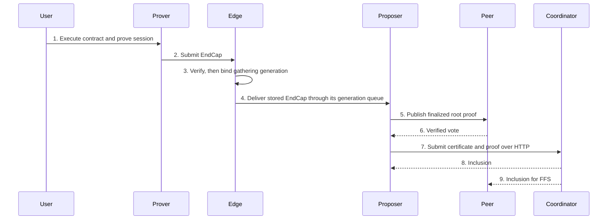

# Function-Circuit Fingerprint and EndCap Debugging Playbook

> Internal developer documentation — repository-only. Not part of the published mdBook (SUMMARY.md).

> Updated: 2026-09-07. Status: Review.

## Terminology

| Term | Meaning |
|---|---|
| EndCap | Final proof of a User Proving Session. |
| UPS | User Proving Session. |
| UCON | User contract tree. |
| GUTA | Global User Tree Aggregator. |
| P2P | Peer-to-peer transport between Realm validators and edges. |
| FFS | Fast-forward synchronization by a non-proposer after Coordinator inclusion. |
| VT | Plonky2 virtual target index in a constructed circuit. |
| SDK | Software development kit. |
| JSON | JavaScript Object Notation. |
| L1 / L2 | Layer 1 / Layer 2. |

## Overview

Use this playbook to distinguish seven failure layers on the real faucet-claim and EndCap path: first-use contract roots, function fingerprints, EndCap verifier metadata, missing checkpoint metadata, finalizer root-job admission, checkpoint-vintage proof composition, and gathering-generation delivery. A correction at one layer does not prove the remaining layers work. Apply the trigger matrix in [Circuit and Verifier Operations](circuit-and-verifier-operations.md#3-trigger-matrices) before regenerating anything.

## Background

Contract function fingerprints are registered chain state; EndCap verifier metadata is compiled verifier input; checkpoint proofs and gathering generations are runtime state. Mixing these ownership boundaries produces superficially similar proof or inclusion failures. The diagnostic examples and timings below were recorded during the 2026-09-06 pure-node, two-Realm investigation. They are historical observations, not a claim that this documentation change exercised the running devnet.

## Table of Contents

- [1. Execution Flow](#1-execution-flow)
- [2. Seven Failure Layers](#2-seven-failure-layers)
- [3. Regeneration Procedures](#3-regeneration-procedures)
- [4. Triage Order](#4-triage-order)
- [5. Recorded Timings](#5-recorded-timings)
- [6. Security Considerations](#6-security-considerations)
- [Related Documents](#related-documents)

## 1. Execution Flow



```text
contract first-use root -> function whitelist -> EndCap verifier
  -> complete checkpoint metadata -> finalizer root-job verification
  -> exact-vintage identity proofs -> one storage/delivery generation
  -> proposal + votes + certificate -> Coordinator inclusion -> equal roots
```

The diagram shows runtime message order. The seven layers below group failure causes, not independent startup phases.

## 2. Seven Failure Layers

### 2.1 First-use contract: zero leaf versus empty-tree root

**Symptom:** `Partition containing VirtualTarget { index: N } was set twice with different values`, with one value zero and the other a cached empty-tree-root limb. The recorded example was `8603459983426387388 != 0`, associated with `CACHED_ZERO_HASHES[31]`; compare the complete hash and the contract's actual height before diagnosing it.

**Cause:** an uninitialized contract has a zero UCON leaf, but session call-start data supplies the default empty root for the contract's state-tree height (`client_prover/psy_core/psy_data/src/qstore/controllers/proving_session.rs:615-638`). Unconditionally equating these two representations rejects first use.

**Invariant:** if the UCON leaf is zero, connect the storage start root to the compile-time empty-tree root; otherwise connect it to the leaf. The UPS state-delta gadget uses this convention (`client_prover/psy_circuit/psy_network_circuit/src/ups/gadgets/ups_standard_cfc_state_delta.rs:194-231`).

```text
default_root = constant_hash(get_zero_hash(contract_state_tree_height))
is_first = is_zero_hash(contract_leaf)
connect_hashes_switch(is_first, storage_start_root, default_root, contract_leaf)
```

| Constraint site | Current source |
|---|---|
| Function-circuit contract start root | `client_prover/psy_circuit/psy_dpn_circuit/src/vm/compile.rs:60-83` |
| UPS current-contract slot reader | `client_prover/psy_circuit/psy_ups_circuit/src/signature/state_reader.rs:98-125` |
| UPS external-contract slot reader | `client_prover/psy_circuit/psy_ups_circuit/src/signature/state_reader.rs:224-256` |
| UPS other-user contract slot reader | `client_prover/psy_circuit/psy_ups_circuit/src/signature/state_reader.rs:366-421` |

For an authorized code investigation, map the reported target index to the actual construction's `connect_hashes` and `connect` calls. The former `vt626_index_map` print-only diagnostic was removed in `348ff052`; it is not a runnable current test. Target indices are construction-specific, not protocol constants. The `ucon_leaf_prove_tests` in the function-circuit crate cover uninitialized proving, unchanged initialized behavior, and a negative control. The recorded verification command was `cargo test --release -p psy_dpn_circuit`.

### 2.2 Function whitelist fingerprint mismatch

**Symptom:** two nonzero limbs conflict during UPS contract-function proving. The recorded example was VT626 with `7671487131530644792 != 4162245137908165195`.

**Cause:** function-tree leaves include `c.get_fingerprint()`, interleaved with method/input-output combination leaves (`client_prover/psy_prover/src/session/session.rs:173-190`). The contract function tree is registered chain state, anchored by `PsyContractLeaf.function_tree_root` and identified by `CONTRACT_FUNCTION_TREE_ID = 4`. Genesis embeds the fingerprints generated from the circuit constraints in effect at compilation. The inclusion gadget connects that registered fingerprint to the attested fingerprint (`client_prover/psy_circuit/psy_network_circuit/src/ups/gadgets/ups_cfc_verify_inclusion.rs:87`).

A `DapenContractFunctionCircuit` constraint change, including the first-use correction, changes the affected function fingerprints. Runtime reconstruction cannot use those new fingerprints against old registered bytecode. This binding is intentional: only registered circuits execute. Follow section 3.2 rather than editing whitelist leaves manually.

In the historical target map, VT626 was the function-tree leaf and VT297–300 were the attested fingerprint. Reconstruct the map for the current circuit before using those numbers.

### 2.3 EndCap verifier artifact mismatch

**Symptom:** proposer-side EndCap verification rejects with `Condition failed: vanishing_polys_zeta[i] == z_h_zeta * reduce_with_powers(...)`. This is a proof-verification failure, not a proposer-schedule rejection.

**Cause:** changed UPS/function-circuit constraints produced a new EndCap circuit while the proposer retained the old `END_CAP_ALT_VERIFIER_DATA_SERIALIZED`. The shared verifier JSON and localhost fingerprint must come from one successful real metadata invocation, then the two caches must be regenerated together. Follow section 3.1.

An EndCap-only change does not independently authorize Genesis, token privacy fingerprint, or every Bridge cohort regeneration. Evaluate the separate matrix rows; a function-circuit change can additionally trigger section 3.2.

### 2.4 Checkpoint metadata circular wait

**Symptom:** repeated `Checkpoint leaf not found for id N` while the processor waits for a Finalize reply.

**Cause:** publishing a gathering checkpoint before its full metadata exists lets the serial processor wait on a gatherer that needs metadata the same processor has not yet persisted. The fix in `0b7c23c0` persists the canonical range, including empty checkpoints, before advancing state. `sync_with_coordinator` calls `persist_checkpoint_metadata_range` before publishing the synchronized base (`psy_node_common/src/realm/processor/db/sync.rs:80-84,315-362`). `set_new_unique_ids` owns generation publication (`psy_node_common/src/realm/processor/db/commit.rs:52-117`). `finalizer_identity` reads the checkpoint leaf and authenticated roots (`psy_node_common/src/realm/processor/gatherers/realm_end_cap_gatherer.rs:466-490`).

Debug persistence ordering and metadata completeness before attributing this error to ordinary Realm lag. Do not restore the redundant header-only startup fetch.

### 2.5 Peer rejects the finalizer root job

**Symptom:** no peer votes and a fatal `wait_votes` timeout despite proposal publication.

**Cause:** mandatory finalization makes `RealmFinalizeGUTA` (circuit 63) the proposal root. The previous inference whitelist accepted only the 13 ordinary GUTA types. `infer_root_job_type` now accepts the finalizer through its registered runtime verifier and preserves fail-closed rejection (`psy_cli/psy_node_cli/src/node/realm_p2p.rs:673-712`). This correction was delivered in `f3e0ee3c`.

The investigation recorded a received peer vote, formed certificate, and matching proposer/non-proposer FFS end roots at checkpoint 431. That historical observation does not substitute for acceptance on a new artifact cohort.

### 2.6 Finalizer proofs use inconsistent checkpoint vintages

**Symptom:** startup rejects finalizer user proofs even though the authenticated leaf value matches; the reconstructed proof root differs from the canonical checkpoint root.

**Cause:** sparse global-user-tree nodes can retain older upper-tree versions after metadata catch-up or other-Realm advancement. A maximum-at-or-before query is not an exact checkpoint top proof. The fix in `aaed92d6` composes the local Realm subtree with the stored authenticated top spine at the exact checkpoint. `f401cbab` extends exact-vintage handling to Realm edge roots/proofs, rewards-top lookups, and metadata completeness.

`finalizer_user_tree_proofs` reads the exact top proof, checks the Realm index and user membership, bounds the local subtree at the Coordinator/Realm boundary, requires local root equal to the top value, validates sibling counts, and verifies the composed proof (`psy_node_common/src/realm/processor/gatherers/realm_end_cap_gatherer.rs:536-567`). Missing or stale top metadata fails closed. Realm edge root reads use checkpoint metadata rather than a sparse global-tree maximum (`psy_node_common/src/realm/edge/handler.rs:1328-1345`).

Rewards rows are keyed by pending identifiers; resolve checkpoint-to-pending mapping before selecting the exact rewards top. Do not treat checkpoint numbers and pending identifiers as interchangeable namespaces. Retained Finalize commands also have a total-retention deadline; expiry drops the reply sender instead of waiting indefinitely. These recovery rules do not permit omitting mandatory finalization.

### 2.7 EndCap storage and delivery use different generations

**Symptom:** an accepted EndCap never reaches planning: its queue item is acknowledged, but the planner cannot find its contract updates.

**Cause:** the edge previously captured generation G before asynchronous verification, stored payload under G, then delivered on a refreshed G+1 process subject. `e45de68b` makes the post-verification `(unique_pending_id, proc_checkpoint_id)` pair the single owner for storage and delivery (`psy_node_common/src/realm/edge/handler.rs:68-95,917-925,1067-1084`). The temporary payload-source-generation workaround was reverted in `cf9c3e37`; do not reintroduce a second generation selector.

```text
1. Verify the EndCap proof and retain the verified proof bytes.
2. Read one current pending/process generation pair.
3. Construct the job identifier from that pair.
4. Use that pair for proof storage, contract updates, slot updates, and idempotency checks.
5. Require the pair to remain unchanged before publication.
6. Create the consumer and publish on that same process-generation subject.
7. Require the pair to remain unchanged after publication.
8. Return success only when all steps succeeded; otherwise return an explicit error.
```

`with_end_cap_gathering_generation<Read, ReadFuture, Submit, SubmitFuture>(read_generation, submit) -> anyhow::Result<()>` reads the pair, awaits submission, and calls `ensure_end_cap_generation_unchanged` afterward. The pre-publication check lives inside submission. Consumer-creation and publish failures propagate. An observed rotation returns `delivery is not confirmed`, not silent success. Fault-injected regression cases cover rotation after verification, rotation during delivery, failed submission, and half-pair refresh (`psy_node_common/src/realm/edge/handler.rs:1600-1695`).

## 3. Regeneration Procedures

These are reference procedures, not permission to stop the running stack, commit, publish, or regenerate unrelated artifacts. Obtain operation-specific authorization and use [Devnet Lifecycle](devnet_lifecycle.md).

### 3.1 EndCap metadata and cache promotion

1. Run the real localhost metadata command:

   ```bash
   PSY_CONFIG_PATH=<repo-root>/psy-genesis/config.json PSY_NETWORK=localhost \
     cargo run --release -p psy_user_cli --no-default-features -- \
     get-user-end-cap-common-data
   ```

2. Require all four output records from that invocation. Compare network magic numerically with `psy-genesis/config.json:3-10`; stop on mismatch.
3. Copy `alt_verify_data` verbatim to `psy_plonky2_circuits/src/circuit_library/end_cap_verifier_data.rs:27` and the printed four fingerprint limbs, in order, to `psy_core/src/network_config/local_devnet.rs:17`. The verifier JSON is shared across network selectors; localhost evidence does not validate non-local operation.
4. Run the exact cache-only command twice:

   ```bash
   RUST_MIN_STACK=134217728 cargo run --release -p psy_plonky2_circuits \
     --example config_gen_v2 --no-default-features \
     --features std,serialize_rkyv,serialize_speedy,serialize_postcard
   ```

5. Require both generated cache files to report `up to date` on the second run. Never use `make config_gen_v2` or omit `--no-default-features`: default `gnark-wrap` enters Groth16 setup.
6. Rebuild the affected release binaries. When deploying incompatible circuit artifacts to local devnet, use the authorized paired purge/restart procedure, not a keep-data contract swap. Re-register users, exercise faucet claim, resubmit a real EndCap, and require the full forwarding/vote/certificate/inclusion/FFS chain and equal roots.

### 3.2 Function-circuit regeneration chain

1. Freeze the intended node source revision and apply the release applicability gate. The historical local compiler experiment used local path dependencies; release consumers must use the exact authorized node revision under `AGENTS.md`, not an undocumented pin override.
2. Update the compiler's node dependencies consistently and let Cargo regenerate its lockfile. Build/check the compiler under the authorized delivery procedure.
3. Run `make gen-deploy-json` in `<workspace>/psy-compiler`. This writes the compressed `psy-genesis/genesis_contracts.json`, token artifacts, contract interfaces, and provenance stamp; it does **not** write the node's root `genesis.json` (`<workspace>/psy-compiler/Makefile:208-255`).
4. Because the contract artifact changed, run `make generate-genesis-data` in `psy-node` to regenerate root `genesis.json`. Rebuild the SDK compiler artifacts when their own input changed and verify both compiler provenance stamps.
5. Use an authorized full purge/restart to install the new chain cohort. Core launcher startup injects the ordered public validators before processors start (`dev/locSetupV4.ts:4048-4056`); require the intended nonempty validator list. Do not hand-edit Genesis fingerprints.
6. Re-register users, claim faucet funds, transfer, and complete the real EndCap acceptance procedure. Do not add Cargo `[patch]` or `[replace]` overrides for pinned node revisions.

## 4. Triage Order

1. A set-twice witness error: compare complete hash values with the cached zero-hash table, then identify the exact connected targets. A zero limb alone is not proof of layer 2.1.
2. Function-tree versus attested fingerprint conflict: inspect layer 2.2 and compiler/Genesis provenance.
3. `vanishing_polys` verification error: inspect layer 2.3 and promoted EndCap metadata.
4. Repeated missing checkpoint leaf: inspect layer 2.4 and persistence-before-publication ordering.
5. Zero peer votes: inspect layer 2.5 and registered root-job verification.
6. Finalizer proof root mismatch after catch-up/restart: inspect layer 2.6 and exact checkpoint top composition.
7. Accepted EndCap absent from planning: inspect layer 2.7; compare pending/process identifiers across payload writes and queue delivery.
8. For every circuit change, apply the independent trigger matrices before selecting generators. Do not infer that fixing one layer authorizes all artifact changes.

## 5. Recorded Timings

Historical measurements: 16-core Ryzen 9950X, pure-node two-Realm stack, 2026-09-06. These are diagnostic context, not readiness deadlines.

| Operation | Recorded duration or observation |
|---|---|
| Prove-proxy warm-up before port 9999 listens | About 5–10 minutes; UPS manager, function registration, and roughly 8,000 BatchDeployContracts rows competed with processor prebuilds. Faucet port 9998 followed. The investigation used roughly 15 minutes without port 9999 as a log-inspection threshold. |
| Full node release build | About 4–4.5 minutes; one measured run took 4m23s. |
| Compiler local-path release build | About 2m16s for the first full compile after switching pins. |
| Compiler contract generation plus root Genesis generation | Minutes; the resulting root `genesis.json` was about 782 MB. The compiler target and root generator are distinct commands. |
| One cache-only generation | About 1.5 minutes; the stability procedure requires two runs. |
| Empty Coordinator checkpoint cadence | About 5–8 seconds; hundreds of checkpoints accumulated within minutes. |
| Validator injection | Core startup rewrites the list; a freshly generated root has no launcher-injected validators until this phase. Process-only controlled resume replays commands rather than rerunning setup. |

## 6. Security Considerations

Never weaken fingerprint inclusion, verifier equality, checkpoint-vintage checks, mandatory finalization, or generation checks to make a transaction succeed. Preserve each complete artifact rollback unit. `private_keys.json`, validator signing keys, and faucet credentials are secrets; do not publish them. A documentation edit authorizes no stack lifecycle change, artifact publication, or source push.

## Related Documents

- [Circuit and Verifier Operations](circuit-and-verifier-operations.md)
- [Devnet Lifecycle](devnet_lifecycle.md)
- [Devnet Launcher Reference](devnet-launcher-reference.md)
- [Genesis Generation](genesis-generation.md)
- [Realm P2P Validators](realm-p2p-validators.md)
- [Token Privacy Circuit Fingerprints](token-privacy-circuit-fingerprints.md)
