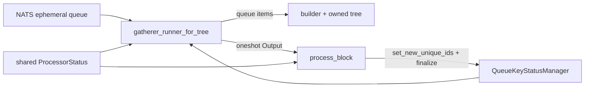

# Gatherers

> Internal developer documentation — repository-only. Not part of the published mdBook (SUMMARY.md).

> Updated: 2026-09-07. Status: Review.

## Terminology

| Term | Meaning |
|---|---|
| Gatherer | Background task that consumes one NATS ephemeral queue, feeds a planner, and returns a finalized snapshot for `process_block`. |
| Planner | Builds the proving-job tree and witness records for one gatherer cycle. |
| EndCap | Final proof of a user proving session. |
| FFS | Fast-forward synchronization payload of Merkle-node updates. |
| Unique pending id | Epoch that isolates one gathering / processing / committed batch. |
| N / N+1 seam | Official block N belongs to the processor; the gatherer may already be collecting EndCaps for N+1. |

## Overview

Gatherers are the only live mutators of the in-memory trees they own. The processor rotates unique ids, triggers finalize, publishes the returned jobs, and commits the snapshot. It does not mutate those trees during prove.

This is a formal English rewrite of the gatherer deep dive in the external memory tree, checked against the current sources listed in [File index](#file-index). Known-stale claims from that draft (silent `needs_revert` no-op, coordinator recovery stub) are not repeated here.

## Background

Five gatherer roles exist. **Four** run on the coordinator (register user, deploy contract, **update contract**, GUTA); one EndCap gatherer runs on each realm. All share `EphemeralQueueGathererWithTree` (`psy_node_common/src/queue/gatherer.rs`) and the same `ProcessorStatus` as their processor.

## Table of Contents

- [1. Types](#1-types)
- [2. Lifecycle](#2-lifecycle)
- [3. Realm EndCap gatherer](#3-realm-endcap-gatherer)
- [4. Coordinator gatherers](#4-coordinator-gatherers)
- [5. Unique-id rotation](#5-unique-id-rotation)
- [6. Planner pairing](#6-planner-pairing)
- [7. Security Considerations](#7-security-considerations)
- [Related Documents](#related-documents)
- [File index](#file-index)

## 1. Types

| Gatherer | Role | Queue | Planner | Location |
|---|---|---|---|---|
| RegisterUserGatherer | Coordinator | register-user | inline | `coordinator/processor/gatherers/register_user_gatherer.rs` |
| DeployContractGatherer | Coordinator | deploy-contract | inline | `coordinator/processor/gatherers/deploy_contract_gatherer.rs` |
| CoordinatorGUTAUpdateGatherer | Coordinator | realm GUTA update | `CoordinatorGUTAPlanner` | `coordinator/processor/gatherers/coordinator_guta_update_gatherer.rs` |
| RealmGUTAEndCapGatherer | Realm | user EndCap | `RealmGUTAPlanner` | `realm/processor/gatherers/realm_end_cap_gatherer.rs` |

```text
process_block
  └── get_results_from_gatherers
        ├── set_new_unique_ids
        └── finalize_gathering_and_update_queue_key  (per gatherer)
              ├── drain queue
              ├── planner / inline tree update
              ├── backup append
              └── return Output { db_output, job_ids }
```

## 2. Lifecycle

Every gatherer follows the same cycle.

**Create.** `create_new_with_tree` reads shared status, opens a backup file for the current `unique_pending_id`, writes magic and a header, and constructs the planner on the current checkpoint root.

**Consume.** `finalize_gathering_and_update_queue_key` (`queue/gatherer.rs:130`, `:249`) rotates the queue key to the new gathering id and triggers the runner. The runner drains the ephemeral queue into `process_queue_item`, which updates the owned tree and appends the item to the backup.

**Finalize.** After the drain, the gatherer asks the planner for jobs, writes the backup footer, and returns FFS node updates plus the job tree.

On a tree-gatherer failure, the runner replies to the active command when present and returns the original error. Realm and Coordinator supervisors observe inner task errors, mark recovery required, then cancel and join their remaining tasks. No failed gatherer stays alive to drain commands.



## 3. Realm EndCap gatherer

Input is `PsyRealmUserUpdateQueueItem`: job id, expected checkpoint, old/new user-leaf hashes, new leaf, GUTA stats, and events. The edge has already validated contract-state updates and produced QBlob node batches (`realm/edge/utils/end_cap.rs`).

`RealmGUTAPlanner::add_end_cap_job` records user-contract and contract-state deltas, pairs EndCaps into two-EndCap or single-EndCap jobs, and stores witnesses. An odd EndCap becomes `end_cap_straggler` and is promoted on finalize. An EndCap whose `last_checkpoint_id` is still in the future is deferred in `future_pending_end_cap_jobs`.

### 3.1 N / N+1 finalize seam

Official block N is the processor's job. The gatherer may already hold EndCaps whose cycle start is the live end root of N (the start of N+1). Finalize must not treat an unauthenticated cycle as official identity for N.

Current contract (`realm_end_cap_gatherer.rs`):

1. If the shared gathering start does not match the cycle start, finalize fails closed without consuming the cycle.
2. Validator and checkpoint proofs use the planner's fixed checkpoint rather than the advancing Coordinator head.
3. If that checkpoint no longer authenticates the cycle start, finalize reverts the journal and returns an empty batch; accepted EndCaps from that generation are discarded by design.
4. A successful finalize commits the tree and publishes the committed root so the next gathering generation can start while the processor proves and submits the completed generation.

FastForward remains the follower path for applying an included proposal; it is separate from generation discard.

The tree runner does not retain raw cycle items for replay. FastForward applies the included updates before constructing a replacement builder; speculative inputs are not replayed. Items fetched from the retired queue after finalize are discarded with a warning. Future-checkpoint EndCaps remain owned by `future_pending_end_cap_jobs`; the lossy raw-input policy does not authorize dropping confirmed FFS.

## 4. Coordinator gatherers

**Register user.** Deserialize 64 bytes (fingerprint + param), set the next leaf in `user_registration_tree`, append FFS public-key bytes, increment `next_user_id`.

**Deploy contract.** Build the function tree from the whitelist, set the next `global_contract_tree` leaf, append leaf / function / code-definition bytes, increment `next_contract_id`.

**Update contract.** Apply layout-aware contract updates into `global_contract_tree` (see `update_contract_gatherer.rs`); finalize emits update ST jobs that Part-1 chains after deploy.

**GUTA update.** Deserialize `GlobalUserTreeAggregatorHeaderWithTagValueAndJobID`, feed `CoordinatorGUTAPlanner`, update the global user tree at the realm position, and store the incoming tag-tree value in temp DB. Finalize emits FFS user-tree nodes, reward-tree node keys, and the multi-level GUTA job tree.

Coordinator trees are owned by these **four** gatherers after startup hydrates them from durable storage. The processor reads finalized snapshots only.

## 5. Unique-id rotation

`set_new_unique_ids` runs once per block **before** finalize (coordinator `coordinator/processor/db.rs:780`; realm `realm/processor/db/commit.rs:52`).

```text
Before:  processing = P, gathering = G
After:   processing = G, gathering = fresh
```

Finalize consumes one gathering generation. The final post-finalize drain acknowledges and discards any fetched tail items; they are not replayed into the next builder. The runner does not guarantee recovery of later publications to the retired queue key.

```text
GATHERING --> PROCESSING --> COMMITTED --> next GATHERING
```

Realm extra fields: `gathering_realm_start_root` (checkpoint-authenticated), `processing_realm_end_root` (set only when jobs will commit), `should_revert_processing_changes`.

## 6. Planner pairing

| Planner | Structure | Leaf circuit | Inner circuit |
|---|---|---|---|
| `RealmGUTAPlanner` | Fixed-level arrays plus EndCap / job stragglers | 7 / 11 EndCap | 8 / 13 / 57 and checkpoint-upgrade twins; root 63 |
| `CoordinatorGUTAPlanner` | MMR-style `waiting_nodes` with right-fold finalize | incoming realm GUTA | lift (mode 3) then binary fold |

Realm two-EndCap jobs are mode 1 (`realm_guta_planner.rs:590`). The finalizer job is mode 0 with the root GUTA as its only dependency (`realm_guta_planner.rs:1028-1038`). Coordinator wrap-one-child jobs are mode 3 (`coordinator_guta_planner.rs:475-484`). Reward-node keys are assigned from the offsets in [Reward Tree Circuit Layouts](reward-tree-circuits.md#5-global-reward-tree-offsets).

## 7. Security Considerations

Edge EndCap admission checks Merkle-root chaining, not the ZK proof. Proof verification happens when workers prove GUTA jobs. Official finalize identity is fail-closed on snapshot-start mismatch; do not restore a rewrite of `gathering_realm_start_root` to the live end before Coordinator inclusion.

A parked processor (`ProcessorState::Error`) stops every bound gatherer. That is intentional: the gatherer must not keep mutating a tree whose processor will not commit.

## Related Documents

- [Processors](processors.md) — who triggers finalize, publishes jobs, and commits.
- [Reward Tree Circuit Layouts](reward-tree-circuits.md) — modes the planners write.
- [RealmFinalizeGUTA BLS Authentication](realm-finalize-bls-auth.md) — official identity after gatherer finalize.
- [Realm P2P Validators](realm-p2p-validators.md) — who is scheduled to finalize.

## File index

| Component | Path |
|---|---|
| Generic gatherer | `psy_node_common/src/queue/gatherer.rs` |
| Realm EndCap gatherer | `psy_node_common/src/realm/processor/gatherers/realm_end_cap_gatherer.rs` |
| Register user | `psy_node_common/src/coordinator/processor/gatherers/register_user_gatherer.rs` |
| Deploy contract | `psy_node_common/src/coordinator/processor/gatherers/deploy_contract_gatherer.rs` |
| Coordinator GUTA | `psy_node_common/src/coordinator/processor/gatherers/coordinator_guta_update_gatherer.rs` |
| Realm planner | `psy_node_common/src/guta_planner/realm_guta_planner.rs` |
| Coordinator planner | `psy_node_common/src/guta_planner/coordinator_guta_planner.rs` |
| EndCap edge validation | `psy_node_common/src/realm/edge/utils/end_cap.rs` |
