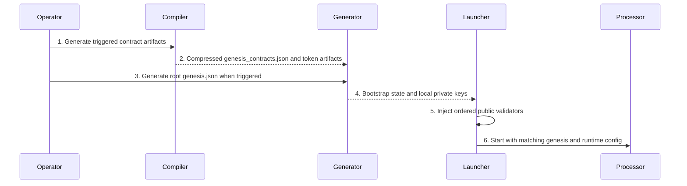

# Genesis Generation

> Internal developer documentation — repository-only. Not part of the published mdBook (SUMMARY.md).

> Updated: 2026-09-20. Status: Review.

## Overview

"Genesis" names three distinct generated artifacts. They have different producers, different triggers, and different consumers; never substitute one procedure for another. The trigger rules live in `AGENTS.md` (`Genesis Regeneration Boundary`) and [circuit-and-verifier-operations.md](circuit-and-verifier-operations.md) §6.1. This page is the operational how-to; those sections own when generation is authorized.

| Artifact | Producer | Consumer |
|---|---|---|
| Root `genesis.json` (network bootstrap state) | `make generate-genesis-data` in `psy-node` | Coordinator/Realm processors via `--genesis-data-path` |
| `psy-genesis/` contract artifacts (`genesis_contracts.json`, `genesis_abi/`, token artifacts) | `make gen-deploy-json` in `<workspace>/psy-compiler` | Node builds, SDK, services, contracts, DApp gitlinks |
| `validators` list inside root `genesis.json` | Devnet launcher P2P injection | Coordinator/Realm P2P validator registry |

## Background

The compiler produces contract definitions, while the node generator embeds those definitions into a network bootstrap snapshot. The launcher then adds public validator membership. `psy-genesis/config.json` is a separate network configuration input; `make gen-deploy-json` does not generate it (`<workspace>/psy-compiler/Makefile:208-255`). Keep these ownership boundaries explicit when debugging stale artifacts.



```text
compiler contract artifacts -> node bootstrap snapshot -> launcher validator injection -> processors
network config -------------> build-time constants and runtime membership validation
```

## Table of Contents

- [1. Root `genesis.json`](#1-root-genesisjson)
  - [1.1 Trigger](#11-trigger)
  - [1.2 Command](#12-command)
  - [1.2.1 Bridge-relayer keystore](#121-bridge-relayer-keystore)
  - [1.3 Outputs](#13-outputs)
  - [1.4 Verification](#14-verification)
- [2. `psy-genesis/` Repository Artifacts](#2-psy-genesis-repository-artifacts)
- [3. P2P Validator Injection into `genesis.json`](#3-p2p-validator-injection-into-genesisjson)
- [4. Excluded Generation Tasks](#4-excluded-generation-tasks)
- [5. Failure Handling](#5-failure-handling)

## 1. Root `genesis.json`

### 1.1 Trigger

Run generation only when at least one of these changed ([circuit-and-verifier-operations.md](circuit-and-verifier-operations.md) §6.1):

1. `psy-genesis/genesis_contracts.json` content;
2. a Genesis construction input or default in `psy_cli/psy_dev_cli/src/subcommand/generate_genesis.rs`;
3. the serialized `genesis.json` format or serializer;
4. an intentionally adopted `psy-genesis` gitlink whose changed content affects Genesis construction.

EndCap metadata, GUTA, cache, verifier JSON, fingerprint, and ordinary witness changes do not trigger it.

### 1.2 Command

```bash
cd <repo-root>
make generate-genesis-data
```

The target runs `./target/release/psy_dev_cli generate-genesis-data` (`Makefile:113-114`). Equivalent:

```bash
./target/release/psy_dev_cli generate-genesis-data
```

Registration 2 (`user_id` `524288`) is the bridge relayer. Derive that ZK public key from an encrypted UTC JSON keystore before generation; the relayer later decrypts the same file. See [§1.2.1](#121-bridge-relayer-keystore).

### 1.2.1 Bridge-relayer keystore

The generator (`psy_cli/psy_dev_cli/src/subcommand/generate_genesis.rs`) decrypts a 32-byte secret and treats it as the Poseidon private key for registration 2 (`Hash256` → `QHashOut`). There is no separate ZK keystore format.

Create the file with `cast`, then pass the path and password into Make. GNU Make forwards both a prefixed environment variable and a command-line Make variable into the CLI process.

```bash
export WALLET_PASSWORD='<password>'
mkdir -p "$HOME/.psy/keystore"

# Random key (new identity; L1 Anvil #0 will not match this secret).
# `cast wallet new` takes an existing directory, then an account filename:
cast wallet new "$HOME/.psy/keystore" bridge-relayer --unsafe-password "$WALLET_PASSWORD"

# Or import a known 32-byte secret (local Anvil #0) into that directory:
# cast wallet import bridge-relayer \
#   --keystore-dir "$HOME/.psy/keystore" \
#   --private-key 0xac0974bec39a17e36ba4a6b4d238ff944bacb478cbed5efcae784d7bf4f2ff80 \
#   --unsafe-password "$WALLET_PASSWORD"

WALLET_PASSWORD="$WALLET_PASSWORD" \
  PSY_BRIDGE_RELAYER_KEYSTORE_PATH="$HOME/.psy/keystore/bridge-relayer" \
  make generate-genesis-data
```

Equivalent Make-variable form:

```bash
make generate-genesis-data \
  PSY_BRIDGE_RELAYER_KEYSTORE_PATH="$HOME/.psy/keystore/bridge-relayer" \
  WALLET_PASSWORD="$WALLET_PASSWORD"
```

Lookup order if several names are set (`resolve_set_keystore_path`):

1. `PSY_BRIDGE_RELAYER_KEYSTORE_PATH`
2. `BRIDGE_RELAYER_KEYSTORE_PATH`
3. `KEYSTORE_PATH`

A *set* path that does not exist fails closed. Empty values are ignored. If none of those names are set, a plaintext `PRIVATE_KEY` or `BRIDGE_RELAYER_L2_PRIVATE_KEY` is used; otherwise `~/.psy/keystore/bridge-relayer` if that file exists; otherwise registration 2 falls back to `deterministic_private_key(2)`. That last fallback is how a later relayer keystore becomes `not_registered`: locSetup will still write `[relayer_wallet] keystore_path` to the UTC JSON, but genesis baked a different Poseidon key.

Decrypt uses `WALLET_PASSWORD`. The launcher keeps the relayer on that encrypted file (`[relayer_wallet] keystore_path`); it does not write a plaintext `private_key` into `daemon.toml`. `[finalize]` / `[[chains]]` may reuse the same file for L1 secp. Do not regenerate genesis on a live chain to rotate this key.

### 1.3 Outputs

| Output | Handling |
|---|---|
| Root `genesis.json` | Network bootstrap state containing contract registrations, worker whitelist, validator list, and checkpoint stats. |
| Root `private_keys.json` | Generated private keys. **Secret.** Never package, upload, commit, paste, or publish it ([circuit-and-verifier-operations.md](circuit-and-verifier-operations.md) §13 and Security Considerations). |
| `psy-dapp/apps/bridge/src/config/faucetOperators.json` | Faucet operator config (`psy_cli/psy_dev_cli/src/subcommand/generate_genesis.rs`). Skip with `--skip-faucet-operators`. |

### 1.4 Verification

1. The CLI exits 0; the three output files exist and are nonempty.
2. `genesis.json` is valid JSON and its `validators` list matches the intended set (see §3).
3. Node startup accepts it via `--genesis-data-path`.

## 2. `psy-genesis/` Repository Artifacts

`psy-genesis/genesis_contracts.json`, `genesis_abi/`, and the token artifacts are generated from a clean `psy-compiler` HEAD, not edited by hand:

```bash
cd <workspace>/psy-compiler
make gen-deploy-json
```

Preconditions and the full DAG position are in `AGENTS.md` (`Ordered Release State Machine` §3): the compiler tree must be clean and exactly at the pinned `R_compiler`; the target defaults `PSY_GENESIS` to `../psy-node/psy-genesis`, writes its `genesis_contracts.json`, refreshes its `genesis_abi/`, writes the compiler provenance stamp, and copies `token.json` and `token.update.json` there (not into `psy-node/client_prover/token.json`).

If `genesis_contracts.json` content changed, the node-side root `genesis.json` (§1) is affected through `genesis_contracts.json` as a construction input — regenerate it and check the `TOKEN_CONTRACT_STATE_TREE_HEIGHT` consequence per [token-privacy-circuit-fingerprints.md](token-privacy-circuit-fingerprints.md).

## 3. P2P Validator Injection into `genesis.json`
Devnet core startup rewrites the `validators` list of the file passed as `--genesis-data-path` from the selected public-only runtime network config. Each Realm's ordered validator array is flattened into Genesis with `realm_id`, `validator_user_id`, `node_id`, and `bls_public_key`; sub-id is derived later as the one-based array position. The launcher pins `PSY_NETWORK` to the same config key selected by the node (`localhost` for `local-devnet`) and exports the generated config as `PSY_CONFIG_PATH`.

Local-devnet genesis pre-places dedicated ZK accounts in dense registration order: validators at registrations `0`, `1`, `3`, `4` for realms `0..1` (Strategy5 GROUP=1), while registration `2` remains the bridge relayer with fixed Strategy5 `user_id` `524288`. Faucet sd-key operators occupy registrations `5..14`. The launcher binds each `(realm_id, sub_id)` to those reserved validator registrations and does not scan ordinary faucet or relayer users. Dense local-devnet genesis currently covers validator realms `0..1` only.

`locSetupV4.ts` writes `[relayer_wallet] keystore_path` (encrypted UTC JSON, `sign_type = "ZKSign"`) into generated `daemon.toml`. That path is the first set of `PSY_BRIDGE_RELAYER_KEYSTORE_PATH`, `BRIDGE_RELAYER_KEYSTORE_PATH`, or `KEYSTORE_PATH`, else `${HOME}/.psy/keystore/bridge-relayer`. The same file is reused by `[finalize]` / `[[chains]]` for L1 secp. `LOCAL_DEVNET_RELAYER_ZK_PRIVATE_KEY` only seeds an auto-generated keystore when the path is missing; it is not written as a plaintext `private_key`. Registration 2 matches this file only when [§1.2.1](#121-bridge-relayer-keystore) fed the same path into `make generate-genesis-data`.

The key generator writes P2P identity/BLS secrets and creates one distinct edge identity and public address for every requested edge index. Foreground public addresses use the requested host. Daemon startup writes a separate runtime config whose public addresses use Compose DNS service names; container listeners remain wildcard addresses. All of these addresses use the standard Realm P2P transport.

Genesis construction fails closed when a Realm exceeds the P2P validator cap (`MAX_VALIDATORS_PER_REALM = 64` in `psy_data/src/p2p/limits.rs`), a NodeId, BLS key, or validator user ID is duplicated, a public identity is invalid, or `validator_user_id` is outside the owning Realm's half-open user range. Processor startup also requires its local Ed25519 NodeId and BLS secret to match the configured public values exactly.

## 4. Excluded Generation Tasks

| Task | Owner |
|---|---|
| Regenerate `cached_circuit_library.rs` / `cached_common_data.rs` | [circuit-and-verifier-operations.md](circuit-and-verifier-operations.md) §5.1 |
| Regenerate EndCap verifier JSON | [circuit-and-verifier-operations.md](circuit-and-verifier-operations.md) §4 |
| Regenerate `local_circuits.json` | `make generate-local-circuits` (`Makefile:120-121`) |
| Regenerate token fingerprints in precompiles | [token-privacy-circuit-fingerprints.md](token-privacy-circuit-fingerprints.md) |
| Regenerate Groth16 keystores | `Makefile:133-137` |

## 5. Failure Handling

| Failure | Response |
|---|---|
| `make generate-genesis-data` fails | Do not ship the partial `genesis.json`; fix the generator input and rerun |
| Set `PSY_BRIDGE_RELAYER_KEYSTORE_PATH` / `BRIDGE_RELAYER_KEYSTORE_PATH` / `KEYSTORE_PATH` points at a missing file | Fail closed; do not fall through to `deterministic_private_key(2)`. Create the UTC JSON with `cast` first ([§1.2.1](#121-bridge-relayer-keystore)) |
| Relayer logs `not_registered` for user `524288` | Genesis registration 2 was not derived from the relayer's keystore. Recreate the keystore, regenerate genesis with that path, then start a new chain. Do not paste a plaintext `private_key` into `daemon.toml` on a live chain. |
| `validators` entries differ from the selected runtime membership | Core startup injects the selected ordered validators; component-only startup does not rewrite them. Diagnose configuration drift before the next authorized core startup. |
| Provenance mismatch in `psy-genesis` stamp | Rebuild from the committed clean compiler revision; never hand-edit provenance JSON |
| `private_keys.json` leaked | Treat as secret compromise; rotate and remove from every distribution channel |

## Security Considerations

Preserve matching source revisions, configuration, and generated artifact cohorts. Never publish root `private_keys.json` or validator/faucet secrets. Generation does not authorize deployment or publication. Treat fingerprint, provenance, and membership mismatches as failures rather than bypassing verification.

## Related Documents

- [Circuit and verifier operations](circuit-and-verifier-operations.md)
- [Devnet launcher reference](devnet-launcher-reference.md)
- [Devnet lifecycle](devnet_lifecycle.md)
- [Fn circuit fingerprint playbook](fn-circuit-fingerprint-playbook.md)
- [Realm p2p validators](realm-p2p-validators.md)
- [Token privacy circuit fingerprints](token-privacy-circuit-fingerprints.md)
