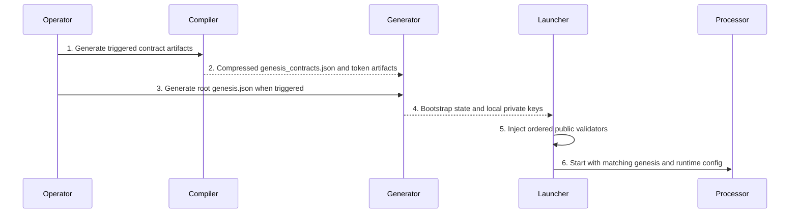

# Genesis Generation

> Internal developer documentation — repository-only. Not part of the published mdBook (SUMMARY.md).

> Updated: 2026-09-20. Status: Review.

## Overview

"Genesis" names three distinct generated artifacts. They have different producers, different triggers, and different consumers; never substitute one procedure for another. The trigger rules live in `AGENTS.md` (`Genesis Regeneration Boundary`) and [circuit-and-verifier-operations.md](circuit-and-verifier-operations.md) §6.1. This page is the operational how-to; those sections own when generation is authorized.

| Artifact | Producer | Consumer |
|---|---|---|
| Root `genesis.json` (network bootstrap state) | `make generate-genesis-data` in `psy-node` | Coordinator/Realm processors via `--genesis-data-path` |
| `psy-genesis/` contract artifacts (`genesis_contracts.json`, `genesis_abi/`, token artifacts) | `make gen-deploy-json` in `<workspace>/psy-compiler` | Node builds, SDK, services, contracts, DApp gitlinks |
| `validators` list inside root `genesis.json` | Devnet launcher P2P injection | Coordinator/Realm P2P validator registry |

## Background

The compiler produces contract definitions, while the node generator embeds those definitions into a network bootstrap snapshot. The launcher then adds public validator membership. `psy-genesis/config.json` is a separate network configuration input; `make gen-deploy-json` does not generate it (`<workspace>/psy-compiler/Makefile:208-255`). Keep these ownership boundaries explicit when debugging stale artifacts.


```mermaid
sequenceDiagram
    participant Operator
    participant Compiler
    participant Generator
    participant Launcher
    participant Processor
    Operator->>Compiler: 1. Generate triggered contract artifacts
    Compiler-->>Generator: 2. Compressed genesis_contracts.json and token artifacts
    Operator->>Generator: 3. Generate root genesis.json when triggered
    Generator-->>Launcher: 4. Bootstrap state and local private keys
    Launcher->>Launcher: 5. Inject ordered public validators
    Launcher->>Processor: 6. Start with matching genesis and runtime config
```

```text
compiler contract artifacts -> node bootstrap snapshot -> launcher validator injection -> processors
network config -------------> build-time constants and runtime membership validation
```

## Table of Contents

- [1. Root `genesis.json`](#1-root-genesisjson)
  - [1.1 Trigger](#11-trigger)
  - [1.2 Command](#12-command)
  - [1.2.1 Public bridge multisig account](#121-public-bridge-multisig-account)
  - [1.3 Outputs](#13-outputs)
  - [1.4 Verification](#14-verification)
- [2. `psy-genesis/` Repository Artifacts](#2-psy-genesis-repository-artifacts)
- [3. P2P Validator Injection into `genesis.json`](#3-p2p-validator-injection-into-genesisjson)
- [4. Excluded Generation Tasks](#4-excluded-generation-tasks)
- [5. Failure Handling](#5-failure-handling)

## 1. Root `genesis.json`

### 1.1 Trigger

Run generation only when at least one of these changed ([circuit-and-verifier-operations.md](circuit-and-verifier-operations.md) §6.1):

1. `psy-genesis/genesis_contracts.json` content;
2. a Genesis construction input or default in `psy_cli/psy_dev_cli/src/subcommand/generate_genesis.rs`;
3. the serialized `genesis.json` format or serializer;
4. an intentionally adopted `psy-genesis` gitlink whose changed content affects Genesis construction.

EndCap metadata, GUTA, cache, verifier JSON, fingerprint, and ordinary witness changes do not trigger it.

### 1.2 Command

When generation is authorized, supply both required public input files:

```bash
PSY_RELAYER_MULTISIG_ACCOUNT='<public-multisig-account-json>' \
PSY_MULTISIG_POLICY_ARTIFACT='<approved-policy-compiler-artifact-json>' \
make generate-genesis-data
```

The equivalent command from the repository root is:

```bash
./target/release/psy_dev_cli generate-genesis-data \
  --repo-root . \
  --relayer-multisig-account '<public-multisig-account-json>' \
  --multisig-policy-artifact '<approved-policy-compiler-artifact-json>'
```

Both flags are required and have no default. Relative input paths resolve against `--repo-root`. The Make target passes the public paths and strips secret-bearing legacy enrollment variables from the generator child environment; it does not change L1 custody in the parent process. The launcher requires these inputs only when it actually generates Genesis, not when reusing a verified existing snapshot. Sources: `Makefile:107-112`; `dev/locSetupV4.ts:2745-2797`; `psy_cli/psy_dev_cli/src/subcommand/generate_genesis.rs:78-84,200-204`.

### 1.2.1 Public bridge multisig account

Registration 2 (`user_id` 524288) is a public-only two-of-three multisig account. The input is a JSON object containing exactly `contract_id` and `initial_policy`; unknown or duplicate fields are rejected. `contract_id` must be 6. `initial_policy` contains exactly `version: 1`, `threshold: 2`, `member_count: 3`, and `member_hashes`, an array of eight strings using the existing `QHashOut` JSON encoding. The first three commitments must be nonzero and strictly increasing by canonical four-limb order; the remaining five must be zero padding. Supply commitments for the approved external signers, not addresses or private keys. Source: `psy_cli/psy_dev_cli/src/subcommand/generate_genesis.rs:171-197`; `client_prover/psy_vm/src/ups/multisig.rs:20-85`.

The separate compiler artifact contains the approved policy contract's current ABI 2.0.0 and exactly `get_policy` and `set_policy` circuit definitions, with declared state-tree height 4. The generator checks method identifiers, input/output counts, mutability, and the visible `header`/three-`members` ABI offsets, then derives the complete deployment and requires equality with Genesis contract 6. This uses the existing ABI, not a new canonical layout root or nested Genesis metadata schema. The required supplied artifact is not compiled or regenerated by these commands. Source: `psy_cli/psy_dev_cli/src/subcommand/generate_genesis.rs:232-287`.

The generator derives the account identity from the actual `MultisigSignatureCircuit` fingerprint and the initial public policy. It initializes contract 6 with header `[1, 2, 3, 0]` in slot 0 and the three member commitments in slots 1 through 3. Contract 0 slot 0 holds the configured nonzero canonical initial fee balance. The user nonce is zero, but the policy is already initialized: the first signed session uses the current initial policy, not pristine-account bootstrap. No relayer master secret is generated, decrypted, or exported. Source: `psy_cli/psy_dev_cli/src/subcommand/generate_genesis.rs:207-229,355-378`.

L1 transaction keystores and passwords remain separate operator custody inputs; they do not select this L2 identity. Do not regenerate an existing chain to rotate members. Use a current-quorum-authorized policy replacement instead. Current quality assurance (QA) for public Genesis construction, initialized-state proofs, and startup is pending; the input contract does not establish that generated artifacts are ready for use.

### 1.3 Outputs

| Output | Handling |
|---|---|
| Root `genesis.json` | Network bootstrap state containing contract registrations, worker whitelist, validator list, and checkpoint stats. |
| Root `private_keys.json` | Dense registration-indexed array: entry 2 is JSON `null`; other validator/faucet entries retain their existing keys and positions. The file remains **secret**. Never package, upload, commit, paste, or publish it ([circuit-and-verifier-operations.md](circuit-and-verifier-operations.md) §13 and Security Considerations). |
| `psy-dapp/apps/bridge/src/config/faucetOperators.json` | Faucet operator config (`psy_cli/psy_dev_cli/src/subcommand/generate_genesis.rs`). Skip with `--skip-faucet-operators`. |

### 1.4 Verification

The following are required QA outcomes, not recorded passes for the current cutover. Generation and runtime execution remain subject to the pipeline gates.

1. The CLI exits 0; the three output files exist and are nonempty.
2. `genesis.json` is valid JSON and its `validators` list matches the intended set (see §3).
3. Node startup accepts it via `--genesis-data-path`.

## 2. `psy-genesis/` Repository Artifacts

`psy-genesis/genesis_contracts.json`, `genesis_abi/`, and the token artifacts are generated from a clean `psy-compiler` HEAD, not edited by hand:

```bash
cd <workspace>/psy-compiler
make gen-deploy-json
```

Preconditions and the full DAG position are in `AGENTS.md` (`Ordered Release State Machine` §3): the compiler tree must be clean and exactly at the pinned `R_compiler`; the target defaults `PSY_GENESIS` to `../psy-node/psy-genesis`, writes its `genesis_contracts.json`, refreshes its `genesis_abi/`, writes the compiler provenance stamp, and copies `token.json` and `token.update.json` there (not into `psy-node/client_prover/token.json`).

The node generator consumes the existing flat array of named deployments from `genesis_contracts.json`, not a nested layout wrapper. Names must be nonempty and unique; entry 6 must be `multisig_policy`. Its sibling `.genesis_contracts.compiler-artifact.json` is mandatory: the generator accepts the existing eight-field stamp, checks fixed-width lowercase identity strings, and verifies the raw bundle byte size and SHA-256 before decoding. The stamp must be a regular file of at most 65,536 bytes. This does not introduce a private-storage ABI export or a new bundle schema. Source: `psy_cli/psy_dev_cli/src/subcommand/generate_genesis.rs:290-348`.

If `genesis_contracts.json` content changed, the node-side root `genesis.json` (§1) is affected through `genesis_contracts.json` as a construction input — regenerate it and check the `TOKEN_CONTRACT_STATE_TREE_HEIGHT` consequence per [token-privacy-circuit-fingerprints.md](token-privacy-circuit-fingerprints.md).

## 3. P2P Validator Injection into `genesis.json`
Devnet core startup rewrites the `validators` list of the file passed as `--genesis-data-path` from the selected public-only runtime network config. Each Realm's ordered validator array is flattened into Genesis with `realm_id`, `validator_user_id`, `node_id`, and `bls_public_key`; sub-id is derived later as the one-based array position. The launcher pins `PSY_NETWORK` to the same config key selected by the node (`localhost` for `local-devnet`) and exports the generated config as `PSY_CONFIG_PATH`.

Local-devnet Genesis pre-places dedicated ZK validator accounts at registrations `0`, `1`, `3`, `4` for realms `0..1` (Strategy5 GROUP=1), and the initialized public multisig account at registration `2` with fixed Strategy5 `user_id` `524288`. Faucet sd-key operators occupy registrations `5..14`. The launcher binds each `(realm_id, sub_id)` to the reserved validator registrations and does not scan ordinary faucet or relayer users. Dense local-devnet Genesis currently covers validator realms `0..1` only.

The launcher writes `guardian_config` into generated `daemon.toml` for L2 multisig operation. `[finalize]` and `[[chains]]` retain their separate encrypted L1 keystore configuration. That keystore does not determine registration 2. See [bridge configuration and enrollment](bridge-common-operations.md#guardian-configuration-and-enrollment) and the public inputs in [§1.2.1](#121-public-bridge-multisig-account).

The key generator writes P2P identity/BLS secrets and creates one distinct edge identity and public address for every requested edge index. Foreground public addresses use the requested host. Daemon startup writes a separate runtime config whose public addresses use Compose DNS service names; container listeners remain wildcard addresses. All of these addresses use the standard Realm P2P transport.

Genesis construction fails closed when a Realm exceeds the P2P validator cap (`MAX_VALIDATORS_PER_REALM = 64` in `psy_data/src/p2p/limits.rs`), a NodeId, BLS key, or validator user ID is duplicated, a public identity is invalid, or `validator_user_id` is outside the owning Realm's half-open user range. Processor startup also requires its local Ed25519 NodeId and BLS secret to match the configured public values exactly.

## 4. Excluded Generation Tasks

| Task | Owner |
|---|---|
| Regenerate `cached_circuit_library.rs` / `cached_common_data.rs` | [circuit-and-verifier-operations.md](circuit-and-verifier-operations.md) §5.1 |
| Regenerate EndCap verifier JSON | [circuit-and-verifier-operations.md](circuit-and-verifier-operations.md) §4 |
| Regenerate `local_circuits.json` | `make generate-local-circuits` (`Makefile:120-121`) |
| Regenerate token fingerprints in precompiles | [token-privacy-circuit-fingerprints.md](token-privacy-circuit-fingerprints.md) |
| Regenerate Groth16 keystores | `Makefile:133-137` |

## 5. Failure Handling

| Failure | Response |
|---|---|
| `make generate-genesis-data` fails | Do not ship the partial `genesis.json`; fix the generator input and rerun |
| Missing or invalid public account or policy compiler artifact | Fail closed; provision both approved public inputs. Do not fall back to a relayer private key or a deterministic registration-2 secret. |
| Relayer identity differs from user `524288` | Compare the original public account, circuit fingerprint, Genesis registration, and Guardian authorization. Do not regenerate a live chain, import a private key, or automatically register another identity. |
| `validators` entries differ from the selected runtime membership | Core startup injects the selected ordered validators; component-only startup does not rewrite them. Diagnose configuration drift before the next authorized core startup. |
| Provenance mismatch in `psy-genesis` stamp | Rebuild from the committed clean compiler revision; never hand-edit provenance JSON |
| `private_keys.json` leaked | Treat as secret compromise; rotate and remove from every distribution channel |

## Security Considerations

Preserve matching source revisions, configuration, and generated artifact cohorts. Never publish root `private_keys.json` or validator/faucet secrets. Generation does not authorize deployment or publication. Treat fingerprint, provenance, and membership mismatches as failures rather than bypassing verification.

## Related Documents

- [Circuit and verifier operations](circuit-and-verifier-operations.md)
- [Devnet launcher reference](devnet-launcher-reference.md)
- [Devnet lifecycle](devnet_lifecycle.md)
- [Fn circuit fingerprint playbook](fn-circuit-fingerprint-playbook.md)
- [Realm p2p validators](realm-p2p-validators.md)
- [Token privacy circuit fingerprints](token-privacy-circuit-fingerprints.md)
