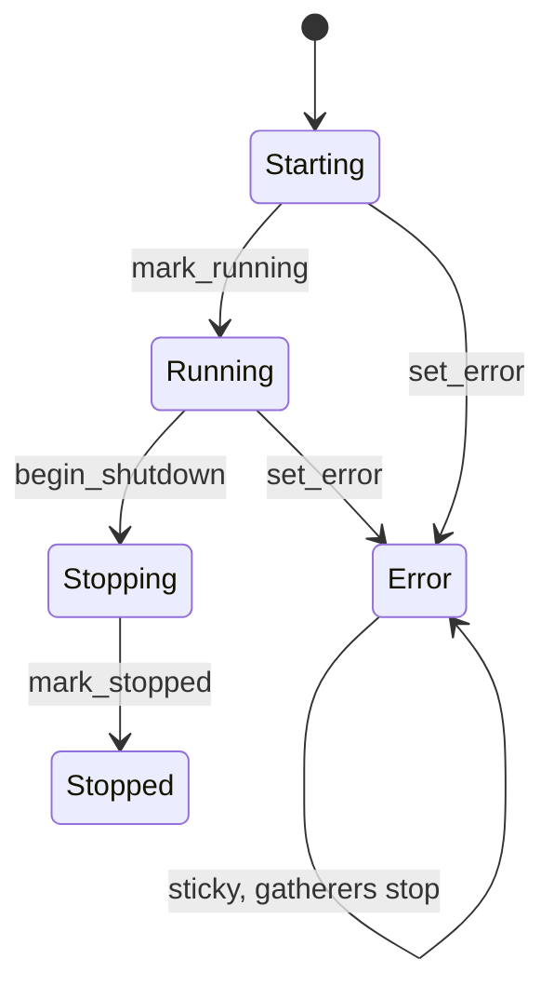
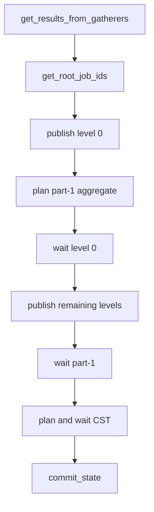

# Coordinator and Realm Processors

> Internal developer documentation — repository-only. Not part of the published mdBook (SUMMARY.md).

> Updated: 2026-09-07. Status: Review.

## Terminology

| Term | Meaning |
|---|---|
| Processor | Long-lived async loop that gathers one batch, publishes proving jobs, and commits durable state. |
| Coordinator | Single writer of the canonical checkpoint tree. |
| Realm | Per-shard consumer that proves EndCaps, submits a GUTA root, and commits after Coordinator inclusion. |
| CST | Checkpoint state-transition root job (circuit 32). |
| FFS | Fast-forward synchronization of replicated tree updates. |
| Unique pending id | Epoch that isolates gathering, processing, and committed batches. |

## Overview

Parth runs two processor loops. The coordinator aggregates per-realm GUTA updates, user registrations, contract deploys, and contract updates into one checkpoint proof, then writes the checkpoint tree. Each realm gathers EndCaps, proves a GUTA (including circuit 63), submits to the coordinator, and commits local state only after the coordinator includes the new realm root.

This is a formal English rewrite of the processor deep dive in the external memory tree, checked against the current sources in [File index](#file-index). Line numbers below are current as of this date; prefer symbol names if they drift.

## Background

Both processors are generic over network type `N`, durable store, temp DB, proof store, filesystem, and queue handles. They share `ProcessorStatus`. Gatherers own the live in-memory trees; processors consume finalized snapshots.

## Table of Contents

- [1. Coordinator versus realm](#1-coordinator-versus-realm)
- [2. ProcessorState](#2-processorstate)
- [3. Coordinator `process_block`](#3-coordinator-process_block)
- [4. Realm `process_block`](#4-realm-process_block)
- [5. Commit ordering](#5-commit-ordering)
- [6. Sync and recovery](#6-sync-and-recovery)
- [7. Security Considerations](#7-security-considerations)
- [Related Documents](#related-documents)
- [File index](#file-index)

## 1. Coordinator versus realm

| Aspect | Coordinator | Realm |
|---|---|---|
| Struct | `PsyCoordinatorProcessor` | `PsyRealmProcessor` |
| Gatherers | GUTA update, register user, deploy contract, update contract | EndCap only |
| Prove | Multi-level job trees, then part-1 aggregate (circuit 40), then CST (circuit 32) | Realm GUTA tree, then circuit 63 |
| Empty batch | Still emits a contiguous empty checkpoint when `next_checkpoint_id > 1` | Syncs to coordinator tip and returns without mutating `processing_realm_end_root` |
| Commit | `set_latest_checkpoint_id` last | Per-checkpoint `set_l2_block_state` last inside checkpoint records; singleton after marker |
| Recovery | Own ZKP + gatherer backups | Coordinator-led, backup end-root scan if pending-id mapping is missing |

The coordinator is the authority. Realms sync the checkpoint tree down and submit GUTA proofs up.

## 2. ProcessorState

`psy_node_common/src/utils/processor_status.rs:8-77`:

```text
Starting = 0, Running = 1, Error = 2, Stopping = 3, Stopped = 4
```

`should_run()` is true only for `Starting | Running`. `Error` is sticky: `mark_running`, `begin_shutdown`, and `mark_stopped` are no-ops once parked. An unknown raw value resolves to `Error`.

Both runner loops call `process_block` on their slot tick. On `Err` they `set_error` and log that the processor is parked until a manual restart. The loop then sleeps while `state == Error`. Gatherers share the same status and stop on the next `should_run()` poll ([Gatherers](gatherers.md#2-lifecycle)).



## 3. Coordinator `process_block`

Entry: `coordinator/processor/core/process_block.rs:615`.

1. `get_results_from_gatherers` (`:422`) rotates unique ids and finalizes all gatherers.
2. `get_root_job_ids`. Dummy no-change roots yield `None`. For `next_checkpoint_id > 1` the coordinator still plans an empty CST so checkpoint height stays contiguous (`:630-632`).
3. Publish level 0 without waiting; plan the part-1 aggregate while those jobs run.
4. Wait for level 0 proofs, then publish remaining levels with wait.
5. Publish and wait the part-1 job (`AggUserRegisterDeployContractsGUTA`, mode 4).
6. `plan_checkpoint_state_transition`: store the CST witness, publish, then poll `proof_store` until the persisted root proof exists.
7. `commit_state` with circuit 32 and the ZK proof.
8. Delete the worker-queue consumer for the processing id.



Part-1 and CST reward layouts are in [Reward Tree Circuit Layouts](reward-tree-circuits.md#45-part-1-aggregate-circuit-40-mode-4).

## 4. Realm `process_block`

Entry: `realm/processor/core/process_block.rs:338`.

1. Sanity check, then `get_results_from_gatherers` (`:169`): `set_new_unique_ids`, finalize the EndCap gatherer.
2. If there is no root job: `sync_to_coordinator_set_checkpoint_id` and return. Do not write `processing_realm_end_root` (`:355-380`).
3. If P2P rotation is enabled and this node is not the scheduled proposer for `T = base + 1`, sync and skip prove/submit/commit so the next gatherer cycle can rebase (`:385-417`).
4. Record `processing_realm_end_root`, publish GUTA jobs, retrieve the root proof.
5. Submit via `rc_submit_guta_proof` (circuit 63 + binding + certificate; see [RealmFinalizeGUTA BLS Authentication](realm-finalize-bls-auth.md)).
6. `wait_for_realm_update_sync_with_coordinator(new_realm_root)`: confirm the coordinator tip carries that root, or bail on divergence.
7. `commit_state` from the returned sync info.
8. Fast-forward any coordinator checkpoints produced while waiting; delete the worker-queue consumer.

Candidate A proving, P2P consensus, and Coordinator inclusion must overlap with builder B accepting EndCaps on A's end root. Do not insert a serial seal/wait/resume barrier that pauses B for the whole of A's prove and inclusion. A short seal that publishes the exact root before A proving may seed B; authoritative witness generation stays checkpoint-bound.

## 5. Commit ordering

### Coordinator

`coordinator/processor/db.rs:1045`.

Pre-write: recompute the new leaf hash; require the old leaf hash to match `last_committed`; require `checkpoint_id == last + 1` with `checked_add`; read the old checkpoint-tree root by the **committed** id, not the incoming id.

Writes:

1. Verifiable transition + ZKP.
2. Bidirectional `unique_pending_id ↔ checkpoint_id` mappings.
3. Tree / leaf / reward-key updates.
4. L2 block state and checkpoint-tree leaf.
5. `set_latest_checkpoint_id` last.

A crash after the mapping and before the marker is `NeedsRecovery`. Recovery rebuilds from the persisted transition plus gatherer backups and re-runs `commit_state`.

### Realm

`realm/processor/db/commit.rs:218`.

1. Bidirectional pending-id mappings first. `commit_state` is the sole writer of the commit mapping.
2. Global-user and reward top proofs.
3. Checkpoint records via `write_checkpoint_state_records`: state roots, leaf data, Merkle ingest, root-to-id mapping, then `set_l2_block_state` as the sentinel final per-checkpoint write.
4. Remaining FFS user/contract/IMT updates.
5. `set_latest_checkpoint_id`.
6. `set_l2_latest_block_state` only after the marker.

`wait_for_realm_update_sync_with_coordinator` does not advance the singleton. The following `commit_state` does.

## 6. Sync and recovery

Realm sync entry points (`realm/processor/db/sync.rs`):

| Function | Writes DB? | When |
|---|---|---|
| `sync_with_coordinator` | no (memory checkpoint tree only) | top of each `process_block` via `sync_and_verify` |
| `commit_state` | yes, one checkpoint | after coordinator inclusion |
| `sync_to_coordinator_set_checkpoint_id` | yes, `[latest+1, tip]` | init, no-jobs skip, post-commit fast-forward |

The append-only checkpoint tree has two roots: the live root over all inserted leaves, and the historical append root over `0..=k` used as a transition's old/new checkpoint-tree root.

Coordinator recovery is self-contained. Realm recovery walks coordinator checkpoints from `last_committed + 1`. Unchanged realm roots skip. Missing pending-id mappings scan backup files by `end_root`. No matching backup is data loss and fails closed.

Startup on a realm also walks `latest_checkpoint_id` backward while a checkpoint has no pending-id mapping, then persists the rolled-back marker.

## 7. Security Considerations

Commit-marker lag is the crash invariant. Do not write `latest_checkpoint_id` before the mappings and checkpoint records it claims. Do not expose `latest_l2_block_state` ahead of that marker.

Realm no-jobs and unscheduled-proposer paths must leave `processing_realm_end_root` untouched. Writing a speculative end root and hoping a later sync overwrites it hides divergence.

Root-proof waits must observe the persisted proof store, not only a queue-complete timeout. A timeout that returns success without a proof is not inclusion.

## Related Documents

- [Gatherers](gatherers.md) — who owns the trees and the N/N+1 seam.
- [Reward Tree Circuit Layouts](reward-tree-circuits.md) — part-1 and CST reward nodes.
- [RealmFinalizeGUTA BLS Authentication](realm-finalize-bls-auth.md) — submit/admit gate.
- [Realm P2P Validators](realm-p2p-validators.md) — scheduled proposer.
- [Devnet Lifecycle](devnet_lifecycle.md) — stack start/stop; processors are not restarted individually.

## File index

| Component | Path |
|---|---|
| ProcessorStatus | `psy_node_common/src/utils/processor_status.rs` |
| Coordinator process_block | `psy_node_common/src/coordinator/processor/core/process_block.rs` |
| Coordinator commit | `psy_node_common/src/coordinator/processor/db.rs` |
| Coordinator runner | `psy_node_common/src/coordinator/processor/core/runner.rs` |
| Realm process_block | `psy_node_common/src/realm/processor/core/process_block.rs` |
| Realm commit | `psy_node_common/src/realm/processor/db/commit.rs` |
| Realm sync | `psy_node_common/src/realm/processor/db/sync.rs` |
| Realm init / recovery | `psy_node_common/src/realm/processor/db/init.rs` |
| Coordinator id state | `psy_data/src/node/coordinator_processor.rs` |
| Realm core state | `psy_data/src/node/realm_processor.rs` |
