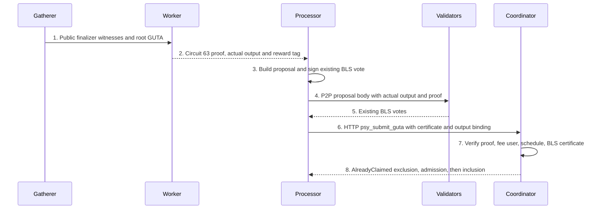

# RealmFinalizeGUTA BLS Authentication

> Internal developer documentation — repository-only. Not part of the published mdBook (SUMMARY.md).

> Draft: 2026-09-07. Status: Draft (design).
> **Currency (2026-09-08, local circuit):** Circuit 63 source already removed wallet-signature fingerprint derivation (`realm_finalize_guta.rs` fee/public-key section). Type 64 is absent from `cached_circuit_library` in this worktree. Treat narrative below that says “currently requires WrappedSignatureProof” as **pre-cutover**; prefer live `realm_finalize_guta.rs` + [ProvingJobs.md](../protocol/ProvingJobs.md) §2 for what ships today. Remaining draft items (PI commitment / AlreadyClaimed) still need independent verification against processors.

> Author: GPT-6 Astra. Reviewed-by: orchestrator, approved with conditions incorporated below.

## Abstract

T-REALM-FINALIZE-BLS removes circuit 63's wallet-signature verification and the gatherer's wallet private-key requirement. It reuses the processor's existing BLS vote and the Coordinator's existing certificate verification as the off-circuit authorization gate. **Validator-tree membership stays in circuit 63**, including its user ID, node/BLS hash limbs, slot index and checkpoint root; Coordinator membership verification is defense in depth, not a replacement. The circuit also retains root GUTA binding, checkpoint/anchor proofs, rotation, user-leaf membership and fee math. A new commitment binds the actual finalizer output to its proof while preserving the four-field recursive GUTA interface. This document specifies a coordinated source/artifact cutover only; it does not implement code, regenerate circuits or authorize deployment.

## Motivation

The planner currently requires a validator wallet private key and public-key parameter, proves a signature locally, and schedules WrappedSignatureProof before circuit 63. Existing processor BLS keys already sign the certificate's proposal commitment. Reusing that authorization removes the extra signature proof without replacing the proof's validator-tree or fee-recipient constraints.

Two verified gaps must not be obscured by this simplification: the existing public inputs commit only the final header and reward tag, not the full finalizer output; and `AlreadyClaimed` is pending-generation first-writer exclusion, not durable checkpoint anti-equivocation. Both receive explicit treatment below.

## Terminology & Abbreviations

| Term | Definition |
|---|---|
| BLS | BLS12-381 signatures using `blst::min_pk`, 48-byte public keys and 96-byte signatures. |
| ZK | Zero-knowledge; here the existing wallet-signature proof. |
| GUTA | Global User Tree Aggregator. |
| P2P | Peer-to-peer proposal replication and voting. |
| RPC | Remote procedure call. |
| HTTP | Hypertext Transfer Protocol carrying the Coordinator RPC. |
| PI | Circuit public input. |
| DST | BLS hash-to-curve domain separation tag. |
| SHA-256 | The existing protocol's 256-bit Secure Hash Algorithm. |
| H | Existing network field hash; `H(a,b)` is `q_two_to_one(a,b)`. |
| P | Proof-base checkpoint: actual circuit `checkpoint_id` and proposal `base_checkpoint_id`. |
| T | Scheduled target checkpoint: checked `P + 1`. |
| I | Actual Coordinator inclusion checkpoint, permitting the existing bounded lag beyond T. |
| EndCap | Final proof of a user proving session. |
| FFS | Fast-forward synchronization of replicated state updates. |
| DAG | Directed acyclic graph of proving dependencies. |
| JSON | JavaScript Object Notation. |
| Groth16 | Bridge wrapper proving system with circuit-specific setup material. |

## Table of Contents

- [Abstract](#abstract)
- [Motivation](#motivation)
- [Terminology & Abbreviations](#terminology--abbreviations)
- [Specification](#specification)
  - [1. Verified current flow](#1-verified-current-flow)
  - [2. Target flow](#2-target-flow)
  - [3. Exact BLS message D](#3-exact-bls-message-d)
  - [4. Circuit and output binding](#4-circuit-and-output-binding)
  - [5. Single admit gate](#5-single-admit-gate)
  - [6. Replay and equivocation](#6-replay-and-equivocation)
- [Data Structures](#data-structures)
- [Core Functions](#core-functions)
- [Core Loops](#core-loops)
- [Migration and Applicability Gate](#migration-and-applicability-gate)
- [Updated Phase 1–3 Scope](#updated-phase-13-scope)
- [Module and File Changes](#module-and-file-changes)
- [Rationale](#rationale)
- [Security Considerations](#security-considerations)
- [Risks and Acceptance Criteria](#risks-and-acceptance-criteria)

## Specification

### 1. Verified current flow



The diagram shows the target interaction; the authoritative current ASCII flow is:

```text
checkpoint identity + validator wallet private key
  -> gatherer / RealmGUTAPlanner -> local wallet-signature prove
  -> WrappedSignatureProof worker child --+
root GUTA proof -------------------------+-> circuit 63 -> final header + reward-tag PI
  -> processor reconstructs ordinary-submit output (checkpoint_id = 0)
  -> P2P proposal -> processor vote + peer votes -> certificate
  -> rc_submit_guta_proof -> HTTP psy_submit_guta
  -> optional certificate checks + proof verification
  -> pending-generation AlreadyClaimed -> proof store -> Coordinator queue
```

| Concern | Read-only source verification |
|---|---|
| Actual circuit path | `psy_plonky2_circuits/src/guta_v2/circuits/realm_finalize_guta.rs:205-238,637-683,979-1018`. The ticket's `guta/circuits/realm_finalize_guta.rs` path does not exist. Circuit 63 verifies WrappedSignatureProof, its fingerprint, action/key-parameter public inputs and wallet public-key derivation. |
| Chain domain | `psy_data/src/guta/realm_finalize.rs:78-85`: `H_many([F::from_u64_value(chain_id)])`. Retain the migrated full `u64` chain identity. |
| Identity | `psy_node_common/src/guta_planner/realm_guta_planner.rs:71-87,122-135,895-947`: a typed identity already exists, but the planner unpacks fourteen independent optional fields. |
| Signing boundary | Same planner, `:1048-1080,1121-1182`: local `VALIDATOR_SIGNATURE_CIRCUIT.prove_base`; only the resulting signature proof crosses the worker boundary. The raw private key is not a serialized circuit-63 witness. |
| Membership | Circuit, `:553-614`: validator leaf hashes user ID plus node/BLS limbs; its Merkle index binds realm/sub-id and root binds checkpoint validator root. Checkpoint and current user-leaf proofs bind the fee account. |
| Fee delta | Circuit, `:685-737`: checked 60-bit balance plus fee, unchanged account fields, current-checkpoint update rule, post-fee root. |
| Exported PI | Circuit, `:739-755`: `H(final_header_hash, rewards_tree_value)`. The host public-output helper is not an additional PI. |
| Synthetic output asymmetry | `psy_node_common/src/realm/processor/consensus.rs:148-184`: `checkpoint_id = 0` and root hash derived from the submitted final header. `psy_node_common/src/coordinator/edge/handler.rs:906-915` repeats this. Actual circuit action uses real P and pre-fee root header. |
| Processor BLS | `psy_node_common/src/realm/network/config.rs:163-180,217-240`, `startup.rs:73-80`, and `processor/core/process_block.rs:635-640,688-696`: load local key, sign own vote. Disk pattern includes `realm_1_sub_1_bls.key`. `parth_common/src/realm_rotation.rs:43-130` owns scheduling, not key files. |
| Submit gate | `process_block.rs:529-559,615-629`: certificate formed before HTTP submission; existing `votes_meet_wait` determines replication requirement, not an unconditional two-vote constant. |
| Coordinator tree trust | `psy_node_core/src/p2p/validator_lookup.rs:14-60`: checkpoint root comparison, known realm-slot lookup and leaf-preimage authentication. |
| Existing exclusion | `handler.rs:708-743`: atomic `(unique_pending_id, realm_id)` claim precedes proof storage and queue publication. `:748-780,848-872` additionally checks old root and bounded inclusion lag. |

### 2. Target flow

```text
checkpoint + anchor + validator-tree + user-leaf public witnesses
  -> root GUTA proof -> circuit 63 (one child; actual output committed in reward tag)
  -> processor actual output -> proposal_id -> existing vote_message D
  -> processor signs D with existing local P2P BLS key; peers sign same D
  -> existing certificate, including scheduled proposer's signature
  -> same HTTP psy_submit_guta, with actual output and finalizer worker tag
  -> one gate: proof/output + fee-user/proposer equality + tree + schedule + certificate
  -> existing AlreadyClaimed first writer -> proof store / queue -> inclusion / local commit
```

No additional authorization signature, key, signing service or endpoint is introduced. The scheduled processor's own vote is the finalizer BLS authorization. The certificate aggregates it with existing peer votes. A certificate without the scheduled proposer is rejected, even when its numerical vote count passes.

### 3. Exact BLS message D

**Reuse the existing proposal identity and vote message bit-for-bit.** In this design D denotes the exact 84-byte message passed to BLS, not a new prehash or a field hash:

```text
D = ASCII("PSYVOT01")
    || u64_le(chain_id)
    || u32_le(realm_id)
    || validator_tree_root[32]
    || proposal_id[32]
BLS.Sign(secret, D, VOTE_BLS_DST, augmentation = empty)
VOTE_BLS_DST = ASCII("BLS_SIG_BLS12381G2_XMD:SHA-256_SSWU_RO_POP_")
```

| D offset, half-open | Field |
|---|---|
| 0..8 | Exact domain `PSYVOT01`, no terminator. |
| 8..16 | Full `u64` chain ID, little-endian. |
| 16..20 | Realm ID, `u32` little-endian. |
| 20..52 | Checkpoint validator-tree root as canonical four little-endian field limbs. |
| 52..84 | Existing SHA-256 proposal ID, raw bytes. |

Source: `psy_data/src/p2p/messages.rs:433-450`, `domains.rs:9-22`, `bls.rs:145-175,232-248`. Do not hash D again before calling `sign_vote` or `fast_aggregate_verify`, and do not use JSON, display hex, native-endian integers or field reduction for chain ID.

The proposal ID must remain exactly the existing `Proposal::compute_proposal_id` / `proposal_from_parts` encoding: domain `PSYPRP01`, chain ID, realm ID, base checkpoint P, proposer sub-id, validator-tree root, public-output hash, finalizer-proof hash, backup hash and body hash, in the existing protocol order. Those existing encoders, not a second handwritten variant, are normative. The implementation must freeze a golden vector for that encoder and D together. `process_block.rs:670-687` already constructs the proposal from those fields.

The proposal-ID preimage is exactly 190 bytes (`psy_data/src/p2p/messages.rs:155-180`): `PSYPRP01[0..8] || chain_id:u64_le[8..16] || realm_id:u32_le[16..20] || P:u64_le[20..28] || proposer_sub_id:u16_le[28..30] || validator_tree_root[30..62] || public_output_hash[62..94] || finalizer_proof_hash[94..126] || backup_hash[126..158] || body_hash[158..190]`. Hash that concatenation once with SHA-256. The proposal ID itself is not included in its preimage. All five hashes are raw 32-byte arrays.

The following required equality chain supplies the full fee authorization:

```text
D -> proposal_id -> proposal.public_output_hash = SHA256(encode410(O))
                -> proposal.base_checkpoint_id = O.checkpoint_id = P
                -> proposal.finalizer_proof_hash = SHA256(actual proof)
O -> proof-bound output commitment A -> circuit PI
O.validator_user_id = scheduled proposer's checkpoint validator leaf user ID
```

O is the **actual circuit output**, including real P, realm/sub-id, pre-fee root-header hash, action hash, claimed user ID, checkpoint roots, child reward and final post-fee header. Its existing 410-byte encoding at `psy_data/src/guta/realm_finalize.rs:182-227` is frozen:

| O offset, half-open | Field / encoding |
|---|---|
| 0..32 | `chain_domain`, canonical four `u64_le` field limbs. |
| 32..40 | `checkpoint_id=P`, canonical field value as `u64_le`. |
| 40..48 | `realm_id`, canonical field value as `u64_le`, checked to protocol u32. |
| 48..50 | `realm_sub_id`, `u16_le`, registered one-based slot. |
| 50..82 | `checkpoint_tree_root`, canonical hash bytes. |
| 82..114 | `validator_tree_root`, canonical hash bytes. |
| 114..122 | `validator_user_id`, canonical field value as `u64_le`. |
| 122..154 | `root_guta_header_hash`, pre-fee header hash. |
| 154..186 | `root_guta_reward_tag`, root-child tag. |
| 186..218 | `action_hash`, existing action hash with real P. |
| 218..250 | Final header `guta_circuit_whitelist`. |
| 250..282 | Final header `checkpoint_tree_root`. |
| 282..314 | Final header old state root. |
| 314..346 | Final header post-fee new state root. |
| 346..354 | Final header node index, canonical `u64_le`. |
| 354..362 | Final header node level, canonical `u64_le`. |
| 362..370 | `guta_fees_collected`, canonical `u64_le`. |
| 370..378 | `da_fees_collected`, canonical `u64_le`. |
| 378..386 | `user_ops_processed`, canonical `u64_le`. |
| 386..394 | `total_transactions`, canonical `u64_le`. |
| 394..402 | `slots_modified`, canonical `u64_le`. |
| 402..410 | `total_aggregation_proofs_generated`, canonical `u64_le`. |

Require every field/hash limb below Goldilocks modulus `0xffffffff00000001` before constructing field values. Do not silently reduce noncanonical bytes. Require configured chain ID and existing `H(chain_id)` equality. P remains the proof base; T is checked P+1; I is not signed in place of P.

**Vote-message collision answer:** finalizer authorization deliberately is the existing proposal vote, not a second message class sharing its domain accidentally. There is no distinct finalizer message for a vote to collide with. Reusing an ordinary/old proposal vote cannot authorize a different finalizer: job type must be 63, the proof hash and actual output hash must match, and changing P, user ID, action or roots changes the proposal identity and D. Proofs of possession retain their separate DST. Do not permit a standalone vote over an unrelated proposal as an authorization substitute.

### 4. Circuit and output binding

Keep the four-field recursive interface and generic consumers' `H(header_hash, tag)` convention. Commit actual O inside circuit 63's exported tag:

```text
A    = O.public_output_hash::<NetworkHasher>()
R63  = H(H(O.root_guta_reward_tag, A), finalizer_worker_reward_tag)
PI63 = H(O.final_guta_header_hash(), R63)
```

A uses the existing field-hash layout at `psy_data/src/guta/realm_finalize.rs:143-168`, mirrored over **constrained circuit targets**. It is not the proposal's SHA-256 output hash. R63 is the standard tagged reward-tree node: the root GUTA child's reward value on the left, A on the right as a value-only boundary, and the finalizer worker's claim tag. There is no R1 intermediate node. A is not a worker leaf and gets no tag, so it is not a claimant; there is no phantom signature reward or zero signature child. Propagate R63 as the submitted tag and persisted reward root. This is a new circuit public API meaning even though PI count stays four.

Generic consumers already treat child tags as opaque (`psy_plonky2_circuits/src/guta/gadgets/verify_guta_proof.rs:41-83`). They continue verifying the same header-plus-tag form. Reward proofs, job metadata and path construction must migrate together; do not introduce a second PI interpretation in every generic GUTA gadget.

| Keep in circuit 63 | Remove from finalizer circuit / gatherer |
|---|---|
| Root GUTA verification, whitelist and pre-fee header binding. | WrappedSignatureProof verification and finalizer signature fingerprints. |
| Checkpoint leaf/tree proofs, old realm-root proof, anchor proof and existing rotation constraint for T. | Wallet private-key requirement and local signature proving. |
| **Validator-tree leaf hash over user ID plus node/BLS hash limbs; index `(realm_id << 8) | realm_sub_id`; root equal to checkpoint validator root.** | Public-key parameter, signature type selector and signature wallet-key derivation. |
| Checkpoint validator user-leaf hash membership, current user-leaf membership, matching user IDs and local fee index. | Signature wrapper child job, dependency level and reward child. |
| Checked 60-bit fee addition, unchanged account fields, checkpoint update rule and final root. | Nothing from fee math or validator-tree proof. |
| Actual O commitment A, binding claimed fee recipient and checkpoint to PI. | No BLS secret or signature becomes a circuit witness. |

The account's public-key field remains in its leaf hash and is preserved by fee math; only its enforced derivation from a wallet-signature fingerprint/parameter is removed. Coordinator membership checks verify the same registered identity and are additional defense, not a replacement for the circuit leaf proof.

Resolve the checkpoint-zero asymmetry by retiring `build_bound_finalize_output` from finalizer construction/verification. Obtain O from the exact planner witness and root proof/reward artifacts; verify it against PI63 before voting/admission. Never reconstruct the pre-fee header by hashing the submitted post-fee header. A nonzero-fee example must have its actual pre-fee root hash and real P, including at genesis where P=0 is legitimate rather than a generic sentinel.

### 5. Single admit gate

Retain this exact existing transport/handler path:

```text
processor/core/process_block.rs:548 rc_submit_guta_proof
  -> psy_node_common/src/p2p/realm_coordinator.rs
  -> psy_submit_guta (psy_api_core/src/coordinator/standard_edge_rpc.rs:20,42-43)
  -> CoordinatorEdgeHandler::submit_guta (coordinator/edge/api.rs:89-97)
  -> CoordinatorEdgeHandler::submit_guta_internal (edge/handler.rs:645-745)
  -> existing proof store / Coordinator queue
```

Append required `finalize_binding: Vec<u8>` to that RPC and all implementations. It contains actual O plus finalizer worker tag, defined below; it contains no new signature. Keep existing proposal/certificate wire encodings. For external Realm admission, require job type 63, proposal, certificate and binding. Internal ordinary GUTA aggregation remains unchanged. No new endpoint or optional legacy finalizer path is permitted.

Reuse `verify_optional_guta_certificate`'s tree lookup, scheduled proposer calculation and BLS FastAggregateVerify. Its current no-validator return at `handler.rs:791-796` must fail closed for the finalizer endpoint. Rename the helper to reflect mandatory validation when migrating its callers.

Before `put_submitted_status_if_absent`, proof storage or queue publication:

1. Strictly decode binding and O. Require final header equality with submitted header. Compute A and R63; require submitted tag equality and verify registered new circuit-63 proof against PI63.
2. Resolve canonical P from submitted checkpoint root (`handler.rs:811-819`). Require O.checkpoint_id and proposal.base_checkpoint_id equal P, chain domain equal configured H(chain_id), and all realm/sub-id/root/action fields consistent. Preserve current old-root equality and bounded inclusion lag.
3. Load checkpoint P's validators using `load_realm_validators_from_tree` and the committed validator root. Preserve preimage/slot/hash checks; explicitly require selected preimage chain ID equal configured chain ID. Never trust a sender-supplied public key or current runtime config instead of checkpoint membership.
4. Compute T=P+1, canonical epoch anchor and scheduled proposer as at `handler.rs:869-899`. Require O.realm_sub_id equals proposal.proposer_sub_id equals scheduled sub-id.
5. **Assert O.validator_user_id equals the scheduled proposer's authenticated validator leaf user ID.** This is the fee-claim glue. The circuit independently binds that user to its validator leaf and fee delta; the Coordinator verifies that this exact proof-bound user is the scheduled certificate proposer.
6. Compare proposal output hash to SHA256(encode410(O)), proof hash to actual proof, and proposal ID to the canonical existing encoder. Validate the existing certificate using checkpoint-tree keys; enforce `votes_meet_wait` and `certificate_includes_proposer` (`handler.rs:916-929`). The scheduled processor's included BLS vote over D is the authorization.
7. Invoke existing atomic AlreadyClaimed exclusion for the captured pending generation and realm. Only a successful first writer stores/publishes. A failure returns existing `RealmFinalizeSubmitCode::AlreadyClaimed` and must not overwrite the winner. Preserve existing state/rebase checks; do not describe them as a new atomic checkpoint transaction.

Non-proposers also verify actual O, A/R63 and PI before voting; replace their synthetic-output equality check at `consensus.rs:198-232`. The processor signs with `self.bls_secret` during `publish_realm_p2p_proposal`, after actual finalizer output is available. No key enters workers or gatherer identity.

### 6. Replay and equivocation

The logical finalizer identity is `(chain_id, realm_id, P)`; multiple realms legitimately finalize from the same P. P in the signed proposal binds the payload to that base and its T=P+1 schedule. I does not replace P.

The implemented gate's **first-writer key is `(unique_pending_id, realm_id)`**, not that logical checkpoint identity. `put_submitted_status_if_absent` is atomic; the first verified writer wins, and every subsequent writer in that generation returns AlreadyClaimed, including exact retransmissions. The certificate does not serialize admissions or prevent validators from signing two proposals. AlreadyClaimed does not distinguish a duplicate from equivocation and is not itself signed evidence.

Two valid certified proposals with different finalizer payloads for the same `(chain, realm, P)` constitute equivocation evidence. A second submission in the same pending generation is rejected by AlreadyClaimed, regardless of whether it is identical or conflicting. Across generations, ordinary root-changing replays are rejected by current old-root checks; bounded inclusion lag also limits eligibility. **Do not claim that checkpoint monotonicity proves durable exactly-once finalization for all cases:** no-op transitions, repeated roots, generation rollover and the claim-before-store crash window are not covered by a durable checkpoint-keyed record in this path.

This ticket preserves existing first-writer semantics. It does not introduce a new durable replay table, slashing mechanism, retry-success contract or outbox. A stronger cross-generation exactly-once guarantee requires an explicitly scoped storage change and is not an acceptance claim for this auth redesign. Record this limitation in release review rather than silently claiming it is solved by BLS or Certificate.

## Data Structures

One new required transport payload carries public binding material; no secret or second signature is added:

```rust
pub struct RealmFinalizeBinding {
    /// Actual canonical finalizer output; required, no default.
    pub output: [u8; 410],
    /// Canonical field-hash bytes; required, no default.
    pub finalizer_worker_reward_tag: [u8; 32],
}
```

Wire encoding is direct concatenation in declaration order, exactly 442 bytes; reject trailing bytes and noncanonical field limbs. O's complete field layout is specified in §3 and existing type definition at `psy_data/src/guta/realm_finalize.rs:129-140`. The processor creates this binding from completed artifacts; the Coordinator consumes it. To give non-proposers the worker tag needed to verify R63 before voting, extend the proposal **body** by appending exactly these 32 worker-tag bytes after its existing three length-prefixed components: `u32_le(410) || O || u32_le(proof_len) || proof || u32_le(ffs_len) || FFS || worker_tag[32]`. The first component remains 410 bytes; body hash covers the entire extended body. Require exact decoding, existing proof/FFS limits and the additional 32-byte total size. Coordinator RPC binding and proposal-body O/tag must come from the same artifacts. Proposal and Certificate fixed metadata structures and their encodings stay unchanged; the body format is a breaking cutover.

Example identity: chain `1384803358401154921`, realm `1`, sub-id `1`, P `17`, T `18`, validator user `1048576`. The output's roots/statistics and worker tag are the actual completed artifacts for that identity; no zero-filled substitute is valid. The exact serialization of chain/IDs is fixed by the tables above.

```text
RealmFinalizeBinding --owns--> O + finalizer worker tag
             O ------hash----> proposal.public_output_hash
      proposal ------hash----> proposal_id ------encodes----> D
   certificate ------BLS-----> D with scheduled proposer included
             O ------field---> A ------tag R63--------------> circuit PI
```

Reuse the existing typed `RealmFinalizeGUTAIdentity`: remove wallet private key and public-key parameter only. Retain its user ID, node/BLS limbs, validator-tree proof, checkpoint/current user leaves and proofs, anchor/checkpoint leaves and proofs, and old realm-root proof (`realm_guta_planner.rs:71-87`). Replace the fourteen independent planner options with this complete public value rather than inventing another identity abstraction.

## Core Functions

Existing signing functions remain unchanged:

```rust
pub fn vote_message(
    chain_id: u64,
    realm_id: u32,
    validator_tree_root: &[u8; 32],
    proposal_id: &[u8; 32],
) -> Vec<u8>;

impl BlsSecretKey {
    pub fn sign_vote(&self, message: &[u8]) -> BlsSignature;
}

impl BlsSignature {
    pub fn fast_aggregate_verify(
        &self,
        message: &[u8],
        public_keys: &[BlsPublicKey],
    ) -> ProtocolResult<()>;
}
```

Source: `messages.rs:435-450`, `bls.rs:156-175,232-239`. Preconditions: canonical proposal and checkpoint-authenticated keys; strict subgroup/non-infinity parsing stays in the existing BLS types. Postcondition: verified certificate message equals D. Invalid keys, signatures or mismatched D fail with the existing protocol error; no storage side effects occur.

Proposed handler signature, preserving the actual existing generic types:

```rust
pub async fn submit_guta_internal(
    &self,
    input: GlobalUserTreeAggregatorHeaderWithTagValueAndJobType<N::F, N::QHash>,
    proof_bytes: Vec<u8>,
    proposal_bytes: Option<Vec<u8>>,
    certificate_bytes: Option<Vec<u8>>,
    finalize_binding: Vec<u8>,
) -> anyhow::Result<()>;
```

Its concrete algorithm is §5's seven steps. Successful return means existing admission/store/publication, not canonical inclusion. Error classes retain invalid output/proof/certificate, checkpoint unavailable, not scheduled proposer and AlreadyClaimed; missing binding/validators is invalid admission, not legacy success. All proof/output/user equality checks precede the claim. Existing claim-before-store failure behavior is unchanged and must not be represented as transactional recovery.

## Core Loops

The existing `process_block` execution at `psy_node_common/src/realm/processor/core/process_block.rs:335-613` remains the owner; no new loop is introduced:

1. Gather checkpoint-bound public identity and finalizer witnesses; preserve unscheduled/rebase behavior.
2. Dispatch root GUTA then one circuit-63 child dependency; await real proof and reward artifacts.
3. Build actual O and binding; verify their PI/tag equality. Build existing proposal, sign D using the local BLS key and publish proposal/own vote.
4. Collect and validate existing peer votes and certificate, including scheduled proposer and replication-wait policy.
5. Submit binding, proof and certificate through the same gate. AlreadyClaimed remains an error, not an invented idempotent success.
6. Wait for Coordinator inclusion; then commit locally and allow non-proposer FFS. Start the next existing gatherer cycle.

Missing key/output/proof aborts the current finalization without local commit. Existing timeout, rebase and shutdown behavior remains. Neither startup nor recovery moves BLS secrets into workers, and this ticket does not create a replay-recovery background service.

## Migration and Applicability Gate

This file is documentation-only. Implementation changes circuit/public-API and consumed-crate contracts. Follow `AGENTS.md:43-53,95-109` and [Circuit and Verifier Operations](circuit-and-verifier-operations.md) §§3 and 8 before generation or release.

| Artifact/state | Required implementation disposition |
|---|---|
| Circuit 63 | New constraints/tag meaning, constructor and one-child witness contract invalidate old proofs/jobs. Keep validator-tree proof and fee binding. Keep circuit ID 63; no dual old/new verifier acceptance. |
| WrappedSignatureProof, type 64 | Remove finalizer child job, worker dispatch branch, wrapper registration/triplet and inclusion edges for 64; remove wrapper-only construction/fields when no longer used. Migrate every type-64 caller, rather than retaining an unused registry entry. Preserve independent wallet ZK-sign circuits consumed by EndCap/user proving; deregistering the network wrapper is not deleting those circuits. |
| Worker DAG and rewards | One finalizer dependency, one child reward, one new job/level above root. No signature proof persistence or signature reward. R63 is the standard tagged reward node with A as a value-only right sibling; update reward paths and expected hashes together. |
| GUTA cache pair | Regenerate `cached_circuit_library.rs` and `cached_common_data.rs` together with the runbook's cache-only command. Require a second identical run to report both up to date. Refresh changed triplets, whitelists and parent/child relationships. |
| EndCap metadata | **Not invalidated by this class alone.** Removing circuit-63's signature wrapper does not change the user EndCap constructor. Only separately changed UPS/EndCap inputs trigger atomic JSON/fingerprint regeneration. Do not change shared user signature circuits merely to remove type 64. |
| `bridge_agg` | Check changed GUTA whitelist/fingerprints through coordinator/checkpoint common/verifier data and cached step-commit fingerprint. Expect a cascade when consumed whitelist/verifier inputs change; if triggered regenerate the complete bridge_agg setup and matching Solidity verifier. Unchanged PI count is not proof of non-applicability. |
| Deposit/withdrawal Groth16 cohorts | No trigger from this auth change alone; their own consumed circuit changes remain independent triggers. |
| Genesis, validator/user records | Existing BLS registrations, validator preimages and fee user leaves remain compatible. No key/account migration or Genesis regeneration is authorized by this change alone. |
| RPC/proposal storage | Required 442-byte binding argument; actual rather than checkpoint-zero output semantics; new tag meaning. Old envelopes and in-flight jobs are incompatible. Proposal/Certificate byte layouts remain unchanged, but their committed output/proof bytes change. |
| Submitted status | Preserve existing AlreadyClaimed storage format/key and first-writer semantics. No durable checkpoint replay schema is introduced. |
| Historical committed data | User/checkpoint/validator leaf formats unchanged. Preserve historical verifier provenance. Storage readability does not imply recursive proof-chain resume across new fingerprints; use owner-authorized verified activation procedure, never silent purge. |
| Downstream applicability | Classify circuit API and consumed crates; freeze one source revision for affected consumers. Review compiler/SDK/services impact, without automatically regenerating unrelated Genesis content or publishing packages. |
| Operational boundary | Regeneration/validation is localhost-only and separately authorized. Current shared EndCap JSON is not per-network metadata. Non-local promotion fails closed. This design task performs no regeneration, setup mutation, upload, deployment or publication. |

## Updated Phase 1–3 Scope

This table amends the intended T-GATHERER-REFACTOR scope; no external task record is claimed edited.

| Phase | Updated scope and completion boundary |
|---|---|
| Phase 1 — complete public identity | Reuse the existing typed identity; remove wallet private key/public-key parameter, not validator-tree proof or node/BLS limbs. Fourteen planner options shrink by those two fields before consolidation into one complete value. Preserve checkpoint/current leaf and anchor/checkpoint snapshots, including the current-leaf proof already present in the typed identity. No BLS secret enters the gatherer. |
| Phase 2 — deterministic public planning | Remove local `VALIDATOR_SIGNATURE_CIRCUIT.prove_base`, signature PI check, type-64 job/persistence/dependency level. Plan one finalizer above root, add one job and one child reward. Retain validator membership, fee math and leaf proofs. Produce actual O and authenticated-output reward metadata. This phase cannot activate independently of the new circuit and gate. |
| Phase 3 — admission and cohort activation | Reuse processor BLS vote/certificate authorization; enforce actual-output PI binding and explicit scheduled-proposer fee-user equality. Preserve AlreadyClaimed semantics and document its limits. Complete registry/cache/bridge applicability review, compatible storage activation and real Plonky2 end-to-end acceptance. Strip obsolete secret fields from new gatherer backup formats and reject old in-flight formats. |

## Module and File Changes

These are source hunk plans, not code edits performed by this document:

```text
psy_data/src/guta/realm_finalize.rs        public witness + actual output binding
psy_plonky2_circuits/src/guta_v2/circuits/  circuit 63 removes signature only
psy_plonky2_circuits/src/guta/             type-64 removal and reward integration
psy_node_common/src/guta_planner/         complete public identity / one-child DAG
psy_node_common/src/realm/processor/       actual output / existing BLS votes
psy_node_common/src/coordinator/edge/      mandatory certificate / fee-user equality
psy_node_core/src/p2p/                    transport binding and checkpoint lookup
psy_api_core/src/coordinator/             required RPC binding argument
```

| File/source anchor | Hunk-style implementation plan |
|---|---|
| `psy_data/src/guta/realm_finalize.rs:296-328,357-463` | `@@ witness`: remove signature parameter/type only; keep validator-tree proof/limbs and user proofs; migrate all canonical serializers/tests. `@@ output`: add binding encoder and shared A/R63 host computation, preserving encode410. |
| `psy_plonky2_circuits/src/guta_v2/circuits/realm_finalize_guta.rs:205-238,465-800,979-1018` | `@@ constructor/prove`: delete signature targets/arguments/fingerprints; keep membership and fee targets; compute constrained A and standard R63; require one child and child tag. Update behavioral tests at `:1023-1432`. |
| `psy_plonky2_circuits/src/guta/guta_helper.rs:281-295,471-558,650-653` | `@@ manager/dispatch`: remove type-64 construction, registration/inclusions and dispatch, migrate callers; preserve independent user signature circuits. |
| `psy_plonky2_circuits/src/circuit_library/core.rs:109-113` and `examples/config_gen_v2.rs:142-143` | `@@ triplets`: replace 63 verifier data and deregister 64; regenerate cache pair only in authorized implementation release. |
| `psy_node_common/src/guta_planner/realm_guta_planner.rs:71-135,895-947,1048-1182` | `@@ identity/finalizer`: consolidate public identity, remove local signature prove/job, preserve membership witnesses; one-child metadata and correct job totals/levels. |
| `psy_node_common/src/realm/processor/gatherers/realm_end_cap_gatherer.rs:466-529` | `@@ finalizer_identity`: stop loading wallet secret/key parameter; preserve validator-tree and leaf/anchor/checkpoint proofs. |
| `psy_node_common/src/realm/processor/core/process_block.rs:506-559,624-687` | `@@ artifact/submit`: load actual O and worker tag; sign existing D via unchanged vote path; pass binding through existing RPC. |
| `psy_node_common/src/realm/processor/consensus.rs:148-234` | `@@ output verification`: remove checkpoint-zero/pre-fee-from-final reconstruction for finalizers; validate actual O, A/R63 and PI. |
| `psy_node_core/src/p2p/validator_lookup.rs:14-60` | `@@ selected preimage`: preserve existing authentication and add explicit configured-chain equality for finalizer membership. |
| `psy_node_core/src/p2p/traits/realm_coordinantor.rs:16`, `psy_node_common/src/p2p/realm_coordinator.rs`, `psy_api_core/src/coordinator/standard_edge_rpc.rs:42-43`, `psy_node_common/src/coordinator/edge/api.rs:89-97` | `@@ submit`: append required binding bytes, migrate every implementation/caller/mock, no compatibility overload. |
| `psy_node_common/src/coordinator/edge/handler.rs:645-745,783-940` | `@@ gate`: require 63/binding/certificate, verify actual output, enforce explicit fee-user/proposer equality, reuse existing tree/BLS/schedule checks; preserve AlreadyClaimed key/behavior. |
| Existing finalizer reward-path producers | `@@ reward path`: use the standard tagged node (child reward left, A value-only right, worker tag at the node); migrate paths, expected metadata and persisted tag root consistently. No generic GUTA PI reinterpretation. |
| `psy_data/src/p2p/messages.rs:220-276` | `@@ proposal body`: append required 32-byte finalizer worker tag after FFS; update decoder return type, exact-length checks, total body size limits and every caller. Keep the output component exactly 410 bytes and fixed Proposal/Certificate encodings unchanged. |
| `docs/src/dev/realm-p2p-validators.md:87-105`, `docs/src/dev/circuit-and-verifier-operations.md:132-167` | `@@ authorization/artifacts`: after implementation update finalizer wallet-key requirements, type-64 retirement and adopted cohort boundaries. |

Representative semantic hunk (not compilable source):

```diff
--- a/psy_plonky2_circuits/src/guta_v2/circuits/realm_finalize_guta.rs
+++ b/psy_plonky2_circuits/src/guta_v2/circuits/realm_finalize_guta.rs
@@ authentication and public inputs
  verify validator-tree leaf(user_id, node_limbs, bls_limbs), slot and checkpoint root
  verify user-leaf membership and fee delta to that user
- verify WrappedSignatureProof, wallet parameter and signature fingerprints
- rewards = H(H(root_reward, signature_reward), worker_reward)
+ A = field_hash(actual_constrained_output)
+ rewards = H(H(root_reward, A), worker_reward)
  public_inputs = H(final_header_hash, rewards)
```

## Rationale

- **Reuse BLS certificate rather than add another signature:** the scheduled processor already signs D, the certificate already aggregates it, and the gate already loads registered keys and validates it. Mandatory proposer inclusion plus proof-bound fee-user equality makes that vote explicit finalizer authorization.
- **Keep validator-tree proof:** circuit soundness continues to bind the registered identity and scheduled slot to the fee delta. Off-circuit lookup is defense in depth and supplies actual key bytes for BLS.
- **Commit actual O through the tag:** generic GUTA proofs already expose header-plus-tag PI. A non-payable commitment node binds the full output without adding global header fields or a normalization circuit; reward-path migration is explicit.
- **Keep first-writer semantics:** this ticket removes wallet-signature proving, not the submission storage protocol. Document the existing exclusion accurately instead of adding an unrequested durable replay subsystem.

## Security Considerations

1. **Fee authority:** only the scheduled validator's checkpoint-registered BLS key can supply the required proposer vote over the certified actual finalizer payload. Gate equality binds its registered user ID to O; circuit membership/leaf/fee constraints bind O to the actual recipient. An unscheduled validator or ordinary wallet-key holder cannot redirect fees.
2. **BLS versus ZK:** wallet key possession leaves the recursive circuit. Validator membership, schedule and fee math remain proved, while possession of the registered BLS key is enforced at admission. A proof-only verifier does not verify BLS or certificate acceptance; Groth16 does not acquire that guarantee. A malicious Coordinator can bypass off-circuit key-possession checks but cannot use this change to remove the retained circuit membership/schedule/fee constraints.
3. **Output tampering:** changes to P, user ID, action, roots or fees change A and proposal identity/D. An unattached forged O fails PI/tag validation; a proof for another fee user fails scheduled-user equality and the retained circuit validator leaf constraints.
4. **Key isolation:** BLS stays in the processor, never gatherer/worker/FFS. Removing the finalizer wallet key does not remove user wallet signing for transactions. Missing BLS fails closed, not a fallback to unsigned or ZK finalization.
5. **Replay:** chain/P/realm binding prevents cross-context reuse; AlreadyClaimed prevents a second writer in a pending generation. It does not establish durable exactly-once per P across all generations. Certificate alone is not anti-equivocation evidence or prevention.
6. **Equivocation:** two valid certified distinct payloads for the same logical finalizer identity are evidence. AlreadyClaimed rejects the second in-generation submission without classifying it. Invalid signatures are not validator equivocation evidence; slashing is outside scope.
7. **Membership snapshot:** use P's validator root and key, not latest/config-only membership. The circuit proves its path to that root; Coordinator lookup trusts its own checkpoint-consistent database/preimages. Missing preimage, wrong chain or root mismatch rejects.
8. **Zero fees:** keep signature/certificate/membership checks for zero fee or no-op transitions. Do not bypass authorization to accommodate replay assumptions.

## Risks and Acceptance Criteria

These are implementation acceptance requirements, not tests executed by this design task.

| Risk | Required evidence |
|---|---|
| Digest/encoding drift | Golden proposal-ID and exact 84-byte D vectors; full-width chain mutation, P/user/action/root changes, noncanonical field limbs and wrong output length reject. No second custom digest encoder. |
| Synthetic O survives | Real finalizer with nonzero P and nonzero fee; pre-fee root hash differs from final-header hash. Mutating O.user_id/P/action/root fails proof binding and proposal verification. |
| Membership accidentally removed | Existing validator leaf, node/BLS limbs, index realm/sub-id, root and checkpoint/user-leaf negative circuit cases still fail. Coordinator fee-user mismatch fails before AlreadyClaimed. |
| Fee/reward regression | Correct fee credit without wallet key; 60-bit overflow and changed account fields fail. Root/finalizer worker reward claims verify through A/R63; A is not paid and signature job is absent. |
| Type-64 leftovers | No wrapper job/dispatch/registry/inclusion caller remains; real one-child finalizer and recursive generic GUTA verification succeed. Independent user signature/EndCap behavior unchanged. |
| Schedule or BLS bypass | Wrong key, wrong scheduled sub-id, missing proposer vote, wrong P membership, missing certificate/binding/validators and ordinary external GUTA type reject. Preserve exact existing replication wait for all validator counts. |
| Replay claim overstated | Concurrent verified submissions in the same pending generation yield one publisher and AlreadyClaimed for the other, including exact duplicate. Root-changing committed replay rejects. Document generation/no-op/crash limitations rather than claiming stronger results. |
| Artifact mismatch | Applicable localhost cache pair stable on second run; bridge_agg cascade resolved against actual consumed inputs. EndCap unchanged absent its independent trigger. No unauthorized Genesis, setup or non-local regeneration. |
| End-to-end divergence | Follow lifecycle/runbook using real Plonky2: real call, actual output proposal, required votes/certificate, gate fee-user binding, fee credit, proposer commit, non-proposer FFS and equal roots. HTTP-only acceptance or dummy proofs are insufficient. |

Read-only verification covered the cited circuit, planner, output encoder, processor BLS ownership, RPC/handler, validator lookup and first-writer checks. This document makes no claim of code implementation, circuit regeneration or executed behavioral tests.
