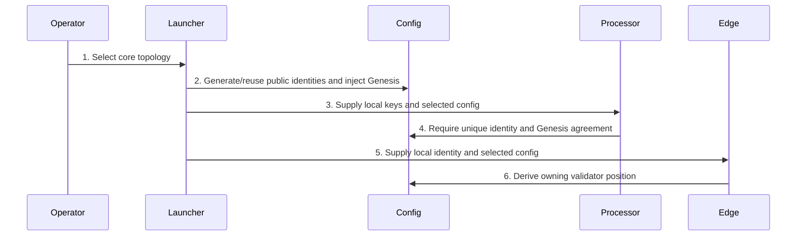

# Realm P2P Validators

> Internal developer documentation — repository-only. Not part of the published mdBook (SUMMARY.md).

> Updated: 2026-09-07. Status: Review.

## Terminology

P2P means peer-to-peer; HTTP means Hypertext Transfer Protocol; BLS identifies the BLS12-381 validator signature scheme; ZK means zero-knowledge; NodeId is the public routing identity; PeerId is its libp2p peer identifier. A sub-id is a one-based validator position, not a separate configured identifier.

## Overview

Realm P2P is the standard Realm launcher path. Validator membership and public routing identity come from `PSY_CONFIG_PATH`, which defaults to `psy-genesis/config.json`. Selection is bound to the node's `config.network`: `LocalDevnet` selects `localhost`, `PsyPublicTestnet` selects `sepolia`, and `PsyMainnet` selects `ethereum`; other mappings fail closed. If `PSY_NETWORK` is present, it must equal that canonical key. The Coordinator admission endpoint remains HTTP and verifies validator certificates; there is no Coordinator libp2p submission path.

## Background

Public membership must agree with local secrets, Genesis, and the compiled network. Startup rejects ambiguity rather than selecting the first identity match. The selected-network loader is `psy_cli/psy_node_cli/src/node/realm_p2p.rs:148-190`; processor/Genesis identity checks are at `psy_cli/psy_node_cli/src/node/realm_p2p.rs:462-535`.

## Table of Contents

- [Network Configuration](#network-configuration)
- [Fail-Closed Startup](#fail-closed-startup)
- [Launcher Behavior](#launcher-behavior)
- [Security Considerations](#security-considerations)
- [Related Documents](#related-documents)



```text
compiled network constants + public runtime config + local secrets + Genesis
  -> exact identity validation -> one-based validator position -> P2P routing
```

## Network Configuration

Each network contains:

```json
{
  "p2p": { "checkpoints_per_epoch": 10 },
  "realm_configs": [{
    "id": 0,
    "validators": [{
      "validator_user_id": 0,
      "processor_node_id": "<38-byte NodeId hex>",
      "bls_public_key": "<48-byte BLS public key hex>",
      "processor_addresses": ["/ip4/127.0.0.1/tcp/41001/p2p/<peer>"],
      "edge_nodes": [{
        "node_id": "<38-byte NodeId hex>",
        "addresses": ["/ip4/127.0.0.1/tcp/41101/p2p/<peer>"]
      }]
    }, {
      "validator_user_id": 262144,
      "processor_node_id": "<38-byte NodeId hex>",
      "bls_public_key": "<48-byte BLS public key hex>",
      "processor_addresses": ["/ip4/127.0.0.1/tcp/41002/p2p/<peer>"],
      "edge_nodes": [{
        "node_id": "<38-byte NodeId hex>",
        "addresses": ["/ip4/127.0.0.1/tcp/41102/p2p/<peer>"]
      }]
    }]
  }]
}
```

Local-devnet example above uses reserved Strategy5 user ids for Realm 0 subs `1`/`2` (`0` and `262144`); Realm 1 uses `1048576` and `1572864`.

The validator sub-id is not stored. It is the validator's one-based array position. This preserves existing port and database namespaces (`realm_{id}_{sub}`). `validator_user_id` must lie in the owning Realm's half-open user range. Local-devnet genesis pre-places dedicated ZK validator accounts at registrations `0`, `1`, `3`, `4` for realms `0..1` (Strategy5 GROUP=1), keeps registration `2` as the bridge relayer (`user_id` `524288`), and has the launcher bind `(realm_id, sub_id)` to those reserved validator accounts rather than picking ordinary faucet users. Realm 0 sub 1 is intentionally registration `0` / `user_id` `0`.

The exact reserved mapping is `(realm 0, sub 1) -> registration 0 -> user 0`, `(realm 0, sub 2) -> registration 4 -> user 262144`, `(realm 1, sub 1) -> registration 1 -> user 1048576`, and `(realm 1, sub 2) -> registration 3 -> user 1572864` (`dev/locSetupV4.ts:978-1013`). The structural example above intentionally uses descriptive placeholders for public keys and PeerIds; obtain real values from key generation, not by copying the example.

`checkpoints_per_epoch` is build-time circuit input. Runtime rotation uses `psy_config::CHECKPOINTS_PER_EPOCH`, not a mutable runtime JSON override (`psy_data/src/config/network_config.rs:61-81`; `psy_cli/psy_node_cli/src/node/realm_p2p.rs:345,373,402`). Localhost currently configures 10 (`psy-genesis/config.json:9-10`). Active Realms must have identical validator counts. Changing the source configuration requires the matching compiled artifacts; editing only the injected runtime configuration cannot change the rotation constant.

## Fail-Closed Startup

A processor derives its public NodeId from its local Ed25519 identity key and requires exactly one match in both the selected Realm array and Genesis. Its own sub-id is the selected validator's one-based array position; no sub-id is supplied at startup. An edge similarly derives its owning validator sub-id by requiring exactly one exact local NodeId match in the selected validator's `edge_nodes` arrays. A processor's local BLS secret must derive the configured public key. Duplicate NodeIds, BLS keys, or validator user IDs, invalid identities, more than 64 validators, and out-of-range user IDs reject startup or Genesis construction.

The first `edge_nodes` element is the scheduled validator's primary EndCap endpoint. Secondary edges share the validator position but forward EndCaps to that primary edge; only configured edge NodeIds may send forwarded EndCaps.

Only local secret and listen parameters are supplied at startup. Peer addresses, ordered membership, proposer identities, and certificate keys come from the selected public network; epoch length comes from the compiled constant described above. Before constructing the network, each node removes bootnode addresses whose `/p2p` PeerId is its own while preserving remote processor and edge addresses. `init-realm-p2p-keys` writes local secret files and a complete runtime config at `local_checkpoints/realm_p2p/config.json`; it does not create a second validator membership input.

Realm rollback loads the same processor config and resolves the one-based sub-id through the same local Ed25519 identity and public-network lookup before checking `--realm-sub-id`, validating a plan, or selecting database and backup paths. A missing `PSY_CONFIG_PATH` target, missing identity key, network mismatch, or non-unique NodeId match aborts rollback rather than falling back to sub-id zero.

## Launcher Behavior

Core startup creates or loads two ordered validators per Realm, injects their public identities into `genesis.json`, exports `PSY_CONFIG_PATH`, and starts processor/edge listeners (`dev/locSetupV4.ts:4048-4056,4152-4243`). Component-only modes without core processors do not mutate Genesis or generate validator secrets. Controlled process-only resume replays saved commands without rerunning this setup phase.

Runtime config reuse requires all requested secret files, matching identities/topology, matching epoch metadata, and `genesisConfigHash` equal to the SHA-256 digest of the source `psy-genesis/config.json` (`dev/locSetupV4.ts:1149-1199,1237-1287`). A changed source config invalidates reuse. Daemon core startup derives a separate public config using Compose service names while listeners bind wildcard addresses (`dev/locSetupV4.ts:1202-1223,4870-4875`).

## Security Considerations

Keep Ed25519, BLS, and validator ZK keys private. Public routing configuration is not a substitute for proving possession of those keys. Identity mismatch, invalid membership, missing exact checkpoint metadata, or unavailable required configuration must remain a hard failure. The validator cap is 64 (`psy_data/src/p2p/limits.rs:69-72`). Do not repair startup by assigning sub-id zero or bypassing the public/Genesis match.

## Related Documents

- [Circuit and verifier operations](circuit-and-verifier-operations.md)
- [Devnet launcher reference](devnet-launcher-reference.md)
- [Devnet lifecycle](devnet_lifecycle.md)
- [Fn circuit fingerprint playbook](fn-circuit-fingerprint-playbook.md)
- [Gatherers](gatherers.md)
- [Genesis generation](genesis-generation.md)
- [Processors](processors.md)
- [Reward tree circuit layouts](reward-tree-circuits.md)
- [Token privacy circuit fingerprints](token-privacy-circuit-fingerprints.md)
