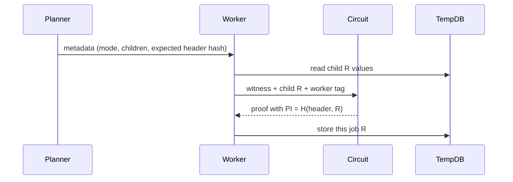

# Reward Tree Circuit Layouts

> Internal developer documentation — repository-only. Not part of the published mdBook (SUMMARY.md).

> Updated: 2026-09-07. Status: Review.

## Terminology

| Term | Meaning |
|---|---|
| H | Network field hash. `H(a,b)` is `two_to_one(a,b)`. |
| Tag | Worker claim tag hashed into every reward-tree node. |
| PI | Circuit public input. Recursive GUTA and coordinator proofs expose `H(header, R)`. |
| R | Reward-tree node value produced by the circuit for this job. |
| Mode | `reward_tree_hash_mode` on `PsyProvingJobMetadata`. |
| CST | Checkpoint state-transition root job (`GenerateRollupStateTransitionProof`, circuit 32). |
| GU / RU / DC / UC | GUTA, register-user, deploy-contract, and update-contract reward subtrees. |
| A | Circuit-63 actual-output commitment. |

## Overview

Every proving job occupies one node of a tagged Merkle tree. The circuit computes a reward node `R` from child reward values and the worker tag, then binds it into the public input as `H(header, R)`. The host planner writes the matching mode and child count into job metadata so workers recompute the same `R` when claiming.

This document is the source-checked layout of those circuit nodes. It supersedes the Chinese reward notes under the external memory tree: those notes swapped modes 0 and 1, omitted mode 4, and placed deploy-contract rewards at `N(3,3)` after update-contract was added.

## Background

The host primitive lives in `parth_core/src/crypto/hash/tag_tree.rs`. The circuit primitive lives in `psy_plonky2_circuits/src/gadgets/tag_tree.rs`. Job metadata and claim metadata both re-derive `R` from the same five modes (`psy_data/src/worker/metadata.rs:8-12`). The coordinator tree offsets that place those nodes in the global reward tree are `psy_data/src/rewards_tree/offsets.rs:52-62`.

## Table of Contents

- [1. Tag-tree primitive](#1-tag-tree-primitive)
- [2. Hash modes](#2-hash-modes)
- [3. Public-input binding](#3-public-input-binding)
- [4. Circuit layouts](#4-circuit-layouts)
- [5. Global reward-tree offsets](#5-global-reward-tree-offsets)
- [6. Host and worker correspondence](#6-host-and-worker-correspondence)
- [7. Security Considerations](#7-security-considerations)
- [Related Documents](#related-documents)

## 1. Tag-tree primitive

A tagged node is two hashes, not one:

```text
hash_tag_tree_node(left, right, tag) = H(H(left, right), tag)
```

Host: `parth_core/src/crypto/hash/tag_tree.rs:31-33`. Circuit: `psy_plonky2_circuits/src/gadgets/tag_tree.rs:4-15`.

Binary tree walk from a leaf preimage:

```text
Level[0][i] = H(H(0, i), Tag[0][i])
Level[n][i] = H(H(Level[n-1][2*i], Level[n-1][2*i+1]), Tag[n][i])
```

That comment is in `tag_tree.rs:19-28`. Proof verification re-applies the same two-hash step at each sibling (`tag_tree.rs:58-77`).

Arity helpers used by circuits:

| Helper | Expansion | Host | Circuit |
|---|---|---|---|
| `hash_tag_tree_node` | `H(H(L,R), tag)` | `tag_tree.rs:31-33` | `tag_tree.rs:4-15` |
| `hash_tag_tree_node_single` | `H(H(L, 0), tag)` | `tag_tree.rs:35-37` | `tag_tree.rs:17-34` |
| `hash_tag_tree_node_three` | `H(H(c0, H(H(c1,c2),tag)), tag)` | `tag_tree.rs:40-43` | `tag_tree.rs:45-64` |
| `hash_tag_tree_node_four` | `H(H(c0, H(H(c1, H(H(c2,c3),tag)), tag)), tag)` | `tag_tree.rs:46-50` | `tag_tree.rs:68-93` |

Three- and four-child helpers are right-nested binary nodes that write intermediate storage keys at the right child and right-right grandchild (`metadata.rs:93-149`).

## 2. Hash modes

Constants in `psy_data/src/worker/metadata.rs:8-12`:

| Mode | Value | Formula for `R` | Typical circuit |
|---|---|---|---|
| `HASH_CHILDREN_STANDARD` | 0 | `H(H(c0, c1), tag)` | Binary GUTA aggregators; RealmFinalizeGUTA |
| `NO_HASH_CHILDREN` | 1 | `H(H(0, 0), tag)` | End-cap leaves; register/deploy leaves |
| `3_CHILDREN_DOUBLE_REWARD` | 2 | `hash_tag_tree_node_three(c0,c1,c2,tag)` | Three-to-one aggregator |
| `LIFT_CHILD` | 3 | `H(H(c0, 0), tag)` | Coordinator GUTA lift; CST wrap of part-1 |
| `4_CHILDREN` | 4 | `hash_tag_tree_node_four(c0,c1,c2,c3,tag)` | AggUserRegisterDeployContractsGUTA |

Mode 0 is the binary inner node. Mode 1 is the leaf. The older memory note reversed those two numbers.

`PsyProvingJobMetadata::get_new_rewards_tag_tree_value` implements the table above (`metadata.rs:49-81`). `get_new_rewards_tag_tree_updates` then materializes the extra intermediate nodes for modes 2 and 4 (`metadata.rs:91-174`):

```text
mode 2: self = H(H(c0, last_two), tag);  right_child = H(H(c1, c2), tag)
mode 4: self = H(H(c0, last_three), tag); right_child = last_three; right_right = last_two
```

Claim metadata (`psy_data/src/worker/proving_work_history.rs:49-87`) matches modes 0, 1, 3, and 4. Its mode-2 expansion is a different nesting (`H(H(c0,c1),tag)` with `H(H(c2,0),tag)`). Job metadata and the circuit helper use `hash_tag_tree_node_three`. Do not mix the two mode-2 expansions.

## 3. Public-input binding

Recursive GUTA proofs expose four public limbs:

```text
PI = H(header_hash, R)
```

`GlobalUserTreeAggregatorHeaderGadget::get_expected_public_inputs_hash` (`psy_plonky2_circuits/src/guta/gadgets/guta_header.rs:149-160`). The host stores `expected_public_inputs_hash` as the header hash only; the worker later tags it with `R` via `compute_reward_tagged_expected_public_inputs` (`metadata.rs:84-87`):

```text
tagged_PI = H(expected_public_inputs_hash, R)
```

Binary GUTA circuits compute `R` and `PI` together (`guta_header.rs:115-137`):

```text
R  = H(H(left_R, right_R), tag)
PI = H(header_hash, R)
```

Leaf helpers reuse that function with zeros:

| Helper | Children passed as | File |
|---|---|---|
| `get_public_inputs_hash_two_end_cap` | `(0, 0)` | `guta_header.rs:180-187` |
| `get_public_inputs_hash_no_children` | `(0, 0)` | `guta_header.rs:189-197` |
| `get_public_inputs_hash_single_child` | `(child_R, 0)` | `guta_header.rs:199-207` |
| `get_public_inputs_hash_right_end_cap` | `(left_R, 0)` | `guta_header.rs:171-178` |
| `get_public_inputs_hash_left_end_cap` | `(0, right_R)` | `guta_header.rs:162-169` |

Coordinator part-1 and CST use the same `H(header, R)` shape with their own headers (`verify_agg_user_registration_deploy_guta.rs:101-129`, `checkpoint_state_transition.rs:57-66`).

## 4. Circuit layouts

```text
worker tag ──┐
child R values ──► tagged node R ──► PI = H(header, R)
```

### 4.1 End-cap leaves (mode 1)

| Circuit | Type | File | Reward children |
|---|---|---|---|
| Two EndCap | 7 `GUTATwoEndCap` | `verify_two_end_cap.rs:119` | `(0, 0)` |
| Single EndCap | 11 `GUTASingleEndCap` | `verify_single_end_cap.rs:105` | `(0, 0)` |

`R = H(H(0, 0), tag)`. The planner writes `PROOF_REWARD_TREE_HASH_MODE_NO_HASH_CHILDREN` (`realm_guta_planner.rs:590`).

### 4.2 Binary GUTA aggregators (mode 0)

| Circuit | Type | File |
|---|---|---|
| Two GUTA | 8 `GUTATwoGUTA` | `verify_two_guta.rs:113-121` |
| Linear GUTA | 57 `GUTATwoGUTALinear` | `verify_guta_linear_transition.rs:98-106` |
| Left GUTA / right EndCap | 13 `GUTAVerifyToCap` | `verify_left_guta_right_end_cap.rs:114-118` |
| Checkpoint-upgrade twins | 55, 56, 58, 59, 60 | `verify_two_guta_upgrade_checkpoint.rs` and siblings |

Each reads `left_R` / `right_R` from the verified child gadgets and calls `get_public_inputs_hash_two_children`. Left-GUTA / right-EndCap zeros the EndCap child's reward (`guta_header.rs:171-178`).

### 4.3 Realm finalize (circuit 63, mode 0)

`RealmFinalizeGUTA` is a binary reward node whose right child is the actual-output commitment, not a second GUTA proof (`realm_finalize_guta.rs:728-740`):

```text
A = public_output_hash(O)
R63 = H(H(root_guta.rewards_tree_value, A), worker_tag)
PI  = H(final_guta_header_hash, R63)
```

The planner marks that job `HASH_CHILDREN_STANDARD` with two children and one dependency: the root GUTA job (`realm_guta_planner.rs:1136-1145`). The worker supplies `root_guta.rewards_tree_value` as `c0`; the circuit supplies `A` as `c1`.

See [RealmFinalizeGUTA BLS Authentication](realm-finalize-bls-auth.md) for the authorization gate around this node.

### 4.4 Coordinator lift (mode 3)

A coordinator GUTA that wraps one realm job uses `LIFT_CHILD` (`coordinator_guta_planner.rs:475-484`):

```text
R = H(H(child_R, 0), tag)
```

That is `get_public_inputs_hash_single_child` / `hash_tag_tree_node_single`.

### 4.5 Part-1 aggregate (circuit 40, mode 4)

`AggUserRegisterDeployContractsGUTA` hashes four child reward values with `hash_tag_tree_node_four_circuit` (`verify_agg_user_registration_deploy_guta.rs:109-129`):

```text
R40 = hash_tag_tree_node_four(GU, RU, DC, UC, tag)
    = H(H(GU, H(H(RU, H(H(DC, UC), tag)), tag)), tag)
PI  = H(part_1_header, R40)
```

The output builder writes mode 4 at global key `N(1, 0)` (`coordinator_output_builder.rs:280-294`):

```text
dependencies = [root_guta, root_register, root_deploy, root_update]
level = 1, index = 0
```

The four children occupy the offsets in section 5.

### 4.6 Checkpoint state transition (circuit 32, mode 3)

CST does not re-hash the four part-1 children. It lifts the part-1 reward value (`checkpoint_state_transition.rs:515-517`, gadget `checkpoint_state_transition_proofs.rs:90`):

```text
R32 = H(H(R40, 0), tag)
```

Chain-commitment public inputs stay reward-independent (`checkpoint_state_transition.rs:449-450`). The worker tag is applied only when the prover updates the witness for the reward-tagged PI.

## 5. Global reward-tree offsets

Authoritative ASCII layout and constants: `psy_data/src/rewards_tree/offsets.rs:6-62`.

```text
N(0, 0)  CST                         circuit 32, mode 3, lifts N(1, 0)
 └── N(1, 0)  AggURDCGUTA            circuit 40, mode 4
      ├── N(2, 0)  GU                realm / coordinator GUTA subtree
      └── N(2, 1)  AggRightTwo
           ├── N(3, 2)  RU           register-user subtree
           └── N(3, 3)  AggRightThree
                ├── N(4, 6)  DC      deploy-contract subtree
                └── N(4, 7)  UC      update-contract subtree
```

| Subtree | Level | Index | Constant |
|---|---|---|---|
| CST | 0 | 0 | implicit root |
| AggURDCGUTA | 1 | 0 | part-1 job metadata |
| GUTA (GU) | 2 | 0 | `GUTA_REWARDS_TREE_OFFSET_ROOT_*` |
| Register users (RU) | 3 | 2 | `REGISTER_USERS_REWARDS_TREE_OFFSET_ROOT_*` |
| Deploy contracts (DC) | 4 | 6 | `DEPLOY_CONTRACTS_REWARDS_TREE_OFFSET_ROOT_*` |
| Update contracts (UC) | 4 | 7 | `UPDATE_CONTRACTS_REWARDS_TREE_OFFSET_ROOT_*` |

`N(1, 1)` is empty. Deploy-contract is not at `N(3, 3)`; that slot is the intermediate that holds DC and UC (`offsets.rs:47-49`).

Planner assignment walks dependencies as a binary tree under each offset (`coordinator_guta_planner.rs:495+`):

```text
child_index = (parent_index << 1) + child_pos
child_level = parent_level + 1
```

A realm subtree under GU uses the same shift: `global_index = (realm_root_index << local_level) + local_index`.

## 6. Host and worker correspondence



The realm worker skips child-value lookup when the job is a leaf or mode 1 (`psy_node_common/src/realm/edge/worker_handler.rs:251-269`). Otherwise it reads each dependency's stored `R` from temp DB, except a CST dependency which contributes zero.

Mode must match the circuit helper that produced `R`. A leaf proven with zeros and later aggregated as a binary child is the intended path: the leaf's `R` becomes `c0` or `c1` of the parent.

## 7. Security Considerations

Reward tags are worker identity in the tree, not authorization of the state transition. Circuit 63 still binds validator-tree membership and the actual output `A` into `R63`; Coordinator BLS admission is a separate gate ([RealmFinalizeGUTA BLS Authentication](realm-finalize-bls-auth.md)).

A mode / arity mismatch between planner metadata and the circuit helper makes `tagged_PI` disagree with the proof and fail closed. Do not "fix" that by rewriting `R` after prove.

Mode 2 has two host expansions. Only `hash_tag_tree_node_three` matches the circuit gadget. Claim-path mode 2 in `proving_work_history.rs:61-69` is a different tree.

## Related Documents

- [RealmFinalizeGUTA BLS Authentication](realm-finalize-bls-auth.md) — circuit 63 authorization and `A`.
- [Gatherers](gatherers.md) — who assigns modes when a cycle finalizes.
- [Processors](processors.md) — who publishes the job tree and commits reward keys.
- [Circuit and Verifier Operations](circuit-and-verifier-operations.md) — cache-pair regeneration after circuit 63 changes.
