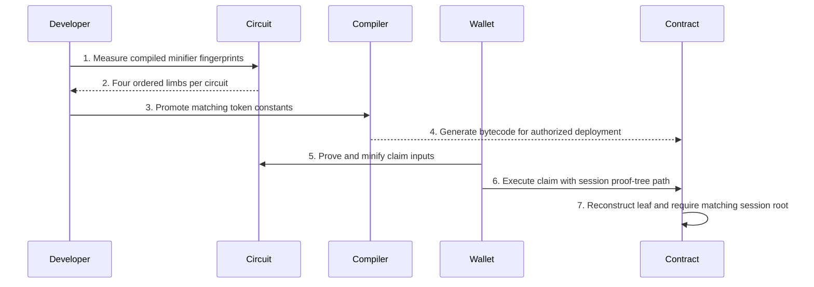

# Token Privacy Circuit Fingerprints

> Internal developer documentation — repository-only. Not part of the published mdBook (SUMMARY.md).

> Updated: 2026-09-07. Status: Review.

## Overview

`private_claim` and `claim_deposit` on the PSY token and USDT token contracts do not verify a Plonky2 proof. They reconstruct one UPS session-proof-tree leaf as `hash_two_to_one(circuit_fingerprint, public_inputs_hash)` and walk 16 Poseidon levels to `get_session_proof_tree_root()`. The four-limb constants `private_note_inclusion_fingerprint` and `shield_claim_fingerprint` are the **minifier** fingerprints of `PrivateNoteInclusionCircuit` and `DepositInclusionCircuit`. `DepositInclusionCircuit` is the compiled circuit; `ShieldDepositClaimCircuit` is a type alias for it (`client_prover/psy_circuit/psy_dpn_circuit/src/circuits/privacy/deposit_inclusion.rs:332`). Changing those circuits, the gadgets they share, their minifier chain, or the heights baked into them requires copying new limbs into both precompile contracts and matching compiled tests, then regenerating compiler/Genesis outputs only where their separate triggers apply.

## Background

The contracts cannot embed a full Plonky2 verifier. The UPS session proof tree already commits to `(circuit_fingerprint, public_inputs_hash)` when the wallet inserts the external proof. The contract therefore only needs the same fingerprint the minifier advertises. A stale constant produces `proof tree root mismatch` on an otherwise valid claim. `psy-services` does not store a second copy of the limbs: it constructs the same circuits from its pinned `psy-node` revision. The compiler pin, Genesis bytecode, wallet `local_circuits.json`, and services pin must still refer to one `R_node`.

## Table of Contents

- [Terminology](#terminology)
- [1. Authority and Operational Boundary](#1-authority-and-operational-boundary)
- [2. Binding Model](#2-binding-model)
- [3. Which Circuit Changes Require an Update](#3-which-circuit-changes-require-an-update)
  - [3.1 `private_note_inclusion_fingerprint`](#31-private_note_inclusion_fingerprint)
  - [3.2 `shield_claim_fingerprint`](#32-shield_claim_fingerprint)
  - [3.3 Shared Changes That Update Both](#33-shared-changes-that-update-both)
  - [3.4 Non-Triggers](#34-non-triggers)
- [4. Related Locksteps That Are Not the Fingerprint](#4-related-locksteps-that-are-not-the-fingerprint)
- [5. Measure](#5-measure)
- [6. Promote](#6-promote)
- [7. Downstream Delivery](#7-downstream-delivery)
- [8. Verification](#8-verification)
- [9. File Impact](#9-file-impact)
- [10. Failure Handling](#10-failure-handling)

## Terminology

| Term | Definition |
|---|---|
| `private_note_inclusion_fingerprint` | Four Goldilocks limbs burned into `private_claim`. Constant name used in both token contracts. |
| `shield_claim_fingerprint` | Four Goldilocks limbs burned into `claim_deposit`. Constant name used in both token contracts. |
| `PrivateNoteInclusionCircuit` | Compiled note-inclusion circuit. Source: `private_note_inclusion.rs`. |
| `DepositInclusionCircuit` | Compiled shield-deposit circuit. Source: `deposit_inclusion.rs`. |
| `ShieldDepositClaimCircuit` | Type alias of `DepositInclusionCircuit` (`client_prover/psy_circuit/psy_dpn_circuit/src/circuits/privacy/deposit_inclusion.rs:332`). Protocol/UPS import name via `privacy::shield_deposit_claim` (`client_prover/psy_circuit/psy_dpn_circuit/src/circuits/privacy/mod.rs:1-2`). |
| Minifier fingerprint | `QStandardCircuit::get_fingerprint()` of the minified circuit, not the wallet base/inner circuit. |
| `R_node` | The frozen, pushed `psy-node` source revision used for compiler and services Cargo pins. |
| PI preimage | Ordered field list hashed into `public_inputs_hash` inside the circuit. |

`client_prover/psy_circuit/psy_dpn_circuit/src/circuits/privacy/shield_deposit_claim.rs` is **not** declared in `privacy/mod.rs` and is not compiled. Do not measure, edit, or copy limbs from that file.

## 1. Authority and Operational Boundary

1. Run node commands from `<repo-root>` and compiler commands from `<workspace>/psy-compiler`. Repository documentation must not contain workstation paths.
2. Current Audit source is the governing reference. The applicability gate and repository cohort are at `AGENTS.md`.
3. These two constants live in `psy-compiler` source. They are not in `cached_circuit_library.rs`, EndCap verifier JSON, or any Groth16 keystore file.
4. Copy limbs from a successful measurement of the **compiled** circuits on current `psy-node` source. Do not copy historical values from this document, a previous commit message, or the uncompiled `shield_deposit_claim.rs`.
5. `token/src/main.psy` and `usdt_token/src/main.psy` must remain identical for both constants. Updating one file and leaving the other is invalid.
6. `psy-services` derives both expected fingerprints from the compiled circuits (`<workspace>/psy-services/src/indexer/nostr/proof_verifier.rs:130-135,224-234`), rather than keeping a second hardcoded array. Pinning services to a different `R_node` than the contracts is invalid even when the `.psy` files were updated.

## 2. Binding Model



```text
PrivateNoteInclusionCircuit / DepositInclusionCircuit
        |  get_fingerprint() = minifier_chain.get_fingerprint()
        v
compiled psy_dpn_circuit test print / expected [u64; 4]
        |  verbatim copy
        v
token.psy + usdt_token.psy
        |  make gen-deploy-json
        v
psy-genesis/token.json, token.update.json, genesis_contracts.json
        |  Genesis trigger when genesis_contracts.json content changed
        v
on-chain claim methods reconstruct
leaf = hash_two_to_one(fingerprint, public_inputs_hash)
        |  16 Poseidon levels (UPS_SESSION_PROOF_TREE_HEIGHT)
        v
assert equal to get_session_proof_tree_root()
```

The leaf formula is `hash_two_to_one` of the burned fingerprint and the contract-side `public_inputs_hash` (`<workspace>/psy-compiler/psy-precompiles/token/src/main.psy:358-365,625-631`). The walk is `for i in 0u32..16u32` (`<workspace>/psy-compiler/psy-precompiles/token/src/main.psy:366-376,633-643`). `UPS_SESSION_PROOF_TREE_HEIGHT` is 16 (`client_prover/psy_core/psy_config/src/network_constants.rs:39`).

`PrivateNoteInclusionCircuit::get_fingerprint` returns the minifier fingerprint (`client_prover/psy_circuit/psy_dpn_circuit/src/circuits/privacy/private_note_inclusion.rs:367-373`). `DepositInclusionCircuit::get_fingerprint` does the same (`client_prover/psy_circuit/psy_dpn_circuit/src/circuits/privacy/deposit_inclusion.rs:315-316`). UPS imports the alias: `privacy::{..., shield_deposit_claim::ShieldDepositClaimCircuit}` (`client_prover/psy_circuit/psy_ups_circuit/src/circuit_manager/core.rs:44-46,196-198`). The wallet proves a base/inner circuit; the UPS manager minifies it. The contract constant is the **minifier** fingerprint, which is what the session proof-tree leaf uses.

These circuits are not coordinator library types. Regenerating `cached_circuit_library.rs` does not change either constant.

## 3. Which Circuit Changes Require an Update

Update **only the affected constant**, in **both** token contracts and the matching **compiled** test expected value.

### 3.1 `private_note_inclusion_fingerprint`

Update when the constructed

```text
PrivateNoteInclusionCircuit::new(
    GLOBAL_USER_TREE_HEIGHT,
    GLOBAL_CONTRACT_TREE_HEIGHT,
    TOKEN_CONTRACT_STATE_TREE_HEIGHT,
    PRIVATE_NOTE_TREE_HEIGHT,
)
```

changes shape. Current construction is `client_prover/psy_circuit/psy_dpn_circuit/src/circuits/privacy/private_note_inclusion.rs:250-274` and the UPS manager copy at `client_prover/psy_circuit/psy_ups_circuit/src/circuit_manager/core.rs:185-193`.

| Changed input | Update this fingerprint? |
|---|---|
| `private_note_inclusion.rs` constraints, gates, gadget wiring, registered PI, minifier step count, or `pad_circuit_degree` | Yes |
| `slot_value_in_contract_state.rs` (user / contract / contract-state Merkle gadgets used by the note circuit) | Yes |
| `MerkleProofGadget` used by the note circuit | Yes |
| `GLOBAL_USER_TREE_HEIGHT` (32), `GLOBAL_CONTRACT_TREE_HEIGHT` (24), `PRIVATE_NOTE_TREE_HEIGHT` (20) | Yes |
| `TOKEN_CONTRACT_STATE_TREE_HEIGHT` generated from `psy-genesis/genesis_contracts.json` token `code_definition.state_tree_height` (`client_prover/psy_core/psy_config/build.rs:219-262`) | Yes |
| Minifier implementation `PsyProofMinifierChain`, `ComparisonGate(32, 16)`, `CircuitConfig::standard_recursion_config`, Poseidon hasher, or `add_psy_type_b_common_gates` | Yes |
| `PrivateNoteInclusionInnerCircuit` base-only wiring that the minifier wraps (must stay byte-identical to the minifier base) | Yes; also regenerate `local_circuits.json` |

Do **not** update this constant for EndCap lookalikes (types 6/7/10/11), GUTA, coordinator circuits, `RealmFinalizeGUTA`, Bridge Groth16, worker whitelist, or token methods other than `private_claim` PI / fingerprint.

### 3.2 `shield_claim_fingerprint`

Update when `DepositInclusionCircuit::new()` changes shape (`client_prover/psy_circuit/psy_dpn_circuit/src/circuits/privacy/deposit_inclusion.rs`). That constructor takes no network height arguments. It bakes `DEPOSIT_TREE_HEIGHT = 32` (`client_prover/psy_circuit/psy_dpn_circuit/src/circuits/privacy/deposit_inclusion.rs:28,109-118`). `ShieldDepositClaimCircuit` is the same type.

| Changed input | Update this fingerprint? |
|---|---|
| `deposit_inclusion.rs` constraints, gates, gadget wiring, registered PI, minifier, or `pad_circuit_degree` | Yes |
| `DEPOSIT_TREE_HEIGHT` in that file, or `MerkleProofGadget` used for the deposit inclusion proof | Yes |
| Shared minifier / hasher / `CircuitConfig` / common gates listed in §3.1 | Yes |
| `TOKEN_CONTRACT_STATE_TREE_HEIGHT`, `GLOBAL_USER_TREE_HEIGHT`, `GLOBAL_CONTRACT_TREE_HEIGHT`, `PRIVATE_NOTE_TREE_HEIGHT` | No |
| EndCap, GUTA, coordinator, RealmFinalizeGUTA, Bridge Groth16 | No |
| Uncompiled `privacy/shield_deposit_claim.rs` | No. That file is not in the crate. |

`psy-services` Nostr deposit-proof admission also constructs `DepositInclusionCircuit::new()`. It is the same compiled circuit as `shield_claim_fingerprint`, not a third circuit.

### 3.3 Shared changes that update both

A change to `MerkleProofGadget`, `PsyProofMinifierChain`, `ComparisonGate`, `pad_circuit_degree`, `CircuitConfig::standard_recursion_config`, or Poseidon hashing used by both compiled circuits updates **both** constants. Measure both tests. Copy both four-limb arrays. Do not assume one stayed the same.

### 3.4 Non-triggers

| Change | Fingerprint action |
|---|---|
| EndCap verifier JSON, localhost EndCap `[u64; 4]`, or `cached_circuit_library.rs` / `cached_common_data.rs` | None. Follow [circuit-and-verifier-operations.md](circuit-and-verifier-operations.md) instead. |
| GUTA whitelist root or coordinator circuit registration | None |
| Bridge aggregation / deposit-append / withdrawal-claim Groth16 | None |
| `function_whitelist_root` / `scripts/update_genesis_whitelist_roots.sh` | None. That is the contract function-tree root, not these circuit fingerprints. |
| Worker whitelist in `psy-genesis/config.json` | None |
| Token method bodies that do not touch the four-limb constant or the PI `hash([...])` list | None |

## 4. Related Locksteps That Are Not the Fingerprint

These are not the two fingerprint constants. They must still stay in lockstep with the same circuit change, or claims fail for a different reason.

1. **PI preimage.** The contract `hash([...])` argument list must match the **compiled** circuit `hash_n_to_hash_no_pad` preimage, field-for-field, in order.
   - Private note: circuit at `client_prover/psy_circuit/psy_dpn_circuit/src/circuits/privacy/private_note_inclusion.rs:151-168`; contract at `<workspace>/psy-compiler/psy-precompiles/token/src/main.psy:616-624`. Fields: owner/receiver (4), amount, user_tree_root (4), checkpoint_id, note_root_slot, token_contract_id, nullifier (4).
   - Shield claim: circuit at `client_prover/psy_circuit/psy_dpn_circuit/src/circuits/privacy/deposit_inclusion.rs:121-164`; contract at `<workspace>/psy-compiler/psy-precompiles/token/src/main.psy:344-357`. Fields: shield_address (4), amount words (8), token_address words (8), l2_token_contract_id words (8), source_chain_index, deposit_root (4), nullifier (4), note_commitment (4), deposit_index. Copy from `client_prover/psy_circuit/psy_dpn_circuit/src/circuits/privacy/deposit_inclusion.rs`, not from uncompiled `client_prover/psy_circuit/psy_dpn_circuit/src/circuits/privacy/shield_deposit_claim.rs`.
2. **Proof-tree height.** The `for i in 0u32..16u32` loops must equal `UPS_SESSION_PROOF_TREE_HEIGHT`. Changing that height is a contract-source change in both methods of both files, independent of the fingerprint limbs.
3. **`note_root_slot`.** `private_claim` currently requires `2147483649` (`<workspace>/psy-compiler/psy-precompiles/token/src/main.psy:652`). That is a slot-id check, not a fingerprint.
4. **Wallet bundle.** Source, serialization version, or circuit-defining height changes to these privacy circuits trigger `make generate-local-circuits` ([circuit-and-verifier-operations.md](circuit-and-verifier-operations.md) §6.2).
5. **`psy-services` `NOTE_TREE_HEIGHT`.** `<workspace>/psy-services/src/indexer/nostr/proof_verifier.rs:36` is a local `20` that must equal `PRIVATE_NOTE_TREE_HEIGHT`. Services constructs `PrivateNoteInclusionCircuit` at `<workspace>/psy-services/src/indexer/nostr/proof_verifier.rs:224-228`. After a height change, pin services to the same `R_node` and keep that local constant equal.

## 5. Measure

Run both compiled tests from `<repo-root>` on the intended `R_node`, even when only one circuit changed. Do **not** pass `--exact` with the leaf function name; libtest `--exact` requires the full module path and matches zero tests otherwise.

```bash
cargo test --release -p psy_dpn_circuit \
  test_private_note_inclusion_circuit_builds -- --nocapture

cargo test --release -p psy_dpn_circuit \
  deposit_inclusion_circuit_builds -- --nocapture
```

Require:

1. The note test prints `fingerprint:` then a `QHashOut` (`client_prover/psy_circuit/psy_dpn_circuit/src/circuits/privacy/private_note_inclusion.rs:699-702`) and currently `assert_eq`s the four limbs that must equal `private_note_inclusion_fingerprint`.
2. The deposit test prints `deposit inclusion fingerprint:` (`client_prover/psy_circuit/psy_dpn_circuit/src/circuits/privacy/deposit_inclusion.rs:454-459`). If that test does not yet `assert_eq` the four limbs to `shield_claim_fingerprint`, add that assertion in the same atomic set as the contract constants so the next change cannot drift.
3. After promotion, both compiled tests' expected/printed four limbs, both `.psy` constants, and `circuit.get_fingerprint()` are the same four decimal `u64` values in the same order.
4. Copy limbs from `QHashOut::from_values(a, b, c, d)` / the four ordered field elements in index order `0..3`. Do not convert a hex display hash, reorder limbs, or drop a limb to `u32`.
5. Ignore any expected value in uncompiled `shield_deposit_claim.rs`.

If a test fails, the printed `actual` is the measurement. Use that `actual`. Then update the compiled test expected value in the same change as the contracts.

`PSY_CONFIG_PATH` / `PSY_NETWORK` affect `TOKEN_CONTRACT_STATE_TREE_HEIGHT` through `psy_config`'s build script. Measure with the same config the release `R_node` compiles against (repo-root `psy-genesis/config.json` and `psy-genesis/genesis_contracts.json`).

## 6. Promote

Treat this as one atomic set. A partial update is invalid.

1. Replace `private_note_inclusion_fingerprint` and/or `shield_claim_fingerprint` in:
   - `<workspace>/psy-compiler/psy-precompiles/token/src/main.psy`
   - `<workspace>/psy-compiler/psy-precompiles/usdt_token/src/main.psy`
2. Replace the matching expected values in the **compiled** tests:
   - `client_prover/psy_circuit/psy_dpn_circuit/src/circuits/privacy/private_note_inclusion.rs` (`test_private_note_inclusion_circuit_builds`)
   - `client_prover/psy_circuit/psy_dpn_circuit/src/circuits/privacy/deposit_inclusion.rs` (`deposit_inclusion_circuit_builds`; add `assert_eq` if missing)
3. If §4 item 1 applies, replace the `hash([...])` argument lists in both token files from the compiled circuit preimage.
4. If §4 item 2 applies, replace both `0u32..16u32` loops to the new height in both token files.
5. If §6.2 of [circuit-and-verifier-operations.md](circuit-and-verifier-operations.md) triggers, run `make generate-local-circuits` and commit `client_prover/psy_prover/src/wallet/local_circuits.json` with the circuit source.
6. Re-run both measurement tests. Require pass.
7. Freeze and push `R_node` before compiler or services pins move (`AGENTS.md` release DAG).

Do not edit `DUMMY_END_CAP_ALT_VERIFIER_DATA_SERIALIZED`, EndCap fingerprints, Groth16 Solidity verifiers, or uncompiled `shield_deposit_claim.rs` as part of this set.

## 7. Downstream Delivery

Follow the applicability gate. This class is a compiler / precompile / Genesis change.

From `<workspace>/psy-compiler`, after the compiler Cargo pins use pushed `R_node`:

```bash
make gen-deploy-json
```

That target compiles both token variants, copies `token.json` and `token.update.json` into `psy-genesis`, regenerates `genesis_contracts.json` and `genesis_abi/`, and writes compiler provenance (`<workspace>/psy-compiler/Makefile:213-255`). Require the generated `token.json` / `token.update.json` / `usdt_token.json` bytecode to contain the new limbs.

Then:

1. If `psy-genesis/genesis_contracts.json` content changed, run Genesis generation per [circuit-and-verifier-operations.md](circuit-and-verifier-operations.md) §6.1.
2. Pin `psy-services` to the same pushed `R_node`. Do not add a hardcoded fingerprint there.
3. For a new local chain, the next authorized purge restart loads the new Genesis bytecode. Fingerprint-only source edits do not take effect on an already-deployed token until `update_contract` with `token.update.json` (or an equivalent authorized redeploy).
4. `claim_deposit` and `private_claim` on a live chain with previously deployed bytecode keep the previously deployed fingerprints. Mixing new wallet proofs with that bytecode fails closed at `proof tree root mismatch`.

## 8. Verification

1. Both compiled `psy_dpn_circuit` tests in §5 pass on `R_node`.
2. The four new decimal limbs appear in `token/src/main.psy`, `usdt_token/src/main.psy`, and the matching compiled test expected values, and the previous limbs are gone from those four places.
3. `make gen-deploy-json` completed on compiler HEAD pinned to that `R_node`.
4. A real `private_claim` (when the note circuit changed) and/or a real `claim_deposit` (when the deposit-inclusion circuit changed) is included as an EndCap. `proof tree root mismatch` is a release failure.
5. `psy-services` Nostr verification of the corresponding proof type succeeds against the same `R_node` pin (`<workspace>/psy-services/src/indexer/nostr/proof_verifier.rs:217-236` for private transfer).

Compilation of the `.psy` files or HTTP admission of an EndCap without the matching claim method is not evidence.

## 9. File Impact

| Action | Path | Trigger |
|---|---|---|
| Manual replace | `<workspace>/psy-compiler/psy-precompiles/token/src/main.psy` | Affected fingerprint and/or PI list |
| Manual replace | `<workspace>/psy-compiler/psy-precompiles/usdt_token/src/main.psy` | Same values as token |
| Manual replace | `client_prover/psy_circuit/psy_dpn_circuit/src/circuits/privacy/private_note_inclusion.rs` | Note-circuit measurement expected value |
| Manual replace | `client_prover/psy_circuit/psy_dpn_circuit/src/circuits/privacy/deposit_inclusion.rs` | Deposit-inclusion measurement expected value |
| Generated replace | `client_prover/psy_prover/src/wallet/local_circuits.json` | §6.2 trigger only |
| Generated replace | `psy-genesis/token.json`, `token.update.json`, `genesis_contracts.json`, `genesis_abi/` | `make gen-deploy-json` |
| Conditional | root `genesis.json` | §6.1 trigger only |
| Pin replace | `<workspace>/psy-compiler/Cargo.toml` and `<workspace>/psy-services/Cargo.toml` | Same pushed `R_node` |

## 10. Failure Handling

| Failure | Required response |
|---|---|
| Test `actual` differs from contract constant | Copy `actual` into the compiled tests **and** both `.psy` files; do not change the circuit to match a stale constant |
| Only `token.psy` updated | Stop; update `usdt_token` to the same limbs |
| Test expected updated but contracts not, or the reverse | Restore one atomic set; restart §5–§6 |
| Limbs copied from uncompiled `shield_deposit_claim.rs` | Discard; re-measure `deposit_inclusion_circuit_builds` |
| `local_circuits.json` regenerated without the fingerprint constants, or the reverse when both triggered | Restore; treat wallet bundle and contract constants as one release unit with the circuit source |
| `make gen-deploy-json` not run after `.psy` edits | Do not claim Genesis or on-chain bytecode is current |
| Services pin lags `R_node` | Do not treat Nostr `proof_verified` as evidence |
| Claim logs `proof tree root mismatch` | Fail the release; do not weaken the assert |
| Cached library or EndCap JSON edited "to match" | Discard those unrelated edits; this procedure does not own them |

The rollback unit is: both `.psy` fingerprint (and PI) edits, both compiled test expected values, `local_circuits.json` when triggered, compiler-generated Genesis token artifacts from one `gen-deploy-json` run, and the compiler/services pins to one `R_node`. Partial rollback is forbidden.

## Security Considerations

Preserve matching source revisions, configuration, and generated artifact cohorts. Never publish root `private_keys.json` or validator/faucet secrets. Generation does not authorize deployment or publication. Treat fingerprint, provenance, and membership mismatches as failures rather than bypassing verification.

## Related Documents

- [Circuit and verifier operations](circuit-and-verifier-operations.md)
- [Devnet launcher reference](devnet-launcher-reference.md)
- [Devnet lifecycle](devnet_lifecycle.md)
- [Fn circuit fingerprint playbook](fn-circuit-fingerprint-playbook.md)
- [Genesis generation](genesis-generation.md)
- [Realm p2p validators](realm-p2p-validators.md)
