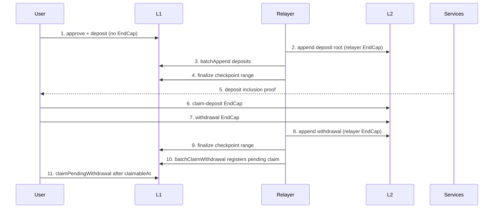

# Bridge Common Operations

> Status: Approved. Updated: 2026-09-02.

This guide is the executable local-devnet procedure for one L1 deposit, one L2 claim-deposit, one L2 withdrawal, and relayer settlement. Run every command from `<repo-root>`. Replace only angle-bracket values. Never place a real private key or wallet password in this document, a result file, or a shell history shared with other users.

## Terminology

- **L1**: the local EVM chain.
- **L2**: the Psy chain.
- **EndCap**: a proven L2 user-state transition submitted to a realm.
- **PSY**: the L2 fee token.
- **RPC**: JSON remote procedure call.

## State flow



```text
L1 deposit recorded
  -> L2 deposit root appended
  -> L1 provedDepositCount advanced
  -> checkpoint finalized
  -> deposit proof available
  -> L2 claim-deposit EndCap confirmed
  -> L2 withdrawal EndCap confirmed
  -> L2 withdrawal appended
  -> checkpoint finalized
  -> L1 pending withdrawal registered
  -> claimableAt reached
  -> recipient calls claimPendingWithdrawal and receives tokens
```

A plain `psy_user_cli deposit` is an L1 transaction and is **not** an EndCap. `claim-deposit` and `withdraw` each produce a real EndCap and wait up to 180 seconds for inclusion (`client_prover/psy_cli/psy_user_cli/src/subcommand/claim_deposit.rs:548-599`, `client_prover/psy_cli/psy_user_cli/src/subcommand/withdraw.rs:132-170`). The relayer runs the append, proof, finalize, and L1 batch-claim phases (`psy_cli/psy_relayer_cli/src/bridge/daemon.rs:619-998`).

## 1. Start and prove readiness

Use only the repository lifecycle targets. In a dedicated supervisor terminal:

```bash
PURGE=1 make shutdown
make run-all
```

Keep `make run-all` in the foreground; it intentionally remains alive as the service supervisor (`Makefile:63-66`, `dev/locSetupV4.ts:5630-5635`). Run readiness checks and every later command from a second terminal whose current directory is `<repo-root>`. Do not background or abandon the supervisor. The supervisor truncates the relayer logs for this initial launch (`dev/locSetupV4.ts:649-658,4542-4549`), so the marker below belongs to the current process. Do not continue until all checks below succeed:

```bash
curl -fsS http://127.0.0.1:3000/health

curl -fsS -X POST http://127.0.0.1:1337 \
  -H 'content-type: application/json' \
  --data '{"jsonrpc":"2.0","id":1,"method":"psy_get_latest_checkpoint_id","params":[]}'

curl -fsS -X POST http://127.0.0.1:13380 \
  -H 'content-type: application/json' \
  --data '{"jsonrpc":"2.0","id":1,"method":"psy_get_latest_checkpoint_id","params":[]}'

grep -a 'bridge relayer started' logs/bridge_relayer_errs.txt
```

The setup waits for services health and recognizes the stable relayer marker `bridge relayer started` (`dev/locSetupV4.ts:1141-1144,3676-3677,4418-4424`). Coordinator and realm RPC methods use the `psy_` prefix (`client_prover/psy_provider/src/request.rs:68-100`).

`make run-all` generates `local_checkpoints/bridge_proposer/daemon.toml` and starts the current relayer daemon through this CLI surface (`dev/locSetupV4.ts:4519-4551`):
```bash
./target/release/psy_relayer_cli \
  --config local_checkpoints/bridge_proposer/daemon.toml
```

The lifecycle target owns that process. The command is shown to identify the active `psy_relayer_cli` surface; do not launch a second copy. The relayer does not support `--result-file`; its durable operational state is `local_checkpoints/bridge_proposer/daemon_state.toml`, its stdout log is `logs/bridge_relayer_logs.txt`, and tracing markers are in `logs/bridge_relayer_errs.txt` (`dev/locSetupV4.ts:3832-3837`, `psy_cli/psy_relayer_cli/src/main.rs:23-31`, `psy_cli/psy_relayer_cli/src/bridge/daemon.rs:568-599`).

## 2. Discover this startup's addresses

Local addresses change after deployment. Read the generated summary after every startup; never copy addresses from an earlier run. The deployment exporter writes this file and includes the core contracts and token metadata (`psy-contracts/deploy/008_export_deployed_contracts.ts:52-118`).

```bash
export DEPLOYMENTS='<repo-root>/psy-contracts/deployments/localhost/deployed-contracts.json'

test -s "$DEPLOYMENTS"
export BRIDGE="$(jq -r '.core.Bridge // .contracts.Bridge' "$DEPLOYMENTS")"
export STATE_MANAGER="$(jq -r '.core.StateManager // .contracts.StateManager' "$DEPLOYMENTS")"
export ROUTER="$(jq -r '.core.Router // .contracts.Router' "$DEPLOYMENTS")"
export EXPORTED_ERC20_GATEWAY="$(jq -r '.core.ERC20Gateway // .contracts.ERC20Gateway' "$DEPLOYMENTS")"
export USDT="$(jq -r '.protocol.tokens.USDT.l1Address' "$DEPLOYMENTS")"
export USDT_L2_CONTRACT_ID="$(jq -r '.protocol.tokens.USDT.l2TokenContractId' "$DEPLOYMENTS")"
export L1_RPC_URL='http://127.0.0.1:8545'
export ERC20_GATEWAY="$(cast call "$ROUTER" 'tokenToGateway(address)(address)' "$USDT" --rpc-url "$L1_RPC_URL")"
test "$ERC20_GATEWAY" != '0x0000000000000000000000000000000000000000' || ERC20_GATEWAY="$EXPORTED_ERC20_GATEWAY"
export SERVICES_URL='http://127.0.0.1:3000'
export RPC_CONFIG='<repo-root>/psy-genesis/config.json'
export RESULT_DIR='<tmp>/psy-bridge-common-operations'
mkdir -p "$RESULT_DIR"

printf 'Bridge=%s\nStateManager=%s\nRouter=%s\nERC20Gateway=%s\nUSDT=%s\nUSDT L2 contract=%s\n' \
  "$BRIDGE" "$STATE_MANAGER" "$ROUTER" "$ERC20_GATEWAY" "$USDT" "$USDT_L2_CONTRACT_ID"
```

Stop if any value is empty or `null`.

## 3. Set one user and small amounts

Use a normal devnet user, not the relayer identity. Keep L2 operations for this user strictly serial. Choose fresh `R0`, `R1`, note-secret limbs, nullifier-secret limbs, and withdrawal nonce for every run.

```bash
export USER_PRIVATE_KEY='<user-l1-private-key>'
export USER_L1_ADDRESS="$(cast wallet address "$USER_PRIVATE_KEY")"
export DEPOSIT_AMOUNT='2000'
export WITHDRAW_AMOUNT='1000'
export PSY_GAS_AMOUNT='10000000000'
export SOURCE_CHAIN_INDEX='0'

eval "$(python3 - <<'PY'
import secrets
prime = 18446744069414584321
values = [secrets.randbelow(prime - 1) + 1 for _ in range(10)]
print(f"export R0='{values[0]}'")
print(f"export R1='{values[1]}'")
print("export NOTE_SECRET='" + ",".join(map(str, values[2:6])) + "'")
print("export NULLIFIER_SECRET='" + ",".join(map(str, values[6:10])) + "'")
print("export WITHDRAWAL_NONCE='0x" + secrets.token_hex(32) + "'")
PY
)"
```
For local USDT, `2000` is `0.002` USDT and `1000` is `0.001` USDT. Small values reduce proof and liquidity surprises. `claim-deposit` and `withdraw` both consume L2 PSY fees; L1 token ownership does not pay L2 gas. The canonical Bridge campaign reference is [PsyProtocol/psy-memory Bridge E2E](https://github.com/PsyProtocol/psy-memory/blob/main/src/repositories/parth-generic-v1/e2e/bridge.md), especially its amount, L2 gas, and same-user serial-operation rules.


## 4. Register the user and wait for the user ID

`register-user` returns `pending` when it submits a new registration and `registered` when the key already exists. `get-user-id` returns a structured `not_registered` state rather than treating it as a transport failure (`client_prover/psy_cli/psy_user_cli/src/subcommand/register_user.rs:15-46`, `client_prover/psy_cli/psy_user_cli/src/subcommand/get_user_id.rs:9-30`).

```bash
./target/release/psy_user_cli \
  --result-file "$RESULT_DIR/register-user.json" \
  register-user \
  --sign-type zk \
  --private-key "$USER_PRIVATE_KEY" \
  --rpc-config "$RPC_CONFIG"

export USER_PUBLIC_KEY="$(jq -r '.public_key_hash' "$RESULT_DIR/register-user.json")"

for attempt in $(seq 1 60); do
  ./target/release/psy_user_cli \
    --result-file "$RESULT_DIR/get-user-id.json" \
    get-user-id \
    --pub-key "$USER_PUBLIC_KEY" \
    --rpc-config "$RPC_CONFIG"
  USER_ID="$(jq -r '.user_id // empty' "$RESULT_DIR/get-user-id.json")"
  test -n "$USER_ID" && break

  sleep 2
done

test -n "${USER_ID:-}"
export USER_ID
jq -e '.status == "registered" and (.user_id != null)' "$RESULT_DIR/get-user-id.json"
```

```bash
./target/release/psy_user_cli \
  --result-file "$RESULT_DIR/note-owner.json" \
  derive-note-owner \
  --private-key "$USER_PRIVATE_KEY" \
  --rpc-config "$RPC_CONFIG" \
  --random0 "$R0" \
  --random1 "$R1"
export SHIELD_ADDRESS="$(jq -r '.note_owner' "$RESULT_DIR/note-owner.json")"
```

`derive-note-owner` resolves the same registered user and computes the bytes32 shield address from `R0` and `R1`; its structured `note_owner` is safe to use as the services query key (`client_prover/psy_cli/psy_user_cli/src/subcommand/shield_address.rs:65-104`).

The global `--result-file` is atomically published only on success and contains secret-free command results (`client_prover/psy_cli/psy_user_cli/src/subcommand/mod.rs:47-54`, `client_prover/psy_cli/psy_user_cli/src/result.rs:299-372`).

## 5. Fund L2 PSY gas — real EndCap

This is the first same-user L2 state transition. Wait for confirmation before doing any later L2 operation.

```bash
./target/release/psy_user_cli \
  --result-file "$RESULT_DIR/mint-psy.json" \
  call \
  --sign-type zk \
  --private-key "$USER_PRIVATE_KEY" \
  --rpc-config "$RPC_CONFIG" \
  --contract-id 0 \
  --method-name simple_mint \
  --inputs "[$PSY_GAS_AMOUNT]" \
  --wait-until-confirmation

jq -e '.status == "confirmed" and (.confirmed_checkpoint != null)' "$RESULT_DIR/mint-psy.json"
```

Do not start `deposit`, `claim-deposit`, or `withdraw` in parallel with this command.

## 6. Approve the gateway and submit the L1 deposit — not an EndCap

Approve only the resolved ERC20Gateway, then submit exactly one deposit. Router dispatches the request, but ERC20Gateway is the token spender and calls `safeTransferFrom(depositor, bridge, amount)` (`psy-contracts/src/Router.sol:64-87`, `psy-contracts/src/ERC20Gateway.sol:62-82`). The CLI derives the shield address and note commitment from the user ID and fresh material (`client_prover/psy_cli/psy_user_cli/src/subcommand/deposit.rs:64-180`).

```bash
export FINALIZED_BEFORE_DEPOSIT="$(cast call "$STATE_MANAGER" 'lastFinalizedCheckpointId()(uint64)' --rpc-url "$L1_RPC_URL" | awk '{print $1}')"

cast send "$USDT" 'approve(address,uint256)' "$ERC20_GATEWAY" "$DEPOSIT_AMOUNT" \
  --rpc-url "$L1_RPC_URL" --private-key "$USER_PRIVATE_KEY"

./target/release/psy_user_cli \
  --result-file "$RESULT_DIR/deposit.json" \
  deposit \
  --l1-rpc-url "$L1_RPC_URL" \
  --private-key "$USER_PRIVATE_KEY" \
  --router-address "$ROUTER" \
  --token "$USDT" \
  --amount "$DEPOSIT_AMOUNT" \
  --rpc-config "$RPC_CONFIG" \
  --source-chain-index "$SOURCE_CHAIN_INDEX" \
  --l2-token-contract-id "$USDT_L2_CONTRACT_ID" \
  --user-id "$USER_ID" \
  --r0 "$R0" \
  --r1 "$R1" \
  --note-secret "$NOTE_SECRET" \
  --nullifier-secret "$NULLIFIER_SECRET" \
  --deposit-proof-output "$RESULT_DIR/deposit-proof.json"

jq -e '.status == "confirmed" and (.transaction_hash != null)' "$RESULT_DIR/deposit.json"
export DEPOSIT_INDEX="$(jq -r '.deposit_index' "$RESULT_DIR/deposit-proof.json")"
test "$DEPOSIT_INDEX" != 'null'
```

`--deposit-proof-output` is optional at the deposit interface, but it is required for the file-based `claim-deposit` command used below. With this flag, the deposit command waits up to 600 seconds for relayer proof readiness and then writes the sender-generated inclusion proof (`client_prover/psy_cli/psy_user_cli/src/subcommand/deposit.rs:636-676`, `client_prover/psy_cli/psy_user_cli/src/subcommand/deposit.rs:1072-1107`). If the receiver uses Nostr recovery, also pass `--recipient-npub <receiver-npub>`; the CLI publishes separate proof and encrypted-secret events (`client_prover/psy_cli/psy_user_cli/src/subcommand/deposit.rs:802-904`). Never rerun `deposit` to retry proof generation: that records a new L1 deposit.

## 7. Observe relayer deposit append and finalize

The relayer first appends the deposit state on L2, advances L1 `provedDepositCount` through `batchAppend`, then finalizes a checkpoint range. The Bridge exposes the deposit counters and root (`psy-contracts/src/Bridge.sol:148-152`). Section 6 captured the finalized cursor before the deposit:

```bash
export PROVED_TARGET="$((DEPOSIT_INDEX + 1))"

for attempt in $(seq 1 120); do
  PROVED="$(cast call "$BRIDGE" 'provedDepositCount()(uint256)' --rpc-url "$L1_RPC_URL" | awk '{print $1}')"
  FINALIZED_AFTER_DEPOSIT="$(cast call "$STATE_MANAGER" 'lastFinalizedCheckpointId()(uint64)' --rpc-url "$L1_RPC_URL" | awk '{print $1}')"
  test "$PROVED" -ge "$PROVED_TARGET" && test "$FINALIZED_AFTER_DEPOSIT" -gt "$FINALIZED_BEFORE_DEPOSIT" && break
  sleep 5
done

test "${PROVED:-0}" -ge "$PROVED_TARGET"
test "${FINALIZED_AFTER_DEPOSIT:-0}" -gt "$FINALIZED_BEFORE_DEPOSIT"
cast call "$BRIDGE" 'pendingDepositCount()(uint256)' --rpc-url "$L1_RPC_URL"
cast call "$BRIDGE" 'provedDepositCount()(uint256)' --rpc-url "$L1_RPC_URL"
cast call "$BRIDGE" 'depositRoot()(bytes32)' --rpc-url "$L1_RPC_URL"
```

The proof file, `provedDepositCount >= deposit_index + 1`, and a measured finalization advance prove that the deposit is in a usable finalized snapshot.

## 8. Claim the deposit on L2 — real EndCap

Run only after the prior L2 mint EndCap has confirmed and the proof file exists. Raw secrets are optional validation inputs, but when supplied they must be supplied together. Do not pass a checkpoint ID; the command resolves current context.

```bash
./target/release/psy_user_cli \
  --result-file "$RESULT_DIR/claim-deposit.json" \
  claim-deposit \
  --sign-type zk \
  --private-key "$USER_PRIVATE_KEY" \
  --rpc-config "$RPC_CONFIG" \
  --l1-rpc-url "$L1_RPC_URL" \
  --token-l1-address "$USDT" \
  --amount "$DEPOSIT_AMOUNT" \
  --source-chain-index "$SOURCE_CHAIN_INDEX" \
  --user-id "$USER_ID" \
  --deposit-index "$DEPOSIT_INDEX" \
  --deposit-proof "$RESULT_DIR/deposit-proof.json" \
  --r0 "$R0" \
  --r1 "$R1" \
  --note-secret "$NOTE_SECRET" \
  --nullifier-secret "$NULLIFIER_SECRET"

jq -e '.status == "confirmed" and (.confirmed_checkpoint != null)' "$RESULT_DIR/claim-deposit.json"
```
```bash
curl -fsS --get "$SERVICES_URL/api/v1/get/bridge/deposits" \
  --data-urlencode "shield_address=$SHIELD_ADDRESS" \
  --data-urlencode "chain_index=$SOURCE_CHAIN_INDEX" \
  > "$RESULT_DIR/deposits.json"
export NOTE_COMMITMENT="$(python3 - <<'PY'
import json, os
words = [int(x) for x in json.load(open(os.environ["RESULT_DIR"] + "/deposit-proof.json"))["note_commitment"]]
print("0x" + "".join(x.to_bytes(8, "big").hex() for x in words))
PY
)"
jq -e --argjson index "$DEPOSIT_INDEX" --arg note "${NOTE_COMMITMENT#0x}" --arg l2 "$USDT_L2_CONTRACT_ID" '
  .success == true and any(.data.items[];
    (.chain_local_deposit_index // .deposit_index) == $index and
    ((.note_commitment | ascii_downcase | sub("^0x"; "")) == ($note | ascii_downcase)) and
    ((.l2_token_contract_id | ascii_downcase) == ($l2 | ascii_downcase)) and
    .claimed == true)
' "$RESULT_DIR/deposits.json"
```

This query requires the exact deposit identity—chain-local index, note commitment, L2 token contract, and shield address—to report `claimed: true`; counts alone are not sufficient (`../psy-services/src/api/handlers/bridge.rs:1331-1359,1431-1451`).


The command checks shield address, token, amount, chain index, deposit index, proof fingerprint, and public inputs before proving and submitting the EndCap (`client_prover/psy_cli/psy_user_cli/src/subcommand/claim_deposit.rs:401-527`).


## 9. Withdraw on L2 — real EndCap

Start only after claim-deposit returns confirmed. The canonical flag is `--destination-chain-index`; it is a Bridge chain index, not the EVM chain ID. Normal 20-byte token and recipient addresses are accepted and left-padded automatically. Omit `--contract-id`: the command queries `Router.l1ToL2Token(token)` and converts the bytes32 mapping to the required decimal `u64` contract ID (`client_prover/psy_cli/psy_user_cli/src/subcommand/args.rs:762-794`, `client_prover/psy_cli/psy_user_cli/src/subcommand/withdraw.rs:75-108`).

```bash
export FINALIZED_BEFORE_WITHDRAW="$(cast call "$STATE_MANAGER" 'lastFinalizedCheckpointId()(uint64)' --rpc-url "$L1_RPC_URL" | awk '{print $1}')"
export L1_BALANCE_BEFORE="$(cast call "$USDT" 'balanceOf(address)(uint256)' "$USER_L1_ADDRESS" --rpc-url "$L1_RPC_URL" | awk '{print $1}')"
./target/release/psy_user_cli \
  --result-file "$RESULT_DIR/withdraw.json" \
  withdraw \
  --sign-type zk \
  --private-key "$USER_PRIVATE_KEY" \
  --l1-rpc-url "$L1_RPC_URL" \
  --destination-chain-index 0 \
  --token-address "$USDT" \
  --amount "$WITHDRAW_AMOUNT" \
  --recipient "$USER_L1_ADDRESS" \
  --nonce "$WITHDRAWAL_NONCE"

jq -e '.status == "confirmed" and (.confirmed_checkpoint != null)' "$RESULT_DIR/withdraw.json"
```

The withdrawal amount must be positive and no greater than the user's withdrawn-token balance. Independently, the user must retain sufficient PSY balance to pay the EndCap fee. Use a unique nonce for every destination chain.

## 10. Register and settle the L1 withdrawal

Section 9 captured the finalization cursor and recipient balance before the L2 withdrawal.

After the withdrawal EndCap, the relayer scans the event, submits an L2 `append_withdrawal` EndCap, proves and finalizes the checkpoint range on L1, then calls `Bridge.batchClaimWithdrawal`. That call registers `pendingWithdrawals[nonce]` and sets `claimedNullifiers[nonce]`; it does not transfer tokens (`psy-contracts/src/Bridge.sol:807-830`, `psy_cli/psy_relayer_cli/src/bridge/claim_withdrawals.rs:588-604`).

```bash
for attempt in $(seq 1 360); do
  CLAIMED="$(cast call "$BRIDGE" 'claimedNullifiers(bytes32)(bool)' "$WITHDRAWAL_NONCE" --rpc-url "$L1_RPC_URL")"
  FINALIZED_AFTER_WITHDRAW="$(cast call "$STATE_MANAGER" 'lastFinalizedCheckpointId()(uint64)' --rpc-url "$L1_RPC_URL" | awk '{print $1}')"
  test "$CLAIMED" = 'true' && test "$FINALIZED_AFTER_WITHDRAW" -gt "$FINALIZED_BEFORE_WITHDRAW" && break
  sleep 5
done

test "${CLAIMED:-false}" = 'true'
test "${FINALIZED_AFTER_WITHDRAW:-0}" -gt "$FINALIZED_BEFORE_WITHDRAW"
PENDING_JSON="$(cast call "$BRIDGE" 'pendingWithdrawals(bytes32)(address,address,uint256,uint64)' "$WITHDRAWAL_NONCE" --rpc-url "$L1_RPC_URL" --json)"
PENDING_AMOUNT="$(jq -r '.[2]' <<<"$PENDING_JSON")"
CLAIMABLE_AT="$(jq -r '.[3]' <<<"$PENDING_JSON")"
test "$PENDING_AMOUNT" -eq "$WITHDRAW_AMOUNT"

while test "$(cast block latest --field timestamp --rpc-url "$L1_RPC_URL" | awk '{print $1}')" -lt "$CLAIMABLE_AT"; do sleep 1; done
cast send "$BRIDGE" 'claimPendingWithdrawal(bytes32)' "$WITHDRAWAL_NONCE" --rpc-url "$L1_RPC_URL" --private-key "$USER_PRIVATE_KEY"

export L1_BALANCE_AFTER="$(cast call "$USDT" 'balanceOf(address)(uint256)' "$USER_L1_ADDRESS" --rpc-url "$L1_RPC_URL" | awk '{print $1}')"
test "$L1_BALANCE_AFTER" -ge "$((L1_BALANCE_BEFORE + WITHDRAW_AMOUNT))"
CLEARED_JSON="$(cast call "$BRIDGE" 'pendingWithdrawals(bytes32)(address,address,uint256,uint64)' "$WITHDRAWAL_NONCE" --rpc-url "$L1_RPC_URL" --json)"
test "$(jq -r '.[2]' <<<"$CLEARED_JSON")" -eq 0
```

`claimedNullifiers(nonce) == true` proves registration/idempotency. Recipient balance increase plus cleared `pendingWithdrawals[nonce]` prove settlement. `claimPendingWithdrawal` enforces `claimableAt`, deletes the pending entry, and then transfers tokens (`psy-contracts/src/Bridge.sol:825-859`).

## Observable-state matrix

| Transition | Producer | Required observable result | Command or surface |
|---|---|---|---|
| User registration submitted | coordinator | `register-user.json.status` is `pending` or `registered` | `psy_user_cli --result-file … register-user` |
| User ID assigned | coordinator | `get-user-id.json.status == "registered"`; `user_id` is non-null | `psy_user_cli --result-file … get-user-id` |
| L2 PSY funded | user EndCap | `mint-psy.json.status == "confirmed"` | `psy_user_cli call --wait-until-confirmation` |
| L1 deposit recorded, not EndCap | user L1 transaction | `deposit.json.status == "confirmed"`; `pendingDepositCount` includes the index | result file; `Bridge.pendingDepositCount()` |
| Relayer deposit append | relayer L2 EndCap and L1 batch append | `provedDepositCount >= deposit_index + 1`; proof JSON exists | `Bridge.provedDepositCount()`; deposit proof file |
| Relayer finalize after deposit | relayer L1 transaction | finalization cursor increases from the captured pre-deposit value | `StateManager.lastFinalizedCheckpointId()` |
| L2 deposit claim | user EndCap | `claim-deposit.json.status == "confirmed"` | result file |
| Deposit indexed as claimed | services | matching item has `claimed: true` | `GET /api/v1/get/bridge/deposits?shield_address=<bytes32>` |
| L2 withdrawal | user EndCap | `withdraw.json.status == "confirmed"` | result file |
| Relayer withdrawal registration | relayer L2 EndCap and L1 transaction | finalization cursor increases; `claimedNullifiers(nonce) == true`; pending amount is nonzero | StateManager and Bridge views |
| User L1 settlement | user L1 transaction | recipient balance rises; pending amount becomes zero | `claimPendingWithdrawal`, Bridge and token views |

Services exposes the stable deposit, withdrawal, deposit-proof, and withdrawal-proof routes (`../psy-services/src/api/server.rs:135-153`, `../psy-services/src/api/server.rs:318-345`). Deposit `claimed` is matched per deposit identity, not inferred from counts (`../psy-services/src/api/handlers/bridge.rs:1331-1359`, `../psy-services/src/api/handlers/bridge.rs:1431-1451`). For direct RPC probes, use `psy_get_latest_checkpoint_id` and `psy_get_imt_leaf_index_for_key`; query the realm tip only, never a coordinator-derived stale checkpoint (`client_prover/psy_provider/src/request.rs:82-87`, `client_prover/psy_provider/src/request.rs:257-265`).

## Exact failure responses

| Response | Meaning | Required action |
|---|---|---|
| result file absent after nonzero exit | Command failed; stale success was removed fail-closed | Read stderr, correct the cause, rerun that command only |
| `status: "not_registered"` and `user_id: null` | Registration has not been indexed | Continue the bounded user-ID poll; do not submit L2 calls |
| `ERC20InsufficientAllowance` | ERC20Gateway allowance is insufficient | Approve the resolved gateway for at least `DEPOSIT_AMOUNT`, then submit one deposit |
| `timeout waiting for deposit claim proof … (elapsed=600s)` | Deposit exists but the relayer/services proof did not become ready in ten minutes | Inspect `provedDepositCount`, services health, and relayer log; do **not** rerun deposit |
| proof response `found:false, reason:"no_proved_deposits"` | No deposit snapshot has been proved | Wait for relayer deposit append |
| `deposit_not_indexed` | Envio has not indexed this deposit | Wait for indexer; keep the same deposit index |
| `deposit_not_in_snapshot` | Requested snapshot does not include this deposit | Wait for a later proved count |
| `indexer_not_ready` | Indexed tree count trails the requested snapshot | Wait for indexer catch-up |
| `indexer_node_missing` | Snapshot data is incomplete | Stop this claim attempt and inspect services/indexer consistency |
| `deposit_leaf_mismatch` | Indexed payload and computed leaf disagree | Stop; do not claim or create another deposit |
| `multi_source_snapshot_not_supported` | A global prefix spans multiple source chains | Query with the chain-local snapshot count |
| `shield address mismatch vs deposit proof` | User ID, `R0`, or `R1` differs from the deposit | Restore the original values; never alter the proof |
| `token address mismatch vs deposit proof`, `amount mismatch vs deposit proof`, `source_chain_index mismatch vs deposit proof`, or `deposit_index mismatch vs deposit proof` | Claim arguments differ from the proof | Use the exact deposit values |
| `--note-secret and --nullifier-secret must be passed together` | Only one raw secret was supplied | Supply both or omit both from claim-deposit |
| `No user id found for sender public key` | Withdrawal wallet is unregistered | Use the registered wallet and wait for its user ID |
| `hash hex must be 40 or 64 hex chars` | Token, recipient, or nonce has invalid width | Use a 20-byte address or a 32-byte hex value; nonce must be 32 bytes |
| EndCap inclusion timeout after 180 seconds | The L2 transition was submitted but not observed in time | Check its structured transaction hash and current realm state before retrying; never run another same-user L2 operation concurrently |
| `InvalidBatchRange()` | Relayer attempted a non-contiguous or invalid deposit append | Stop manual relayer commands; let the daemon reconcile its proved cursor |
| `InvalidProvenChainIndex()` | Finalize proof targets the wrong Bridge chain index | Correct the relayer deployment/network configuration |
| `InvalidCheckpointContinuity()` | Finalize proof does not continue from L1 finalized state | Discard the stale proof and let the daemon rebuild from `lastFinalizedCheckpointId + 1` |
| `NullifierAlreadyClaimed()` or relayer `already_claimed_count > 0` | Withdrawal registration already happened | Require `claimedNullifiers(nonce) == true`, then inspect/settle the pending withdrawal |
| Recipient balance does not rise after a successful pending claim | Settlement transfer failed or token balance is insufficient | Inspect the pending entry, receipt, and Bridge token balance; do not label it proof-not-ready |

The deposit proof response reasons are stable machine-readable values (`../psy-services/src/api/handlers/bridge.rs:1555-1721`). StateManager exposes the exact finalize errors (`psy-contracts/src/StateManager.sol:63-76`, `psy-contracts/src/StateManager.sol:173-212`).

## Serial ordering rule

For one user, execute these L2 EndCaps in this exact order, with each command returning `confirmed` before the next begins:

```text
simple_mint -> claim-deposit -> withdraw
```

Do not background these commands. Do not submit two withdrawals for the same user concurrently. The relayer defaults to one sequential L2 batch (`psy_cli/psy_relayer_cli/src/bridge/daemon.rs:103-112`). The same serial rule is part of the canonical [PsyProtocol/psy-memory Bridge E2E](https://github.com/PsyProtocol/psy-memory/blob/main/src/repositories/parth-generic-v1/e2e/bridge.md).

## Cleanup

Preserve result and proof files until all observable checks pass. Then remove only this run's temporary output and stop the stack through the lifecycle target:

```bash
rm -rf "$RESULT_DIR"
make shutdown
```

Do not manually kill individual services. A non-purge restart can separate L1 and L2 state; the walkthrough sections “33.10 locSetupV4 auto-restart timing” and “33.11 Non-purge devnet restart tears L1/L2 state apart” explain why routine cleanup uses `make shutdown` before the next `make run-all`.

## Source and walkthrough references

- Current command registry and flags: `client_prover/psy_cli/psy_user_cli/src/subcommand/mod.rs:47-159`, `client_prover/psy_cli/psy_user_cli/src/subcommand/args.rs:705-877`.
- Current executable reference flow: `e2e/bridge-e2e.sh:88-289`.
- Current relayer command surface: `psy_cli/psy_relayer_cli/src/main.rs:23-62`, `psy_cli/psy_relayer_cli/src/main.rs:148-223`.
- Authoritative memory walkthrough: *Bridge E2E Walkthrough — Deposit → Claim → Withdraw → Claim* in the external Psy memory repository, especially “服务健康检查”, “全局注意事项与操作纪律 (Gotchas)”, sections 4.0–4.6, “Bridge Relayer 主循环”, and lessons 33.3–33.11.
- Current source overrides any stale command or behavior in the walkthrough.
