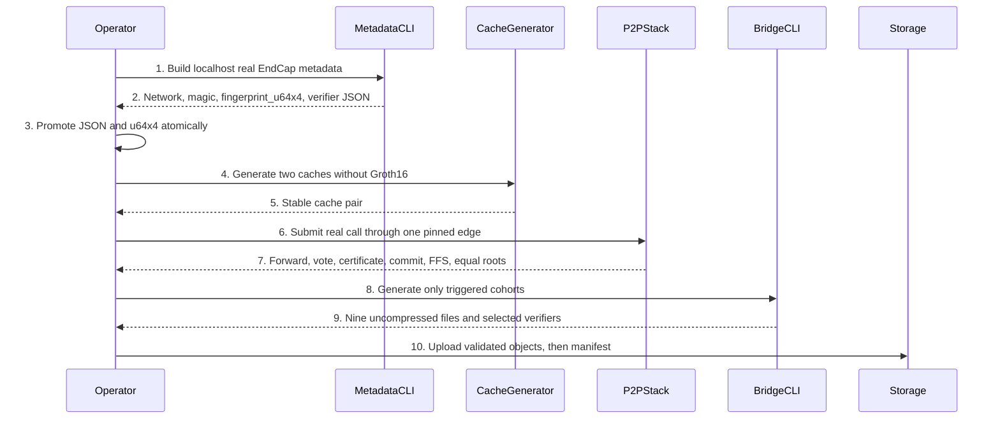
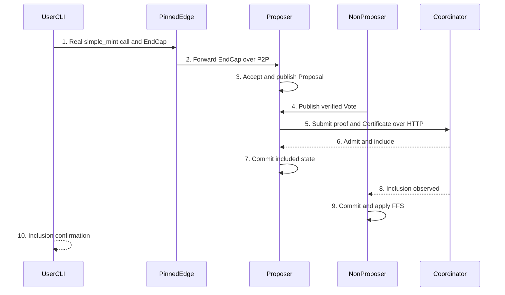

# Circuit and Verifier Operations

> Status: Approved. Updated: 2026-09-02.

## Abstract

This runbook is the release procedure for EndCap verifier metadata generated and completely validated only with `PSY_NETWORK=localhost`, Plonky2 caches, real peer-to-peer transaction acceptance, cross-repository delivery, and the three independent Bridge Groth16 cohorts. `config_gen_v2` is hardcoded to local-devnet constants, while every network enum arm currently reads one shared verifier JSON. Replacing that JSON is therefore a global runtime verifier mutation generated and validated only against localhost; non-local operation must fail closed until source implements and validates distinct per-network verifier metadata selection. Bridge publication is a separate, explicitly authorized operation: package offline, hash the nine uncompressed files in a version-1 manifest, upload objects first, read them back and validate them, then upload the manifest last.

## Motivation

Circuit metadata forms a dependency cascade, but not every circuit-related change triggers every generator. EndCap verifier JSON and its four-limb fingerprint must come from one real circuit construction. Cache generation must not enter the Groth16 path. Genesis data and the embedded wallet circuit bundle have narrower independent triggers. Bridge aggregation, deposit append, and withdrawal claim each own a separate trusted-setup cohort. Finally, compilation success or HTTP admission alone does not prove the real peer-to-peer path: acceptance requires one real `psy_user_cli call`, a forwarded EndCap through one pinned edge, proposal voting and certification, Coordinator admission, proposer commit, non-proposer fast-forward synchronization, and equal roots.

## Table of Contents

- [Terminology](#terminology)
- [1. Authority and Operational Boundary](#1-authority-and-operational-boundary)
- [2. Dependency Model](#2-dependency-model)
- [3. Trigger Matrices](#3-trigger-matrices)
- [4. Localhost EndCap Metadata](#4-localhost-endcap-metadata)
- [5. Cache Generation](#5-cache-generation)
- [6. Genesis and Embedded Circuit Boundaries](#6-genesis-and-embedded-circuit-boundaries)
- [7. Real Peer-to-Peer End-to-End Acceptance](#7-real-peer-to-peer-end-to-end-acceptance)
- [8. Cross-Repository Release Applicability and DAG](#8-cross-repository-release-applicability-and-dag)
- [9. Bridge Cohort Generation](#9-bridge-cohort-generation)
- [10. Offline Packaging and Manifest](#10-offline-packaging-and-manifest)
- [11. Publication Boundary](#11-publication-boundary)
- [12. Verification and Failure Handling](#12-verification-and-failure-handling)
- [13. File Impact](#13-file-impact)
- [14. Rationale](#14-rationale)
- [15. Security Considerations](#15-security-considerations)

## Terminology

| Term | Definition |
|---|---|
| ABI | Application Binary Interface. |
| CLI | Command-line interface. |
| DAG | Directed acyclic graph. |
| DTO | Data transfer object. |
| EndCap | Final proof of one User Proving Session, produced by `UPSStandardEndCapCircuit`. |
| FFS | Fast-forward synchronization applied by a non-proposer after Coordinator inclusion. |
| Groth16 | Proving system used by the Bridge wrappers for layer-one verification. |
| GUTA | Global User Tree Aggregator. |
| JSON | JavaScript Object Notation. |
| P2P | Peer-to-peer. |
| PI | Public input. |
| RPC | Remote procedure call. |
| SDK | Software development kit. |
| UPS | User Proving Session. |
| WASM | WebAssembly. |

## 1. Authority and Operational Boundary

1. Run node commands from `<repo-root>`, sibling commands from `<workspace>/<repo>`, local keystore commands against `<home>/.psy/keystore`, and disposable operations under `<tmp>`. Repository documentation must not contain workstation paths.
2. Current Audit source is authoritative. Relevant release policy and repository topology are at `AGENTS.md:72-90,92-134`.
3. The complete metadata generation and validation procedure exists only for `PSY_NETWORK=localhost`. The metadata CLI prints the compiled `CURRENT_NETWORK`, `PSY_NETWORK_MAGIC`, fingerprint, exact `[u64; 4]`, and verifier JSON (`client_prover/psy_cli/psy_user_cli/src/subcommand/get_user_endcap_common_data.rs:12-30`). The fingerprint constant is localhost-specific, but the checked-in real verifier JSON is shared by every network selector arm.
4. Replacing `END_CAP_ALT_VERIFIER_DATA_SERIALIZED` changes runtime verifier input for all eight networks, even though current generation and cache validation cover only LocalDevnet. `config_gen_v2` explicitly loads `PsyChainNetworkType::LocalDevnet` and instantiates `PsyNetworkLocalDevnetConstants` (`psy_plonky2_circuits/examples/config_gen_v2.rs:93-102,441-442`), while the verifier selector maps every network enum arm to the same JSON constant (`psy_plonky2_circuits/src/circuit_library/end_cap_verifier_data.rs:29-40`). Block all non-local use of the changed blob until a reviewed implementation selects and validates distinct per-network verifier metadata throughout the CLI, cache generator, checked-in verifier data, and network constants.
5. Generation, repository delivery, artifact upload, package publication, contract deployment, and Git push are separate actions. Authorization for one does not authorize another (`AGENTS.md:56-67`).

## 2. Dependency Model

### 2.1 Operator flow



### 2.2 EndCap cascade

```text
UPS / EndCap circuit source or circuit-defining constant
                         |
                         v
              UPSStandardEndCapCircuit
                         |
              +----------+----------+
              |                     |
              v                     v
         verifier JSON      fingerprint_u64x4
              +----------+----------+
                         |
                         v
                   GUTA inputs
                         |
                         v
        coordinator circuit library and caches
                         |
                         v
 bridge_agg only if its consumed circuit shape/data changed
```

`UPSStandardEndCapCircuit` constrains the UPS whitelist, proof-tree whitelist, roots, state transition, GUTA statistics, and final public-input hash (`client_prover/psy_circuit/psy_network_circuit/src/ups/circuits/end_cap.rs:55-70,105-160`). `PsyUPSStepCircuitManager` constructs the real EndCap from the real UPS circuit set (`client_prover/psy_circuit/psy_ups_circuit/src/circuit_manager/core.rs:61-76,96-140`).

### 2.3 Bridge cohorts

```text
<home>/.psy/keystore/
├── circuit_groth16.bin, pk_groth16.bin, vk_groth16.bin
├── deposit_append/
│   └── circuit_groth16.bin, pk_groth16.bin, vk_groth16.bin
└── withdrawal_claim/
    └── circuit_groth16.bin, pk_groth16.bin, vk_groth16.bin

psy-contracts/src/
├── GnarkGroth16Verifier.sol
├── DepositBatchVerifier.sol
└── WithdrawalClaimVerifier.sol
```

The CLI enables deposit append and withdrawal claim unless explicitly skipped, and enables Bridge aggregation only with `--include-bridge-agg` (`psy_cli/psy_relayer_cli/src/bridge/regen_groth16_keystore.rs:84-113`). Each selected directory owns exactly `circuit_groth16.bin`, `pk_groth16.bin`, and `vk_groth16.bin` (`psy_cli/psy_relayer_cli/src/bridge/regen_groth16_keystore.rs:82,567-586`).

## 3. Trigger Matrices

### 3.1 EndCap, cache, Genesis, and embedded wallet bundle

| Changed input | EndCap metadata | Cache pair | Genesis outputs | `local_circuits.json` |
|---|---:|---:|---:|---:|
| UPS or EndCap constraints, gates, ordered PI, whitelist inputs, minifier, verifier shape, or network magic used by the circuit | Yes | Yes | No | No unless an embedded bundle circuit also changed |
| EndCap verifier JSON or fingerprint correction | Re-derive and promote as one set | Yes | No | No |
| GUTA or coordinator constraints, verifier shape, ordered PI, registered circuit triplet, common data, or library composition | No unless EndCap changed | Yes | No | No |
| Cache encoding or serialization with identical reconstructed circuits | No | Yes | No | No |
| Ordinary EndCap, GUTA, cache, verifier, transport, witness, logging, retry, or storage change | No extra action | As rows above | No | No |
| `psy-genesis/genesis_contracts.json` content changes | Apply separate Genesis trigger | Only if circuit inputs changed | Yes | Yes only if embedded bundle circuit sources/version/heights changed |
| Genesis setup constants used by `local_devnet.rs` change | No unless EndCap input changed | Only if network circuits changed | Yes | Yes only if embedded bundle circuit sources/version/heights changed |
| Serialized `genesis.json` format or serializer changes | No | No unless network circuits changed | Yes | No |
| Adopted `psy-genesis` gitlink changes to Genesis inputs | No unless EndCap input changed | Only if network circuits changed | Yes | Yes only if embedded bundle circuit sources/version/heights changed |
| Embedded zk-sign, private-note-inclusion, or shield-deposit-claim circuit source, serialization version, or circuit-defining height changes | No unless EndCap input changed | Only if network library changed | No | Yes |

A transport-only or DTO-only field is a non-trigger only while constraints, ordered PI count and meaning, verifier data, fingerprints, common data, cap heights, and tree heights remain identical.

### 3.2 Independent Bridge matrix

| Changed input | `bridge_agg` | `deposit_append` | `withdrawal_claim` |
|---|---:|---:|---:|
| Bridge aggregation final, chain, wrapper constraints, ordered PI, verifier data, checkpoint common data, checkpoint fingerprint, cached rollup step-commit fingerprint, cap height, or passed tree height | Yes | No | No |
| Deposit leaf, frontier, batch, tree, minifier, commitment, wrapper constraints, ordered PI, or verifier data | No | Yes | No |
| Withdrawal slot, Merkle, padding, batch, tree, commitment, wrapper constraints, ordered PI, or verifier data | No | No | Yes |
| `validator_tree_root` added only to a DTO, transport, log, or storage record | No | No | No |
| `validator_tree_root` added to a canonical checkpoint hash or circuit gadget | Yes | No | No |
| Witness values, roots, amounts, addresses, nonces, checkpoint numbers, transport, logging, timeout, retry, or Solidity caller logic with unchanged verifier key and ABI | No | No | No |

Deposit append exposes its batch commitment as PI and owns its own frontier, leaf, batch, and tree targets (`psy_plonky2_common_circuits/src/bridge/deposit_batch_append_circuit.rs:242-259,267-374`). Withdrawal claim independently owns root, count, fixed slots, Merkle checks, padding, and batch commitment PI (`psy_plonky2_common_circuits/src/bridge/withdrawal_batch_claim_circuit.rs:59-69,78-175`).

## 4. Localhost EndCap Metadata

### 4.1 Preconditions

1. Use the exact source revision intended for the release.
2. Require `<repo-root>/psy-genesis/config.json` to contain the intended localhost configuration. The current localhost magic and realm-0 edge list are at `psy-genesis/config.json:3-15`.
3. Preserve the previous shared verifier JSON, localhost fingerprint constant, and both caches as one rollback unit. Inventory every deployment built from the shared JSON because replacing it is not isolated to localhost in current source.
4. Do not run this section for a non-local target and do not treat localhost validation as evidence for another network.

### 4.2 Generate

Run exactly from `<repo-root>`:

```bash
PSY_CONFIG_PATH=<repo-root>/psy-genesis/config.json \
PSY_NETWORK=localhost \
cargo run --release -p psy_user_cli --no-default-features -- \
  get-user-end-cap-common-data
```

Require these four output records from the same successful invocation:

```text
psy_network: localhost
psy_network_magic: 0x...
endcap_fingerprint_u64x4: [limb0, limb1, limb2, limb3]
alt_verify_data: {complete JSON object}
```

The command constructs `PsyUPSStepCircuitManager` with the compiled network magic and converts its real verifier-only data (`client_prover/psy_cli/psy_user_cli/src/subcommand/get_user_endcap_common_data.rs:12-24`).

### 4.3 Promote atomically

1. Require `psy_network: localhost`. Parse the printed magic and `networks.localhost.magic` in `<repo-root>/psy-genesis/config.json` as hexadecimal integers and require equality (`psy-genesis/config.json:3-5`). The CLI prints lowercase hex while the configuration may use uppercase; case-sensitive string comparison is invalid. A numeric mismatch is a hard failure.
2. Copy the complete value after `alt_verify_data:` verbatim into `END_CAP_ALT_VERIFIER_DATA_SERIALIZED` at `psy_plonky2_circuits/src/circuit_library/end_cap_verifier_data.rs:27`. This single blob is returned for all network selector arms, so the edit has global runtime scope even though its generation and validation evidence is localhost-only.
3. Copy the printed `endcap_fingerprint_u64x4` limbs verbatim, in printed order, into the localhost `END_CAP_CIRCUIT_FINGERPRINT_HASH_U64_X4`. Do not convert from the display fingerprint and do not reorder, reinterpret, or recalculate limbs. The CLI obtains the four canonical limbs directly from the fingerprint elements (`client_prover/psy_cli/psy_user_cli/src/subcommand/get_user_endcap_common_data.rs:19-24`).
4. Do not copy the dummy verifier constant at `psy_plonky2_circuits/src/circuit_library/end_cap_verifier_data.rs:5-25`.
5. Do not update a non-local network fingerprint constant from localhost output. Current one-JSON-for-all-networks source is not evidence that the new shared verifier is valid for another network (`psy_plonky2_circuits/src/circuit_library/end_cap_verifier_data.rs:29-40`).
6. Treat the shared verifier JSON, localhost `[u64; 4]`, and both generated caches as one atomic rollback unit. A partial update is invalid.

## 5. Cache Generation

### 5.1 Cache-only command

Run exactly from `<repo-root>` after Section 4 promotion or any cache trigger:

```bash
RUST_MIN_STACK=134217728 \
cargo run --release -p psy_plonky2_circuits \
  --example config_gen_v2 \
  --no-default-features \
  --features std,serialize_rkyv,serialize_speedy,serialize_postcard
```

This command writes only:

```text
psy_plonky2_circuits/src/generated/cached_circuit_library.rs
psy_plonky2_circuits/src/generated/cached_common_data.rs
```

The writer compares and replaces only those paths (`psy_plonky2_circuits/examples/config_gen_v2.rs:441-467`).

### 5.2 Forbidden cache command

Do not run either of these for cache-only work:

```bash
make config_gen_v2
cargo run --release --package psy_plonky2_circuits --example config_gen_v2
```

The crate default features include `gnark-wrap`, while the required command explicitly disables defaults. The generator conditionally enters Groth16 setup under that feature (`psy_plonky2_circuits/Cargo.toml:7-13`; `psy_plonky2_circuits/examples/config_gen_v2.rs:249-252,346-438`). Cache generation must not delete, generate, or export Bridge setup material.

### 5.3 Stability loop

```text
entry: a cache trigger from Section 3.1
1. Complete localhost metadata promotion first when EndCap changed.
2. Run the cache-only command once.
3. Run the identical cache-only command again.
4. Require both “cached_circuit_library.rs is up to date.” and
   “cached_common_data.rs is up to date.” on the second run.
5. If either file changes on the second run, restore the previous pair and stop.
exit: both generated files are stable as one pair
```

## 6. Genesis and Embedded Circuit Boundaries

### 6.1 Genesis trigger

Run Genesis generation only when at least one of these inputs changed:

1. `psy-genesis/genesis_contracts.json` content;
2. a Genesis setup constant or construction input in `psy_plonky2_circuits/src/node/config/networks/local_devnet.rs`;
3. the serialized `genesis.json` format or serializer changes;
4. an intentionally adopted `psy-genesis` gitlink revision whose changed content affects Genesis construction.

EndCap metadata, GUTA, cache, verifier JSON, network fingerprint, ordinary circuit witness, Bridge cohort, transport, DTO, logging, or retry changes do not trigger Genesis generation.

When triggered, the current target is:

```bash
make generate-genesis-data
```

It runs the local-devnet Genesis test (`Makefile:110-111`). The generator writes root `genesis.json`, root `private_keys.json`, and `psy-dapp/apps/bridge/src/config/faucetOperators.json` (`psy_plonky2_circuits/src/node/config/networks/local_devnet.rs:368-374,376-460`). Root `genesis.json` and `private_keys.json` are local operational artifacts. Never package or publish `private_keys.json`; never include generated private keys in a release artifact.

### 6.2 Embedded wallet circuit trigger

Run the following only when an embedded bundle circuit source, bundle serialization version, or circuit-defining height changes:

```bash
make generate-local-circuits
```

The target regenerates `client_prover/psy_prover/src/wallet/local_circuits.json` (`Makefile:113-118`). Runtime loads that embedded bundle, containing zk-sign plus the private-note-inclusion and shield-deposit-claim base circuits (`client_prover/psy_prover/src/wallet/memory_wallet.rs:336-339,426-451`). Ordinary EndCap, GUTA, cache, or verifier changes do not trigger it.

## 7. Real Peer-to-Peer End-to-End Acceptance

### 7.1 Acceptance flow



### 7.2 Single pinned edge configuration

Create `<tmp>/p2p-e2e.json` by copying `<repo-root>/psy-genesis/config.json`, then change only `networks.localhost.realm_configs` entry `id: 0` so `rpc_url` contains exactly one edge URL. Determine the scheduled proposer from the `realm P2P scheduled proposer` log. If sub-1 is the non-proposer, retain only `http://127.0.0.1:13380`; if sub-2 is the non-proposer, retain only `http://127.0.0.1:13381`. Leave every other value unchanged. The source configuration defines these two realm-0 edges (`psy-genesis/config.json:9-15`).

The resulting fragment must be exactly one of:

```json
{"id": 0, "rpc_url": ["http://127.0.0.1:13380"]}
```

```json
{"id": 0, "rpc_url": ["http://127.0.0.1:13381"]}
```

### 7.3 Real transaction command

Run one serial transaction through that config:

```bash
<repo-root>/target/release/psy_user_cli call \
  --rpc-config <tmp>/p2p-e2e.json \
  --private-key "$USER_PRIVATE_KEY" \
  --contract-id 0 \
  --method-name simple_mint \
  --inputs '[1000000000000]' \
  --wait-until-confirmation
```

`WalletSessionArgs` defines repeated contract, method, and JSON input arguments plus `--wait-until-confirmation` (`client_prover/psy_core/psy_common/src/args.rs:114-171`). The command waits for EndCap inclusion and logs `endcap submitted` followed by `endcap included` (`client_prover/psy_cli/psy_user_cli/src/subcommand/submit_end_cap_proof.rs:150-181`).

Plain `psy_user_cli deposit` is excluded: it calls the layer-one Router and is not an L2 EndCap producer (`client_prover/psy_cli/psy_user_cli/src/subcommand/deposit.rs:1-15,183-184`). Real EndCap-producing paths include `call`, `withdraw`, and `claim-deposit`; `withdraw` builds an L2 contract call and waits for EndCap inclusion (`client_prover/psy_cli/psy_user_cli/src/subcommand/withdraw.rs:115-161`), while `claim-deposit` builds the L2 `claim_deposit` call (`client_prover/psy_cli/psy_user_cli/src/subcommand/claim_deposit.rs:493-556`).

### 7.4 Required log and RPC assertions

Capture one coherent transaction chain. Require:

| Stage | Owning log | Exact log substring |
|---|---|---|
| Forward from pinned non-proposer edge | Non-proposer edge | `realm P2P EndCap forwarded end_cap_id=` |
| Accept at scheduled proposer edge | Proposer edge | `realm P2P EndCap accepted end_cap_id=` |
| Proposal | Proposer processor | `realm P2P proposal published proposal=` |
| Non-proposer vote | Non-proposer processor | `realm P2P non-proposer vote published proposal=` |
| Certificate | Proposer processor | `realm P2P certificate formed` |
| HTTP submit | Proposer processor | `Submitting GUTA proof to Coordinator proposal=` |
| Coordinator admission | Coordinator edge | `realm P2P certificate admitted realm=0` |
| Proposer commit | Proposer processor | `Committed new realm block with checkpoint_id` |
| Non-proposer FFS | Non-proposer processor | `Applied Realm proposal FFS` |

Require the same 64-hex `end_cap_id` in forward and accept. Require the same 64-hex `proposal` identifier in proposal, vote, certificate, submit, and admission. Then correlate proposer commit and non-proposer FFS by the admitted inclusion checkpoint and resulting realm root; those two logs do not contain the proposal identifier. Require the certificate to show both validator signers or equivalent evidence with at least two verified votes. Source ownership for these needles is `psy_node_common/src/realm/edge/handler.rs:197-201,825-829`, `psy_node_common/src/realm/processor/core/process_block.rs:280-284,537-541,581-584,697-704,772-776`, `psy_cli/psy_node_cli/src/node/realm_p2p.rs:355-359`, and `psy_node_common/src/coordinator/edge/handler.rs:931-935`.

After inclusion, query `psy_get_checkpoint_global_state_roots` for the included checkpoint from Coordinator RPC and both realm-0 edge RPC endpoints. Require identical complete results across all three endpoints. Also require equal latest checkpoint identifiers on both realm edges. The RPC surfaces are defined in `psy_api_core/src/coordinator/standard_edge_rpc.rs:46-50,78-79` and `psy_api_core/src/realm/standard_edge_rpc.rs:78-82,128-133`.

A dummy prover, lookalike circuit, direct fabricated submission, HTTP admission without commit, transaction without confirmation, missing vote, missing certificate, missing non-proposer FFS, or unequal roots fails acceptance.

## 8. Cross-Repository Release Applicability and DAG

### 8.1 Applicability gate

| Change | Required delivery | Excluded unless another row applies |
|---|---|---|
| Documentation only | `psy-node` only | Genesis, SDK, WASM, packages, DApp, Wallet, Bridge publication |
| Circuit or prover source consumed by SDK | Freeze `psy-node`; pin SDK to that revision; rebuild SDK Rust, prover WASM, compiler WASM when compiler input changed, and TypeScript outputs | Package publication without changed packed bytes and authorization |
| Node crate consumed by compiler or services | Freeze `psy-node`; update only affected consumer pins | Genesis unless its trigger in Section 6 applies |
| Genesis input from Section 6.1 | Generate and publish Genesis; update only applicable Genesis gitlinks | Unchanged Genesis gitlinks |
| SDK Rust, public TypeScript, generated types, prover WASM, or compiler WASM bytes change | Build and pack SDK; compare outputs | Package publication without authorization |
| Bridge circuit/verifier/deployment input | `psy-contracts`, affected DApp, applicable gitlinks, and authorized artifact storage | SDK and Genesis unless their own inputs changed |
| DTO-only or transport-only change with unchanged circuit and public contract | Changed source repository and affected runtime consumers only | Circuit generation, Bridge cohorts, Genesis, SDK packages |

The repository ownership and consumer table is at `AGENTS.md:72-90`; the applicability rules are at `AGENTS.md:92-108`.

### 8.2 Release DAG

```text
freeze and publish psy-node source revision R_node
  ├── affected psy-compiler Cargo pins use R_node
  ├── affected psy-services Cargo pins use R_node
  ├── psy-sdk Cargo pins use the same R_node before WASM builds
  └── psy-contracts changes only for L1/verifier/deployment/config inputs

R_node + clean affected compiler revision
  ├── rebuild SDK Rust
  ├── rebuild prover WASM
  ├── rebuild compiler WASM when compiler input changed
  ├── rebuild TypeScript packages and compare packed output
  └── generate Genesis only when Section 6.1 triggers

published Genesis / contracts / authorized package versions
  ├── update DApp only after required package registry confirmation
  ├── update Wallet only after required package registry confirmation
  └── update Genesis gitlinks only when Genesis changed

commit parent psy-node generated outputs and child gitlinks last
```

The producer-before-consumer order and immutable node pin are defined at `AGENTS.md:110-134,164-179`. SDK pins must use the frozen node revision before WASM generation (`AGENTS.md:207-230`). Package publication is permitted only when packed bytes or a public contract changed and the exact package and version are authorized; registry confirmation precedes DApp or Wallet updates (`AGENTS.md:262-300`). Do not bump or publish unchanged packages. Do not advance a Genesis gitlink when Genesis did not change.

## 9. Bridge Cohort Generation

### 9.1 Preconditions

1. Apply Section 3.2 and select only triggered cohorts.
2. Build the release relayer executable:

```bash
cargo build --release -p psy_relayer_cli
```

3. Set the local root:

```bash
export KEYSTORE_DIR=<home>/.psy/keystore
```

4. Stop local consumers of selected cohorts and preserve the previous complete selected cohort plus matching Solidity verifier.
5. Never recursively delete the keystore root. The CLI removes only the three named files in a selected directory (`psy_cli/psy_relayer_cli/src/bridge/regen_groth16_keystore.rs:567-578`).

### 9.2 Exact commands

| Triggered cohorts | Regeneration | Verifier export |
|---|---|---|
| All three | `make regen-groth16-keystore` | `make export-all-solidity-verifier` |
| `bridge_agg` only | `make regen-bridge-agg-keystore` | `make export-solidity-verifier` |
| `deposit_append` only | `<repo-root>/target/release/psy_relayer_cli regenerate-groth16-keystore --keystore-dir <home>/.psy/keystore --skip-withdrawal-claim` | `make export-solidity-verifier-deposit` |
| `withdrawal_claim` only | `<repo-root>/target/release/psy_relayer_cli regenerate-groth16-keystore --keystore-dir <home>/.psy/keystore --skip-deposit-append` | `make export-solidity-verifier-withdrawal` |
| Deposit and withdrawal | `<repo-root>/target/release/psy_relayer_cli regenerate-groth16-keystore --keystore-dir <home>/.psy/keystore` | `make export-solidity-verifier-deposit && make export-solidity-verifier-withdrawal` |
| Bridge aggregation and deposit | `<repo-root>/target/release/psy_relayer_cli regenerate-groth16-keystore --keystore-dir <home>/.psy/keystore --skip-withdrawal-claim --include-bridge-agg` | `make export-solidity-verifier && make export-solidity-verifier-deposit` |
| Bridge aggregation and withdrawal | `<repo-root>/target/release/psy_relayer_cli regenerate-groth16-keystore --keystore-dir <home>/.psy/keystore --skip-deposit-append --include-bridge-agg` | `make export-solidity-verifier && make export-solidity-verifier-withdrawal` |

The Make targets and exact verifier destinations are at `Makefile:130-146`. After generation, require every selected file to exist and be nonempty. The generator itself requires existence (`psy_cli/psy_relayer_cli/src/bridge/regen_groth16_keystore.rs:581-586`).

## 10. Offline Packaging and Manifest

### 10.1 Package layout

The publication cohort is exactly five compressed objects plus one manifest:

```text
circuit_groth16.bin.zst
pk_groth16.bin.zst
vk_groth16.bin.zst
deposit_append.tar.zst
withdrawal_claim.tar.zst
sha256sums.json
```

The three root files are compressed separately. Each child archive contains its top-level directory and exactly three files. This matches the current downloader groups (`dev/locSetupV4.ts:2387-2411`).

### 10.2 Offline packaging command

Run without network access:

```bash
export KEYSTORE_DIR=<home>/.psy/keystore
export PACKAGE_DIR=<tmp>/psy-groth16-package
rm -rf "$PACKAGE_DIR"
mkdir -p "$PACKAGE_DIR"

zstd -f "$KEYSTORE_DIR/circuit_groth16.bin" -o "$PACKAGE_DIR/circuit_groth16.bin.zst"
zstd -f "$KEYSTORE_DIR/pk_groth16.bin" -o "$PACKAGE_DIR/pk_groth16.bin.zst"
zstd -f "$KEYSTORE_DIR/vk_groth16.bin" -o "$PACKAGE_DIR/vk_groth16.bin.zst"

tar -C "$KEYSTORE_DIR" -cf - \
  deposit_append/circuit_groth16.bin \
  deposit_append/pk_groth16.bin \
  deposit_append/vk_groth16.bin \
  | zstd -f -o "$PACKAGE_DIR/deposit_append.tar.zst"

tar -C "$KEYSTORE_DIR" -cf - \
  withdrawal_claim/circuit_groth16.bin \
  withdrawal_claim/pk_groth16.bin \
  withdrawal_claim/vk_groth16.bin \
  | zstd -f -o "$PACKAGE_DIR/withdrawal_claim.tar.zst"
```

### 10.3 Version-1 manifest

The manifest hashes the nine uncompressed files, not the five compressed objects. Each entry contains lowercase hexadecimal SHA-256 and byte size. Generate it exactly:

```bash
KEYSTORE_DIR="$KEYSTORE_DIR" PACKAGE_DIR="$PACKAGE_DIR" python3 - <<'PY'
import hashlib, json, os
from pathlib import Path

root = Path(os.environ["KEYSTORE_DIR"])
out = Path(os.environ["PACKAGE_DIR"]) / "sha256sums.json"
paths = [
    "circuit_groth16.bin",
    "pk_groth16.bin",
    "vk_groth16.bin",
    "deposit_append/circuit_groth16.bin",
    "deposit_append/pk_groth16.bin",
    "deposit_append/vk_groth16.bin",
    "withdrawal_claim/circuit_groth16.bin",
    "withdrawal_claim/pk_groth16.bin",
    "withdrawal_claim/vk_groth16.bin",
]
files = {}
for rel in paths:
    path = root / rel
    if not path.is_file() or path.stat().st_size == 0:
        raise SystemExit(f"missing or empty: {path}")
    digest = hashlib.sha256()
    with path.open("rb") as handle:
        for chunk in iter(lambda: handle.read(1024 * 1024), b""):
            digest.update(chunk)
    files[rel] = {"sha256": digest.hexdigest(), "size": path.stat().st_size}
out.write_text(json.dumps({"version": 1, "files": files}, indent=2) + "\n")
PY
```

The consumer schema is `{version, files[path] = {sha256, size}}`; version must equal `1` (`dev/locSetupV4.ts:2222-2266,2377-2382`).

### 10.4 Offline validation

Validate the package into a clean directory before any upload:

```bash
export VERIFY_DIR=<tmp>/psy-groth16-package-verify
rm -rf "$VERIFY_DIR"
mkdir -p "$VERIFY_DIR/deposit_append" "$VERIFY_DIR/withdrawal_claim"

zstd -d -f "$PACKAGE_DIR/circuit_groth16.bin.zst" -o "$VERIFY_DIR/circuit_groth16.bin"
zstd -d -f "$PACKAGE_DIR/pk_groth16.bin.zst" -o "$VERIFY_DIR/pk_groth16.bin"
zstd -d -f "$PACKAGE_DIR/vk_groth16.bin.zst" -o "$VERIFY_DIR/vk_groth16.bin"
zstd -d -c "$PACKAGE_DIR/deposit_append.tar.zst" | tar -xf - -C "$VERIFY_DIR"
zstd -d -c "$PACKAGE_DIR/withdrawal_claim.tar.zst" | tar -xf - -C "$VERIFY_DIR"

VERIFY_DIR="$VERIFY_DIR" MANIFEST="$PACKAGE_DIR/sha256sums.json" python3 - <<'PY'
import hashlib, json, os
from pathlib import Path

root = Path(os.environ["VERIFY_DIR"])
manifest = json.loads(Path(os.environ["MANIFEST"]).read_text())
assert manifest["version"] == 1
assert len(manifest["files"]) == 9
for rel, expected in manifest["files"].items():
    path = root / rel
    data_hash = hashlib.sha256()
    with path.open("rb") as handle:
        for chunk in iter(lambda: handle.read(1024 * 1024), b""):
            data_hash.update(chunk)
    assert path.stat().st_size == expected["size"], rel
    assert data_hash.hexdigest() == expected["sha256"], rel
print("validated 9 uncompressed Groth16 files")
PY
```

## 11. Publication Boundary

### 11.1 Authorization and storage class

Artifact upload requires separate exact authorization naming the target storage location and object prefix. Generation, packaging, source push, or contract deployment does not authorize upload. The public bucket configured in current source is a devnet-only default (`dev/locSetupV4.ts:1489-1492`). Custody-restricted networks must use access-controlled artifact storage; do not place their setup material in the devnet public bucket.

Do not put credential values, access keys, secret keys, session tokens, or profile names in commands, documentation, logs, or release records.

### 11.2 Objects first, manifest last

After exact upload authorization, set the authorized URI and use generic commands only:

```bash
export ARTIFACT_URI=s3://<authorized-bucket>/<authorized-prefix>

aws s3 cp "$PACKAGE_DIR/circuit_groth16.bin.zst" "$ARTIFACT_URI/circuit_groth16.bin.zst"
aws s3 cp "$PACKAGE_DIR/pk_groth16.bin.zst" "$ARTIFACT_URI/pk_groth16.bin.zst"
aws s3 cp "$PACKAGE_DIR/vk_groth16.bin.zst" "$ARTIFACT_URI/vk_groth16.bin.zst"
aws s3 cp "$PACKAGE_DIR/deposit_append.tar.zst" "$ARTIFACT_URI/deposit_append.tar.zst"
aws s3 cp "$PACKAGE_DIR/withdrawal_claim.tar.zst" "$ARTIFACT_URI/withdrawal_claim.tar.zst"
```

Do not upload `sha256sums.json` yet.

### 11.3 Read back and validate every object

```bash
export READBACK_DIR=<tmp>/psy-groth16-readback
rm -rf "$READBACK_DIR"
mkdir -p "$READBACK_DIR"

aws s3 cp "$ARTIFACT_URI/circuit_groth16.bin.zst" "$READBACK_DIR/circuit_groth16.bin.zst"
aws s3 cp "$ARTIFACT_URI/pk_groth16.bin.zst" "$READBACK_DIR/pk_groth16.bin.zst"
aws s3 cp "$ARTIFACT_URI/vk_groth16.bin.zst" "$READBACK_DIR/vk_groth16.bin.zst"
aws s3 cp "$ARTIFACT_URI/deposit_append.tar.zst" "$READBACK_DIR/deposit_append.tar.zst"
aws s3 cp "$ARTIFACT_URI/withdrawal_claim.tar.zst" "$READBACK_DIR/withdrawal_claim.tar.zst"

cmp "$PACKAGE_DIR/circuit_groth16.bin.zst" "$READBACK_DIR/circuit_groth16.bin.zst"
cmp "$PACKAGE_DIR/pk_groth16.bin.zst" "$READBACK_DIR/pk_groth16.bin.zst"
cmp "$PACKAGE_DIR/vk_groth16.bin.zst" "$READBACK_DIR/vk_groth16.bin.zst"
cmp "$PACKAGE_DIR/deposit_append.tar.zst" "$READBACK_DIR/deposit_append.tar.zst"
cmp "$PACKAGE_DIR/withdrawal_claim.tar.zst" "$READBACK_DIR/withdrawal_claim.tar.zst"
cp "$PACKAGE_DIR/sha256sums.json" "$READBACK_DIR/sha256sums.json"
```

In a subshell, set `PACKAGE_DIR="$READBACK_DIR"` and repeat Section 10.4; exit the subshell before Section 11.4 so the original package directory remains selected. Any byte, decompression, path, size, or hash mismatch blocks manifest publication.

### 11.4 Publish manifest last and confirm

```bash
aws s3 cp "$PACKAGE_DIR/sha256sums.json" "$ARTIFACT_URI/sha256sums.json"
aws s3 cp "$ARTIFACT_URI/sha256sums.json" "$READBACK_DIR/sha256sums.json"
cmp "$PACKAGE_DIR/sha256sums.json" "$READBACK_DIR/sha256sums.json"
```

The manifest is the publication commit point. Never replace it before all five objects pass readback validation.

### 11.5 Clean consumer download proof

Consumer verification must use an empty `<home>/.psy/keystore`, must run without `PSY_SKIP_KEYSTORE`, and must successfully fetch and parse the manifest before accepting downloaded files. The current startup path skips all download and hash verification when `PSY_SKIP_KEYSTORE=1` (`dev/locSetupV4.ts:2317-2355`). It also contains an offline existence-only fallback when manifest fetch fails (`dev/locSetupV4.ts:2268-2283,2371-2385`). Neither path is publication proof.

For release evidence:

1. Use a clean disposable home directory.
2. Ensure `PSY_SKIP_KEYSTORE` is unset.
3. Point `PSY_KEYSTORE_S3_BASE_URL` at the authorized object prefix when it differs from the devnet default.
4. Launch the normal consumer startup path.
5. Require a successful `sha256sums.json` fetch and `verified OK` for every downloaded group (`dev/locSetupV4.ts:2371-2451`).
6. Reject existence-only fallback, retained local files, or `PSY_SKIP_KEYSTORE=1` as proof.

## 12. Verification and Failure Handling

### 12.1 Release checks

1. Rerun Section 4.2 with identical environment. Require identical network, magic, `fingerprint_u64x4`, and verifier JSON.
2. Rerun Section 5.1. Require both cache files to report up to date.
3. Complete Section 7 through dual-sub root equality.
4. For each triggered Bridge cohort, require three nonempty files, export the matching Solidity verifier, generate a proof through the matching wrapper, and verify it with that newly exported verifier before deployment. Runtime constructs separate withdrawal, deposit, and Bridge aggregation wrappers (`client_prover/psy_prover/src/local/native/prove_proxy.rs:645-730`).
5. Complete Section 10.4 before upload and Sections 11.3-11.5 after authorized upload.
6. Require the final change scope to contain only triggered metadata, both caches, selected Solidity verifiers, applicable downstream pins or generated outputs, and the source changes that caused them. Genesis, embedded wallet circuits, unrelated Bridge cohorts, gitlinks, and packages remain unchanged unless their matrix row triggers.

### 12.2 Failure table

| Failure | Required response |
|---|---|
| Metadata prints a network other than `localhost` or a numerically different magic | Stop; do not promote any output |
| Non-local generation, promotion, runtime use, or validation claim requested | Stop until distinct per-network verifier metadata selection is implemented and reviewed; the current JSON edit has global runtime scope but only localhost validation evidence |
| Fingerprint constant differs | Rerun metadata generation; copy printed `[u64; 4]` verbatim; never weaken the check |
| One cache changes on the second run | Restore the previous pair; identify unstable input; restart Section 5 |
| Cache command enters Groth16 setup | Stop; restore affected cohort from its complete preserved copy; rerun the exact cache-only command |
| Genesis or embedded bundle generator was run without its trigger | Discard those unrelated outputs; retain the previously verified artifacts |
| Real call confirms but any P2P stage is missing | Fail acceptance; confirmation alone does not prove the required path |
| Forward and accept EndCap identifiers differ | Fail acceptance |
| Proposal identifiers differ across stages | Fail acceptance |
| Coordinator, proposer, and non-proposer roots differ | Fail acceptance |
| Selected cohort generation leaves a missing or empty file | Keep consumers stopped; restore or regenerate the entire selected cohort |
| New proof fails against new verifier | Roll back the entire cohort and matching Solidity verifier |
| Offline package validation fails | Do not upload |
| Any object readback differs or fails uncompressed manifest validation | Replace the object and repeat readback; do not publish the manifest |
| Manifest fetch falls back to existence checks | Fail publication verification |
| Upload lacks exact authorization | Do not upload |

Rollback units are: the globally shared verifier JSON plus localhost fingerprint plus both caches, with every deployment built from that shared JSON accounted for; or one complete Groth16 cohort plus its matching Solidity verifier. Partial rollback is forbidden.

## 13. File Impact

| Action | Path | Trigger |
|---|---|---|
| Manual replace | `psy_plonky2_circuits/src/circuit_library/end_cap_verifier_data.rs` | Localhost EndCap verifier changes |
| Manual replace | `psy_core/src/network_config/local_devnet.rs` | Same metadata run changes printed `[u64; 4]` |
| Generated replace | `psy_plonky2_circuits/src/generated/cached_circuit_library.rs` | Cache output differs |
| Generated replace | `psy_plonky2_circuits/src/generated/cached_common_data.rs` | Cache output differs |
| Conditional generated local artifact | `genesis.json` | Section 6.1 trigger only |
| Secret local artifact; never package | `private_keys.json` | Section 6.1 trigger only |
| Conditional generated DApp config | `psy-dapp/apps/bridge/src/config/faucetOperators.json` | Section 6.1 trigger only |
| Conditional generated bundle | `client_prover/psy_prover/src/wallet/local_circuits.json` | Section 6.2 trigger only |
| Selected verifier replace | `psy-contracts/src/GnarkGroth16Verifier.sol` | `bridge_agg` trigger |
| Selected verifier replace | `psy-contracts/src/DepositBatchVerifier.sol` | `deposit_append` trigger |
| Selected verifier replace | `psy-contracts/src/WithdrawalClaimVerifier.sol` | `withdrawal_claim` trigger |

```diff
--- a/psy_plonky2_circuits/src/circuit_library/end_cap_verifier_data.rs
+++ b/psy_plonky2_circuits/src/circuit_library/end_cap_verifier_data.rs
@@ localhost real EndCap verifier metadata @@
-previous complete verifier JSON
+complete alt_verify_data JSON from one localhost metadata invocation

--- a/psy_core/src/network_config/local_devnet.rs
+++ b/psy_core/src/network_config/local_devnet.rs
@@ line 17: localhost EndCap fingerprint @@
-previous four limbs
+endcap_fingerprint_u64x4 copied verbatim from the same invocation

--- a/psy_plonky2_circuits/src/generated/cached_circuit_library.rs
+++ b/psy_plonky2_circuits/src/generated/cached_circuit_library.rs
@@ generated library @@
-previous generated bytes
+cache-only generator output

--- a/psy_plonky2_circuits/src/generated/cached_common_data.rs
+++ b/psy_plonky2_circuits/src/generated/cached_common_data.rs
@@ generated common data @@
-previous generated bytes
+cache-only generator output

--- a/psy-contracts/src/GnarkGroth16Verifier.sol
+++ b/psy-contracts/src/GnarkGroth16Verifier.sol
@@ bridge_agg verification key when selected @@
-previous bridge_agg verifier
+export from matching newly generated bridge_agg cohort

--- a/psy-contracts/src/DepositBatchVerifier.sol
+++ b/psy-contracts/src/DepositBatchVerifier.sol
@@ deposit_append verification key when selected @@
-previous deposit_append verifier
+export from matching newly generated deposit_append cohort

--- a/psy-contracts/src/WithdrawalClaimVerifier.sol
+++ b/psy-contracts/src/WithdrawalClaimVerifier.sol
@@ withdrawal_claim verification key when selected @@
-previous withdrawal_claim verifier
+export from matching newly generated withdrawal_claim cohort
```

## 14. Rationale

1. **Localhost-generated, globally shared metadata:** the current cache generator is local-devnet-specific, but the verifier selector returns one real JSON for every network arm. Only localhost has complete generation and validation evidence; replacing the blob still changes verifier input globally, so all non-local operation remains blocked until per-network selection exists.
2. **Verbatim limbs:** the CLI already prints canonical fingerprint limbs. Copying those limbs removes error-prone display-hash conversion.
3. **Atomic metadata and caches:** verifier JSON, fingerprint, and generated libraries jointly define compatibility. A mixed generation can reject real proofs.
4. **Narrow Genesis and bundle triggers:** these generators write unrelated, large, or secret-bearing artifacts. Circuit metadata regeneration does not authorize their churn.
5. **Real P2P acceptance:** the required chain proves forwarding, consensus, Coordinator admission, local commit, non-proposer FFS, and state convergence rather than only client or HTTP success.
6. **Independent Bridge cohorts:** each cohort has distinct constraints, key files, and Solidity verifier. Regenerating an unaffected cohort increases custody and deployment risk without improving correctness.
7. **Manifest-last publication:** consumers never observe a manifest that advertises objects which have not passed storage readback and uncompressed hash validation.
8. **Applicability-gated DAG:** immutable producer revisions and conditional downstream delivery prevent needless package, WASM, Genesis, DApp, Wallet, and gitlink changes.

## 15. Security Considerations

1. **Fail-closed network boundary:** never use localhost validation as evidence for another network. The current verifier JSON is globally shared, so a localhost-generated replacement requires every non-local consumer to remain blocked until distinct per-network verifier metadata is implemented and validated.
2. **Private-key exclusion:** root `private_keys.json` and faucet operator private keys are secrets. Never package, upload, commit, paste, or publish them.
3. **Proving-key custody:** `pk_groth16.bin` and compiled wrapper circuits require storage appropriate to the target network. The public devnet bucket is not valid custody storage for restricted networks.
4. **Separate authorization:** source delivery, package publication, artifact upload, and deployment each require their own authorization. Upload commands must not embed credentials or profile names.
5. **Atomic verifier deployment:** deploy a Solidity verifier only with its matching complete cohort and runtime configuration.
6. **No dummy substitution:** dummy EndCap provers, dummy verifier JSON, lookalike circuits, and fabricated submissions are never release evidence.
7. **No verification bypass:** fingerprint mismatch, missing manifest, existence-only fallback, missing vote, missing certificate, proof rejection, or root mismatch is a release failure.
8. **Least deletion:** remove only selected cohort files and disposable verification directories. Never recursively delete the active keystore root.
9. **Objects before manifest:** upload, read back, decompress, and validate every data object before publishing the version-1 manifest.
10. **Immutable provenance:** record exact source revisions, selected network and magic, commands, manifest, object URI, and package versions without recording secrets or relying on branch names.
