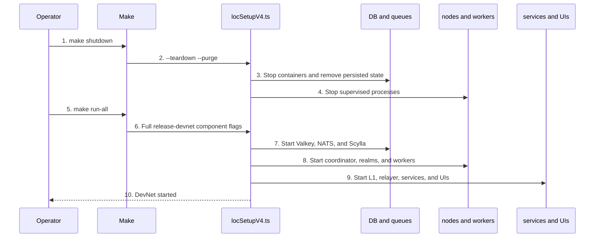

# Local Release Devnet

> Status: Approved. Updated: 2026-08-24.

## Abstract

The supported local E2E lifecycle is `make shutdown` followed by `make run-all` from the `psy-node` repository root. The Makefile owns the complete release-devnet topology and delegates orchestration to `dev/locSetupV4.ts`; operators must not start or restart individual databases, nodes, workers, relayers, or frontends.

## Motivation

Manual component startup creates an invalid partial topology and bypasses the launcher's dependency ordering, schema creation, generated artifacts, process supervision, and cleanup. `make run-all` supplies the full component set at `Makefile:60-66`, while `make shutdown` performs teardown with purge at `Makefile:93-94`.

## Table of Contents

- [Canonical Flow](#canonical-flow)
- [Prerequisites](#prerequisites)
- [Clean Start](#clean-start)
- [Readiness Checks](#readiness-checks)
- [Operating Rules](#operating-rules)
- [Shutdown](#shutdown)
- [Failure Diagnosis](#failure-diagnosis)
- [Security Considerations](#security-considerations)

## Canonical Flow



```text
psy-node root
  |
  +-- make shutdown
  |     `-- locSetupV4.ts --teardown --purge
  |           `-- processes, deployments, logs, checkpoints, Docker volumes removed
  |
  `-- make run-all
        `-- locSetupV4.ts
              +-- infrastructure
              +-- coordinator and two realms
              +-- coordinator and realm workers
              +-- prove proxy and faucet
              +-- local L1 and bridge relayer
              `-- Services, Bridge, IDE, and Explorer
```

The exact topology is defined by `LOCSETUP_START_ARGS` at `Makefile:60` and executed by the `run-all` target at `Makefile:63-66`.

## Prerequisites

Run every command from the `psy-node` repository root in Bash. The launcher checks Git, Cargo, curl, zstd, Node.js, npm, pnpm, Make, Bash, Bun, Docker Compose, and Anvil at `dev/locSetupV4.ts:2360-2388`.

Required repository state:

1. Required submodules and sibling repositories are available. The launcher validates them before startup at `dev/locSetupV4.ts:2390-2400`.
2. Local trust-setup files are complete when `PSY_SKIP_KEYSTORE=1`. The launcher rejects missing or empty files at `dev/locSetupV4.ts:2112-2135`.
3. Release binaries exist when `PSY_SKIP_BUILD=1`:
   - `target/release/psy_node_cli`
   - `target/release/psy_worker_cli`
   - `target/release/psy_relayer_cli`
   - `target/release/psy_user_cli`
   - sibling `psy-services` release binaries `psy-services` and `psy-indexer`

The binary gate is implemented at `dev/locSetupV4.ts:1578-1609`.

## Clean Start

### Rebuild current source

Use this after source changes, a branch switch, or whenever binary provenance is uncertain:

```bash
make shutdown

VITE_NETWORK=localhost \
VITE_FORK=false \
PSY_SKIP_BUILD=0 \
PSY_SKIP_BRANCH_CHECK=1 \
PSY_SKIP_KEYSTORE=1 \
make run-all
```

With `PSY_SKIP_BUILD=0`, the launcher builds the required `psy-node` and sibling `psy-services` binaries with Cargo release mode and `--locked` at `dev/locSetupV4.ts:1612-1638`.

### Reuse verified release binaries

Use this only when the required binaries were built from the current source:

```bash
make shutdown

VITE_NETWORK=localhost \
VITE_FORK=false \
PSY_SKIP_BUILD=1 \
PSY_SKIP_BRANCH_CHECK=1 \
PSY_SKIP_KEYSTORE=1 \
make run-all
```

`PSY_SKIP_BUILD=1` checks that binaries exist but does not prove they match the current source. Rebuild after any relevant edit or branch change.

Environment invariants:

| Variable | Required value | Effect |
|---|---:|---|
| `VITE_NETWORK` | `localhost` | Selects local L1 and localhost network configuration. |
| `VITE_FORK` | `false` | Starts a fresh local Anvil chain instead of an external fork. |
| `PSY_SKIP_BRANCH_CHECK` | `1` | Preserves every current repository HEAD; no automatic fetch or checkout. |
| `PSY_SKIP_KEYSTORE` | `1` | Preserves the local trust setup; no download or refresh. |
| `PSY_SKIP_BUILD` | `0` or `1` | Builds current release binaries or reuses verified release binaries. |

Keep `make run-all` in the foreground. For disconnect-safe operation, run it inside a tmux session; do not append `&`. The launcher prints `DevNet started. Press Ctrl+C to stop.` only after `setupProcesses` completes at `dev/locSetupV4.ts:4928-4936`.

## Readiness Checks

Do not run an E2E case before the startup terminal prints `DevNet started`.

In a second shell, verify the active surfaces:

```bash
curl -fsS http://127.0.0.1:3000/health
curl -fsS http://127.0.0.1:8080/healthz
cast block-number --rpc-url http://127.0.0.1:8545

curl -fsS http://127.0.0.1:1337 \
  -H 'content-type: application/json' \
  -d '{"jsonrpc":"2.0","method":"psy_get_latest_checkpoint_id","params":[],"id":1}'
```

The localhost endpoints are defined at `psy-genesis/config.json:9-42,61-66`. Coordinator edge RPC methods require the `psy_` prefix; the canonical method is documented at `docs/src/rpc/CoordinatorRpc.md:440-459`.

Deployment addresses are regenerated during startup. Read the current values from:

```text
psy-contracts/deployments/localhost/deployed-contracts.json
```

Never reuse addresses from an earlier devnet run.

## Operating Rules

1. Use only `make run-all` to start and `make shutdown` to stop or reset the complete stack.
2. Never manually start or restart Scylla, Valkey, NATS, coordinator nodes, realm nodes, workers, Services, indexers, relayers, or frontends.
3. Never use a non-purge restart to preserve an E2E state. Local L1 is ephemeral while Scylla and queue data are persisted; mixing a fresh L1 with old L2 state corrupts test attribution. The purge path removes checkpoints, logs, deployments, and devnet Docker volumes at `dev/locSetupV4.ts:3017-3033`.
4. Run L2 operations for the same user serially. Different users may operate concurrently.
5. Treat `logs/` as the per-run diagnostic source. Copy required evidence before shutdown because purge removes it.
6. Child-process auto-restart is enabled by default at `dev/locSetupV4.ts:4931-4935`. Set `PSY_NO_AUTO_RESTART=1` before startup only for E2E cases that explicitly test process failure or restart boundaries.

## Shutdown

From the repository root:

```bash
make shutdown
```

The target executes `bun run dev/locSetupV4.ts --teardown --purge` at `Makefile:93-94`. It stops supervised processes and containers, releases known ports, and removes local checkpoints, logs, generated localhost deployments, and devnet Docker volumes at `dev/locSetupV4.ts:3017-3033`.

Run `make shutdown` before every clean E2E start and after every completed or failed E2E session.

## Failure Diagnosis

| Symptom | Decision |
|---|---|
| Missing release binary with `PSY_SKIP_BUILD=1` | Restart with `PSY_SKIP_BUILD=0`; do not launch components manually. |
| Behavior does not match current source | Purge, rebuild with `PSY_SKIP_BUILD=0`, and start again. |
| Missing trust-setup file with `PSY_SKIP_KEYSTORE=1` | Stop and prepare the complete local trust setup before retrying. |
| Startup fails before `DevNet started` | Read the terminal error and the generated file under `logs/`; then run `make shutdown`. |
| A single child exits | Let the supervisor retry with exponential backoff capped at 30 seconds; a failed respawn is retried after at most 60 seconds. Do not replace the child manually. |
| E2E state is inconsistent after restart | Run `make shutdown`, then perform a clean `make run-all`; never retain mixed L1 and L2 state. |

## Security Considerations

1. `PSY_SKIP_BRANCH_CHECK=1` prevents startup from changing repository revisions and protects uncommitted work.
2. `PSY_SKIP_KEYSTORE=1` prevents unattended trust-setup replacement. Never print wallet passwords, private keys, or keystore contents in logs or commands.
3. Local fixture identities are for localhost E2E only. Never reuse them on public networks.
4. Do not expose local RPC, database, queue, or frontend ports beyond the development host.
5. `make shutdown` is destructive to local devnet state by design. Capture required logs and artifacts before invoking it.
