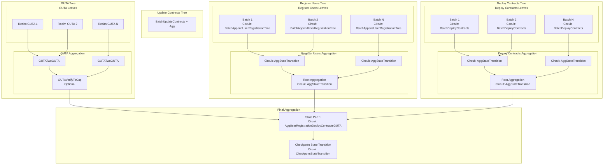
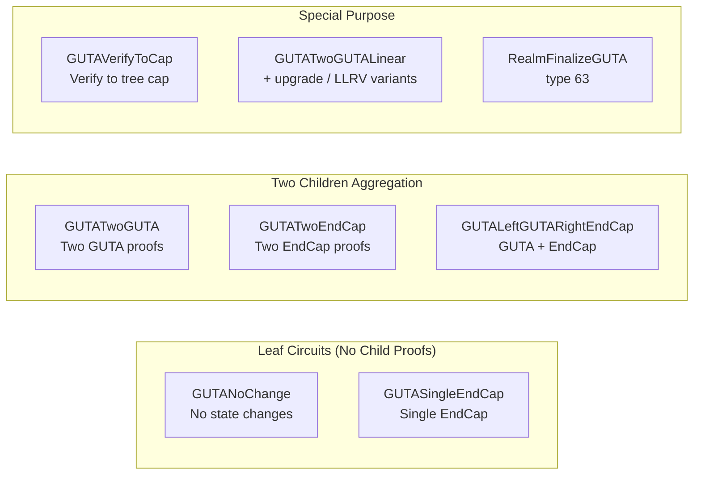

# Proving Jobs Architecture

This protocol reference covers realm and coordinator proving-job dependencies and public input layouts alongside the [circuit index](Circuits.md).

> Updated: 2026-09-08. PI layouts corrected to 4-felt rewards-tag model.

## Abstract

This document describes the proving jobs architecture for both Realm and Coordinator processors, including the tree structure of different proof types and their public inputs layout.

## Table of Contents

- [1. Public Input Layouts](#1-public-input-layouts)
- [2. Realm Proving Jobs](#2-realm-proving-jobs)
- [3. Coordinator Proving Jobs](#3-coordinator-proving-jobs)
- [4. Global User Tree Aggregator Circuit Variants](#4-global-user-tree-aggregator-circuit-variants)
- [5. State Part 1](#5-state-part-1)
- [6. Checkpoint State Transition](#6-checkpoint-state-transition)
- [7. Job Dependencies and Task Graph](#7-job-dependencies-and-task-graph)
- [8. Commitment Calculation Rules](#8-commitment-calculation-rules)
- [9. Core Proving Circuits](#9-core-proving-circuits)
- [10. Proof Miner Job Statistics](#10-proof-miner-job-statistics)
- [11. Design Principles](#11-design-principles)

## 1. Public Input Layouts

> **Currency (2026-09-08):** Live circuits register a **4-felt Poseidon hash**, not a flat 19- or 15-limb public vector. Older “19 / 15 input” tables below this note are **obsolete**; do not use them for audit or worker PI checks. Authoritative helpers: `psy_plonky2_circuits/src/agg/common.rs`, `guta/gadgets/guta_header.rs`, `docs/src/dev/reward-tree-circuits.md`.

### Coordinator trackable leaves / aggregates (4 felts)

```
ST = H2(old_root, new_root)   // or equivalent state-transition hash
PI = compute_agg_state_trackable_final_public_inputs_leaf(
       whitelist_root, ST, worker_reward_tag)
   // ≈ H2( H( H2(whitelist, ST) || proof_count ), rewards_tag_tree_value )
```

Worker identity and PM job counts are **inside the rewards tag tree / witness**, not separate public limbs.

### GUTA circuits (4 felts)

```
PI = H2(guta_header_hash, rewards_tree_value)
```

`rewards_tree_value` folds worker tag + child reward tags (see reward-tree layouts). Header carries whitelist, checkpoint, GUSR transition, and stats.

### Part-1 `AggUserRegisterDeployContractsGUTA` (type 40, 4 felts)

```
header_hash = combined(URT_ST, GCON_ST, GUSR_header, …)
tag = hash_tag_tree_node_four(guta_R, register_R, deploy_R, update_R, worker_tag)
PI = H2(header_hash, tag)
```

**Four** child proofs: register-users ST, deploy ST, **update-contracts ST**, GUTA. Deploy end root must equal update start root on GCON.

### Checkpoint state transition (type 32, 4 felts)

Registers the CST public-inputs hash (chain / transition commitment) — not a flat 19-limb layout. See CST circuit + recursive previous-proof gadget.

## 2. Realm Proving Jobs

> **Current source (2026-09):** Realm does **not** use circuits named `ProcessUserOp`, `AggregateUserOps`, or `RealmStateTransition`. Those names are obsolete. Authoritative circuit types live in `psy_core/src/job/job_id.rs` (`ProvingJobCircuitType`).

### EndCap → GUTA → RealmFinalize

```text
User EndCap proofs (submitted to realm edge)
        |
        v
Realm GUTA aggregation tree
  (GUTAVerifySingleEndCap / TwoEndCap / TwoGUTA / linear+upgrade variants)
        |
        v
RealmFinalizeGUTA (63)  -- proved by psy_worker_cli; root GUTA + validator-tree/fee constraints
        |
        v
P2P Proposal / Votes / Certificate --> Coordinator psy_submit_guta(..., proposal, certificate)
```

> **Currency (2026-09-08, local):** Circuit 63 no longer verifies a child `WrappedSignatureProof` (64). Wallet-signature fingerprint derivation was removed with the BLS auth cutover (`realm_finalize_guta.rs` comment at the fee/public-key section). Authorization for submission is the realm processor BLS vote + Coordinator certificate verification off-circuit; validator-tree membership and fee math remain in-circuit. Type 64 is absent from `cached_circuit_library` in this worktree. Older docs that still say “63 depends on 64” are stale.

### Realm root circuit details

| Circuit                   | Type u32                                              | Who proves         | Role                                               |
| ------------------------- | ----------------------------------------------------- | ------------------ | -------------------------------------------------- |
| User EndCap family        | see job_id.rs                                         | user / prove-proxy | Leaf transitions into realm GUTA                   |
| GUTA aggregation variants | live cache: 7,8,10,11,13,15,55–59 (not 9/12/14/60/64) | `psy_worker_cli`   | Aggregate EndCaps / GUTAs                          |
| RealmFinalizeGUTA         | 63                                                    | `psy_worker_cli`   | Realm root submitted with P2P Proposal+Certificate |

Witness construction for finalization is `RealmGUTAPlanner::append_realm_finalize_guta` (`psy_node_common/src/guta_planner/realm_guta_planner.rs`). Circuit implementation: `psy_plonky2_circuits/src/guta_v2/circuits/realm_finalize_guta.rs`.

GUTA aggregation jobs use the **4-felt** `H2(header, rewards)` PI form in §1. RealmFinalizeGUTA likewise registers a 4-felt PI over the finalized header and rewards tag; do not use obsolete ProcessUserOp or flat 15-limb tables.

## 3. Coordinator Proving Jobs

### Three Main Trees + Final Aggregation



## 4. Global User Tree Aggregator Circuit Variants

The GUTA (Global User Tree Aggregator) has multiple circuit variants to handle different scenarios.

> **Live set (2026-09-08, `cached_circuit_library`):** `GUTATwoEndCap`(7), `GUTATwoGUTA`(8), `GUTALeftGUTARightEndCap`(10), `GUTASingleEndCap`(11), `GUTAVerifyToCap`(13), `GUTANoChange`(15), checkpoint/linear/LLRV upgrades (55–59), `RealmFinalizeGUTA`(63). **Absent from cache / not constructed by `QEDGUTACircuitManager`:** `GUTALeftEndCapRightGUTA`(9), `GUTARegisterUsers`(12), `GUTAOnlyRegisterUsers`(14), `GUTAVerifyLeftLeafRightLinearUpgradeCheckpoint`(60), `WrappedSignatureProof`(64). User registration is coordinator `BatchAppendUserRegistrationTree`, not a GUTA register circuit.

### GUTA Circuit Types and Usage



### Additional GUTA Circuits

**Other live GUTA circuits** (4-felt rewards-header PI form — see [GUTAV2Circuits.md](./GUTAV2Circuits.md)):
- `GUTANoChange`: No state changes
- `GUTATwoEndCap`: Aggregate two EndCap proofs
- `GUTAVerifyToCap`: Verify GUTA to tree cap
- `GUTATwoGUTALinear` / `GUTATwoGUTALinearUpgradeCheckpoint`
- `GUTATwoGUTAWithCheckpointUpgrade` / `GUTAVerifyToCapWithCheckpointUpgrade`
- `GUTAVerifyLeftLinearRightLeafUpgradeCheckpoint`
- `RealmFinalizeGUTA`: Realm root (type 63)

All follow the same commitment / rewards-tag calculation rules based on their dependency count (see §1 and reward-tree docs).

## 5. State Part 1

This circuit aggregates **four** coordinator streams (register, deploy, update, GUTA):

### Inputs

- Register Users ST proof (aggregation root)
- Deploy Contracts ST proof (aggregation root)
- **Update Contracts** ST proof (aggregation root)
- GUTA proof (aggregation root or GUTAVerifyToCap)

### Public Inputs

4 felts: `H2(combined_header_hash, four_child_rewards_tag)` — see §1. Do **not** use the obsolete flat 19-limb Part-1 table.

### Child proof processing

Each child exposes a 4-felt PI hash. Part-1 verifies fingerprints/whitelists, binds deploy.end → update.start on GCON, and folds child reward tags with `hash_tag_tree_node_four`.

### PM / rewards tag tree

Reward metadata for the four children is folded into the Part-1 tag tree (not three independent flat roots). See `docs/src/dev/reward-tree-circuits.md`.

## 6. Checkpoint State Transition

The final circuit that creates the checkpoint proof:

### Inputs

- State Part 1 proof
- Previous checkpoint proof
- Checkpoint tree merkle proof
- Various metadata (block time, random seed, etc.)

### Public Inputs

4-felt CST public-inputs hash (see §1). Previous CST / genesis fingerprint checks are in-circuit via `VerifyRecursiveCheckpointStateTransitionProofGadget`.


## 7. Job Dependencies and Task Graph

```mermaid
graph LR
    subgraph "Parallel Execution"
        RU[Register Users Jobs<br/>PM Stats: (0, N, 0)]
        DC[Deploy Contracts Jobs<br/>PM Stats: (M, 0, 0)]
        GUTA[GUTA Jobs<br/>PM Stats: (0, 0, K)]
    end

    subgraph "Sequential Dependencies"
        SP1[State Part 1<br/>PM Stats: (M, N, K)]
        CST[Checkpoint State Transition<br/>PM Stats: (M, N, K)]
        NOTIFY[Notify Block Complete]
    end

    RU --> SP1
    DC --> SP1
    UC[Update Contracts Jobs] --> SP1
    GUTA --> SP1
    SP1 --> CST
    CST --> NOTIFY
```

> **Currency:** Part-1 also depends on the **Update Contracts** aggregation root (four children). The Register / Deploy / GUTA parallel trees remain; update runs beside deploy on GCON.
The dependency graph shows how PM stats flow through the system:
1. **Parallel Trees**: Each tree type accumulates its specific job counts
2. **State Part 1**: Combines PM stats from all three trees
3. **Checkpoint**: Preserves the combined PM stats for final reward calculation
4. **Block Completion**: Uses PM stats to calculate and distribute rewards

## 8. Commitment Calculation Rules

The commitment calculation follows a consistent pattern across all circuits:

### 1. Leaf Circuits (No Dependencies)

```rust
PI = agg_state_trackable_leaf(whitelist, ST, worker_tag)  // not raw worker_pk
```

Examples: GUTANoChange, BatchDeployContracts, AppendUserRegistrationTree (PI via `compute_agg_state_trackable_final_public_inputs_leaf`, not raw worker_pk)

### 2. Single Dependency Circuits (One Child Proof)

```rust
PI folds child PI hash + worker_tag into rewards tag tree (see reward-tree docs)
```

Examples: GUTASingleEndCap, GUTAVerifyToCap, GUTAVerifyToCapWithCheckpointUpgrade

### 3. Two Dependencies Circuits (Two Child Proofs)

```rust
PI = H2(header, hash_tag_tree(left_R, right_R, worker_tag))
```

Examples: GUTATwoGUTA, GUTATwoGUTAWithCheckpointUpgrade, GUTATwoEndCap, GUTALeftGUTARightEndCap, AggStateTransition

### Core Design Principles

1. **Commitment Chain**: Forms a tree structure but NOT for reward distribution as originally thought
   - **ALL leaf circuits**: `commitment = hash(0, 0)` (constant value!)
   - **Aggregation circuits**: `commitment = hash(hash(child1.commit, child1.worker), hash(child2.commit, child2.worker))`

2. **Job Categories**: Three parallel proving trees
   - **User Registration**: `batch_append` → `state_transition` → final aggregation
   - **Contract Deployment**: `batch_deploy` → `state_transition` → final aggregation
   - **GUTA Tree**: Various GUTA circuits → final aggregation

3. **Special Cases**:
   - **Dummy circuits**: Used when no real work is available
   - **AggUserRegistration**: Unique layout combining all three trees
   - **Checkpoint**: Final proof creating the rollup state transition

## 9. Core Proving Circuits

### Coordinator Main Circuits (4-felt PI)

| Circuit                             | Type        | Dependencies | Commitment Calculation                                                                |
| ----------------------------------- | ----------- | ------------ | ------------------------------------------------------------------------------------- |
| **BatchAppendUserRegistrationTree** | Leaf        | None         | `commitment = hash(0, 0)`                                                             |
| **BatchDeployContracts**            | Leaf        | None         | `commitment = hash(0, 0)`                                                             |
| **AggStateTransition**              | Aggregation | 2 proofs     | `commitment = hash(hash(left.commit, left.worker), hash(right.commit, right.worker))` |
| **DummyAggStateTransition**         | Dummy       | None         | `commitment = hash(0, 0)`                                                             |

**Public Inputs:** 4 felts via `compute_agg_state_trackable_final_public_inputs_leaf` (§1).

### GUTA Core Circuits (4-felt PI)

Live rows only (enum leftovers 9/12/14 omitted — see §4 currency note).

| Circuit                     | Type        | Dependencies      | Commitment Calculation                                                                |
| --------------------------- | ----------- | ----------------- | ------------------------------------------------------------------------------------- |
| **GUTASingleEndCap**        | Leaf        | 1 EndCap          | `commitment = hash(0, 0)`                                                             |
| **GUTANoChange**            | Leaf        | None              | `commitment = hash(0, 0)`                                                             |
| **GUTATwoGUTA**             | Aggregation | 2 GUTA            | `commitment = hash(hash(left.commit, left.worker), hash(right.commit, right.worker))` |
| **GUTATwoEndCap**           | Aggregation | 2 EndCap          | `commitment = hash(hash(left.commit, left.worker), hash(right.commit, right.worker))` |
| **GUTALeftGUTARightEndCap** | Mixed       | 1 GUTA + 1 EndCap | `commitment = hash(hash(left.commit, left.worker), hash(right.commit, right.worker))` |

**Public Inputs:** 4 felts = `H2(header_hash, rewards_tree_value)` (§1).

### Final Aggregation Circuits

| Circuit                                          | Dependencies                                        | Special Notes                                      |
| ------------------------------------------------ | --------------------------------------------------- | -------------------------------------------------- |
| **VerifyAggUserRegistrationDeployContractsGUTA** | 4 proofs (user_reg + deploy + **update** + guta)    | 4-felt PI: `H2(header, four_child_rewards_tag)` (§1) |
| **QEDCheckpointStateTransition**                 | 1 proof (state_part_1) + previous CST/genesis       | 4-felt CST PI hash (§1); not a flat 19-limb layout |

## 10. Proof Miner Job Statistics

The PM (Proof Miner) jobs completed stats track the number of different types of jobs completed throughout the circuit hierarchy. These stats flow upward through the trees and are combined at aggregation points.

### PM Stats Components

- **deploy_contracts_completed**: Number of deploy contract jobs completed in this subtree
- **register_users_completed**: Number of user registration jobs completed in this subtree
- **gutas_completed**: Number of GUTA jobs completed in this subtree

### How Stats Flow Through the Hierarchy

#### Leaf Circuits

Leaf circuits initialize their PM stats based on the work they perform:
- **Deploy Contract leaves** (BatchDeployContracts): `pm_stats = (batch_size, 0, 0)`
- **Register Users leaves** (AppendUserRegistrationTree): `pm_stats = (0, batch_size, 0)`
- **GUTA leaves** (GUTANoChange, GUTASingleEndCap, etc.): `pm_stats = (0, 0, 0)` initially
- **Dummy circuits** (AggStateTransitionDummy): `pm_stats = (0, 0, 0)` (all zeros)

#### Aggregation Circuits

Aggregation circuits combine PM stats from their children:

```rust
// Two children aggregation (AggStateTransition, GUTATwoGUTA)
final_pm_stats = PMJobsCompletedStats {
    deploy_contracts_completed: left.pm_stats[0] + right.pm_stats[0],
    register_users_completed: left.pm_stats[1] + right.pm_stats[1],
    gutas_completed: left.pm_stats[2] + right.pm_stats[2],
}
```

#### GUTA Circuits Special Handling

GUTA circuits add 1 to their gutas_completed count:

```rust
// Single child GUTA aggregation (GUTAVerifyToCap)
final_pm_stats = PMJobsCompletedStats {
    deploy_contracts_completed: child.pm_stats[0],
    register_users_completed: child.pm_stats[1],
    gutas_completed: child.pm_stats[2] + 1, // Add 1 GUTA completion
}
```

### Final Aggregation

At the State Part 1 level (AggUserRegistrationDeployContractsGUTA), the PM stats from all three trees are combined:

```rust
final_pm_stats = register_users_proof.pm_stats +
                 deploy_contracts_proof.pm_stats +
                 guta_proof.pm_stats
```

This provides a complete count of all work performed in the current checkpoint.

## 11. Design Principles

1. **Consistent Public Inputs**: Trackable/GUTA circuits expose a **4-felt** Poseidon commitment; worker/PM metadata lives in the rewards tag tree / witness
2. **Tree Aggregation**: Each category (GUTA, Register Users, Deploy Contracts) forms its own tree
3. **Parallel Processing**: The three trees can be processed in parallel
4. **Commitment Chain**: Commitments flow up from leaves to root, enabling reward distribution
5. **Flexibility**: GUTA circuits handle various scenarios (no changes, single realm, multiple realms)
6. **Worker Tracking**: Every circuit includes the worker's public key who computed that proof
7. **PM Stats Tracking**: Job completion counts flow upward through the tree hierarchy for reward calculation
